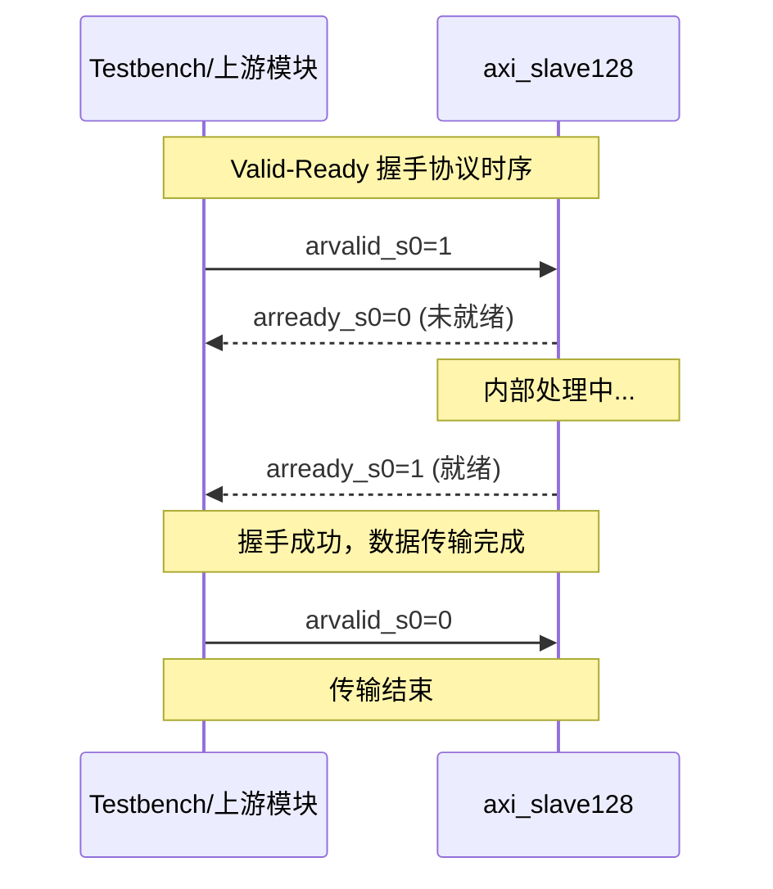
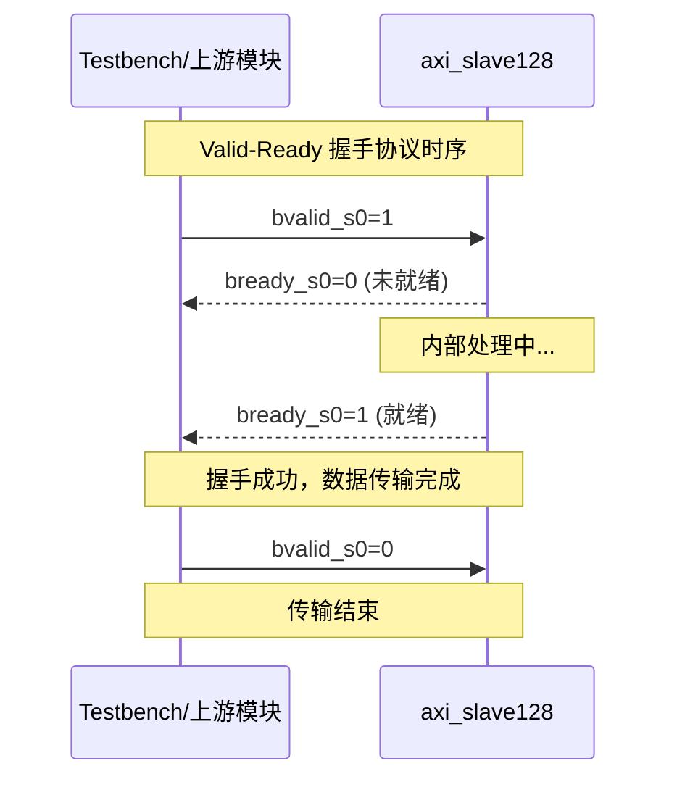
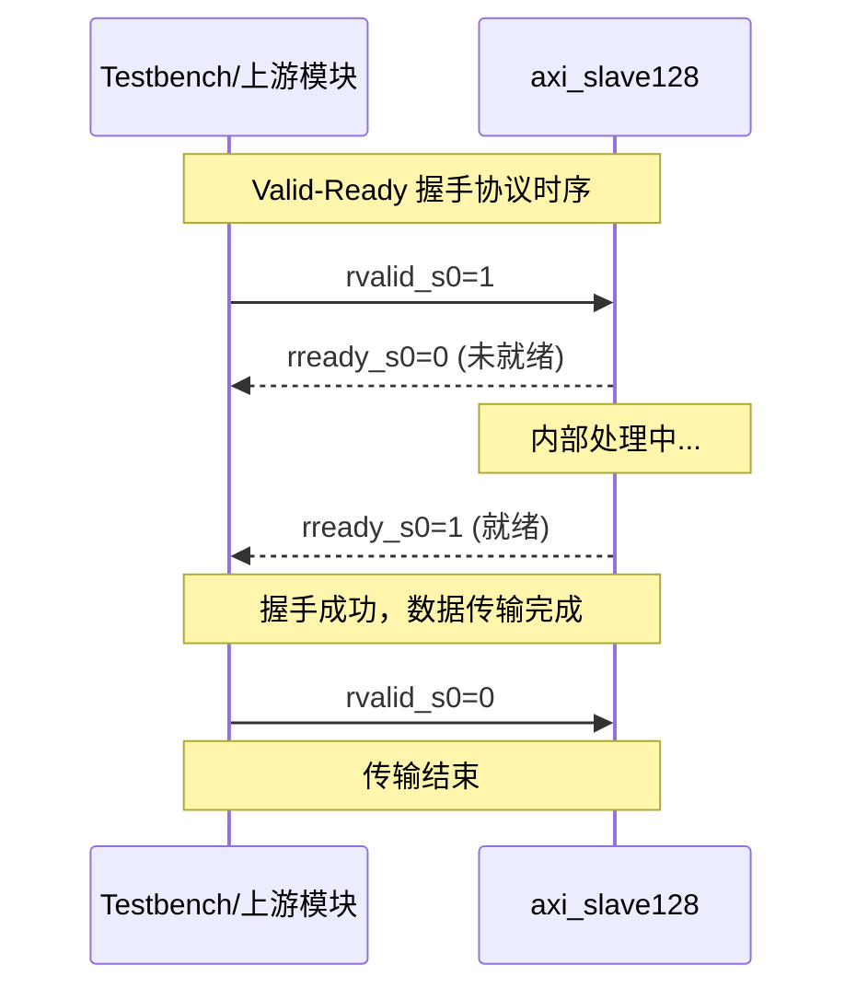
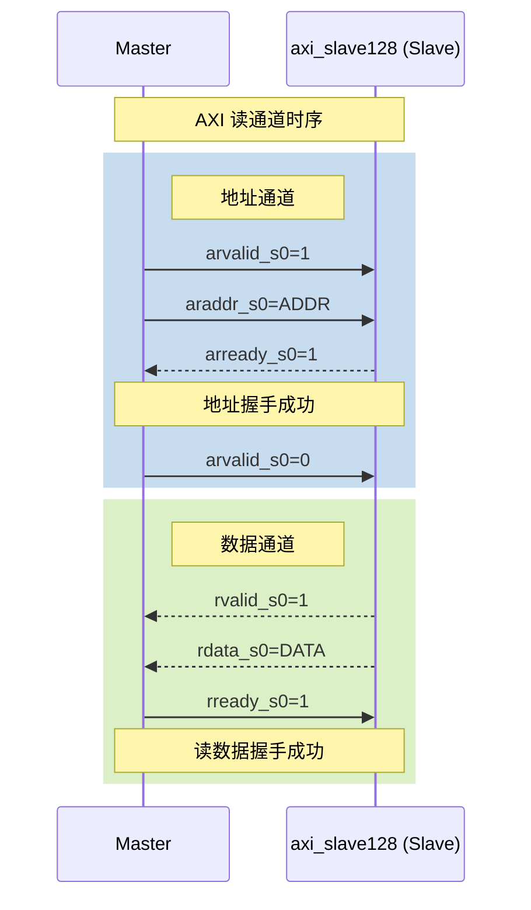
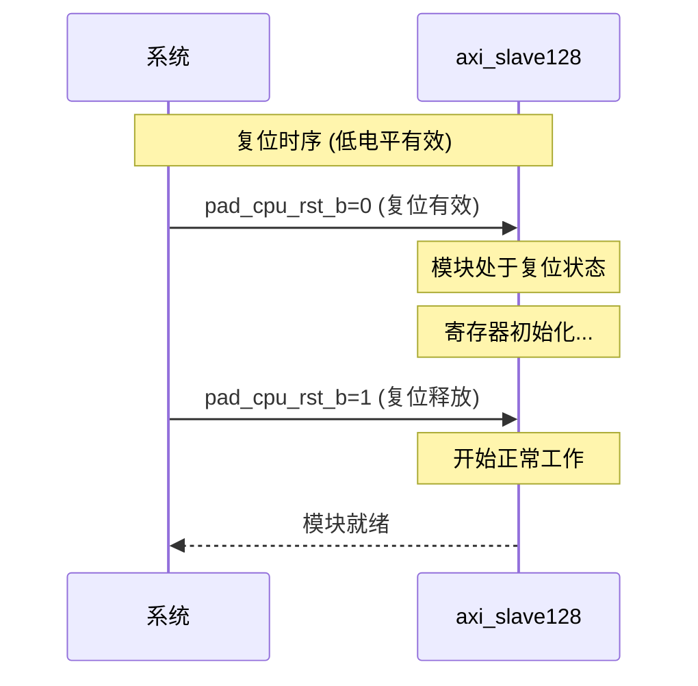

# axi_slave128 接口时序图

## 时序模式说明

| 模式类型 | 相关信号 | 描述 |
|----------|----------|------|
| valid_ready | arvalid_s0, arready_s0 | arvalid_s0 和 arready_s0 构成 Valid-Ready 握手协议 |
| valid_ready | awvalid_s0, awready_s0 | awvalid_s0 和 awready_s0 构成 Valid-Ready 握手协议 |
| valid_ready | bvalid_s0, bready_s0 | bvalid_s0 和 bready_s0 构成 Valid-Ready 握手协议 |
| valid_ready | rvalid_s0, rready_s0 | rvalid_s0 和 rready_s0 构成 Valid-Ready 握手协议 |
| axi_read | arvalid_s0, arready_s0, rvalid_s0, rready_s0 | AXI 读通道 |
| reset | pad_cpu_rst_b | 复位时序 |

## 时序图 1: arvalid_s0 和 arready_s0 构成 Valid-Ready 握手协议

### Mermaid 序列图

## 时序图 2: awvalid_s0 和 awready_s0 构成 Valid-Ready 握手协议

### Mermaid 序列图

## 时序图 3: bvalid_s0 和 bready_s0 构成 Valid-Ready 握手协议

### Mermaid 序列图

## 时序图 4: rvalid_s0 和 rready_s0 构成 Valid-Ready 握手协议

### Mermaid 序列图

## 时序图 5: AXI 读通道

### Mermaid 序列图

## 时序图 6: 复位时序

### Mermaid 序列图

