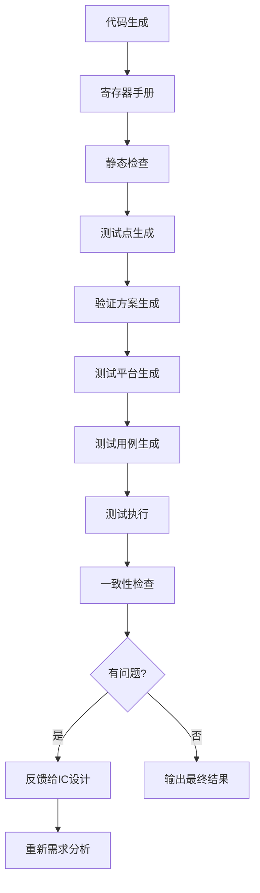

# 芯片验证流程SKILL开发计划

## 任务概述

开发5个芯片验证流程SKILL，覆盖从测试点到测试执行的全流程，并将其集成到chip-design-orchestrator调度器中。

## 现有SKILL（已创建）

| 序号 | SKILL名称 | 功能 |
|------|-----------|------|
| 1 | requirements-analyzer | 需求分析与明确化 |
| 2 | functional-spec-generator | 功能规格说明书生成 |
| 3 | top-level-design-generator | 芯片总体方案生成 |
| 4 | module-design-generator | 模块详细方案生成 |
| 5 | rtl-code-generator | RTL代码生成 |
| 6 | register-manual-generator | 寄存器手册生成 |
| 7 | verilog-linter | 静态检查 |
| 8 | chip-design-orchestrator | 工作流调度器 |

## 需要新增的SKILL

### SKILL 9: 测试点文档生成

**Skill名称**: `test-point-generator`

**功能**:
- 基于明确的需求列表生成芯片测试点文档
- 提取功能需求转化为可验证的测试点
- 覆盖正常场景和异常场景

**测试点分类**:
- 功能测试点
- 边界测试点
- 异常测试点
- 性能测试点
- 接口测试点

### SKILL 10: 验证方案生成

**Skill名称**: `verification-plan-generator`

**功能**:
- 基于测试点文档生成芯片验证方案
- 定义验证环境架构
- 制定验证策略
- 规划验证进度

### SKILL 11: 测试平台生成

**Skill名称**: `testbench-generator`

**功能**:
- 基于验证方案生成测试平台
- 生成UVM测试平台结构
- 生成driver、monitor、scoreboard等组件

### SKILL 12: 测试用例生成

**Skill名称**: `test-case-generator`

**功能**:
- 基于验证方案和测试点生成测试用例
- 生成功能测试用例
- 生成随机测试用例
- 生成边界测试用例

### SKILL 13: 一致性检查

**Skill名称**: `consistency-checker`

**功能**:
- 检查需求列表与总体方案的一致性
- 检查总体方案与模块方案的一致性
- 检查模块方案与RTL代码的一致性
- 反馈问题给IC设计专家

### SKILL 14: 测试执行与问题反馈（扩展chip-design-orchestrator）

**功能**:
- 使用测试平台和测试用例执行测试
- 收集测试结果
- 分析RTL问题
- 反馈给IC设计专家修改

## 新增SKILL详细设计

### SKILL 9: 测试点文档生成

**输出格式**:

```markdown
# [芯片名称] 测试点文档

## 1. 测试点汇总

| 序号 | 测试点名称 | 功能模块 | 优先级 | 测试类型 |
|------|------------|----------|--------|----------|
| TP-001 | 功能1 | 模块A | 高 | 功能 |

## 2. 功能测试点

### 2.1 模块A功能测试

#### TP-001: [测试点名称]

- **描述**: [测试点描述]
- **前置条件**: [测试前置条件]
- **测试步骤**: 
  1. 步骤1
  2. 步骤2
- **预期结果**: [预期结果]
- **优先级**: 高
- **测试类型**: 功能
```

### SKILL 10: 验证方案生成

**输出格式**:

```markdown
# [芯片名称] 验证方案

## 1. 验证目标

## 2. 验证环境

### 2.1 硬件环境
### 2.2 软件环境

## 3. 验证策略

## 4. 验证进度

## 5. 覆盖率目标
```

### SKILL 11: 测试平台生成

**输出格式**:
- UVM测试平台结构
- Verilog/SystemVerilog测试平台代码

### SKILL 12: 测试用例生成

**输出格式**:
- 测试用例代码
- 测试用例说明文档

### SKILL 13: 一致性检查

**输出格式**:

```markdown
# 一致性检查报告

## 检查项目

| 检查项 | 状态 | 问题 |
|--------|------|------|
| 需求-总体方案 | 通过 | 无 |
| 总体方案-模块方案 | 未通过 | XXX |
| 模块方案-RTL | 通过 | 无 |
```

## 集成到调度器

在chip-design-orchestrator中添加验证流程：



## 文件结构

```
.skills/
├── test-point-generator/
│   ├── SKILL.md
│   └── templates/
│       └── test_point.md
├── verification-plan-generator/
│   ├── SKILL.md
│   └── templates/
│       └── verification_plan.md
├── testbench-generator/
│   ├── SKILL.md
│   └── templates/
│       └── tb_template.sv
├── test-case-generator/
│   ├── SKILL.md
│   └── templates/
│       └── test_case.sv
├── consistency-checker/
│   ├── SKILL.md
│   └── scripts/
│       └── consistency_check.py
```

## 实现优先级

| 优先级 | SKILL | 依赖 |
|--------|-------|------|
| 1 | test-point-generator | requirements-analyzer |
| 2 | verification-plan-generator | test-point-generator |
| 3 | testbench-generator | verification-plan-generator |
| 4 | test-case-generator | verification-plan-generator, test-point-generator |
| 5 | consistency-checker | 全部设计SKILL |

## 更新chip-design-orchestrator

修改现有调度器，添加验证流程阶段：

1. 代码生成后增加：测试点生成
2. 测试点生成后：验证方案生成
3. 验证方案后：测试平台生成
4. 测试平台后：测试用例生成
5. 测试用例后：测试执行
6. 测试完成后：一致性检查
7. 如有问题：反馈给IC设计专家
