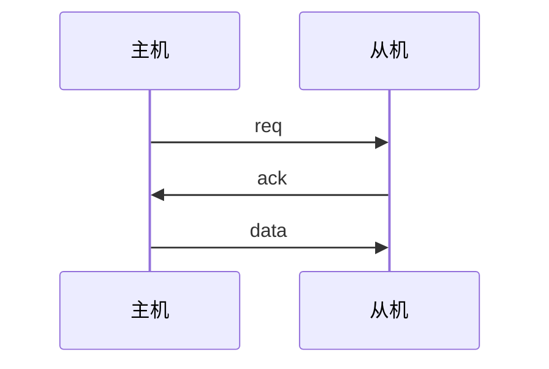
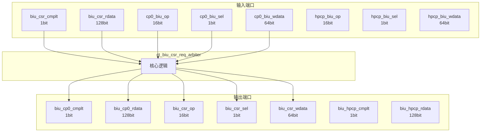

# ct_biu_csr_req_arbiter 模块设计文档

## 1. 模块概述

### 1.1 基本信息

| 属性 | 值 |
|------|-----|
| 模块名称 | ct_biu_csr_req_arbiter |
| 文件路径 | biu\rtl\ct_biu_csr_req_arbiter.v |
| 层级 | Level 2 |

### 1.2 功能描述

总线接口单元 (Bus Interface Unit)，主要信号: 数据信号、选择信号、操作码、程序计数器

### 1.3 设计特点

- 包含 1 个 always 块
- 包含 2 个 assign 语句

## 2. 模块接口说明

### 2.1 输入端口

| 信号名 | 方向 | 位宽 | 描述 |
|--------|------|------|------|
| biu_csr_cmplt | input | 1 |  |
| biu_csr_rdata | input | 128 | 数据信号 |
| cp0_biu_op | input | 16 | 操作码 |
| cp0_biu_sel | input | 1 | 选择信号 |
| cp0_biu_wdata | input | 64 | 数据信号 |
| hpcp_biu_op | input | 16 | 程序计数器 |
| hpcp_biu_sel | input | 1 | 选择信号 |
| hpcp_biu_wdata | input | 64 | 数据信号 |

### 2.2 输出端口

| 信号名 | 方向 | 位宽 | 描述 |
|--------|------|------|------|
| biu_cp0_cmplt | output | 1 |  |
| biu_cp0_rdata | output | 128 | 数据信号 |
| biu_csr_op | output | 16 | 操作码 |
| biu_csr_sel | output | 1 | 选择信号 |
| biu_csr_wdata | output | 64 | 数据信号 |
| biu_hpcp_cmplt | output | 1 | 程序计数器 |
| biu_hpcp_rdata | output | 128 | 数据信号 |

### 2.5 接口时序图



## 3. 模块框图

### 3.1 模块架构图



### 3.2 主要数据连线

无子模块连接。

## 4. 模块实现方案

### 4.1 关键逻辑描述

**Always 块列表:**

```verilog
always @(hpcp_biu_op[15:0]
       or hpcp_biu_wdata[63:0]
       or cp0_biu_wdata[63:0]
       or cp0_biu_op[15:0]
       or cp0_biu_sel
       or hpcp_biu_sel) begin
  // ...
end
```


**Assign 语句列表:**

| 目标信号 | 源表达式 |
|----------|----------|
| biu_cp0_cmplt | biu_csr_cmplt && cp0_biu_sel |
| biu_hpcp_cmplt | biu_csr_cmplt |

## 5. 内部关键信号列表

### 5.1 寄存器信号

无寄存器信号。

### 5.2 线网信号

无线网信号。

## 6. 子模块方案

无子模块。

## 7. 修订历史

| 版本 | 日期 | 作者 | 说明 |
|------|------|------|------|
| 1.0 | 2026-03-12 | Auto-generated | 初始版本 |
