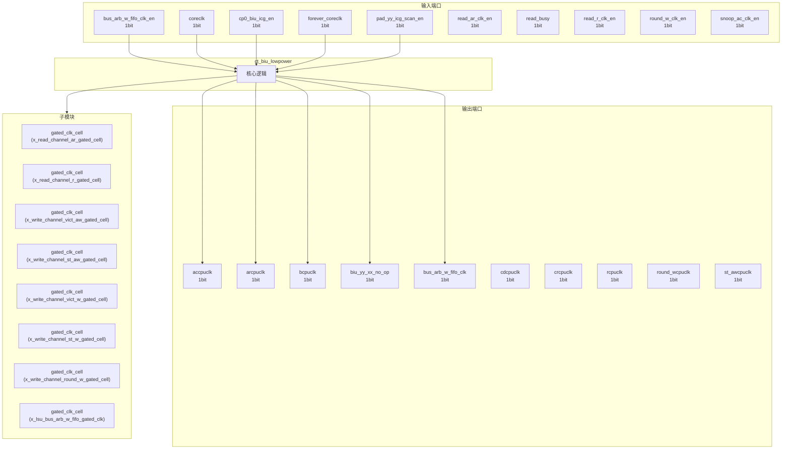

# ct_biu_lowpower 模块设计文档

## 1. 模块概述

### 1.1 基本信息

| 属性 | 值 |
|------|-----|
| 模块名称 | ct_biu_lowpower |
| 文件路径 | biu\rtl\ct_biu_lowpower.v |
| 层级 | Level 2 |

### 1.2 功能描述

ct_biu_lowpower 模块的功能描述。

### 1.3 设计特点

- 包含 12 个子模块实例
- 包含 1 个 assign 语句

## 2. 模块接口说明

### 2.1 输入端口

| 信号名 | 方向 | 位宽 | 描述 |
|--------|------|------|------|
| bus_arb_w_fifo_clk_en | input | 1 | |
| coreclk | input | 1 | |
| cp0_biu_icg_en | input | 1 | |
| forever_coreclk | input | 1 | |
| pad_yy_icg_scan_en | input | 1 | |
| read_ar_clk_en | input | 1 | |
| read_busy | input | 1 | |
| read_r_clk_en | input | 1 | |
| round_w_clk_en | input | 1 | |
| snoop_ac_clk_en | input | 1 | |
| snoop_cd_clk_en | input | 1 | |
| snoop_cr_clk_en | input | 1 | |
| st_aw_clk_en | input | 1 | |
| st_w_clk_en | input | 1 | |
| vict_aw_clk_en | input | 1 | |
| vict_w_clk_en | input | 1 | |
| write_b_clk_en | input | 1 | |
| write_busy | input | 1 | |

### 2.2 输出端口

| 信号名 | 方向 | 位宽 | 描述 |
|--------|------|------|------|
| accpuclk | output | 1 | |
| arcpuclk | output | 1 | |
| bcpuclk | output | 1 | |
| biu_yy_xx_no_op | output | 1 | |
| bus_arb_w_fifo_clk | output | 1 | |
| cdcpuclk | output | 1 | |
| crcpuclk | output | 1 | |
| rcpuclk | output | 1 | |
| round_wcpuclk | output | 1 | |
| st_awcpuclk | output | 1 | |
| st_wcpuclk | output | 1 | |
| vict_awcpuclk | output | 1 | |
| vict_wcpuclk | output | 1 | |

## 3. 模块框图

### 3.1 模块架构图

### 3.2 主要数据连线

| 源模块 | 目标模块 | 信号名 | 位宽 | 说明 |
|--------|----------|--------|------|------|
| ct_biu_lowpower | gated_clk_cell | clk_in | - | |
| ct_biu_lowpower | gated_clk_cell | clk_out | - | |
| ct_biu_lowpower | gated_clk_cell | external_en | - | |
| ct_biu_lowpower | gated_clk_cell | clk_in | - | |
| ct_biu_lowpower | gated_clk_cell | clk_out | - | |
| ct_biu_lowpower | gated_clk_cell | external_en | - | |
| ct_biu_lowpower | gated_clk_cell | clk_in | - | |
| ct_biu_lowpower | gated_clk_cell | clk_out | - | |
| ct_biu_lowpower | gated_clk_cell | external_en | - | |
| ct_biu_lowpower | gated_clk_cell | clk_in | - | |
| ct_biu_lowpower | gated_clk_cell | clk_out | - | |
| ct_biu_lowpower | gated_clk_cell | external_en | - | |
| ct_biu_lowpower | gated_clk_cell | clk_in | - | |
| ct_biu_lowpower | gated_clk_cell | clk_out | - | |
| ct_biu_lowpower | gated_clk_cell | external_en | - | |
| ct_biu_lowpower | gated_clk_cell | clk_in | - | |
| ct_biu_lowpower | gated_clk_cell | clk_out | - | |
| ct_biu_lowpower | gated_clk_cell | external_en | - | |
| ct_biu_lowpower | gated_clk_cell | clk_in | - | |
| ct_biu_lowpower | gated_clk_cell | clk_out | - | |
| ct_biu_lowpower | gated_clk_cell | external_en | - | |
| ct_biu_lowpower | gated_clk_cell | clk_in | - | |
| ct_biu_lowpower | gated_clk_cell | clk_out | - | |
| ct_biu_lowpower | gated_clk_cell | external_en | - | |
| ct_biu_lowpower | gated_clk_cell | clk_in | - | |
| ct_biu_lowpower | gated_clk_cell | clk_out | - | |
| ct_biu_lowpower | gated_clk_cell | external_en | - | |
| ct_biu_lowpower | gated_clk_cell | clk_in | - | |
| ct_biu_lowpower | gated_clk_cell | clk_out | - | |
| ct_biu_lowpower | gated_clk_cell | external_en | - | |

## 4. 模块实现方案

### 4.1 关键逻辑描述

无关键 always 块。

**Assign 语句列表:**

| 目标信号 | 源表达式 |
|----------|----------|
| biu_yy_xx_no_op | !read_busy && !write_busy |

## 5. 内部关键信号列表

### 5.1 寄存器信号

无寄存器信号。

### 5.2 线网信号

无线网信号。

## 6. 子模块方案

### 6.1 模块例化层次结构

```mermaid
graph TD
    ROOT["当前模块"]
    N0["gated_clk_cell\n(x_read_channel_ar_gated_cell)"]
    ROOT --> N0
    N1["gated_clk_cell\n(x_read_channel_r_gated_cell)"]
    ROOT --> N1
    N2["gated_clk_cell\n(x_write_channel_vict_aw_gated_cell)"]
    ROOT --> N2
    N3["gated_clk_cell\n(x_write_channel_st_aw_gated_cell)"]
    ROOT --> N3
    N4["gated_clk_cell\n(x_write_channel_vict_w_gated_cell)"]
    ROOT --> N4
    N5["gated_clk_cell\n(x_write_channel_st_w_gated_cell)"]
    ROOT --> N5
    N6["gated_clk_cell\n(x_write_channel_round_w_gated_cell)"]
    ROOT --> N6
    N7["gated_clk_cell\n(x_lsu_bus_arb_w_fifo_gated_clk)"]
    ROOT --> N7
    N8["gated_clk_cell\n(x_write_channel_b_gated_cell)"]
    ROOT --> N8
    N9["gated_clk_cell\n(x_snoop_channel_ac_gated_cell)"]
    ROOT --> N9
    N10["gated_clk_cell\n(x_snoop_channel_cr_gated_cell)"]
    ROOT --> N10
    N11["gated_clk_cell\n(x_snoop_channel_cd_gated_cell)"]
    ROOT --> N11
```

### 6.2 子模块列表

| 层级 | 模块名 | 实例名 | 功能描述 |
|------|--------|--------|----------|
| 1 | gated_clk_cell | x_read_channel_ar_gated_cell | |
| 1 | gated_clk_cell | x_read_channel_r_gated_cell | |
| 1 | gated_clk_cell | x_write_channel_vict_aw_gated_cell | |
| 1 | gated_clk_cell | x_write_channel_st_aw_gated_cell | |
| 1 | gated_clk_cell | x_write_channel_vict_w_gated_cell | |
| 1 | gated_clk_cell | x_write_channel_st_w_gated_cell | |
| 1 | gated_clk_cell | x_write_channel_round_w_gated_cell | |
| 1 | gated_clk_cell | x_lsu_bus_arb_w_fifo_gated_clk | |
| 1 | gated_clk_cell | x_write_channel_b_gated_cell | |
| 1 | gated_clk_cell | x_snoop_channel_ac_gated_cell | |
| 1 | gated_clk_cell | x_snoop_channel_cr_gated_cell | |
| 1 | gated_clk_cell | x_snoop_channel_cd_gated_cell | |

## 7. 修订历史

| 版本 | 日期 | 作者 | 说明 |
|------|------|------|------|
| 1.0 | 2026-03-12 | Auto-generated | 初始版本 |
