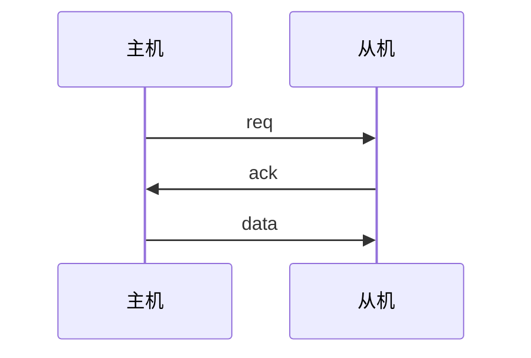
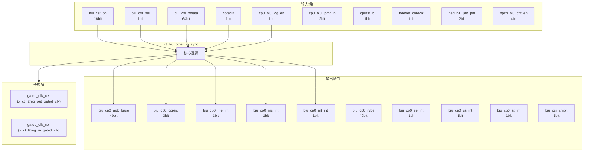
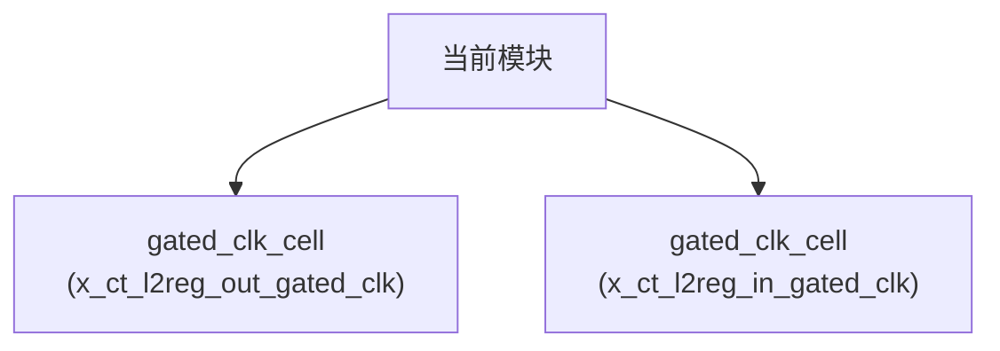

# ct_biu_other_io_sync 模块设计文档

## 1. 模块概述

### 1.1 基本信息

| 属性 | 值 |
|------|-----|
| 模块名称 | ct_biu_other_io_sync |
| 文件路径 | biu\rtl\ct_biu_other_io_sync.v |
| 层级 | Level 2 |

### 1.2 功能描述

总线接口单元 (Bus Interface Unit)，(IO同步)，主要信号: 使能信号、操作码、读使能、输入信号、选择信号

### 1.3 设计特点

- 包含 2 个子模块实例
- 包含 13 个 always 块
- 包含 15 个 assign 语句

## 2. 模块接口说明

### 2.1 输入端口

| 信号名 | 方向 | 位宽 | 描述 |
|--------|------|------|------|
| biu_csr_op | input | 16 | 操作码 |
| biu_csr_sel | input | 1 | 选择信号 |
| biu_csr_wdata | input | 64 | 数据信号 |
| coreclk | input | 1 | 时钟信号 |
| cp0_biu_icg_en | input | 1 | 使能信号 |
| cp0_biu_lpmd_b | input | 2 |  |
| cpurst_b | input | 1 | 复位信号 |
| forever_coreclk | input | 1 | 时钟信号 |
| had_biu_jdb_pm | input | 2 |  |
| hpcp_biu_cnt_en | input | 4 | 使能信号 |
| pad_biu_csr_cmplt | input | 1 |  |
| pad_biu_csr_rdata | input | 128 | 数据信号 |
| pad_biu_dbgrq_b | input | 1 |  |
| pad_biu_hpcp_l2of_int | input | 4 | 程序计数器 |
| pad_biu_me_int | input | 1 | 输入信号 |
| pad_biu_ms_int | input | 1 | 输入信号 |
| pad_biu_mt_int | input | 1 | 输入信号 |
| pad_biu_se_int | input | 1 | 输入信号 |
| pad_biu_ss_int | input | 1 | 输入信号 |
| pad_biu_st_int | input | 1 | 输入信号 |
| pad_core_hartid | input | 3 | 读使能 |
| pad_core_rvba | input | 40 | 读使能 |
| pad_xx_apb_base | input | 40 |  |
| pad_xx_time | input | 64 |  |
| pad_yy_icg_scan_en | input | 1 | 使能信号 |

### 2.2 输出端口

| 信号名 | 方向 | 位宽 | 描述 |
|--------|------|------|------|
| biu_cp0_apb_base | output | 40 |  |
| biu_cp0_coreid | output | 3 | 读使能 |
| biu_cp0_me_int | output | 1 | 输入信号 |
| biu_cp0_ms_int | output | 1 | 输入信号 |
| biu_cp0_mt_int | output | 1 | 输入信号 |
| biu_cp0_rvba | output | 40 |  |
| biu_cp0_se_int | output | 1 | 输入信号 |
| biu_cp0_ss_int | output | 1 | 输入信号 |
| biu_cp0_st_int | output | 1 | 输入信号 |
| biu_csr_cmplt | output | 1 |  |
| biu_csr_rdata | output | 128 | 数据信号 |
| biu_had_coreid | output | 2 | 读使能 |
| biu_had_sdb_req_b | output | 1 | 请求信号 |
| biu_hpcp_l2of_int | output | 4 | 程序计数器 |
| biu_hpcp_time | output | 64 | 程序计数器 |
| biu_mmu_smp_disable | output | 1 |  |
| biu_pad_cnt_en | output | 4 | 使能信号 |
| biu_pad_csr_sel | output | 1 | 选择信号 |
| biu_pad_csr_wdata | output | 80 | 数据信号 |
| biu_pad_jdb_pm | output | 1 |  |
| biu_pad_lpmd_b | output | 1 |  |
| biu_xx_dbg_wakeup | output | 1 | 唤醒信号 |
| biu_xx_int_wakeup | output | 1 | 输入信号 |
| biu_xx_normal_work | output | 1 |  |
| biu_xx_pmp_sel | output | 1 | 选择信号 |

### 2.5 接口时序图



## 3. 模块框图

### 3.1 模块架构图



### 3.2 主要数据连线

| 源模块 | 目标模块 | 信号名 | 位宽 | 说明 |
|--------|----------|--------|------|------|
| ct_biu_other_io_sync | gated_clk_cell | clk_in | - | |
| ct_biu_other_io_sync | gated_clk_cell | clk_out | - | |
| ct_biu_other_io_sync | gated_clk_cell | external_en | - | |
| ct_biu_other_io_sync | gated_clk_cell | clk_in | - | |
| ct_biu_other_io_sync | gated_clk_cell | clk_out | - | |
| ct_biu_other_io_sync | gated_clk_cell | external_en | - | |

## 4. 模块实现方案

### 4.1 关键逻辑描述

**Always 块列表:**

```verilog
always @(posedge coreclk) begin
  // ...
end
```

```verilog
always @(posedge coreclk) begin
  // ...
end
```

```verilog
always @(posedge l2reg_oclk or negedge cpurst_b) begin
  // ...
end
```

```verilog
always @(posedge l2reg_oclk or negedge cpurst_b) begin
  // ...
end
```

```verilog
always @(posedge l2reg_oclk) begin
  // ...
end
```


**Assign 语句列表:**

| 目标信号 | 源表达式 |
|----------|----------|
| biu_xx_pmp_sel | 1'b0 |
| l2reg_oclk_en | biu_csr_sel | biu_csr_sel_ff |
| l2reg_iclk_en | pad_biu_csr_cmplt | biu_csr_cmplt |
| csr_sel_pulse | biu_csr_sel & !biu_csr_sel_ff |
| biu_cp0_me_int | cp0_me_int_ff2 |
| biu_cp0_mt_int | cp0_mt_int_ff2 |
| biu_cp0_ms_int | cp0_ms_int_ff2 |
| biu_cp0_se_int | cp0_se_int_ff2 |
| biu_cp0_st_int | cp0_st_int_ff2 |
| biu_cp0_ss_int | cp0_ss_int_ff2 |
| biu_xx_int_wakeup | cp0_me_int_ff2 | cp0_mt_int_ff2 | cp0_ms_int_ff2 |
                           cp0_se_int_ff2 | cp0_st_int_ff2 | cp0_ss_int_ff2 |
| biu_had_sdb_req_b | had_sdb_req_b_ff2 |
| biu_xx_dbg_wakeup | !had_sdb_req_b_ff2 |
| biu_xx_normal_work | biu_pad_lpmd_b |
| biu_mmu_smp_disable | 1'b0 |

## 5. 内部关键信号列表

### 5.1 寄存器信号

| 信号名 | 位宽 | 描述 |
|--------|------|------|
| biu_csr_sel_ff | 1 | |
| cp0_me_int_ff1 | 1 | |
| cp0_me_int_ff2 | 1 | |
| cp0_ms_int_ff1 | 1 | |
| cp0_ms_int_ff2 | 1 | |
| cp0_mt_int_ff1 | 1 | |
| cp0_mt_int_ff2 | 1 | |
| cp0_se_int_ff1 | 1 | |
| cp0_se_int_ff2 | 1 | |
| cp0_ss_int_ff1 | 1 | |
| cp0_ss_int_ff2 | 1 | |
| cp0_st_int_ff1 | 1 | |
| cp0_st_int_ff2 | 1 | |
| had_sdb_req_b_ff1 | 1 | |
| had_sdb_req_b_ff2 | 1 | |

### 5.2 线网信号

| 信号名 | 位宽 | 描述 |
|--------|------|------|
| biu_csr_req_data | 80 | |
| csr_sel_pulse | 1 | |
| l2reg_iclk | 1 | |
| l2reg_iclk_en | 1 | |
| l2reg_oclk | 1 | |
| l2reg_oclk_en | 1 | |

## 6. 子模块方案

### 6.1 模块例化层次结构



### 6.2 子模块列表

| 层级 | 模块名 | 实例名 | 功能描述 |
|------|--------|--------|----------|
| 1 | gated_clk_cell | x_ct_l2reg_out_gated_clk |  |
| 1 | gated_clk_cell | x_ct_l2reg_in_gated_clk |  |

## 7. 修订历史

| 版本 | 日期 | 作者 | 说明 |
|------|------|------|------|
| 1.0 | 2026-03-12 | Auto-generated | 初始版本 |
