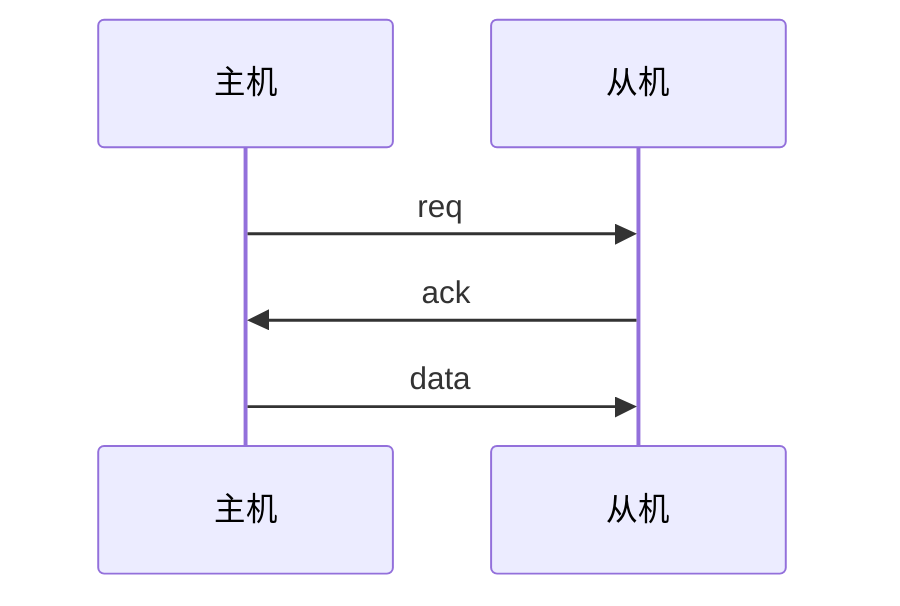
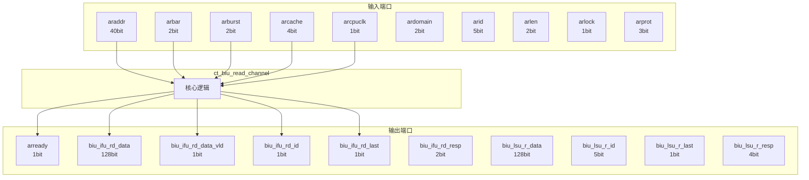

# ct_biu_read_channel 模块设计文档

## 1. 模块概述

### 1.1 基本信息

| 属性 | 值 |
|------|-----|
| 模块名称 | ct_biu_read_channel |
| 文件路径 | biu\rtl\ct_biu_read_channel.v |
| 层级 | Level 2 |

### 1.2 功能描述

总线接口单元 (Bus Interface Unit)，(通道)，主要信号: 使能信号、就绪信号、地址信号、锁定信号、操作码

### 1.3 设计特点

- 包含 16 个 always 块
- 包含 27 个 assign 语句

## 2. 模块接口说明

### 2.1 输入端口

| 信号名 | 方向 | 位宽 | 描述 |
|--------|------|------|------|
| araddr | input | 40 | 地址信号 |
| arbar | input | 2 |  |
| arburst | input | 2 | 复位信号 |
| arcache | input | 4 |  |
| arcpuclk | input | 1 | 时钟信号 |
| ardomain | input | 2 | 输入信号 |
| arid | input | 5 |  |
| arlen | input | 2 | 使能信号 |
| arlock | input | 1 | 锁定信号 |
| arprot | input | 3 |  |
| arsize | input | 3 |  |
| arsnoop | input | 4 | 操作码 |
| aruser | input | 3 |  |
| arvalid | input | 1 | 有效信号 |
| arvalid_gate | input | 1 | 有效信号 |
| coreclk | input | 1 | 时钟信号 |
| cpurst_b | input | 1 | 复位信号 |
| ifu_biu_r_ready | input | 1 | 就绪信号 |
| lsu_biu_r_linefill_ready | input | 1 | 就绪信号 |
| pad_biu_arready | input | 1 | 就绪信号 |
| pad_biu_rack_ready | input | 1 | 应答信号 |
| pad_biu_rdata | input | 128 | 数据信号 |
| pad_biu_rid | input | 5 |  |
| pad_biu_rlast | input | 1 |  |
| pad_biu_rresp | input | 4 | 读使能 |
| pad_biu_rvalid | input | 1 | 有效信号 |
| rcpuclk | input | 1 | 时钟信号 |

### 2.2 输出端口

| 信号名 | 方向 | 位宽 | 描述 |
|--------|------|------|------|
| arready | output | 1 | 就绪信号 |
| biu_ifu_rd_data | output | 128 | 数据信号 |
| biu_ifu_rd_data_vld | output | 1 | 有效信号 |
| biu_ifu_rd_id | output | 1 |  |
| biu_ifu_rd_last | output | 1 |  |
| biu_ifu_rd_resp | output | 2 | 读使能 |
| biu_lsu_r_data | output | 128 | 数据信号 |
| biu_lsu_r_id | output | 5 |  |
| biu_lsu_r_last | output | 1 |  |
| biu_lsu_r_resp | output | 4 | 读使能 |
| biu_lsu_r_vld | output | 1 | 有效信号 |
| biu_pad_araddr | output | 40 | 地址信号 |
| biu_pad_arbar | output | 2 |  |
| biu_pad_arburst | output | 2 | 复位信号 |
| biu_pad_arcache | output | 4 |  |
| biu_pad_ardomain | output | 2 | 输入信号 |
| biu_pad_arid | output | 5 |  |
| biu_pad_arlen | output | 2 | 使能信号 |
| biu_pad_arlock | output | 1 | 锁定信号 |
| biu_pad_arprot | output | 3 |  |
| biu_pad_arsize | output | 3 |  |
| biu_pad_arsnoop | output | 4 | 操作码 |
| biu_pad_aruser | output | 3 |  |
| biu_pad_arvalid | output | 1 | 有效信号 |
| biu_pad_rack | output | 1 | 应答信号 |
| biu_pad_rready | output | 1 | 就绪信号 |
| read_ar_clk_en | output | 1 | 时钟信号 |
| read_busy | output | 1 | 读使能 |
| read_r_clk_en | output | 1 | 时钟信号 |

### 2.5 接口时序图



## 3. 模块框图

### 3.1 模块架构图



### 3.2 主要数据连线

无子模块连接。

## 4. 模块实现方案

### 4.1 关键逻辑描述

**Always 块列表:**

```verilog
always @(cur_raddr_buf0_arprot[2:0]
       or cur_raddr_buf1_arcache[3:0]
       or cur_raddr_buf1_ardomain[1:0]
       or cur_raddr_buf1_arburst[1:0]
       or cur_raddr_buf0_arcache[3:0]
       or cur_raddr_buf0_aruser[2:0]
       or cur_raddr_buf1_arlen[1:0]
       or cur_raddr_buf1_arsnoop[3:0]
       or cur_raddr_buf0_arbar[1:0]
       or cur_raddr_buf0_araddr[39:0]
       or cur_raddr_buf0_arid[4:0]
       or cur_raddr_buf1_arlock
       or cur_raddr_buf0_arburst[1:0]
       or cur_raddr_buf0_arsnoop[3:0]
       or cur_raddr_buf_pop1_sel
       or cur_raddr_buf0_ardomain[1:0]
       or cur_raddr_buf0_arsize[2:0]
       or cur_raddr_buf1_arid[4:0]
       or cur_raddr_buf1_aruser[2:0]
       or cur_raddr_buf0_arlen[1:0]
       or cur_raddr_buf1_araddr[39:0]
       or cur_raddr_buf0_arlock
       or cur_raddr_buf1_arbar[1:0]
       or cur_raddr_buf1_arprot[2:0]
       or cur_raddr_buf1_arsize[2:0]) begin
  // ...
end
```

```verilog
always @(posedge arcpuclk or negedge cpurst_b) begin
  // ...
end
```

```verilog
always @(posedge arcpuclk or negedge cpurst_b) begin
  // ...
end
```

```verilog
always @(posedge arcpuclk or negedge cpurst_b) begin
  // ...
end
```

```verilog
always @(posedge arcpuclk or negedge cpurst_b) begin
  // ...
end
```


**Assign 语句列表:**

| 目标信号 | 源表达式 |
|----------|----------|
| arready | cur_raddr_buf_ready |
| cur_raddr_buf_ready | cur_raddr_buf_empty |
| cur_raddr_buf_empty | !cur_raddr_buf0_arvalid
                             || !cur_raddr_buf1_arvalid |
| biu_pad_arvalid | cur_raddr_buf_arvalid |
| biu_pad_arlock | cur_raddr_buf_arlock |
| cur_raddr_buf_arvalid | cur_raddr_buf0_arvalid
                                        || cur_raddr_buf1_arvalid |
| biu_pad_rready | cur_rdata_buf_ready |
| cur_rdata_buf_ready | cur_rdata_buf_empty |
| cur_rdata_buf_empty | !cur_rdata_buf0_rvalid
                              || !cur_rdata_buf1_rvalid |
| rd_data_clr_en_raw | (cur_rdata_is_ifu && ifu_biu_r_ready)
                           || (cur_rdata_is_lsu && lsu_biu_r_linefill_ready)
                           || (cur_rdata_is_lsu && !cur_rdata_is_linefill) |
| rd_data_clr_en | rd_data_clr_en_raw && !rack_full |
| cur_rdata_is_ifu | cur_rdata_buf_rvalid
                           && (   (cur_rdata_buf_rid[4:0] == 5'b10000)
                               || (cur_rdata_buf_rid[4:0] == 5'b10001) ) |
| cur_rdata_is_lsu | cur_rdata_buf_rvalid
                           && !cur_rdata_is_ifu |
| cur_rdata_is_linefill | cur_rdata_buf_rvalid
                             && (cur_rdata_buf_rid[4:3] == 2'b00) |
| rd_data_create_en | cur_rdata_buf_ready && pad_biu_rvalid |
| ... | 共27条assign语句 |

## 5. 内部关键信号列表

### 5.1 寄存器信号

| 信号名 | 位宽 | 描述 |
|--------|------|------|
| cur_raddr_buf0_araddr | 40 | |
| cur_raddr_buf0_arbar | 2 | |
| cur_raddr_buf0_arburst | 2 | |
| cur_raddr_buf0_arcache | 4 | |
| cur_raddr_buf0_ardomain | 2 | |
| cur_raddr_buf0_arid | 5 | |
| cur_raddr_buf0_arlen | 2 | |
| cur_raddr_buf0_arlock | 1 | |
| cur_raddr_buf0_arprot | 3 | |
| cur_raddr_buf0_arsize | 3 | |
| cur_raddr_buf0_arsnoop | 4 | |
| cur_raddr_buf0_aruser | 3 | |
| cur_raddr_buf0_arvalid | 1 | |
| cur_raddr_buf1_araddr | 40 | |
| cur_raddr_buf1_arbar | 2 | |
| cur_raddr_buf1_arburst | 2 | |
| cur_raddr_buf1_arcache | 4 | |
| cur_raddr_buf1_ardomain | 2 | |
| cur_raddr_buf1_arid | 5 | |
| cur_raddr_buf1_arlen | 2 | |
| ... | ... | 共58个寄存器信号 |

### 5.2 线网信号

| 信号名 | 位宽 | 描述 |
|--------|------|------|
| cur_raddr_buf_arvalid | 1 | |
| cur_raddr_buf_empty | 1 | |
| cur_raddr_buf_ready | 1 | |
| cur_rdata_buf_empty | 1 | |
| cur_rdata_buf_ready | 1 | |
| cur_rdata_buf_rvalid | 1 | |
| cur_rdata_is_ifu | 1 | |
| cur_rdata_is_linefill | 1 | |
| cur_rdata_is_lsu | 1 | |
| rack_full | 1 | |
| rd_data_clr_en | 1 | |
| rd_data_clr_en_raw | 1 | |
| rd_data_create_en | 1 | |
| rlast_done | 1 | |

## 6. 子模块方案

无子模块。

## 7. 修订历史

| 版本 | 日期 | 作者 | 说明 |
|------|------|------|------|
| 1.0 | 2026-03-12 | Auto-generated | 初始版本 |
