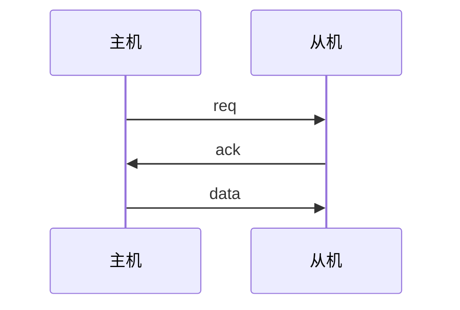
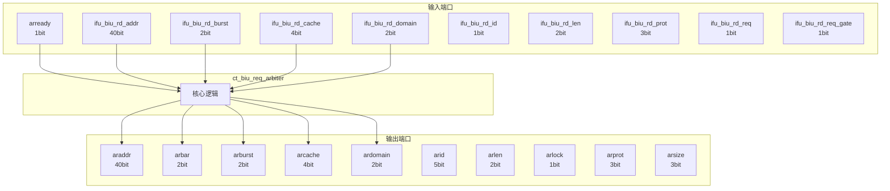

# ct_biu_req_arbiter 模块设计文档

## 1. 模块概述

### 1.1 基本信息

| 属性 | 值 |
|------|-----|
| 模块名称 | ct_biu_req_arbiter |
| 文件路径 | biu\rtl\ct_biu_req_arbiter.v |
| 层级 | Level 2 |

### 1.2 功能描述

总线接口单元 (Bus Interface Unit)，主要信号: 使能信号、就绪信号、地址信号、锁定信号、操作码

### 1.3 设计特点

- 包含 1 个 always 块
- 包含 26 个 assign 语句

## 2. 模块接口说明

### 2.1 输入端口

| 信号名 | 方向 | 位宽 | 描述 |
|--------|------|------|------|
| arready | input | 1 | 就绪信号 |
| ifu_biu_rd_addr | input | 40 | 地址信号 |
| ifu_biu_rd_burst | input | 2 | 复位信号 |
| ifu_biu_rd_cache | input | 4 |  |
| ifu_biu_rd_domain | input | 2 | 输入信号 |
| ifu_biu_rd_id | input | 1 |  |
| ifu_biu_rd_len | input | 2 | 使能信号 |
| ifu_biu_rd_prot | input | 3 |  |
| ifu_biu_rd_req | input | 1 | 请求信号 |
| ifu_biu_rd_req_gate | input | 1 | 请求信号 |
| ifu_biu_rd_size | input | 3 |  |
| ifu_biu_rd_snoop | input | 4 | 操作码 |
| ifu_biu_rd_user | input | 2 |  |
| lsu_biu_ar_addr | input | 40 | 地址信号 |
| lsu_biu_ar_bar | input | 2 |  |
| lsu_biu_ar_burst | input | 2 | 复位信号 |
| lsu_biu_ar_cache | input | 4 |  |
| lsu_biu_ar_domain | input | 2 | 输入信号 |
| lsu_biu_ar_dp_req | input | 1 | 请求信号 |
| lsu_biu_ar_id | input | 5 |  |
| lsu_biu_ar_len | input | 2 | 使能信号 |
| lsu_biu_ar_lock | input | 1 | 锁定信号 |
| lsu_biu_ar_prot | input | 3 |  |
| lsu_biu_ar_req | input | 1 | 请求信号 |
| lsu_biu_ar_req_gate | input | 1 | 请求信号 |
| lsu_biu_ar_size | input | 3 |  |
| lsu_biu_ar_snoop | input | 4 | 操作码 |
| lsu_biu_ar_user | input | 3 |  |
| lsu_biu_aw_req_gate | input | 1 | 请求信号 |
| lsu_biu_aw_st_addr | input | 40 | 地址信号 |
| ... | ... | ... | 共73个输入端口 |

### 2.2 输出端口

| 信号名 | 方向 | 位宽 | 描述 |
|--------|------|------|------|
| araddr | output | 40 | 地址信号 |
| arbar | output | 2 |  |
| arburst | output | 2 | 复位信号 |
| arcache | output | 4 |  |
| ardomain | output | 2 | 输入信号 |
| arid | output | 5 |  |
| arlen | output | 2 | 使能信号 |
| arlock | output | 1 | 锁定信号 |
| arprot | output | 3 |  |
| arsize | output | 3 |  |
| arsnoop | output | 4 | 操作码 |
| aruser | output | 3 |  |
| arvalid | output | 1 | 有效信号 |
| arvalid_gate | output | 1 | 有效信号 |
| biu_ifu_rd_grnt | output | 1 |  |
| biu_lsu_ar_ready | output | 1 | 就绪信号 |
| biu_lsu_aw_vb_grnt | output | 1 |  |
| biu_lsu_aw_wmb_grnt | output | 1 |  |
| biu_lsu_w_vb_grnt | output | 1 |  |
| biu_lsu_w_wmb_grnt | output | 1 |  |
| st_awaddr | output | 40 | 地址信号 |
| st_awbar | output | 2 |  |
| st_awburst | output | 2 | 复位信号 |
| st_awcache | output | 4 |  |
| st_awdomain | output | 2 | 输入信号 |
| st_awid | output | 5 |  |
| st_awlen | output | 2 | 使能信号 |
| st_awlock | output | 1 | 锁定信号 |
| st_awprot | output | 3 |  |
| st_awsize | output | 3 |  |
| ... | ... | ... | 共60个输出端口 |

### 2.5 接口时序图



## 3. 模块框图

### 3.1 模块架构图



### 3.2 主要数据连线

无子模块连接。

## 4. 模块实现方案

### 4.1 关键逻辑描述

**Always 块列表:**

```verilog
always @(lsu_biu_ar_lock
       or ifu_biu_rd_domain[1:0]
       or ifu_biu_rd_burst[1:0]
       or lsu_biu_ar_len[1:0]
       or lsu_biu_ar_size[2:0]
       or lsu_biu_ar_addr[39:0]
       or ifu_biu_rd_len[1:0]
       or ifu_biu_rd_addr[39:0]
       or ifu_biu_rd_cache[3:0]
       or lsu_biu_ar_dp_req
       or lsu_biu_ar_cache[3:0]
       or lsu_biu_ar_burst[1:0]
       or ifu_biu_rd_user[1:0]
       or lsu_biu_ar_user[2:0]
       or lsu_biu_ar_prot[2:0]
       or ifu_biu_rd_snoop[3:0]
       or lsu_biu_ar_bar[1:0]
       or ifu_biu_rd_prot[2:0]
       or lsu_biu_ar_domain[1:0]
       or ifu_biu_rd_size[2:0]
       or lsu_biu_ar_id[4:0]
       or ifu_biu_rd_id
       or lsu_biu_ar_snoop[3:0]) begin
  // ...
end
```


**Assign 语句列表:**

| 目标信号 | 源表达式 |
|----------|----------|
| ifu_ar_req | ifu_biu_rd_req && !lsu_biu_ar_dp_req |
| lsu_ar_req | lsu_biu_ar_req  &&  lsu_biu_ar_dp_req |
| arvalid | ifu_ar_req || lsu_ar_req |
| arvalid_gate | ifu_ar_req || lsu_biu_ar_dp_req |
| biu_ifu_rd_grnt | ifu_ar_req && arready |
| biu_lsu_ar_ready | arready |
| vict_awvalid | lsu_biu_aw_vict_req |
| vict_awvalid_gate | lsu_biu_aw_vict_dp_req |
| vict_awlock | lsu_biu_aw_vict_lock |
| vict_awuser | lsu_biu_aw_vict_user |
| vict_awunique | lsu_biu_aw_vict_unique |
| st_awvalid | lsu_biu_aw_st_req |
| st_awvalid_gate | lsu_biu_aw_st_dp_req |
| st_awlock | lsu_biu_aw_st_lock |
| st_awuser | lsu_biu_aw_st_user |
| ... | 共26条assign语句 |

## 5. 内部关键信号列表

### 5.1 寄存器信号

无寄存器信号。

### 5.2 线网信号

| 信号名 | 位宽 | 描述 |
|--------|------|------|
| ifu_ar_req | 1 | |
| lsu_ar_req | 1 | |

## 6. 子模块方案

无子模块。

## 7. 修订历史

| 版本 | 日期 | 作者 | 说明 |
|------|------|------|------|
| 1.0 | 2026-03-12 | Auto-generated | 初始版本 |
