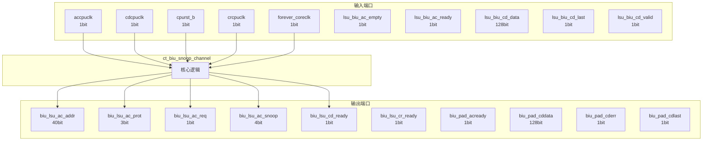

# ct_biu_snoop_channel 模块设计文档

## 1. 模块概述

### 1.1 基本信息

| 属性 | 值 |
|------|-----|
| 模块名称 | ct_biu_snoop_channel |
| 文件路径 | biu\rtl\ct_biu_snoop_channel.v |
| 层级 | Level 2 |

### 1.2 功能描述

ct_biu_snoop_channel 模块的功能描述。

### 1.3 设计特点

- 包含 21 个 always 块
- 包含 22 个 assign 语句

## 2. 模块接口说明

### 2.1 输入端口

| 信号名 | 方向 | 位宽 | 描述 |
|--------|------|------|------|
| accpuclk | input | 1 | |
| cdcpuclk | input | 1 | |
| cpurst_b | input | 1 | |
| crcpuclk | input | 1 | |
| forever_coreclk | input | 1 | |
| lsu_biu_ac_empty | input | 1 | |
| lsu_biu_ac_ready | input | 1 | |
| lsu_biu_cd_data | input | 128 | |
| lsu_biu_cd_last | input | 1 | |
| lsu_biu_cd_valid | input | 1 | |
| lsu_biu_cr_resp | input | 5 | |
| lsu_biu_cr_valid | input | 1 | |
| pad_biu_acaddr | input | 40 | |
| pad_biu_acprot | input | 3 | |
| pad_biu_acsnoop | input | 4 | |
| pad_biu_acvalid | input | 1 | |
| pad_biu_cdready | input | 1 | |
| pad_biu_crready | input | 1 | |

### 2.2 输出端口

| 信号名 | 方向 | 位宽 | 描述 |
|--------|------|------|------|
| biu_lsu_ac_addr | output | 40 | |
| biu_lsu_ac_prot | output | 3 | |
| biu_lsu_ac_req | output | 1 | |
| biu_lsu_ac_snoop | output | 4 | |
| biu_lsu_cd_ready | output | 1 | |
| biu_lsu_cr_ready | output | 1 | |
| biu_pad_acready | output | 1 | |
| biu_pad_cddata | output | 128 | |
| biu_pad_cderr | output | 1 | |
| biu_pad_cdlast | output | 1 | |
| biu_pad_cdvalid | output | 1 | |
| biu_pad_crresp | output | 5 | |
| biu_pad_crvalid | output | 1 | |
| biu_xx_snoop_vld | output | 1 | |
| snoop_ac_clk_en | output | 1 | |
| snoop_cd_clk_en | output | 1 | |
| snoop_cr_clk_en | output | 1 | |

## 3. 模块框图

### 3.1 模块架构图



### 3.2 主要数据连线

无子模块连接。

## 4. 模块实现方案

### 4.1 关键逻辑描述

**Always 块列表:**

```verilog
always @(posedge accpuclk or negedge cpurst_b) begin
  // ...
end
```

```verilog
always @(posedge accpuclk or negedge cpurst_b) begin
  // ...
end
```

```verilog
always @(posedge accpuclk or negedge cpurst_b) begin
  // ...
end
```

```verilog
always @(posedge accpuclk) begin
  // ...
end
```

```verilog
always @(posedge accpuclk or negedge cpurst_b) begin
  // ...
end
```


**Assign 语句列表:**

| 目标信号 | 源表达式 |
|----------|----------|
| snoop_req_create_en | cur_acaddr_buf_ready
                            && pad_biu_acvalid |
| cur_acaddr_buf_ready | !cur_acaddr_buf0_acvalid
                               || !cur_acaddr_buf1_acvalid |
| biu_pad_acready | cur_acaddr_buf_ready |
| cur_acaddr_buf_acvalid | cur_acaddr_buf0_acvalid || cur_acaddr_buf1_acvalid |
| biu_lsu_ac_req | cur_acaddr_buf_acvalid |
| biu_lsu_cr_ready | crready |
| crready | cur_craddr_buf_ready |
| cur_craddr_buf_ready | !cur_craddr_buf0_crvalid
                              || !cur_craddr_buf1_crvalid |
| biu_pad_crvalid | cur_craddr_buf_crvalid |
| cur_craddr_buf_crvalid | cur_craddr_buf0_crvalid || cur_craddr_buf1_crvalid |
| biu_lsu_cd_ready | cdready |
| cdready | cur_cddata_buf_ready |
| cur_cddata_buf_ready | !cur_cddata_buf0_cdvalid
                              || !cur_cddata_buf1_cdvalid |
| biu_pad_cdvalid | cur_cddata_buf_cdvalid |
| biu_pad_cdlast | cur_cddata_buf_cdlast |
| ... | 共22条assign语句 |

## 5. 内部关键信号列表

### 5.1 寄存器信号

| 信号名 | 位宽 | 描述 |
|--------|------|------|
| core_snoop_vld | 1 | |
| cur_acaddr_buf0_acaddr | 40 | |
| cur_acaddr_buf0_acprot | 3 | |
| cur_acaddr_buf0_acsnoop | 4 | |
| cur_acaddr_buf0_acvalid | 1 | |
| cur_acaddr_buf1_acaddr | 40 | |
| cur_acaddr_buf1_acprot | 3 | |
| cur_acaddr_buf1_acsnoop | 4 | |
| cur_acaddr_buf1_acvalid | 1 | |
| cur_acaddr_buf_acaddr | 40 | |
| cur_acaddr_buf_acprot | 3 | |
| cur_acaddr_buf_acsnoop | 4 | |
| cur_acaddr_buf_crt1_sel | 1 | |
| cur_acaddr_buf_pop1_sel | 1 | |
| cur_cddata_buf0_cddata | 128 | |
| cur_cddata_buf0_cdlast | 1 | |
| cur_cddata_buf0_cdvalid | 1 | |
| cur_cddata_buf1_cddata | 128 | |
| cur_cddata_buf1_cdlast | 1 | |
| cur_cddata_buf1_cdvalid | 1 | |
| ... | ... | 共30个寄存器信号 |

### 5.2 线网信号

| 信号名 | 位宽 | 描述 |
|--------|------|------|
| cdready | 1 | |
| core_ac_empty | 1 | |
| crready | 1 | |
| cur_acaddr_buf_acvalid | 1 | |
| cur_acaddr_buf_ready | 1 | |
| cur_cddata_buf_cdvalid | 1 | |
| cur_cddata_buf_ready | 1 | |
| cur_craddr_buf_crresp | 5 | |
| cur_craddr_buf_crvalid | 1 | |
| cur_craddr_buf_ready | 1 | |
| snoop_req_create_en | 1 | |

## 6. 子模块方案

无子模块。

## 7. 修订历史

| 版本 | 日期 | 作者 | 说明 |
|------|------|------|------|
| 1.0 | 2026-03-12 | Auto-generated | 初始版本 |
