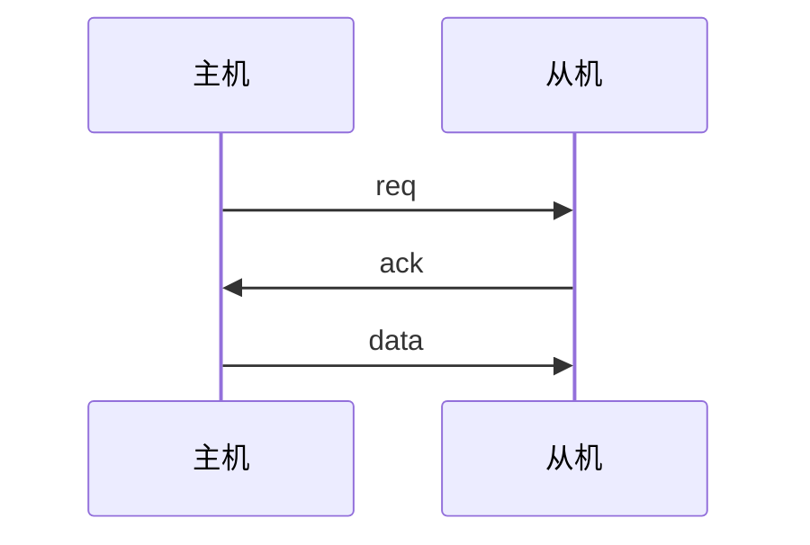
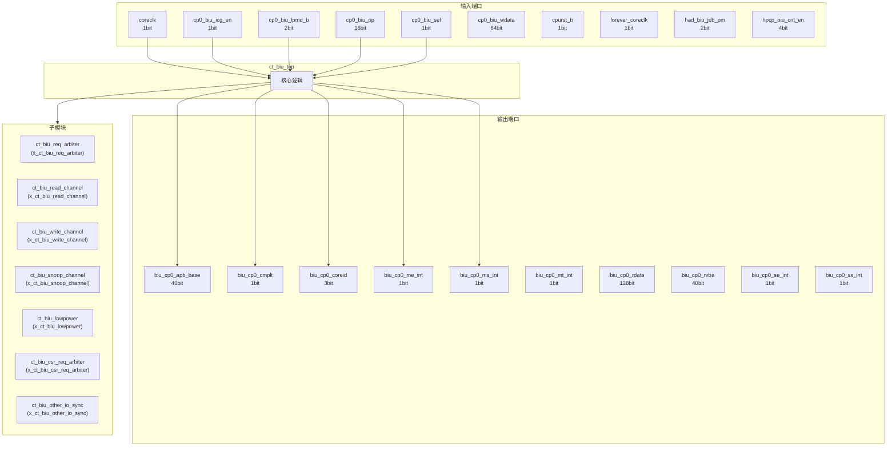
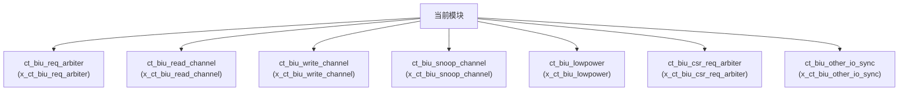

# ct_biu_top 模块设计文档

## 1. 模块概述

### 1.1 基本信息

| 属性 | 值 |
|------|-----|
| 模块名称 | ct_biu_top |
| 文件路径 | biu\rtl\ct_biu_top.v |
| 层级 | Level 1 |

### 1.2 功能描述

总线接口单元 (Bus Interface Unit)，主要信号: 有效信号、读使能、输入信号、数据信号、程序计数器

### 1.3 设计特点

- 包含 7 个子模块实例
- 包含 2 个 assign 语句

## 2. 模块接口说明

### 2.1 输入端口

| 信号名 | 方向 | 位宽 | 描述 |
|--------|------|------|------|
| coreclk | input | 1 | 时钟信号 |
| cp0_biu_icg_en | input | 1 | 使能信号 |
| cp0_biu_lpmd_b | input | 2 |  |
| cp0_biu_op | input | 16 | 操作码 |
| cp0_biu_sel | input | 1 | 选择信号 |
| cp0_biu_wdata | input | 64 | 数据信号 |
| cpurst_b | input | 1 | 复位信号 |
| forever_coreclk | input | 1 | 时钟信号 |
| had_biu_jdb_pm | input | 2 |  |
| hpcp_biu_cnt_en | input | 4 | 使能信号 |
| hpcp_biu_op | input | 16 | 程序计数器 |
| hpcp_biu_sel | input | 1 | 选择信号 |
| hpcp_biu_wdata | input | 64 | 数据信号 |
| ifu_biu_r_ready | input | 1 | 就绪信号 |
| ifu_biu_rd_addr | input | 40 | 地址信号 |
| ifu_biu_rd_burst | input | 2 | 复位信号 |
| ifu_biu_rd_cache | input | 4 |  |
| ifu_biu_rd_domain | input | 2 | 输入信号 |
| ifu_biu_rd_id | input | 1 |  |
| ifu_biu_rd_len | input | 2 | 使能信号 |
| ifu_biu_rd_prot | input | 3 |  |
| ifu_biu_rd_req | input | 1 | 请求信号 |
| ifu_biu_rd_req_gate | input | 1 | 请求信号 |
| ifu_biu_rd_size | input | 3 |  |
| ifu_biu_rd_snoop | input | 4 | 操作码 |
| ifu_biu_rd_user | input | 2 |  |
| lsu_biu_ac_empty | input | 1 | 空标志 |
| lsu_biu_ac_ready | input | 1 | 就绪信号 |
| lsu_biu_ar_addr | input | 40 | 地址信号 |
| lsu_biu_ar_bar | input | 2 |  |
| ... | ... | ... | 共126个输入端口 |

### 2.2 输出端口

| 信号名 | 方向 | 位宽 | 描述 |
|--------|------|------|------|
| biu_cp0_apb_base | output | 40 |  |
| biu_cp0_cmplt | output | 1 |  |
| biu_cp0_coreid | output | 3 | 读使能 |
| biu_cp0_me_int | output | 1 | 输入信号 |
| biu_cp0_ms_int | output | 1 | 输入信号 |
| biu_cp0_mt_int | output | 1 | 输入信号 |
| biu_cp0_rdata | output | 128 | 数据信号 |
| biu_cp0_rvba | output | 40 |  |
| biu_cp0_se_int | output | 1 | 输入信号 |
| biu_cp0_ss_int | output | 1 | 输入信号 |
| biu_cp0_st_int | output | 1 | 输入信号 |
| biu_had_coreid | output | 2 | 读使能 |
| biu_had_sdb_req_b | output | 1 | 请求信号 |
| biu_hpcp_cmplt | output | 1 | 程序计数器 |
| biu_hpcp_l2of_int | output | 4 | 程序计数器 |
| biu_hpcp_rdata | output | 128 | 数据信号 |
| biu_hpcp_time | output | 64 | 程序计数器 |
| biu_ifu_rd_data | output | 128 | 数据信号 |
| biu_ifu_rd_data_vld | output | 1 | 有效信号 |
| biu_ifu_rd_grnt | output | 1 |  |
| biu_ifu_rd_id | output | 1 |  |
| biu_ifu_rd_last | output | 1 |  |
| biu_ifu_rd_resp | output | 2 | 读使能 |
| biu_lsu_ac_addr | output | 40 | 地址信号 |
| biu_lsu_ac_prot | output | 3 |  |
| biu_lsu_ac_req | output | 1 | 请求信号 |
| biu_lsu_ac_snoop | output | 4 | 操作码 |
| biu_lsu_ar_ready | output | 1 | 就绪信号 |
| biu_lsu_aw_vb_grnt | output | 1 |  |
| biu_lsu_aw_wmb_grnt | output | 1 |  |
| ... | ... | ... | 共98个输出端口 |

### 2.5 接口时序图

## 3. 模块框图

### 3.1 模块架构图

### 3.2 主要数据连线

| 源模块 | 目标模块 | 信号名 | 位宽 | 说明 |
|--------|----------|--------|------|------|
| ct_biu_top | ct_biu_req_arbiter | araddr | - | |
| ct_biu_top | ct_biu_req_arbiter | arbar | - | |
| ct_biu_top | ct_biu_req_arbiter | arburst | - | |
| ct_biu_top | ct_biu_read_channel | araddr | - | |
| ct_biu_top | ct_biu_read_channel | arbar | - | |
| ct_biu_top | ct_biu_read_channel | arburst | - | |
| ct_biu_top | ct_biu_write_channel | bcpuclk | - | |
| ct_biu_top | ct_biu_write_channel | biu_lsu_b_id | - | |
| ct_biu_top | ct_biu_write_channel | biu_lsu_b_resp | - | |
| ct_biu_top | ct_biu_snoop_channel | accpuclk | - | |
| ct_biu_top | ct_biu_snoop_channel | biu_lsu_ac_addr | - | |
| ct_biu_top | ct_biu_snoop_channel | biu_lsu_ac_prot | - | |
| ct_biu_top | ct_biu_lowpower | accpuclk | - | |
| ct_biu_top | ct_biu_lowpower | arcpuclk | - | |
| ct_biu_top | ct_biu_lowpower | bcpuclk | - | |
| ct_biu_top | ct_biu_csr_req_arbiter | biu_cp0_cmplt | - | |
| ct_biu_top | ct_biu_csr_req_arbiter | biu_cp0_rdata | - | |
| ct_biu_top | ct_biu_csr_req_arbiter | biu_csr_cmplt | - | |
| ct_biu_top | ct_biu_other_io_sync | biu_cp0_apb_base | - | |
| ct_biu_top | ct_biu_other_io_sync | biu_cp0_coreid | - | |
| ct_biu_top | ct_biu_other_io_sync | biu_cp0_me_int | - | |

## 4. 模块实现方案

### 4.1 关键逻辑描述

无关键 always 块。

**Assign 语句列表:**

| 目标信号 | 源表达式 |
|----------|----------|
| pad_biu_rack_ready | 1'b1 |
| pad_biu_back_ready | 1'b1 |

## 5. 内部关键信号列表

### 5.1 寄存器信号

无寄存器信号。

### 5.2 线网信号

| 信号名 | 位宽 | 描述 |
|--------|------|------|
| accpuclk | 1 | |
| araddr | 40 | |
| arbar | 2 | |
| arburst | 2 | |
| arcache | 4 | |
| arcpuclk | 1 | |
| ardomain | 2 | |
| arid | 5 | |
| arlen | 2 | |
| arlock | 1 | |
| arprot | 3 | |
| arready | 1 | |
| arsize | 3 | |
| arsnoop | 4 | |
| aruser | 3 | |
| arvalid | 1 | |
| arvalid_gate | 1 | |
| bcpuclk | 1 | |
| biu_csr_cmplt | 1 | |
| biu_csr_op | 16 | |
| ... | ... | 共92个线网信号 |

## 6. 子模块方案

### 6.1 模块例化层次结构

### 6.2 子模块列表

| 层级 | 模块名 | 实例名 | 功能描述 |
|------|--------|--------|----------|
| 1 | ct_biu_req_arbiter | x_ct_biu_req_arbiter | 总线接口单元 |
| 1 | ct_biu_read_channel | x_ct_biu_read_channel | 总线接口单元 |
| 1 | ct_biu_write_channel | x_ct_biu_write_channel | 总线接口单元 |
| 1 | ct_biu_snoop_channel | x_ct_biu_snoop_channel | 总线接口单元 |
| 1 | ct_biu_lowpower | x_ct_biu_lowpower | 总线接口单元 |
| 1 | ct_biu_csr_req_arbiter | x_ct_biu_csr_req_arbiter | 总线接口单元 |
| 1 | ct_biu_other_io_sync | x_ct_biu_other_io_sync | 总线接口单元 |

## 7. 修订历史

| 版本 | 日期 | 作者 | 说明 |
|------|------|------|------|
| 1.0 | 2026-03-12 | Auto-generated | 初始版本 |
