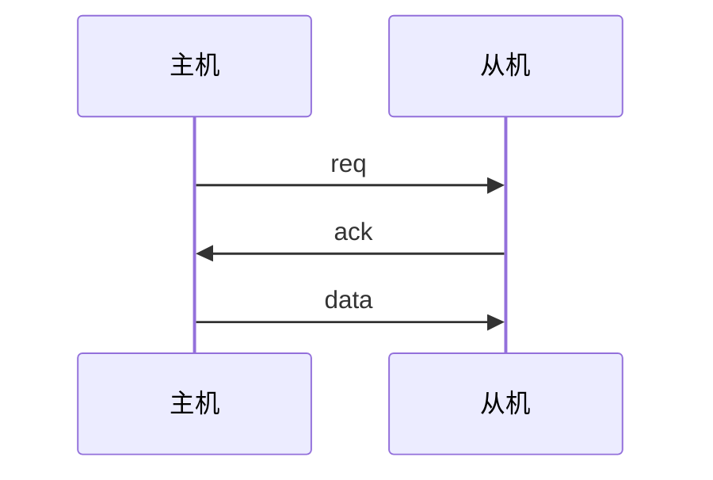
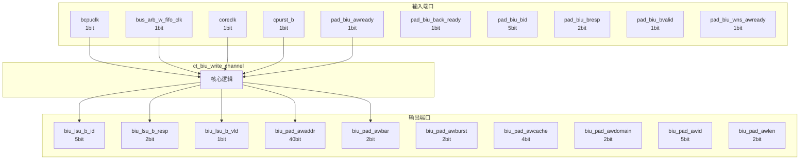

# ct_biu_write_channel 模块设计文档

## 1. 模块概述

### 1.1 基本信息

| 属性 | 值 |
|------|-----|
| 模块名称 | ct_biu_write_channel |
| 文件路径 | biu\rtl\ct_biu_write_channel.v |
| 层级 | Level 2 |
| 参数 | WU=3'b000, WLU=3'b001, EVICT=3'b100, W_FIFO_ENTRY=12 |

### 1.2 功能描述

总线接口单元 (Bus Interface Unit)，(通道)，主要信号: 应答信号、使能信号、操作码、地址信号、锁定信号

### 1.3 设计特点

- 包含 19 个 always 块
- 包含 43 个 assign 语句
- 可配置参数: 4 个

## 2. 模块接口说明

### 2.1 输入端口

| 信号名 | 方向 | 位宽 | 描述 |
|--------|------|------|------|
| bcpuclk | input | 1 | 时钟信号 |
| bus_arb_w_fifo_clk | input | 1 | 时钟信号 |
| coreclk | input | 1 | 时钟信号 |
| cpurst_b | input | 1 | 复位信号 |
| pad_biu_awready | input | 1 | 就绪信号 |
| pad_biu_back_ready | input | 1 | 应答信号 |
| pad_biu_bid | input | 5 |  |
| pad_biu_bresp | input | 2 | 读使能 |
| pad_biu_bvalid | input | 1 | 有效信号 |
| pad_biu_wns_awready | input | 1 | 就绪信号 |
| pad_biu_wns_wready | input | 1 | 就绪信号 |
| pad_biu_wready | input | 1 | 就绪信号 |
| pad_biu_ws_awready | input | 1 | 就绪信号 |
| pad_biu_ws_wready | input | 1 | 就绪信号 |
| round_wcpuclk | input | 1 | 时钟信号 |
| st_awaddr | input | 40 | 地址信号 |
| st_awbar | input | 2 |  |
| st_awburst | input | 2 | 复位信号 |
| st_awcache | input | 4 |  |
| st_awcpuclk | input | 1 | 时钟信号 |
| st_awdomain | input | 2 | 输入信号 |
| st_awid | input | 5 |  |
| st_awlen | input | 2 | 使能信号 |
| st_awlock | input | 1 | 锁定信号 |
| st_awprot | input | 3 |  |
| st_awsize | input | 3 |  |
| st_awsnoop | input | 3 | 操作码 |
| st_awunique | input | 1 |  |
| st_awuser | input | 1 |  |
| st_awvalid | input | 1 | 有效信号 |
| ... | ... | ... | 共59个输入端口 |

### 2.2 输出端口

| 信号名 | 方向 | 位宽 | 描述 |
|--------|------|------|------|
| biu_lsu_b_id | output | 5 |  |
| biu_lsu_b_resp | output | 2 | 读使能 |
| biu_lsu_b_vld | output | 1 | 有效信号 |
| biu_pad_awaddr | output | 40 | 地址信号 |
| biu_pad_awbar | output | 2 |  |
| biu_pad_awburst | output | 2 | 复位信号 |
| biu_pad_awcache | output | 4 |  |
| biu_pad_awdomain | output | 2 | 输入信号 |
| biu_pad_awid | output | 5 |  |
| biu_pad_awlen | output | 2 | 使能信号 |
| biu_pad_awlock | output | 1 | 锁定信号 |
| biu_pad_awprot | output | 3 |  |
| biu_pad_awsize | output | 3 |  |
| biu_pad_awsnoop | output | 3 | 操作码 |
| biu_pad_awunique | output | 1 |  |
| biu_pad_awuser | output | 1 |  |
| biu_pad_awvalid | output | 1 | 有效信号 |
| biu_pad_back | output | 1 | 应答信号 |
| biu_pad_bready | output | 1 | 就绪信号 |
| biu_pad_wdata | output | 128 | 数据信号 |
| biu_pad_werr | output | 1 | 写使能 |
| biu_pad_wlast | output | 1 |  |
| biu_pad_wns | output | 1 |  |
| biu_pad_wstrb | output | 16 |  |
| biu_pad_wvalid | output | 1 | 有效信号 |
| bus_arb_w_fifo_clk_en | output | 1 | 时钟信号 |
| round_w_clk_en | output | 1 | 时钟信号 |
| st_aw_clk_en | output | 1 | 时钟信号 |
| st_awready | output | 1 | 就绪信号 |
| st_w_clk_en | output | 1 | 时钟信号 |
| ... | ... | ... | 共37个输出端口 |

### 2.4 参数列表

| 参数名 | 默认值 | 位宽 | 描述 |
|--------|--------|------|------|
| WU | 3'b000 | 1 | |
| WLU | 3'b001 | 1 | |
| EVICT | 3'b100 | 1 | |
| W_FIFO_ENTRY | 12 | 1 | |

### 2.5 接口时序图



## 3. 模块框图

### 3.1 模块架构图



### 3.2 主要数据连线

无子模块连接。

## 4. 模块实现方案

### 4.1 关键逻辑描述

**Always 块列表:**

```verilog
always @(cur_waddr_st_awid[4:0]
       or cur_waddr_st_awuser
       or cur_waddr_st_awdomain[1:0]
       or cur_waddr_vict_awuser
       or cur_waddr_vict_awcache[3:0]
       or cur_waddr_vict_awdomain[1:0]
       or cur_waddr_vict_awbar[1:0]
       or cur_waddr_vict_awsize[2:0]
       or cur_waddr_st_awlock
       or cur_waddr_st_awsize[2:0]
       or cur_waddr_vict_awsnoop[2:0]
       or cur_waddr_st_awburst[1:0]
       or cur_waddr_st_awbar[1:0]
       or cur_waddr_st_awaddr[39:0]
       or cur_waddr_vict_awaddr[39:0]
       or cur_waddr_vict_awlock
       or cur_waddr_st_awcache[3:0]
       or cur_waddr_st_awsnoop[2:0]
       or cur_waddr_vict_awid[4:0]
       or cur_waddr_vict_awvalid
       or cur_waddr_vict_awlen[1:0]
       or cur_waddr_st_awprot[2:0]
       or cur_waddr_st_awunique
       or cur_waddr_vict_awunique
       or cur_waddr_st_awlen[1:0]
       or cur_waddr_vict_awprot[2:0]
       or cur_waddr_vict_awburst[1:0]) begin
  // ...
end
```

```verilog
always @(posedge vict_awcpuclk or negedge cpurst_b) begin
  // ...
end
```

```verilog
always @(posedge vict_awcpuclk or negedge cpurst_b) begin
  // ...
end
```

```verilog
always @(posedge st_awcpuclk or negedge cpurst_b) begin
  // ...
end
```

```verilog
always @(posedge st_awcpuclk or negedge cpurst_b) begin
  // ...
end
```


**Assign 语句列表:**

| 目标信号 | 源表达式 |
|----------|----------|
| aw_ws | ((cur_waddr_buf_awsnoop[2:0] == WU) || 
                      (cur_waddr_buf_awsnoop[2:0] == WLU)) && 
                      (cur_waddr_buf_awdomain[1:0] == 2'b01) ||
                     cur_waddr_buf_awbar[0] |
| pad_awready | aw_ws & pad_biu_ws_awready | !aw_ws & pad_biu_wns_awready |
| vict_awready | !cur_waddr_vict_awvalid |
| st_awready | !cur_waddr_st_awvalid |
| biu_pad_awvalid | cur_waddr_buf_awvalid |
| biu_pad_awlock | cur_waddr_buf_awlock |
| biu_pad_awuser | cur_waddr_buf_awuser |
| biu_pad_awunique | cur_waddr_buf_awunique |
| cur_waddr_buf_awvalid | cur_waddr_vict_awvalid
                                        || cur_waddr_st_awvalid |
| evict_trans | (cur_waddr_buf_awsnoop[2:0] == EVICT) |
| bus_arb_w_fifo_create_vld_gateclk_en | cur_waddr_buf_awvalid && !evict_trans |
| bus_arb_w_fifo_pop_vld_gateclk_en | cur_wdata_buf_wvalid |
| bus_arb_w_fifo_create_vld | cur_waddr_buf_awvalid  && !evict_trans &&  pad_awready |
| bus_arb_w_fifo_pop_vld | cur_wdata_buf_wvalid
                                    &&  cur_wdata_buf_wlast
                                    &&  pad_wready |
| bus_arb_w_fifo_empty | bus_arb_w_fifo_create_ptr[0] |
| ... | 共43条assign语句 |

## 5. 内部关键信号列表

### 5.1 寄存器信号

| 信号名 | 位宽 | 描述 |
|--------|------|------|
| back_pending | 1 | |
| back_valid | 1 | |
| bus_arb_w_fifo | 12 | |
| bus_arb_w_fifo_create_ptr | 13 | |
| cur_bresp_buf_bid | 5 | |
| cur_bresp_buf_bresp | 2 | |
| cur_bresp_buf_bvalid | 1 | |
| cur_waddr_buf_awaddr | 40 | |
| cur_waddr_buf_awbar | 2 | |
| cur_waddr_buf_awburst | 2 | |
| cur_waddr_buf_awcache | 4 | |
| cur_waddr_buf_awdomain | 2 | |
| cur_waddr_buf_awid | 5 | |
| cur_waddr_buf_awlen | 2 | |
| cur_waddr_buf_awlock | 1 | |
| cur_waddr_buf_awprot | 3 | |
| cur_waddr_buf_awsize | 3 | |
| cur_waddr_buf_awsnoop | 3 | |
| cur_waddr_buf_awunique | 1 | |
| cur_waddr_buf_awuser | 1 | |
| ... | ... | 共69个寄存器信号 |

### 5.2 线网信号

| 信号名 | 位宽 | 描述 |
|--------|------|------|
| aw_ws | 1 | |
| back_full | 1 | |
| blast_done | 1 | |
| bus_arb_w_fifo_create_vld | 1 | |
| bus_arb_w_fifo_create_vld_gateclk_en | 1 | |
| bus_arb_w_fifo_empty | 1 | |
| bus_arb_w_fifo_less2 | 1 | |
| bus_arb_w_fifo_next | 12 | |
| bus_arb_w_fifo_pop_vld | 1 | |
| bus_arb_w_fifo_pop_vld_gateclk_en | 1 | |
| bus_arb_w_fifo_stage | 12 | |
| cur_waddr_buf_awvalid | 1 | |
| cur_wdata_buf_create_pop_sel | 3 | |
| cur_wdata_buf_pop_sel_next | 3 | |
| cur_wdata_buf_wvalid | 1 | |
| evict_trans | 1 | |
| pad_awready | 1 | |
| pad_wready | 1 | |
| pop_next_w_fifo | 1 | |
| round_wvalid | 1 | |
| ... | ... | 共24个线网信号 |

## 6. 子模块方案

无子模块。

## 7. 修订历史

| 版本 | 日期 | 作者 | 说明 |
|------|------|------|------|
| 1.0 | 2026-03-12 | Auto-generated | 初始版本 |
