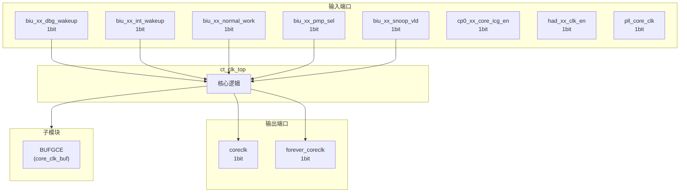
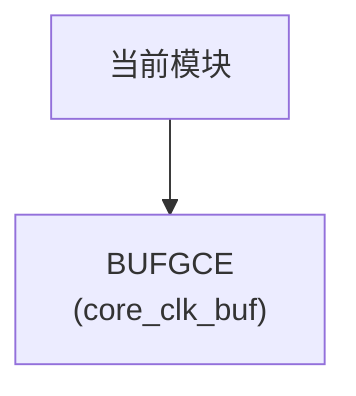

# ct_clk_top 模块设计文档

## 1. 模块概述

### 1.1 基本信息

| 属性 | 值 |
|------|-----|
| 模块名称 | ct_clk_top |
| 文件路径 | clk\rtl\ct_clk_top.v |
| 层级 | Level 1 |

### 1.2 功能描述

ct_clk_top 模块的功能描述。

### 1.3 设计特点

- 包含 1 个子模块实例
- 包含 2 个 assign 语句

## 2. 模块接口说明

### 2.1 输入端口

| 信号名 | 方向 | 位宽 | 描述 |
|--------|------|------|------|
| biu_xx_dbg_wakeup | input | 1 | |
| biu_xx_int_wakeup | input | 1 | |
| biu_xx_normal_work | input | 1 | |
| biu_xx_pmp_sel | input | 1 | |
| biu_xx_snoop_vld | input | 1 | |
| cp0_xx_core_icg_en | input | 1 | |
| had_xx_clk_en | input | 1 | |
| pll_core_clk | input | 1 | |

### 2.2 输出端口

| 信号名 | 方向 | 位宽 | 描述 |
|--------|------|------|------|
| coreclk | output | 1 | |
| forever_coreclk | output | 1 | |

## 3. 模块框图

### 3.1 模块架构图

### 3.2 主要数据连线

| 源模块 | 目标模块 | 信号名 | 位宽 | 说明 |
|--------|----------|--------|------|------|
| ct_clk_top | BUFGCE | O | - | |
| ct_clk_top | BUFGCE | I | - | |
| ct_clk_top | BUFGCE | CE | - | |

## 4. 模块实现方案

### 4.1 关键逻辑描述

无关键 always 块。

**Assign 语句列表:**

| 目标信号 | 源表达式 |
|----------|----------|
| forever_coreclk | pll_core_clk |
| core_clk_en | biu_xx_normal_work |
                     biu_xx_int_wakeup | 
                     biu_xx_dbg_wakeup | 
                     biu_xx_snoop_vld |
                     had_xx_clk_en | 
                     biu_xx_pmp_sel |
                     cp0_xx_core_icg_en |

## 5. 内部关键信号列表

### 5.1 寄存器信号

无寄存器信号。

### 5.2 线网信号

| 信号名 | 位宽 | 描述 |
|--------|------|------|
| core_clk_en | 1 | |

## 6. 子模块方案

### 6.1 模块例化层次结构

### 6.2 子模块列表

| 层级 | 模块名 | 实例名 | 功能描述 |
|------|--------|--------|----------|
| 1 | BUFGCE | core_clk_buf | |

## 7. 修订历史

| 版本 | 日期 | 作者 | 说明 |
|------|------|------|------|
| 1.0 | 2026-03-12 | Auto-generated | 初始版本 |
