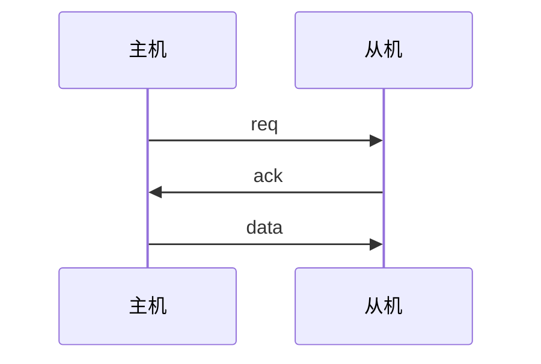
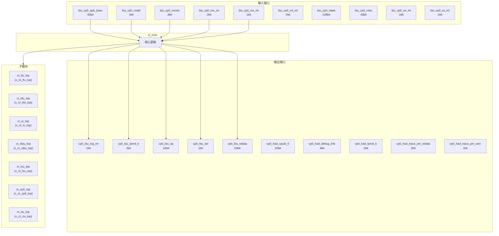
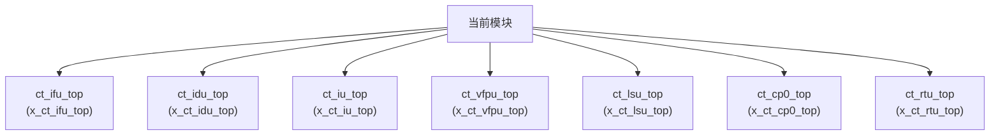

# ct_core 模块设计文档

## 1. 模块概述

### 1.1 基本信息

| 属性 | 值 |
|------|-----|
| 模块名称 | ct_core |
| 文件路径 | cpu\rtl\ct_core.v |
| 层级 | Level 1 |

### 1.2 功能描述

处理器核心 (Processor Core)，主要信号: 地址信号、读使能、输入信号、数据信号、有效信号

### 1.3 设计特点

- 包含 7 个子模块实例

## 2. 模块接口说明

### 2.1 输入端口

| 信号名 | 方向 | 位宽 | 描述 |
|--------|------|------|------|
| biu_cp0_apb_base | input | 40 |  |
| biu_cp0_cmplt | input | 1 |  |
| biu_cp0_coreid | input | 3 | 读使能 |
| biu_cp0_me_int | input | 1 | 输入信号 |
| biu_cp0_ms_int | input | 1 | 输入信号 |
| biu_cp0_mt_int | input | 1 | 输入信号 |
| biu_cp0_rdata | input | 128 | 数据信号 |
| biu_cp0_rvba | input | 40 |  |
| biu_cp0_se_int | input | 1 | 输入信号 |
| biu_cp0_ss_int | input | 1 | 输入信号 |
| biu_cp0_st_int | input | 1 | 输入信号 |
| biu_ifu_rd_data | input | 128 | 数据信号 |
| biu_ifu_rd_data_vld | input | 1 | 有效信号 |
| biu_ifu_rd_grnt | input | 1 |  |
| biu_ifu_rd_id | input | 1 |  |
| biu_ifu_rd_last | input | 1 |  |
| biu_ifu_rd_resp | input | 2 | 读使能 |
| biu_lsu_ac_addr | input | 40 | 地址信号 |
| biu_lsu_ac_prot | input | 3 |  |
| biu_lsu_ac_req | input | 1 | 请求信号 |
| biu_lsu_ac_snoop | input | 4 | 操作码 |
| biu_lsu_ar_ready | input | 1 | 就绪信号 |
| biu_lsu_aw_vb_grnt | input | 1 |  |
| biu_lsu_aw_wmb_grnt | input | 1 |  |
| biu_lsu_b_id | input | 5 |  |
| biu_lsu_b_resp | input | 2 | 读使能 |
| biu_lsu_b_vld | input | 1 | 有效信号 |
| biu_lsu_cd_ready | input | 1 | 就绪信号 |
| biu_lsu_cr_ready | input | 1 | 就绪信号 |
| biu_lsu_r_data | input | 128 | 数据信号 |
| ... | ... | ... | 共130个输入端口 |

### 2.2 输出端口

| 信号名 | 方向 | 位宽 | 描述 |
|--------|------|------|------|
| cp0_biu_icg_en | output | 1 | 使能信号 |
| cp0_biu_lpmd_b | output | 2 |  |
| cp0_biu_op | output | 16 | 操作码 |
| cp0_biu_sel | output | 1 | 选择信号 |
| cp0_biu_wdata | output | 64 | 数据信号 |
| cp0_had_cpuid_0 | output | 32 |  |
| cp0_had_debug_info | output | 4 | 输入信号 |
| cp0_had_lpmd_b | output | 2 |  |
| cp0_had_trace_pm_wdata | output | 2 | 数据信号 |
| cp0_had_trace_pm_wen | output | 1 | 使能信号 |
| cp0_hpcp_icg_en | output | 1 | 使能信号 |
| cp0_hpcp_index | output | 12 | 索引信号 |
| cp0_hpcp_int_disable | output | 1 | 程序计数器 |
| cp0_hpcp_mcntwen | output | 32 | 使能信号 |
| cp0_hpcp_op | output | 4 | 程序计数器 |
| cp0_hpcp_pmdm | output | 1 | 程序计数器 |
| cp0_hpcp_pmds | output | 1 | 程序计数器 |
| cp0_hpcp_pmdu | output | 1 | 程序计数器 |
| cp0_hpcp_sel | output | 1 | 选择信号 |
| cp0_hpcp_src0 | output | 64 | 程序计数器 |
| cp0_hpcp_wdata | output | 64 | 数据信号 |
| cp0_mmu_cskyee | output | 1 |  |
| cp0_mmu_icg_en | output | 1 | 使能信号 |
| cp0_mmu_maee | output | 1 |  |
| cp0_mmu_mpp | output | 2 |  |
| cp0_mmu_mprv | output | 1 |  |
| cp0_mmu_mxr | output | 1 |  |
| cp0_mmu_no_op_req | output | 1 | 请求信号 |
| cp0_mmu_ptw_en | output | 1 | 使能信号 |
| cp0_mmu_reg_num | output | 2 | 读使能 |
| ... | ... | ... | 共328个输出端口 |

### 2.5 接口时序图

## 3. 模块框图

### 3.1 模块架构图

### 3.2 主要数据连线

| 源模块 | 目标模块 | 信号名 | 位宽 | 说明 |
|--------|----------|--------|------|------|
| ct_core | ct_ifu_top | biu_ifu_rd_data | - | |
| ct_core | ct_ifu_top | biu_ifu_rd_data_vld | - | |
| ct_core | ct_ifu_top | biu_ifu_rd_grnt | - | |
| ct_core | ct_idu_top | cp0_idu_cskyee | - | |
| ct_core | ct_idu_top | cp0_idu_dlb_disable | - | |
| ct_core | ct_idu_top | cp0_idu_frm | - | |
| ct_core | ct_iu_top | cp0_iu_div_entry_disable | - | |
| ct_core | ct_iu_top | cp0_iu_div_entry_disable_clr | - | |
| ct_core | ct_iu_top | cp0_iu_ex3_abnormal | - | |
| ct_core | ct_vfpu_top | cp0_vfpu_fcsr | - | |
| ct_core | ct_vfpu_top | cp0_vfpu_fxcr | - | |
| ct_core | ct_vfpu_top | cp0_vfpu_icg_en | - | |
| ct_core | ct_lsu_top | biu_lsu_ac_addr | - | |
| ct_core | ct_lsu_top | biu_lsu_ac_prot | - | |
| ct_core | ct_lsu_top | biu_lsu_ac_req | - | |
| ct_core | ct_cp0_top | biu_cp0_apb_base | - | |
| ct_core | ct_cp0_top | biu_cp0_cmplt | - | |
| ct_core | ct_cp0_top | biu_cp0_coreid | - | |
| ct_core | ct_rtu_top | cp0_rtu_icg_en | - | |
| ct_core | ct_rtu_top | cp0_rtu_srt_en | - | |
| ct_core | ct_rtu_top | cp0_rtu_xx_int_b | - | |

## 4. 模块实现方案

### 4.1 关键逻辑描述

无关键 always 块。

## 5. 内部关键信号列表

### 5.1 寄存器信号

无寄存器信号。

### 5.2 线网信号

| 信号名 | 位宽 | 描述 |
|--------|------|------|
| cp0_idu_cskyee | 1 | |
| cp0_idu_dlb_disable | 1 | |
| cp0_idu_frm | 3 | |
| cp0_idu_fs | 2 | |
| cp0_idu_icg_en | 1 | |
| cp0_idu_iq_bypass_disable | 1 | |
| cp0_idu_rob_fold_disable | 1 | |
| cp0_idu_src2_fwd_disable | 1 | |
| cp0_idu_srcv2_fwd_disable | 1 | |
| cp0_idu_vill | 1 | |
| cp0_idu_vs | 2 | |
| cp0_idu_vstart | 7 | |
| cp0_idu_zero_delay_move_disable | 1 | |
| cp0_ifu_bht_en | 1 | |
| cp0_ifu_bht_inv | 1 | |
| cp0_ifu_btb_en | 1 | |
| cp0_ifu_btb_inv | 1 | |
| cp0_ifu_icache_en | 1 | |
| cp0_ifu_icache_inv | 1 | |
| cp0_ifu_icache_pref_en | 1 | |
| ... | ... | 共1062个线网信号 |

## 6. 子模块方案

### 6.1 模块例化层次结构

### 6.2 子模块列表

| 层级 | 模块名 | 实例名 | 功能描述 |
|------|--------|--------|----------|
| 1 | ct_ifu_top | x_ct_ifu_top | 取指单元 |
| 1 | ct_idu_top | x_ct_idu_top | 译码单元 |
| 1 | ct_iu_top | x_ct_iu_top | 整数执行单元 |
| 1 | ct_vfpu_top | x_ct_vfpu_top | 向量浮点单元 |
| 1 | ct_lsu_top | x_ct_lsu_top | 访存单元 |
| 1 | ct_cp0_top | x_ct_cp0_top | 协处理器0 |
| 1 | ct_rtu_top | x_ct_rtu_top | 退休单元 |

## 7. 修订历史

| 版本 | 日期 | 作者 | 说明 |
|------|------|------|------|
| 1.0 | 2026-03-12 | Auto-generated | 初始版本 |
