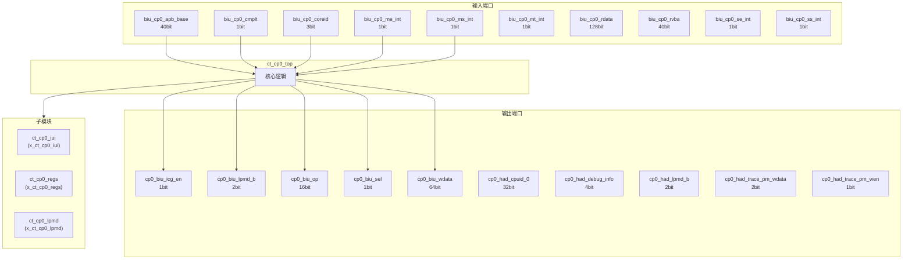
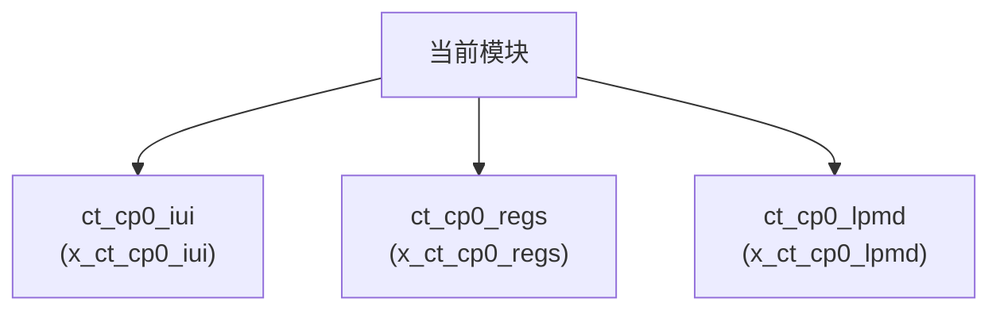

# ct_cp0_top 模块设计文档

## 1. 模块概述

### 1.1 基本信息

| 属性 | 值 |
|------|-----|
| 模块名称 | ct_cp0_top |
| 文件路径 | cp0\rtl\ct_cp0_top.v |
| 层级 | Level 2 |

### 1.2 功能描述

ct_cp0_top 模块的功能描述。

### 1.3 设计特点

- 包含 3 个子模块实例

## 2. 模块接口说明

### 2.1 输入端口

| 信号名 | 方向 | 位宽 | 描述 |
|--------|------|------|------|
| biu_cp0_apb_base | input | 40 | |
| biu_cp0_cmplt | input | 1 | |
| biu_cp0_coreid | input | 3 | |
| biu_cp0_me_int | input | 1 | |
| biu_cp0_ms_int | input | 1 | |
| biu_cp0_mt_int | input | 1 | |
| biu_cp0_rdata | input | 128 | |
| biu_cp0_rvba | input | 40 | |
| biu_cp0_se_int | input | 1 | |
| biu_cp0_ss_int | input | 1 | |
| biu_cp0_st_int | input | 1 | |
| biu_yy_xx_no_op | input | 1 | |
| cpurst_b | input | 1 | |
| forever_cpuclk | input | 1 | |
| had_cp0_xx_dbg | input | 1 | |
| hpcp_cp0_cmplt | input | 1 | |
| hpcp_cp0_data | input | 64 | |
| hpcp_cp0_int_vld | input | 1 | |
| hpcp_cp0_sce | input | 1 | |
| idu_cp0_fesr_acc_updt_val | input | 7 | |
| idu_cp0_fesr_acc_updt_vld | input | 1 | |
| idu_cp0_rf_func | input | 5 | |
| idu_cp0_rf_gateclk_sel | input | 1 | |
| idu_cp0_rf_iid | input | 7 | |
| idu_cp0_rf_opcode | input | 32 | |
| idu_cp0_rf_preg | input | 7 | |
| idu_cp0_rf_sel | input | 1 | |
| idu_cp0_rf_src0 | input | 64 | |
| ifu_cp0_bht_inv_done | input | 1 | |
| ifu_cp0_btb_inv_done | input | 1 | |
| ... | ... | ... | 共67个输入端口 |

### 2.2 输出端口

| 信号名 | 方向 | 位宽 | 描述 |
|--------|------|------|------|
| cp0_biu_icg_en | output | 1 | |
| cp0_biu_lpmd_b | output | 2 | |
| cp0_biu_op | output | 16 | |
| cp0_biu_sel | output | 1 | |
| cp0_biu_wdata | output | 64 | |
| cp0_had_cpuid_0 | output | 32 | |
| cp0_had_debug_info | output | 4 | |
| cp0_had_lpmd_b | output | 2 | |
| cp0_had_trace_pm_wdata | output | 2 | |
| cp0_had_trace_pm_wen | output | 1 | |
| cp0_hpcp_icg_en | output | 1 | |
| cp0_hpcp_index | output | 12 | |
| cp0_hpcp_int_disable | output | 1 | |
| cp0_hpcp_mcntwen | output | 32 | |
| cp0_hpcp_op | output | 4 | |
| cp0_hpcp_pmdm | output | 1 | |
| cp0_hpcp_pmds | output | 1 | |
| cp0_hpcp_pmdu | output | 1 | |
| cp0_hpcp_sel | output | 1 | |
| cp0_hpcp_src0 | output | 64 | |
| cp0_hpcp_wdata | output | 64 | |
| cp0_idu_cskyee | output | 1 | |
| cp0_idu_dlb_disable | output | 1 | |
| cp0_idu_frm | output | 3 | |
| cp0_idu_fs | output | 2 | |
| cp0_idu_icg_en | output | 1 | |
| cp0_idu_iq_bypass_disable | output | 1 | |
| cp0_idu_rob_fold_disable | output | 1 | |
| cp0_idu_src2_fwd_disable | output | 1 | |
| cp0_idu_srcv2_fwd_disable | output | 1 | |
| ... | ... | ... | 共150个输出端口 |

## 3. 模块框图

### 3.1 模块架构图

### 3.2 主要数据连线

| 源模块 | 目标模块 | 信号名 | 位宽 | 说明 |
|--------|----------|--------|------|------|
| ct_cp0_top | ct_cp0_iui | biu_cp0_cmplt | - | |
| ct_cp0_top | ct_cp0_iui | biu_cp0_rdata | - | |
| ct_cp0_top | ct_cp0_iui | cp0_biu_op | - | |
| ct_cp0_top | ct_cp0_regs | biu_cp0_apb_base | - | |
| ct_cp0_top | ct_cp0_regs | biu_cp0_cmplt | - | |
| ct_cp0_top | ct_cp0_regs | biu_cp0_coreid | - | |
| ct_cp0_top | ct_cp0_lpmd | biu_yy_xx_no_op | - | |
| ct_cp0_top | ct_cp0_lpmd | cp0_biu_lpmd_b | - | |
| ct_cp0_top | ct_cp0_lpmd | cp0_had_lpmd_b | - | |

## 4. 模块实现方案

### 4.1 关键逻辑描述

无关键 always 块。

## 5. 内部关键信号列表

### 5.1 寄存器信号

无寄存器信号。

### 5.2 线网信号

| 信号名 | 位宽 | 描述 |
|--------|------|------|
| cp0_mret | 1 | |
| cp0_sret | 1 | |
| inst_lpmd_ex1_ex2 | 1 | |
| iui_regs_addr | 12 | |
| iui_regs_csr_wr | 1 | |
| iui_regs_csrw | 1 | |
| iui_regs_ex3_inst_csr | 1 | |
| iui_regs_inst_mret | 1 | |
| iui_regs_inst_sret | 1 | |
| iui_regs_inv_expt | 1 | |
| iui_regs_opcode | 32 | |
| iui_regs_ori_src0 | 64 | |
| iui_regs_rst_inv_d | 1 | |
| iui_regs_rst_inv_i | 1 | |
| iui_regs_sel | 1 | |
| iui_regs_src0 | 64 | |
| iui_top_cur_state | 2 | |
| lpmd_cmplt | 1 | |
| lpmd_top_cur_state | 2 | |
| regs_iui_cfr_no_op | 1 | |
| ... | ... | 共45个线网信号 |

## 6. 子模块方案

### 6.1 模块例化层次结构

### 6.2 子模块列表

| 层级 | 模块名 | 实例名 | 功能描述 |
|------|--------|--------|----------|
| 1 | ct_cp0_iui | x_ct_cp0_iui | |
| 1 | ct_cp0_regs | x_ct_cp0_regs | |
| 1 | ct_cp0_lpmd | x_ct_cp0_lpmd | |

## 7. 修订历史

| 版本 | 日期 | 作者 | 说明 |
|------|------|------|------|
| 1.0 | 2026-03-12 | Auto-generated | 初始版本 |
