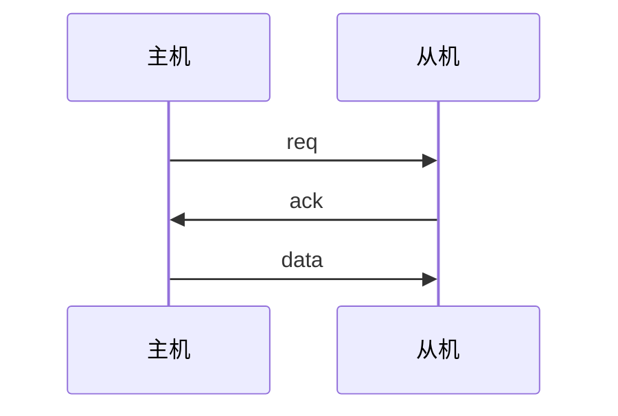
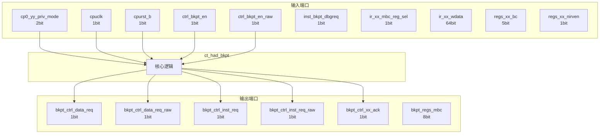

# ct_had_bkpt 模块设计文档

## 1. 模块概述

### 1.1 基本信息

| 属性 | 值 |
|------|-----|
| 模块名称 | ct_had_bkpt |
| 文件路径 | had\rtl\ct_had_bkpt.v |
| 层级 | Level 2 |

### 1.2 功能描述

硬件调试 (Hardware Debug)，(断点)，主要信号: 应答信号、使能信号、读使能、时钟信号、数据信号

### 1.3 设计特点

- 包含 5 个 always 块
- 包含 22 个 assign 语句

## 2. 模块接口说明

### 2.1 输入端口

| 信号名 | 方向 | 位宽 | 描述 |
|--------|------|------|------|
| cp0_yy_priv_mode | input | 2 |  |
| cpuclk | input | 1 | 时钟信号 |
| cpurst_b | input | 1 | 复位信号 |
| ctrl_bkpt_en | input | 1 | 使能信号 |
| ctrl_bkpt_en_raw | input | 1 | 使能信号 |
| inst_bkpt_dbgreq | input | 1 | 请求信号 |
| ir_xx_mbc_reg_sel | input | 1 | 读使能 |
| ir_xx_wdata | input | 64 | 数据信号 |
| regs_xx_bc | input | 5 | 读使能 |
| regs_xx_nirven | input | 1 | 使能信号 |
| rtu_had_bkpt_data_st | input | 1 | 数据信号 |
| rtu_had_data_bkpt_vld | input | 1 | 有效信号 |
| rtu_had_inst_bkpt_inst_vld | input | 1 | 有效信号 |
| rtu_had_inst_bkpt_vld | input | 1 | 有效信号 |
| rtu_had_inst_split | input | 1 | 指令信号 |
| rtu_had_xx_mbkpt_chgflow | input | 1 |  |
| rtu_had_xx_mbkpt_data_ack | input | 1 | 应答信号 |
| rtu_had_xx_mbkpt_inst_ack | input | 1 | 应答信号 |
| rtu_had_xx_split_inst | input | 1 | 指令信号 |
| rtu_yy_xx_dbgon | input | 1 |  |
| rtu_yy_xx_flush | input | 1 | 刷新信号 |
| rtu_yy_xx_retire0_normal | input | 1 | 读使能 |
| x_sm_xx_update_dr_en | input | 1 | 使能信号 |

### 2.2 输出端口

| 信号名 | 方向 | 位宽 | 描述 |
|--------|------|------|------|
| bkpt_ctrl_data_req | output | 1 | 请求信号 |
| bkpt_ctrl_data_req_raw | output | 1 | 请求信号 |
| bkpt_ctrl_inst_req | output | 1 | 请求信号 |
| bkpt_ctrl_inst_req_raw | output | 1 | 请求信号 |
| bkpt_ctrl_xx_ack | output | 1 | 应答信号 |
| bkpt_regs_mbc | output | 8 | 读使能 |

### 2.5 接口时序图



## 3. 模块框图

### 3.1 模块架构图



### 3.2 主要数据连线

无子模块连接。

## 4. 模块实现方案

### 4.1 关键逻辑描述

**Always 块列表:**

```verilog
always @(posedge cpuclk or negedge cpurst_b) begin
  // ...
end
```

```verilog
always @(posedge cpuclk or negedge cpurst_b) begin
  // ...
end
```

```verilog
always @(posedge cpuclk or negedge cpurst_b) begin
  // ...
end
```

```verilog
always @(posedge cpuclk or negedge cpurst_b) begin
  // ...
end
```

```verilog
always @(posedge cpuclk or negedge cpurst_b) begin
  // ...
end
```


**Assign 语句列表:**

| 目标信号 | 源表达式 |
|----------|----------|
| inst_bkpt_occur | rtu_had_inst_bkpt_vld && !regs_xx_nirven |
| data_bkpt_occur | rtu_had_data_bkpt_vld && !regs_xx_nirven |
| user_mode | cp0_yy_priv_mode[1:0] == 2'b00 |
| priv_mode | !user_mode |
| changeflow_inst_bkpt | !regs_xx_bc[4]&&!regs_xx_bc[3]&& regs_xx_bc[2]&&!regs_xx_bc[1]&&!regs_xx_bc[0]
                           || regs_xx_bc[4]&&!regs_xx_bc[3]&& regs_xx_bc[2]&&!regs_xx_bc[1]&&!regs_xx_bc[0]&&!priv_mode
                           || regs_xx_bc[4]&& regs_xx_bc[3]&& regs_xx_bc[2]&&!regs_xx_bc[1]&&!regs_xx_bc[0]&& priv_mode |
| normal_inst_bkpt | !regs_xx_bc[4]&&!regs_xx_bc[3]&&!regs_xx_bc[2]&&!regs_xx_bc[1]&& regs_xx_bc[0]
                           ||!regs_xx_bc[4]&&!regs_xx_bc[3]&&!regs_xx_bc[2]&& regs_xx_bc[1]&&!regs_xx_bc[0]
                           || regs_xx_bc[4]&&!regs_xx_bc[3]&&!regs_xx_bc[2]&&!regs_xx_bc[1]&& regs_xx_bc[0]&&!priv_mode
                           || regs_xx_bc[4]&&!regs_xx_bc[3]&&!regs_xx_bc[2]&& regs_xx_bc[1]&&!regs_xx_bc[0]&&!priv_mode
                           || regs_xx_bc[4]&& regs_xx_bc[3]&&!regs_xx_bc[2]&&!regs_xx_bc[1]&& regs_xx_bc[0]&& priv_mode
                           || regs_xx_bc[4]&& regs_xx_bc[3]&&!regs_xx_bc[2]&& regs_xx_bc[1]&&!regs_xx_bc[0]&& priv_mode |
| normal_data_bkpt | !regs_xx_bc[4]&&!regs_xx_bc[3]&&!regs_xx_bc[2]&&!regs_xx_bc[1]&& regs_xx_bc[0]
                           ||!regs_xx_bc[4]&&!regs_xx_bc[3]&&!regs_xx_bc[2]&& regs_xx_bc[1]&& regs_xx_bc[0]
                           || regs_xx_bc[4]&&!regs_xx_bc[3]&&!regs_xx_bc[2]&&!regs_xx_bc[1]&& regs_xx_bc[0]&&!priv_mode
                           || regs_xx_bc[4]&&!regs_xx_bc[3]&&!regs_xx_bc[2]&& regs_xx_bc[1]&& regs_xx_bc[0]&&!priv_mode
                           || regs_xx_bc[4]&& regs_xx_bc[3]&&!regs_xx_bc[2]&&!regs_xx_bc[1]&& regs_xx_bc[0]&& priv_mode
                           || regs_xx_bc[4]&& regs_xx_bc[3]&&!regs_xx_bc[2]&& regs_xx_bc[1]&& regs_xx_bc[0]&& priv_mode |
| st_data_bkpt | !regs_xx_bc[4]&&!regs_xx_bc[3]&& regs_xx_bc[2]&&!regs_xx_bc[1]&& regs_xx_bc[0]
                           || regs_xx_bc[4]&&!regs_xx_bc[3]&& regs_xx_bc[2]&&!regs_xx_bc[1]&& regs_xx_bc[0]&&!priv_mode
                           || regs_xx_bc[4]&& regs_xx_bc[3]&& regs_xx_bc[2]&&!regs_xx_bc[1]&& regs_xx_bc[0]&& priv_mode |
| load_data_bkpt | !regs_xx_bc[4]&&!regs_xx_bc[3]&& regs_xx_bc[2]&& regs_xx_bc[1]&&!regs_xx_bc[0]
                           || regs_xx_bc[4]&&!regs_xx_bc[3]&& regs_xx_bc[2]&& regs_xx_bc[1]&&!regs_xx_bc[0]&&!priv_mode
                           || regs_xx_bc[4]&& regs_xx_bc[3]&& regs_xx_bc[2]&& regs_xx_bc[1]&&!regs_xx_bc[0]&& priv_mode |
| inst_bkpt_vld | inst_bkpt_occur && rtu_had_xx_mbkpt_chgflow && changeflow_inst_bkpt_ff
                    || inst_bkpt_occur && normal_inst_bkpt_ff |
| data_bkpt_vld | data_bkpt_occur && normal_data_bkpt_ff
                    || data_bkpt_occur && rtu_had_bkpt_data_st && st_data_bkpt_ff
                    || data_bkpt_occur &&!rtu_had_bkpt_data_st && load_data_bkpt_ff |
| bkpt_counter_dec_1 | (inst_bkpt_vld_f && !rtu_had_xx_split_inst || 
                             data_bkpt_vld_f) && 
                             ctrl_bkpt_en &&
                             rtu_yy_xx_retire0_normal &&
                            !bkpt_counter_eq_0 &&
                            !inst_bkpt_dbgreq &&

                            !rtu_yy_xx_dbgon |
| bkpt_counter_eq_0 | bkpt_counter[7:0] == 8'b0 |
| bkpt_counter_eq_1 | bkpt_counter[7:0] == 8'b1 |
| bkpt_counter_eq_0_raw | bkpt_counter_dec_1 ? bkpt_counter_eq_1 : bkpt_counter_eq_0 |
| ... | 共22条assign语句 |

## 5. 内部关键信号列表

### 5.1 寄存器信号

| 信号名 | 位宽 | 描述 |
|--------|------|------|
| bkpt_counter | 8 | |
| changeflow_inst_bkpt_ff | 1 | |
| data_bkpt_pending | 1 | |
| data_bkpt_vld_f | 1 | |
| inst_bkpt_inst_vld_f | 1 | |
| inst_bkpt_vld_f | 1 | |
| load_data_bkpt_ff | 1 | |
| normal_data_bkpt_ff | 1 | |
| normal_inst_bkpt_ff | 1 | |
| st_data_bkpt_ff | 1 | |

### 5.2 线网信号

| 信号名 | 位宽 | 描述 |
|--------|------|------|
| bkpt_counter_dec_1 | 1 | |
| bkpt_counter_eq_0 | 1 | |
| bkpt_counter_eq_0_raw | 1 | |
| bkpt_counter_eq_1 | 1 | |
| changeflow_inst_bkpt | 1 | |
| data_bkpt_occur | 1 | |
| data_bkpt_req_raw | 1 | |
| data_bkpt_vld | 1 | |
| inst_bkpt_occur | 1 | |
| inst_bkpt_req_raw | 1 | |
| inst_bkpt_vld | 1 | |
| load_data_bkpt | 1 | |
| normal_data_bkpt | 1 | |
| normal_inst_bkpt | 1 | |
| priv_mode | 1 | |
| st_data_bkpt | 1 | |
| user_mode | 1 | |

## 6. 子模块方案

无子模块。

## 7. 修订历史

| 版本 | 日期 | 作者 | 说明 |
|------|------|------|------|
| 1.0 | 2026-03-12 | Auto-generated | 初始版本 |
