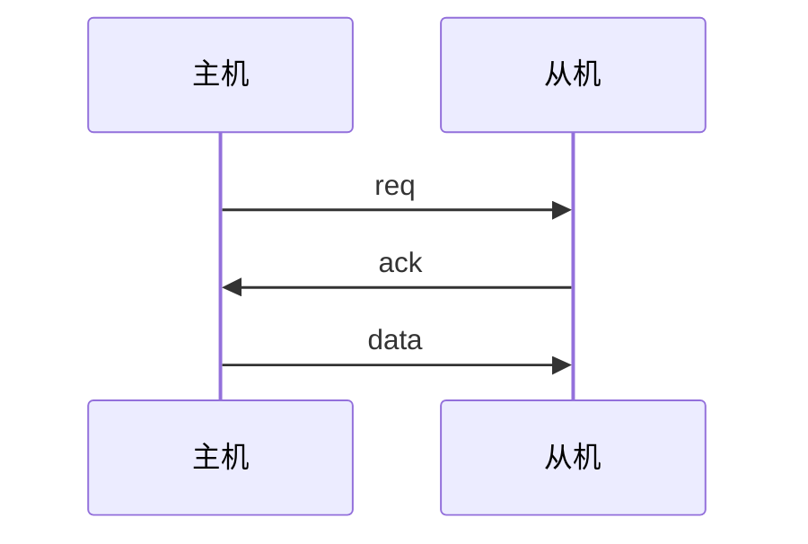
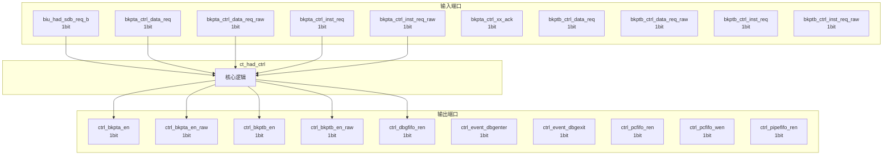

# ct_had_ctrl 模块设计文档

## 1. 模块概述

### 1.1 基本信息

| 属性 | 值 |
|------|-----|
| 模块名称 | ct_had_ctrl |
| 文件路径 | had\rtl\ct_had_ctrl.v |
| 层级 | Level 2 |

### 1.2 功能描述

硬件调试 (Hardware Debug)，(控制逻辑)，主要信号: 应答信号、使能信号、时钟信号、请求信号、复位信号

### 1.3 设计特点

- 包含 8 个 always 块
- 包含 66 个 assign 语句

## 2. 模块接口说明

### 2.1 输入端口

| 信号名 | 方向 | 位宽 | 描述 |
|--------|------|------|------|
| biu_had_sdb_req_b | input | 1 | 请求信号 |
| bkpta_ctrl_data_req | input | 1 | 请求信号 |
| bkpta_ctrl_data_req_raw | input | 1 | 请求信号 |
| bkpta_ctrl_inst_req | input | 1 | 请求信号 |
| bkpta_ctrl_inst_req_raw | input | 1 | 请求信号 |
| bkpta_ctrl_xx_ack | input | 1 | 应答信号 |
| bkptb_ctrl_data_req | input | 1 | 请求信号 |
| bkptb_ctrl_data_req_raw | input | 1 | 请求信号 |
| bkptb_ctrl_inst_req | input | 1 | 请求信号 |
| bkptb_ctrl_inst_req_raw | input | 1 | 请求信号 |
| bkptb_ctrl_xx_ack | input | 1 | 应答信号 |
| cpuclk | input | 1 | 时钟信号 |
| cpurst_b | input | 1 | 复位信号 |
| ddc_xx_update_ir | input | 1 | 数据信号 |
| event_ctrl_enter_dbg | input | 1 | 使能信号 |
| event_ctrl_exit_dbg | input | 1 | 使能信号 |
| event_ctrl_had_clk_en | input | 1 | 时钟信号 |
| forever_coreclk | input | 1 | 时钟信号 |
| ir_ctrl_exit_dbg_reg | input | 1 | 控制信号 |
| ir_ctrl_had_clk_en | input | 1 | 时钟信号 |
| ir_xx_ir_reg_sel | input | 1 | 读使能 |
| nirv_bkpta | input | 1 |  |
| non_irv_bkpt_vld | input | 1 | 有效信号 |
| regs_ctrl_adr | input | 1 | 控制信号 |
| regs_ctrl_dr | input | 1 | 控制信号 |
| regs_ctrl_fdb | input | 1 | 控制信号 |
| regs_ctrl_frzc | input | 1 | 控制信号 |
| regs_ctrl_pcfifo_frozen | input | 1 | 使能信号 |
| regs_ctrl_pm | input | 2 | 控制信号 |
| regs_ctrl_sqa | input | 1 | 控制信号 |
| ... | ... | ... | 共50个输入端口 |

### 2.2 输出端口

| 信号名 | 方向 | 位宽 | 描述 |
|--------|------|------|------|
| ctrl_bkpta_en | output | 1 | 使能信号 |
| ctrl_bkpta_en_raw | output | 1 | 使能信号 |
| ctrl_bkptb_en | output | 1 | 使能信号 |
| ctrl_bkptb_en_raw | output | 1 | 使能信号 |
| ctrl_dbgfifo_ren | output | 1 | 使能信号 |
| ctrl_event_dbgenter | output | 1 | 使能信号 |
| ctrl_event_dbgexit | output | 1 | 使能信号 |
| ctrl_pcfifo_ren | output | 1 | 使能信号 |
| ctrl_pcfifo_wen | output | 1 | 使能信号 |
| ctrl_pipefifo_ren | output | 1 | 使能信号 |
| ctrl_pipefifo_wen | output | 1 | 使能信号 |
| ctrl_regs_bkpta_vld | output | 1 | 有效信号 |
| ctrl_regs_bkptb_vld | output | 1 | 有效信号 |
| ctrl_regs_exit_dbg | output | 1 | 控制信号 |
| ctrl_regs_freeze_pcfifo | output | 1 | 控制信号 |
| ctrl_regs_set_sqa | output | 1 | 控制信号 |
| ctrl_regs_set_sqb | output | 1 | 控制信号 |
| ctrl_regs_update_adro | output | 1 | 数据信号 |
| ctrl_regs_update_dro | output | 1 | 数据信号 |
| ctrl_regs_update_mbo | output | 1 | 数据信号 |
| ctrl_regs_update_pro | output | 1 | 数据信号 |
| ctrl_regs_update_swo | output | 1 | 数据信号 |
| ctrl_regs_update_to | output | 1 | 数据信号 |
| ctrl_trace_en | output | 1 | 使能信号 |
| ctrl_xx_dbg_disable | output | 1 | 控制信号 |
| had_cp0_xx_dbg | output | 1 |  |
| had_ifu_ir_vld | output | 1 | 有效信号 |
| had_ifu_pcload | output | 1 | 程序计数器 |
| had_rtu_data_bkpt_dbgreq | output | 1 | 请求信号 |
| had_rtu_dbg_disable | output | 1 |  |
| ... | ... | ... | 共45个输出端口 |

### 2.5 接口时序图



## 3. 模块框图

### 3.1 模块架构图



### 3.2 主要数据连线

无子模块连接。

## 4. 模块实现方案

### 4.1 关键逻辑描述

**Always 块列表:**

```verilog
always @(posedge cpuclk or negedge cpurst_b) begin
  // ...
end
```

```verilog
always @(posedge cpuclk or negedge cpurst_b) begin
  // ...
end
```

```verilog
always @(posedge cpuclk or negedge cpurst_b) begin
  // ...
end
```

```verilog
always @(posedge cpuclk or negedge cpurst_b) begin
  // ...
end
```

```verilog
always @(posedge cpuclk or negedge cpurst_b) begin
  // ...
end
```


**Assign 语句列表:**

| 目标信号 | 源表达式 |
|----------|----------|
| ctrl_bkpta_en | |regs_xx_bca[4:0] |
| ctrl_bkpta_en_raw | |regs_xx_bca[4:0] |
| bkptb_en | |regs_xx_bcb[4:0] |
| bkptb_sqc_en | !regs_ctrl_sqc[1] ||
                       regs_ctrl_sqc[1] && rtu_yy_xx_retire0_normal &&
                      !inst_bkpt_dbgreq && (bkpta_ctrl_inst_req || bkpta_ctrl_data_req) ||
                       regs_ctrl_sqa |
| ctrl_bkptb_en_raw | bkptb_en && bkptb_sqc_en |
| trace_sqc_en | !regs_ctrl_sqc[0] ||
                       regs_ctrl_sqc[0] && rtu_yy_xx_retire0_normal &&
                      !inst_bkpt_dbgreq && (bkptb_ctrl_inst_req || bkptb_ctrl_data_req) ||
                       regs_ctrl_sqb |
| had_rtu_trace_en | ctrl_trace_en |
| ctrl_pcfifo_wen | !regs_ctrl_pcfifo_frozen &&
                         !inst_bkpt_dbgreq &&
                         !rtu_yy_xx_dbgon |
| ctrl_pcfifo_ren | !regs_ctrl_pcfifo_frozen && x_ir_ctrl_pcfifo_read_pulse |
| ctrl_pipefifo_wen | !rtu_yy_xx_dbgon |
| ctrl_pipefifo_ren | x_ir_ctrl_pipefifo_read_pulse |
| ctrl_dbgfifo_ren | x_ir_ctrl_dbgfifo_read_pulse |
| trace_req | trace_ctrl_req |
| mem_bkpta_inst_req | bkpta_ctrl_inst_req && !regs_ctrl_sqc[1] |
| mem_bkpta_data_req | bkpta_ctrl_data_req && !regs_ctrl_sqc[1] |
| ... | 共66条assign语句 |

## 5. 内部关键信号列表

### 5.1 寄存器信号

| 信号名 | 位宽 | 描述 |
|--------|------|------|
| ctrl_exit_dbg | 1 | |
| ctrl_go_noex | 1 | |
| ctrl_out_dbg_disable | 1 | |
| dr_set_req | 1 | |
| event_req | 1 | |
| had_clk_en_ff | 1 | |

### 5.2 线网信号

| 信号名 | 位宽 | 描述 |
|--------|------|------|
| adr_set_req | 1 | |
| async_dbg_req | 1 | |
| bkptb_en | 1 | |
| bkptb_sqc_en | 1 | |
| ctrl_tee_dbg_disable | 1 | |
| data_bkpt_dbgreq | 1 | |
| ddc_inst_go | 1 | |
| exit_dbg | 1 | |
| exit_dbg_active | 1 | |
| go_in_dbg | 1 | |
| go_noex | 1 | |
| had_clk_en | 1 | |
| mem_bkpta_data_req | 1 | |
| mem_bkpta_data_req_raw | 1 | |
| mem_bkpta_inst_req | 1 | |
| mem_bkpta_inst_req_raw | 1 | |
| mem_bkptb_data_req | 1 | |
| mem_bkptb_data_req_raw | 1 | |
| mem_bkptb_inst_req | 1 | |
| mem_bkptb_inst_req_raw | 1 | |
| ... | ... | 共23个线网信号 |

## 6. 子模块方案

无子模块。

## 7. 修订历史

| 版本 | 日期 | 作者 | 说明 |
|------|------|------|------|
| 1.0 | 2026-03-12 | Auto-generated | 初始版本 |
