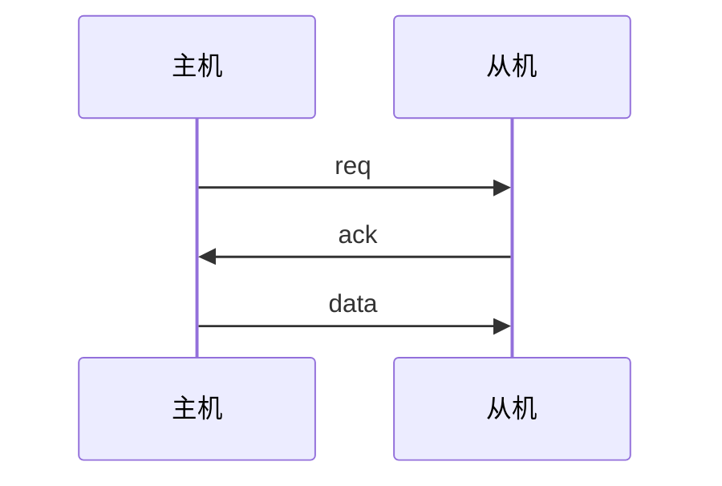
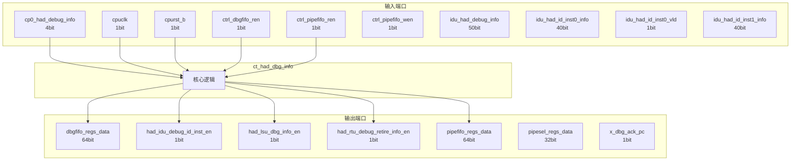

# ct_had_dbg_info 模块设计文档

## 1. 模块概述

### 1.1 基本信息

| 属性 | 值 |
|------|-----|
| 模块名称 | ct_had_dbg_info |
| 文件路径 | had\rtl\ct_had_dbg_info.v |
| 层级 | Level 2 |
| 参数 | PTR_WIDTH=5, WIDTH=64, DEPTH=16, DBG_WIDTH=64, DBG_RPTR=3... |

### 1.2 功能描述

硬件调试 (Hardware Debug)，主要信号: 使能信号、读使能、输入信号、时钟信号、数据信号

### 1.3 设计特点

- 包含 10 个 always 块
- 包含 16 个 assign 语句
- 可配置参数: 6 个

## 2. 模块接口说明

### 2.1 输入端口

| 信号名 | 方向 | 位宽 | 描述 |
|--------|------|------|------|
| cp0_had_debug_info | input | 4 | 输入信号 |
| cpuclk | input | 1 | 时钟信号 |
| cpurst_b | input | 1 | 复位信号 |
| ctrl_dbgfifo_ren | input | 1 | 使能信号 |
| ctrl_pipefifo_ren | input | 1 | 使能信号 |
| ctrl_pipefifo_wen | input | 1 | 使能信号 |
| idu_had_debug_info | input | 50 | 输入信号 |
| idu_had_id_inst0_info | input | 40 | 指令信号 |
| idu_had_id_inst0_vld | input | 1 | 有效信号 |
| idu_had_id_inst1_info | input | 40 | 指令信号 |
| idu_had_id_inst1_vld | input | 1 | 有效信号 |
| idu_had_id_inst2_info | input | 40 | 指令信号 |
| idu_had_id_inst2_vld | input | 1 | 有效信号 |
| ifu_had_debug_info | input | 83 | 输入信号 |
| ir_xx_pipesel_reg_sel | input | 1 | 读使能 |
| ir_xx_wdata | input | 64 | 数据信号 |
| iu_had_debug_info | input | 10 | 输入信号 |
| lsu_had_debug_info | input | 184 | 输入信号 |
| lsu_had_st_addr | input | 40 | 地址信号 |
| lsu_had_st_data | input | 64 | 数据信号 |
| lsu_had_st_req | input | 1 | 请求信号 |
| mmu_had_debug_info | input | 34 | 输入信号 |
| rtu_had_dbg_ack_info | input | 1 | 应答信号 |
| rtu_had_debug_info | input | 43 | 输入信号 |
| rtu_had_retire_inst0_info | input | 64 | 读使能 |
| rtu_had_retire_inst0_vld | input | 1 | 有效信号 |
| rtu_had_retire_inst1_info | input | 64 | 读使能 |
| rtu_had_retire_inst1_vld | input | 1 | 有效信号 |
| rtu_had_retire_inst2_info | input | 64 | 读使能 |
| rtu_had_retire_inst2_vld | input | 1 | 有效信号 |
| ... | ... | ... | 共31个输入端口 |

### 2.2 输出端口

| 信号名 | 方向 | 位宽 | 描述 |
|--------|------|------|------|
| dbgfifo_regs_data | output | 64 | 数据信号 |
| had_idu_debug_id_inst_en | output | 1 | 使能信号 |
| had_lsu_dbg_info_en | output | 1 | 使能信号 |
| had_rtu_debug_retire_info_en | output | 1 | 使能信号 |
| pipefifo_regs_data | output | 64 | 数据信号 |
| pipesel_regs_data | output | 32 | 数据信号 |
| x_dbg_ack_pc | output | 1 | 应答信号 |

### 2.4 参数列表

| 参数名 | 默认值 | 位宽 | 描述 |
|--------|--------|------|------|
| PTR_WIDTH | 5 | 1 | |
| WIDTH | 64 | 1 | |
| DEPTH | 16 | 1 | |
| DBG_WIDTH | 64 | 1 | |
| DBG_RPTR | 3 | 1 | |
| DBG_DPETH | 7 | 1 | |

### 2.5 接口时序图



## 3. 模块框图

### 3.1 模块架构图



### 3.2 主要数据连线

无子模块连接。

## 4. 模块实现方案

### 4.1 关键逻辑描述

**Always 块列表:**

```verilog
always @(posedge cpuclk or negedge cpurst_b) begin
  // ...
end
```

```verilog
always @(lsu_pipe_vld[2:0]
       or lsu_had_st_data[63:0]
       or rtu_had_retire_inst2_info[63:0]
       or rtu_had_retire_inst1_info[63:0]
       or rtu_had_retire_inst0_info[63:0]
       or idu_had_id_inst1_info[39:0]
       or rtu_pipe_vld[2:0]
       or pipesel[1:0]
       or idu_pipe_vld[2:0]
       or idu_had_id_inst0_info[39:0]
       or idu_had_id_inst2_info[39:0]
       or lsu_had_st_addr[39:0]) begin
  // ...
end
```

```verilog
always @(posedge cpuclk or negedge cpurst_b) begin
  // ...
end
```

```verilog
always @(posedge cpuclk or negedge cpurst_b) begin
  // ...
end
```

```verilog
always @(posedge cpuclk or negedge cpurst_b) begin
  // ...
end
```


**Assign 语句列表:**

| 目标信号 | 源表达式 |
|----------|----------|
| had_idu_debug_id_inst_en | (pipesel[1:0] == 2'b01) && ctrl_pipefifo_wen |
| had_rtu_debug_retire_info_en | (pipesel[1:0] == 2'b10) && ctrl_pipefifo_wen |
| had_lsu_dbg_info_en | (pipesel[1:0] == 2'b11) && ctrl_pipefifo_wen |
| create_vld | |pipefifo_wen[2:0] |
| create_one | pipefifo_wen[2:0] == 3'b001 |
| create_two | pipefifo_wen[2:0] == 3'b011 |
| create_thr | pipefifo_wen[2:0] == 3'b111 |
| pipefifo_empty | (wptr[PTR_WIDTH-2:0] == rptr[PTR_WIDTH-2:0]) &&
                        (wptr[PTR_WIDTH-1]   ~^ rptr[PTR_WIDTH-1]) |
| pipefifo_full | (wptr[PTR_WIDTH-2:0] == rptr[PTR_WIDTH-2:0]) &&
                       (wptr[PTR_WIDTH-1]   ^  rptr[PTR_WIDTH-1]) |
| two_entry_left | (wptr_2[PTR_WIDTH-2:0] == rptr[PTR_WIDTH-2:0]) &&
                        (wptr_2[PTR_WIDTH-1]   ^  rptr[PTR_WIDTH-1]) |
| one_entry_left | (wptr_1[PTR_WIDTH-2:0] == rptr[PTR_WIDTH-2:0]) &&
                        (wptr_1[PTR_WIDTH-1]   ^  rptr[PTR_WIDTH-1]) |
| rptr_inc_3 | create_vld && pipefifo_full && create_thr |
| rptr_inc_2 | create_vld && (one_entry_left && create_thr ||
                                   pipefifo_full && create_two) |
| rptr_inc_1 | create_vld && (two_entry_left && create_thr ||
                                   one_entry_left && create_two ||
                                   pipefifo_full && create_one) 
                  || ctrl_pipefifo_ren |
| dbg_rptr_done | dbg_read_ptr[DBG_RPTR-1:0] == DBG_DPETH |
| ... | 共16条assign语句 |

## 5. 内部关键信号列表

### 5.1 寄存器信号

| 信号名 | 位宽 | 描述 |
|--------|------|------|
| dbg_ack_pc_f | 1 | |
| dbg_read_ptr | 3 | |
| dbginfo_dout | 64 | |
| pipefifo_din_0 | 64 | |
| pipefifo_din_1 | 64 | |
| pipefifo_din_2 | 64 | |
| pipefifo_dout | 64 | |
| pipefifo_sel | 3 | |
| pipesel | 2 | |
| rptr | 5 | |
| wptr | 5 | |
| xx_dbg_info_reg | 408 | |
| pipefifo_reg | 2 | |

### 5.2 线网信号

| 信号名 | 位宽 | 描述 |
|--------|------|------|
| create_one | 1 | |
| create_thr | 1 | |
| create_two | 1 | |
| create_vld | 1 | |
| dbg_rptr_done | 1 | |
| idu_pipe_vld | 3 | |
| lsu_pipe_vld | 3 | |
| one_entry_left | 1 | |
| pipefifo_empty | 1 | |
| pipefifo_full | 1 | |
| pipefifo_wen | 3 | |
| rptr_inc | 5 | |
| rptr_inc_1 | 1 | |
| rptr_inc_2 | 1 | |
| rptr_inc_3 | 1 | |
| rtu_pipe_vld | 3 | |
| two_entry_left | 1 | |
| wptr_0 | 5 | |
| wptr_1 | 5 | |
| wptr_2 | 5 | |
| ... | ... | 共26个线网信号 |

## 6. 子模块方案

无子模块。

## 7. 修订历史

| 版本 | 日期 | 作者 | 说明 |
|------|------|------|------|
| 1.0 | 2026-03-12 | Auto-generated | 初始版本 |
