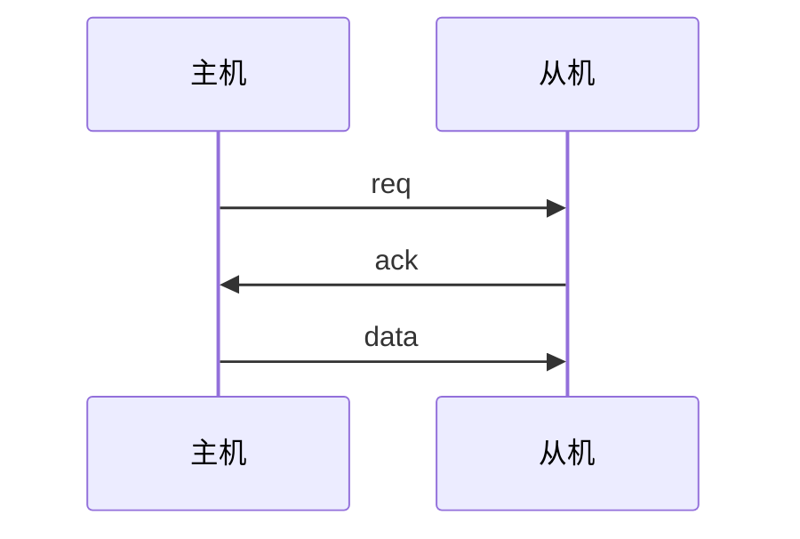
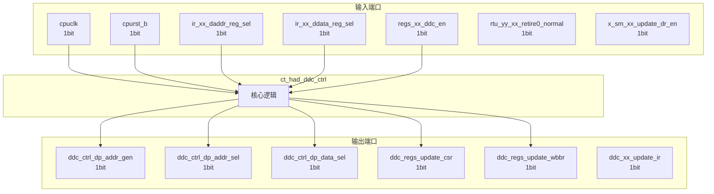

# ct_had_ddc_ctrl 模块设计文档

## 1. 模块概述

### 1.1 基本信息

| 属性 | 值 |
|------|-----|
| 模块名称 | ct_had_ddc_ctrl |
| 文件路径 | had\rtl\ct_had_ddc_ctrl.v |
| 层级 | Level 2 |
| 参数 | IDLE=4'h0, ADDR_WATI=4'h1, ADDR_LD=4'h2, DATA_WAIT=4'h3, DATA_LD=4'h4... |

### 1.2 功能描述

硬件调试 (Hardware Debug)，(控制逻辑)，主要信号: 使能信号、地址信号、读使能、时钟信号、数据信号

### 1.3 设计特点

- 包含 3 个 always 块
- 包含 11 个 assign 语句
- 可配置参数: 9 个

## 2. 模块接口说明

### 2.1 输入端口

| 信号名 | 方向 | 位宽 | 描述 |
|--------|------|------|------|
| cpuclk | input | 1 | 时钟信号 |
| cpurst_b | input | 1 | 复位信号 |
| ir_xx_daddr_reg_sel | input | 1 | 地址信号 |
| ir_xx_ddata_reg_sel | input | 1 | 数据信号 |
| regs_xx_ddc_en | input | 1 | 使能信号 |
| rtu_yy_xx_retire0_normal | input | 1 | 读使能 |
| x_sm_xx_update_dr_en | input | 1 | 使能信号 |

### 2.2 输出端口

| 信号名 | 方向 | 位宽 | 描述 |
|--------|------|------|------|
| ddc_ctrl_dp_addr_gen | output | 1 | 使能信号 |
| ddc_ctrl_dp_addr_sel | output | 1 | 地址信号 |
| ddc_ctrl_dp_data_sel | output | 1 | 数据信号 |
| ddc_regs_update_csr | output | 1 | 数据信号 |
| ddc_regs_update_wbbr | output | 1 | 数据信号 |
| ddc_xx_update_ir | output | 1 | 数据信号 |

### 2.4 参数列表

| 参数名 | 默认值 | 位宽 | 描述 |
|--------|--------|------|------|
| IDLE | 4'h0 | 1 | |
| ADDR_WATI | 4'h1 | 1 | |
| ADDR_LD | 4'h2 | 1 | |
| DATA_WAIT | 4'h3 | 1 | |
| DATA_LD | 4'h4 | 1 | |
| STW_WAIT | 4'h5 | 1 | |
| STW_LD | 4'h6 | 1 | |
| STW_FINISH | 4'h7 | 1 | |
| ADDR_GEN | 4'h8 | 1 | |

### 2.5 接口时序图



## 3. 模块框图

### 3.1 模块架构图



### 3.2 主要数据连线

无子模块连接。

## 4. 模块实现方案

### 4.1 关键逻辑描述

**Always 块列表:**

```verilog
always @(posedge cpuclk or negedge cpurst_b) begin
  // ...
end
```

```verilog
always @(addr_ld_finish
       or cur_st[3:0]
       or addr_ready
       or regs_xx_ddc_en
       or data_ready
       or stw_inst_retire
       or data_ld_finish) begin
  // ...
end
```

```verilog
always @(posedge cpuclk or negedge cpurst_b) begin
  // ...
end
```


**Assign 语句列表:**

| 目标信号 | 源表达式 |
|----------|----------|
| addr_ready | x_sm_xx_update_dr_en && ir_xx_daddr_reg_sel |
| data_ready | x_sm_xx_update_dr_en && ir_xx_ddata_reg_sel |
| data_ld_finish | rtu_yy_xx_retire0_normal |
| stw_inst_retire | rtu_yy_xx_retire0_normal |
| ddc_ctrl_dp_addr_sel | cur_st[3:0] == ADDR_LD |
| ddc_ctrl_dp_data_sel | cur_st[3:0] == DATA_LD |
| ddc_ctrl_dp_stw_sel | cur_st[3:0] == STW_LD |
| ddc_ctrl_dp_addr_gen | cur_st[3:0] == ADDR_GEN |
| ddc_regs_update_wbbr | ddc_ctrl_dp_addr_sel || ddc_ctrl_dp_data_sel |
| ddc_regs_update_csr | ddc_ctrl_dp_addr_sel ||
                              ddc_ctrl_dp_data_sel ||
                              ddc_ctrl_dp_stw_sel |
| ddc_xx_update_ir | ddc_ctrl_dp_addr_sel ||
                            ddc_ctrl_dp_data_sel ||
                            ddc_ctrl_dp_stw_sel |

## 5. 内部关键信号列表

### 5.1 寄存器信号

| 信号名 | 位宽 | 描述 |
|--------|------|------|
| addr_ld_finish | 1 | |
| cur_st | 4 | |
| nxt_st | 4 | |

### 5.2 线网信号

| 信号名 | 位宽 | 描述 |
|--------|------|------|
| addr_ready | 1 | |
| data_ld_finish | 1 | |
| data_ready | 1 | |
| ddc_ctrl_dp_stw_sel | 1 | |
| stw_inst_retire | 1 | |

## 6. 子模块方案

无子模块。

## 7. 修订历史

| 版本 | 日期 | 作者 | 说明 |
|------|------|------|------|
| 1.0 | 2026-03-12 | Auto-generated | 初始版本 |
