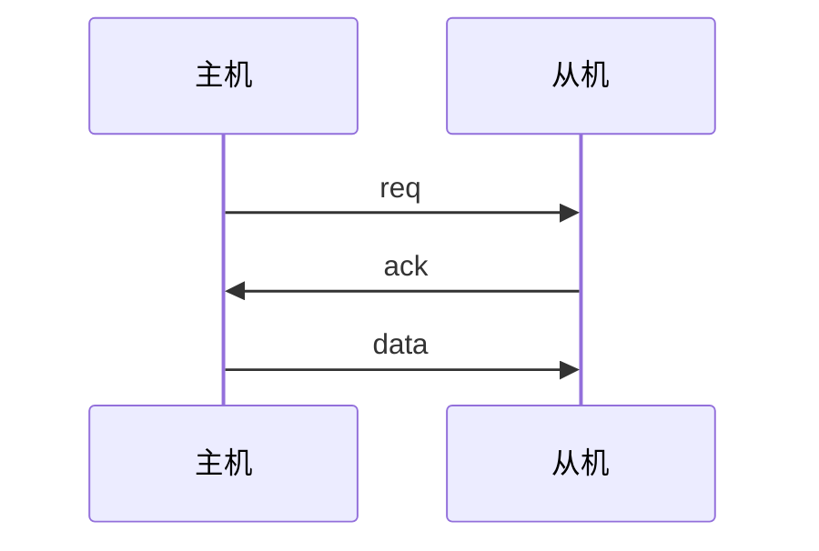
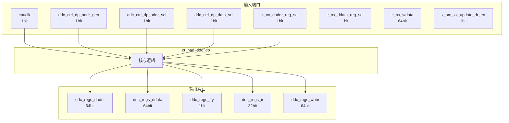

# ct_had_ddc_dp 模块设计文档

## 1. 模块概述

### 1.1 基本信息

| 属性 | 值 |
|------|-----|
| 模块名称 | ct_had_ddc_dp |
| 文件路径 | had\rtl\ct_had_ddc_dp.v |
| 层级 | Level 2 |
| 参数 | DATAW=64, ADDRW=`PA_WIDTH |

### 1.2 功能描述

硬件调试 (Hardware Debug)，(数据通路)，主要信号: 使能信号、地址信号、读使能、时钟信号、数据信号

### 1.3 设计特点

- 包含 2 个 always 块
- 包含 1 个 assign 语句
- 可配置参数: 2 个

## 2. 模块接口说明

### 2.1 输入端口

| 信号名 | 方向 | 位宽 | 描述 |
|--------|------|------|------|
| cpuclk | input | 1 | 时钟信号 |
| ddc_ctrl_dp_addr_gen | input | 1 | 使能信号 |
| ddc_ctrl_dp_addr_sel | input | 1 | 地址信号 |
| ddc_ctrl_dp_data_sel | input | 1 | 数据信号 |
| ir_xx_daddr_reg_sel | input | 1 | 地址信号 |
| ir_xx_ddata_reg_sel | input | 1 | 数据信号 |
| ir_xx_wdata | input | 64 | 数据信号 |
| x_sm_xx_update_dr_en | input | 1 | 使能信号 |

### 2.2 输出端口

| 信号名 | 方向 | 位宽 | 描述 |
|--------|------|------|------|
| ddc_regs_daddr | output | 64 | 地址信号 |
| ddc_regs_ddata | output | 64 | 数据信号 |
| ddc_regs_ffy | output | 1 | 读使能 |
| ddc_regs_ir | output | 32 | 读使能 |
| ddc_regs_wbbr | output | 64 | 读使能 |

### 2.4 参数列表

| 参数名 | 默认值 | 位宽 | 描述 |
|--------|--------|------|------|
| DATAW | 64 | 1 | |
| ADDRW | `PA_WIDTH | 1 | |

### 2.5 接口时序图



## 3. 模块框图

### 3.1 模块架构图



### 3.2 主要数据连线

无子模块连接。

## 4. 模块实现方案

### 4.1 关键逻辑描述

**Always 块列表:**

```verilog
always @(posedge cpuclk) begin
  // ...
end
```

```verilog
always @(posedge cpuclk) begin
  // ...
end
```


**Assign 语句列表:**

| 目标信号 | 源表达式 |
|----------|----------|
| ddc_regs_ffy | (ddc_ctrl_dp_addr_sel || ddc_ctrl_dp_data_sel) |

## 5. 内部关键信号列表

### 5.1 寄存器信号

| 信号名 | 位宽 | 描述 |
|--------|------|------|
| daddr_reg | 64 | |
| ddata_reg | 64 | |

### 5.2 线网信号

无线网信号。

## 6. 子模块方案

无子模块。

## 7. 修订历史

| 版本 | 日期 | 作者 | 说明 |
|------|------|------|------|
| 1.0 | 2026-03-12 | Auto-generated | 初始版本 |
