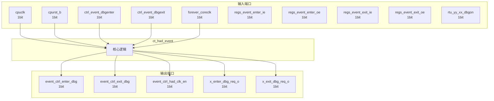

# ct_had_event 模块设计文档

## 1. 模块概述

### 1.1 基本信息

| 属性 | 值 |
|------|-----|
| 模块名称 | ct_had_event |
| 文件路径 | had\rtl\ct_had_event.v |
| 层级 | Level 2 |

### 1.2 功能描述

ct_had_event 模块的功能描述。

### 1.3 设计特点

- 包含 4 个 always 块
- 包含 7 个 assign 语句

## 2. 模块接口说明

### 2.1 输入端口

| 信号名 | 方向 | 位宽 | 描述 |
|--------|------|------|------|
| cpuclk | input | 1 | |
| cpurst_b | input | 1 | |
| ctrl_event_dbgenter | input | 1 | |
| ctrl_event_dbgexit | input | 1 | |
| forever_coreclk | input | 1 | |
| regs_event_enter_ie | input | 1 | |
| regs_event_enter_oe | input | 1 | |
| regs_event_exit_ie | input | 1 | |
| regs_event_exit_oe | input | 1 | |
| rtu_yy_xx_dbgon | input | 1 | |
| x_enter_dbg_req_i | input | 1 | |
| x_exit_dbg_req_i | input | 1 | |

### 2.2 输出端口

| 信号名 | 方向 | 位宽 | 描述 |
|--------|------|------|------|
| event_ctrl_enter_dbg | output | 1 | |
| event_ctrl_exit_dbg | output | 1 | |
| event_ctrl_had_clk_en | output | 1 | |
| x_enter_dbg_req_o | output | 1 | |
| x_exit_dbg_req_o | output | 1 | |

## 3. 模块框图

### 3.1 模块架构图



### 3.2 主要数据连线

无子模块连接。

## 4. 模块实现方案

### 4.1 关键逻辑描述

**Always 块列表:**

```verilog
always @(posedge forever_coreclk or negedge cpurst_b) begin
  // ...
end
```

```verilog
always @(posedge cpuclk or negedge cpurst_b) begin
  // ...
end
```

```verilog
always @(posedge cpuclk or negedge cpurst_b) begin
  // ...
end
```

```verilog
always @(posedge cpuclk or negedge cpurst_b) begin
  // ...
end
```


**Assign 语句列表:**

| 目标信号 | 源表达式 |
|----------|----------|
| event_ctrl_enter_dbg | enter_dbg_req_i |
| event_ctrl_exit_dbg | x_exit_dbg_req_i_sync & regs_event_exit_ie |
| x_exit_dbg_req_o_sync | exit_dbg_req_o && regs_event_exit_oe |
| x_enter_dbg_req_o_sync | enter_dbg_req_o && regs_event_enter_oe |
| x_exit_dbg_req_o | x_exit_dbg_req_o_sync |
| x_enter_dbg_req_o | x_enter_dbg_req_o_sync |
| event_ctrl_had_clk_en | x_enter_dbg_req_i_sync
                            || x_exit_dbg_req_i_sync |

## 5. 内部关键信号列表

### 5.1 寄存器信号

| 信号名 | 位宽 | 描述 |
|--------|------|------|
| enter_dbg_req_i | 1 | |
| enter_dbg_req_o | 1 | |
| exit_dbg_req_o | 1 | |
| x_enter_dbg_req_i_f | 1 | |
| x_enter_dbg_req_i_sync | 1 | |
| x_exit_dbg_req_i_f | 1 | |
| x_exit_dbg_req_i_sync | 1 | |

### 5.2 线网信号

| 信号名 | 位宽 | 描述 |
|--------|------|------|
| x_enter_dbg_req_o_sync | 1 | |
| x_exit_dbg_req_o_sync | 1 | |

## 6. 子模块方案

无子模块。

## 7. 修订历史

| 版本 | 日期 | 作者 | 说明 |
|------|------|------|------|
| 1.0 | 2026-03-12 | Auto-generated | 初始版本 |
