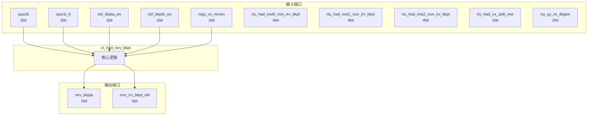

# ct_had_nirv_bkpt 模块设计文档

## 1. 模块概述

### 1.1 基本信息

| 属性 | 值 |
|------|-----|
| 模块名称 | ct_had_nirv_bkpt |
| 文件路径 | had\rtl\ct_had_nirv_bkpt.v |
| 层级 | Level 2 |

### 1.2 功能描述

ct_had_nirv_bkpt 模块的功能描述。

### 1.3 设计特点

- 包含 4 个 always 块
- 包含 5 个 assign 语句

## 2. 模块接口说明

### 2.1 输入端口

| 信号名 | 方向 | 位宽 | 描述 |
|--------|------|------|------|
| cpuclk | input | 1 | |
| cpurst_b | input | 1 | |
| ctrl_bkpta_en | input | 1 | |
| ctrl_bkptb_en | input | 1 | |
| regs_xx_nirven | input | 1 | |
| rtu_had_inst0_non_irv_bkpt | input | 4 | |
| rtu_had_inst1_non_irv_bkpt | input | 4 | |
| rtu_had_inst2_non_irv_bkpt | input | 4 | |
| rtu_had_xx_split_inst | input | 1 | |
| rtu_yy_xx_dbgon | input | 1 | |
| rtu_yy_xx_flush | input | 1 | |
| rtu_yy_xx_retire0_normal | input | 1 | |
| rtu_yy_xx_retire1 | input | 1 | |
| rtu_yy_xx_retire2 | input | 1 | |

### 2.2 输出端口

| 信号名 | 方向 | 位宽 | 描述 |
|--------|------|------|------|
| nirv_bkpta | output | 1 | |
| non_irv_bkpt_vld | output | 1 | |

## 3. 模块框图

### 3.1 模块架构图



### 3.2 主要数据连线

无子模块连接。

## 4. 模块实现方案

### 4.1 关键逻辑描述

**Always 块列表:**

```verilog
always @(posedge cpuclk or negedge cpurst_b) begin
  // ...
end
```

```verilog
always @(posedge cpuclk or negedge cpurst_b) begin
  // ...
end
```

```verilog
always @(posedge cpuclk or negedge cpurst_b) begin
  // ...
end
```

```verilog
always @(posedge cpuclk or negedge cpurst_b) begin
  // ...
end
```


**Assign 语句列表:**

| 目标信号 | 源表达式 |
|----------|----------|
| nirv_bkpta_occur | inst0_non_irv_bkpt[1] || inst0_non_irv_bkpt[2] ||
                          inst1_non_irv_bkpt[1] || inst1_non_irv_bkpt[2] ||
                          inst2_non_irv_bkpt[1] || inst2_non_irv_bkpt[2] |
| nirv_bkptb_occur | inst0_non_irv_bkpt[0] || inst0_non_irv_bkpt[3] ||
                          inst1_non_irv_bkpt[0] || inst1_non_irv_bkpt[3] ||
                          inst2_non_irv_bkpt[0] || inst2_non_irv_bkpt[3] |
| kbpt_occur | regs_xx_nirven && 
                    (nirv_bkpta_occur && ctrl_bkpta_en || nirv_bkptb_occur && ctrl_bkptb_en) |
| nirv_bkpt_occur_raw | kbpt_occur && !rtu_had_xx_split_inst ||
                             nirv_bkpt_pending && !rtu_had_xx_split_inst && rtu_yy_xx_retire0_normal |
| nirv_bkpta_sel | nirv_bkpt_pending ? nirv_bkpta_pending : nirv_bkpta_occur |

## 5. 内部关键信号列表

### 5.1 寄存器信号

| 信号名 | 位宽 | 描述 |
|--------|------|------|
| nirv_bkpt_pending | 1 | |
| nirv_bkpta_pending | 1 | |

### 5.2 线网信号

| 信号名 | 位宽 | 描述 |
|--------|------|------|
| inst0_non_irv_bkpt | 4 | |
| inst1_non_irv_bkpt | 4 | |
| inst2_non_irv_bkpt | 4 | |
| kbpt_occur | 1 | |
| nirv_bkpt_occur_raw | 1 | |
| nirv_bkpta_occur | 1 | |
| nirv_bkpta_sel | 1 | |
| nirv_bkptb_occur | 1 | |

## 6. 子模块方案

无子模块。

## 7. 修订历史

| 版本 | 日期 | 作者 | 说明 |
|------|------|------|------|
| 1.0 | 2026-03-12 | Auto-generated | 初始版本 |
