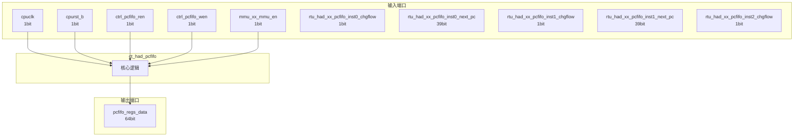

# ct_had_pcfifo 模块设计文档

## 1. 模块概述

### 1.1 基本信息

| 属性 | 值 |
|------|-----|
| 模块名称 | ct_had_pcfifo |
| 文件路径 | had\rtl\ct_had_pcfifo.v |
| 层级 | Level 2 |
| 参数 | WIDTH=`PA_WIDTH, DATAW=64, DEPTH=16, PTR_WIDTH=5 |

### 1.2 功能描述

ct_had_pcfifo 模块的功能描述。

### 1.3 设计特点

- 包含 9 个 always 块
- 包含 14 个 assign 语句
- 可配置参数: 4 个

## 2. 模块接口说明

### 2.1 输入端口

| 信号名 | 方向 | 位宽 | 描述 |
|--------|------|------|------|
| cpuclk | input | 1 | |
| cpurst_b | input | 1 | |
| ctrl_pcfifo_ren | input | 1 | |
| ctrl_pcfifo_wen | input | 1 | |
| mmu_xx_mmu_en | input | 1 | |
| rtu_had_xx_pcfifo_inst0_chgflow | input | 1 | |
| rtu_had_xx_pcfifo_inst0_next_pc | input | 39 | |
| rtu_had_xx_pcfifo_inst1_chgflow | input | 1 | |
| rtu_had_xx_pcfifo_inst1_next_pc | input | 39 | |
| rtu_had_xx_pcfifo_inst2_chgflow | input | 1 | |
| rtu_had_xx_pcfifo_inst2_next_pc | input | 39 | |

### 2.2 输出端口

| 信号名 | 方向 | 位宽 | 描述 |
|--------|------|------|------|
| pcfifo_regs_data | output | 64 | |

### 2.4 参数列表

| 参数名 | 默认值 | 位宽 | 描述 |
|--------|--------|------|------|
| WIDTH | `PA_WIDTH | 1 | |
| DATAW | 64 | 1 | |
| DEPTH | 16 | 1 | |
| PTR_WIDTH | 5 | 1 | |

## 3. 模块框图

### 3.1 模块架构图



### 3.2 主要数据连线

无子模块连接。

## 4. 模块实现方案

### 4.1 关键逻辑描述

**Always 块列表:**

```verilog
always @(posedge cpuclk or negedge cpurst_b) begin
  // ...
end
```

```verilog
always @(posedge cpuclk or negedge cpurst_b) begin
  // ...
end
```

```verilog
always @(posedge cpuclk) begin
  // ...
end
```

```verilog
always @(posedge cpuclk) begin
  // ...
end
```

```verilog
always @(posedge cpuclk) begin
  // ...
end
```


**Assign 语句列表:**

| 目标信号 | 源表达式 |
|----------|----------|
| inst0_chgflow_vld | chgflow_valid[0] && ctrl_pcfifo_wen_flop |
| inst1_chgflow_vld | chgflow_valid[1] && ctrl_pcfifo_wen_flop |
| inst2_chgflow_vld | chgflow_valid[2] && ctrl_pcfifo_wen_flop |
| create_vld | |chgflow_valid[2:0] && ctrl_pcfifo_wen_flop |
| create_three | &chgflow_valid[2:0] |
| create_two | (chgflow_valid[2:0] == 3'b110) ||
                      (chgflow_valid[2:0] == 3'b101) ||
                      (chgflow_valid[2:0] == 3'b011) |
| create_one | (chgflow_valid[2:0] == 3'b100) ||
                      (chgflow_valid[2:0] == 3'b010) ||
                      (chgflow_valid[2:0] == 3'b001) |
| pcfifo_empty | (wptr[PTR_WIDTH-2:0] == rptr[PTR_WIDTH-2:0]) &&
                      (wptr[PTR_WIDTH-1]   ~^ rptr[PTR_WIDTH-1]) |
| pcfifo_full | (wptr[PTR_WIDTH-2:0] == rptr[PTR_WIDTH-2:0]) &&
                      (wptr[PTR_WIDTH-1]   ^  rptr[PTR_WIDTH-1]) |
| two_entry_left | (wptr_2[PTR_WIDTH-2:0] == rptr[PTR_WIDTH-2:0]) &&
                        (wptr_2[PTR_WIDTH-1]   ^  rptr[PTR_WIDTH-1]) |
| one_entry_left | (wptr_1[PTR_WIDTH-2:0] == rptr[PTR_WIDTH-2:0]) &&
                        (wptr_1[PTR_WIDTH-1]   ^  rptr[PTR_WIDTH-1]) |
| rptr_inc_3 | create_vld && 
                    pcfifo_full && create_three |
| rptr_inc_2 | create_vld &&
                    (one_entry_left && create_three || 
                     pcfifo_full && create_two) |
| rptr_inc_1 | create_vld && 
                    (two_entry_left && create_three ||
                     one_entry_left && create_two ||
                     pcfifo_full && create_one) ||
                    ctrl_pcfifo_ren |

## 5. 内部关键信号列表

### 5.1 寄存器信号

| 信号名 | 位宽 | 描述 |
|--------|------|------|
| chgflow_valid | 3 | |
| ctrl_pcfifo_wen_flop | 1 | |
| pcfifo_din_0 | 40 | |
| pcfifo_din_1 | 40 | |
| pcfifo_din_2 | 40 | |
| pcfifo_dout | 40 | |
| rptr | 5 | |
| wptr | 5 | |
| pcfifo_reg | 2 | |

### 5.2 线网信号

| 信号名 | 位宽 | 描述 |
|--------|------|------|
| chgflow_valid_pre | 3 | |
| create_one | 1 | |
| create_three | 1 | |
| create_two | 1 | |
| create_vld | 1 | |
| inst0_chgflow_vld | 1 | |
| inst1_chgflow_vld | 1 | |
| inst2_chgflow_vld | 1 | |
| one_entry_left | 1 | |
| pcfifo_empty | 1 | |
| pcfifo_full | 1 | |
| rptr_inc | 5 | |
| rptr_inc_1 | 1 | |
| rptr_inc_2 | 1 | |
| rptr_inc_3 | 1 | |
| two_entry_left | 1 | |
| wptr_0 | 5 | |
| wptr_1 | 5 | |
| wptr_2 | 5 | |
| wptr_inc | 5 | |
| ... | ... | 共24个线网信号 |

## 6. 子模块方案

无子模块。

## 7. 修订历史

| 版本 | 日期 | 作者 | 说明 |
|------|------|------|------|
| 1.0 | 2026-03-12 | Auto-generated | 初始版本 |
