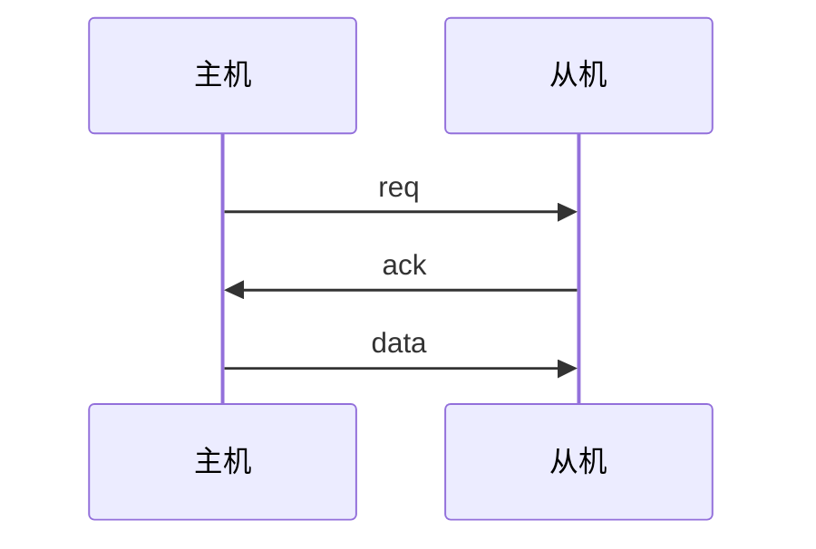
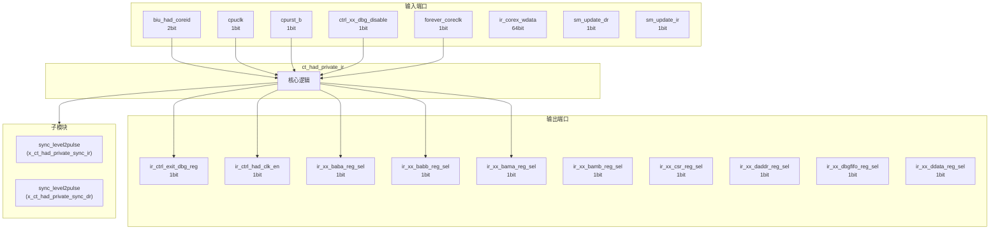
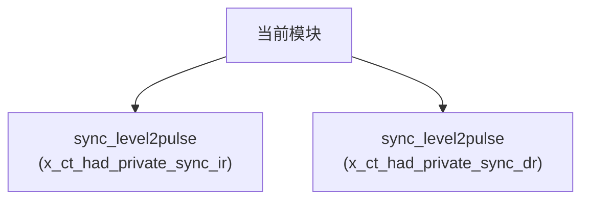

# ct_had_private_ir 模块设计文档

## 1. 模块概述

### 1.1 基本信息

| 属性 | 值 |
|------|-----|
| 模块名称 | ct_had_private_ir |
| 文件路径 | had\rtl\ct_had_private_ir.v |
| 层级 | Level 2 |
| 参数 | ID_NUM=5'd2, OTC_NUM=5'd3, MBCA_NUM=5'd4, MBCB_NUM=5'd5, PCFIFO_NUM=5'd6... |

### 1.2 功能描述

硬件调试 (Hardware Debug)，(寄存器重命名)，主要信号: 控制信号、使能信号、地址信号、读使能、时钟信号

### 1.3 设计特点

- 包含 2 个子模块实例
- 包含 2 个 always 块
- 包含 45 个 assign 语句
- 可配置参数: 25 个

## 2. 模块接口说明

### 2.1 输入端口

| 信号名 | 方向 | 位宽 | 描述 |
|--------|------|------|------|
| biu_had_coreid | input | 2 | 读使能 |
| cpuclk | input | 1 | 时钟信号 |
| cpurst_b | input | 1 | 复位信号 |
| ctrl_xx_dbg_disable | input | 1 | 控制信号 |
| forever_coreclk | input | 1 | 时钟信号 |
| ir_corex_wdata | input | 64 | 数据信号 |
| sm_update_dr | input | 1 | 数据信号 |
| sm_update_ir | input | 1 | 数据信号 |

### 2.2 输出端口

| 信号名 | 方向 | 位宽 | 描述 |
|--------|------|------|------|
| ir_ctrl_exit_dbg_reg | output | 1 | 控制信号 |
| ir_ctrl_had_clk_en | output | 1 | 时钟信号 |
| ir_xx_baba_reg_sel | output | 1 | 读使能 |
| ir_xx_babb_reg_sel | output | 1 | 读使能 |
| ir_xx_bama_reg_sel | output | 1 | 读使能 |
| ir_xx_bamb_reg_sel | output | 1 | 读使能 |
| ir_xx_csr_reg_sel | output | 1 | 读使能 |
| ir_xx_daddr_reg_sel | output | 1 | 地址信号 |
| ir_xx_dbgfifo_reg_sel | output | 1 | 读使能 |
| ir_xx_ddata_reg_sel | output | 1 | 数据信号 |
| ir_xx_eventie_reg_sel | output | 1 | 使能信号 |
| ir_xx_eventoe_reg_sel | output | 1 | 使能信号 |
| ir_xx_hcr_reg_sel | output | 1 | 读使能 |
| ir_xx_hsr_reg_sel | output | 1 | 读使能 |
| ir_xx_id_reg_sel | output | 1 | 读使能 |
| ir_xx_ir_reg_sel | output | 1 | 读使能 |
| ir_xx_mbca_reg_sel | output | 1 | 读使能 |
| ir_xx_mbcb_reg_sel | output | 1 | 读使能 |
| ir_xx_mbir_reg_sel | output | 1 | 读使能 |
| ir_xx_otc_reg_sel | output | 1 | 读使能 |
| ir_xx_pc_reg_sel | output | 1 | 读使能 |
| ir_xx_pcfifo_reg_sel | output | 1 | 读使能 |
| ir_xx_pipefifo_reg_sel | output | 1 | 读使能 |
| ir_xx_pipesel_reg_sel | output | 1 | 读使能 |
| ir_xx_wbbr_reg_sel | output | 1 | 读使能 |
| ir_xx_wdata | output | 64 | 数据信号 |
| x_ir_ctrl_dbgfifo_read_pulse | output | 1 | 控制信号 |
| x_ir_ctrl_pcfifo_read_pulse | output | 1 | 控制信号 |
| x_ir_ctrl_pipefifo_read_pulse | output | 1 | 控制信号 |
| x_ir_xx_ex | output | 1 |  |
| ... | ... | ... | 共32个输出端口 |

### 2.4 参数列表

| 参数名 | 默认值 | 位宽 | 描述 |
|--------|--------|------|------|
| ID_NUM | 5'd2 | 1 | |
| OTC_NUM | 5'd3 | 1 | |
| MBCA_NUM | 5'd4 | 1 | |
| MBCB_NUM | 5'd5 | 1 | |
| PCFIFO_NUM | 5'd6 | 1 | |
| BABA_NUM | 5'd7 | 1 | |
| BABB_NUM | 5'd8 | 1 | |
| BAMA_NUM | 5'd9 | 1 | |
| BAMB_NUM | 5'd10 | 1 | |
| BYPASS_NUM | 5'd12 | 1 | |
| HCR_NUM | 5'd13 | 1 | |
| HSR_NUM | 5'd14 | 1 | |
| WBBR_NUM | 5'd17 | 1 | |
| PSR_NUM | 5'd18 | 1 | |
| PC_NUM | 5'd19 | 1 | |
| IR_NUM | 5'd20 | 1 | |
| CSR_NUM | 5'd21 | 1 | |
| DADDR_NUM | 5'd24 | 1 | |
| DDATA_NUM | 5'd25 | 1 | |
| MBIR_NUM | 5'd27 | 1 | |
| EVENT_OE_NUM | 5'd2 | 1 | |
| EVENT_IE_NUM | 5'd3 | 1 | |
| DBGFIFO_NUM | 5'd4 | 1 | |
| PIPEFIFO_NUM | 5'd5 | 1 | |
| PIPESEL_NUM | 5'd6 | 1 | |

### 2.5 接口时序图



## 3. 模块框图

### 3.1 模块架构图



### 3.2 主要数据连线

| 源模块 | 目标模块 | 信号名 | 位宽 | 说明 |
|--------|----------|--------|------|------|
| ct_had_private_ir | sync_level2pulse | clk | - | |
| ct_had_private_ir | sync_level2pulse | rst_b | - | |
| ct_had_private_ir | sync_level2pulse | sync_ack | - | |
| ct_had_private_ir | sync_level2pulse | clk | - | |
| ct_had_private_ir | sync_level2pulse | rst_b | - | |
| ct_had_private_ir | sync_level2pulse | sync_ack | - | |

## 4. 模块实现方案

### 4.1 关键逻辑描述

**Always 块列表:**

```verilog
always @(posedge cpuclk or negedge cpurst_b) begin
  // ...
end
```

```verilog
always @(posedge cpuclk or negedge cpurst_b) begin
  // ...
end
```


**Assign 语句列表:**

| 目标信号 | 源表达式 |
|----------|----------|
| x_update_ir_cpu | x_update_ir_cpu_raw && !ctrl_xx_dbg_disable |
| x_update_dr_cpu | x_update_dr_cpu_raw && !ctrl_xx_dbg_disable |
| hacr_update_en | x_update_ir_cpu |
| hacr_rw | hacr_f[15] |
| ir_xx_go | hacr_f[14] |
| ir_xx_ex | hacr_f[13] |
| core_sel | (hacr_f[1:0] == biu_had_coreid[1:0]) |
| x_ir_xx_ex | ir_xx_ex && core_sel |
| x_ir_xx_go | ir_xx_go && core_sel |
| bank0_sel | (hacr_f[6:4] == 3'd0) |
| bank1_sel | (hacr_f[6:4] == 3'd1) |
| bank2_sel | (hacr_f[6:4] == 3'd2) |
| ir_xx_id_reg_sel | bank0_sel && (hacr_index[4:0] == ID_NUM) |
| ir_xx_otc_reg_sel | bank0_sel && (hacr_index[4:0] == OTC_NUM) |
| ir_xx_mbca_reg_sel | bank0_sel && (hacr_index[4:0] == MBCA_NUM) |
| ... | 共45条assign语句 |

## 5. 内部关键信号列表

### 5.1 寄存器信号

| 信号名 | 位宽 | 描述 |
|--------|------|------|
| hacr_f | 16 | |
| update_dr_ff1 | 1 | |
| update_hacr_ff1 | 1 | |

### 5.2 线网信号

| 信号名 | 位宽 | 描述 |
|--------|------|------|
| bank0_sel | 1 | |
| bank1_sel | 1 | |
| bank2_sel | 1 | |
| core_sel | 1 | |
| dbgfifo_read | 1 | |
| hacr_index | 5 | |
| hacr_rw | 1 | |
| hacr_update_en | 1 | |
| ir_xx_bypass_reg_sel | 1 | |
| ir_xx_ex | 1 | |
| ir_xx_go | 1 | |
| pcfifo_read | 1 | |
| pipefifo_read | 1 | |
| x_update_dr_cpu | 1 | |
| x_update_dr_cpu_ack | 1 | |
| x_update_dr_cpu_raw | 1 | |
| x_update_ir_cpu | 1 | |
| x_update_ir_cpu_ack | 1 | |
| x_update_ir_cpu_raw | 1 | |

## 6. 子模块方案

### 6.1 模块例化层次结构



### 6.2 子模块列表

| 层级 | 模块名 | 实例名 | 功能描述 |
|------|--------|--------|----------|
| 1 | sync_level2pulse | x_ct_had_private_sync_ir |  |
| 1 | sync_level2pulse | x_ct_had_private_sync_dr |  |

## 7. 修订历史

| 版本 | 日期 | 作者 | 说明 |
|------|------|------|------|
| 1.0 | 2026-03-12 | Auto-generated | 初始版本 |
