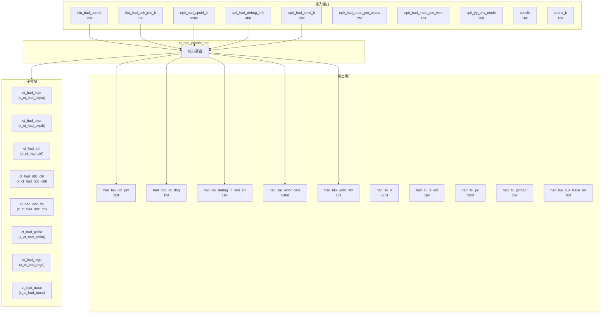

# ct_had_private_top 模块设计文档

## 1. 模块概述

### 1.1 基本信息

| 属性 | 值 |
|------|-----|
| 模块名称 | ct_had_private_top |
| 文件路径 | had\rtl\ct_had_private_top.v |
| 层级 | Level 1 |

### 1.2 功能描述

ct_had_private_top 模块的功能描述。

### 1.3 设计特点

- 包含 12 个子模块实例
- 包含 3 个 assign 语句

## 2. 模块接口说明

### 2.1 输入端口

| 信号名 | 方向 | 位宽 | 描述 |
|--------|------|------|------|
| biu_had_coreid | input | 2 | |
| biu_had_sdb_req_b | input | 1 | |
| cp0_had_cpuid_0 | input | 32 | |
| cp0_had_debug_info | input | 4 | |
| cp0_had_lpmd_b | input | 2 | |
| cp0_had_trace_pm_wdata | input | 2 | |
| cp0_had_trace_pm_wen | input | 1 | |
| cp0_yy_priv_mode | input | 2 | |
| cpuclk | input | 1 | |
| cpurst_b | input | 1 | |
| forever_coreclk | input | 1 | |
| idu_had_debug_info | input | 50 | |
| idu_had_id_inst0_info | input | 40 | |
| idu_had_id_inst0_vld | input | 1 | |
| idu_had_id_inst1_info | input | 40 | |
| idu_had_id_inst1_vld | input | 1 | |
| idu_had_id_inst2_info | input | 40 | |
| idu_had_id_inst2_vld | input | 1 | |
| idu_had_iq_empty | input | 1 | |
| idu_had_pipe_stall | input | 1 | |
| idu_had_pipeline_empty | input | 1 | |
| idu_had_wb_data | input | 64 | |
| idu_had_wb_vld | input | 1 | |
| ifu_had_debug_info | input | 83 | |
| ifu_had_no_inst | input | 1 | |
| ifu_had_no_op | input | 1 | |
| ifu_had_reset_on | input | 1 | |
| ir_corex_wdata | input | 64 | |
| iu_had_debug_info | input | 10 | |
| lsu_had_debug_info | input | 184 | |
| ... | ... | ... | 共105个输入端口 |

### 2.2 输出端口

| 信号名 | 方向 | 位宽 | 描述 |
|--------|------|------|------|
| had_biu_jdb_pm | output | 2 | |
| had_cp0_xx_dbg | output | 1 | |
| had_idu_debug_id_inst_en | output | 1 | |
| had_idu_wbbr_data | output | 64 | |
| had_idu_wbbr_vld | output | 1 | |
| had_ifu_ir | output | 32 | |
| had_ifu_ir_vld | output | 1 | |
| had_ifu_pc | output | 39 | |
| had_ifu_pcload | output | 1 | |
| had_lsu_bus_trace_en | output | 1 | |
| had_lsu_dbg_en | output | 1 | |
| had_rtu_data_bkpt_dbgreq | output | 1 | |
| had_rtu_dbg_disable | output | 1 | |
| had_rtu_dbg_req_en | output | 1 | |
| had_rtu_debug_retire_info_en | output | 1 | |
| had_rtu_event_dbgreq | output | 1 | |
| had_rtu_fdb | output | 1 | |
| had_rtu_hw_dbgreq | output | 1 | |
| had_rtu_hw_dbgreq_gateclk | output | 1 | |
| had_rtu_inst_bkpt_dbgreq | output | 1 | |
| had_rtu_non_irv_bkpt_dbgreq | output | 1 | |
| had_rtu_pop1_disa | output | 1 | |
| had_rtu_trace_dbgreq | output | 1 | |
| had_rtu_trace_en | output | 1 | |
| had_rtu_xx_jdbreq | output | 1 | |
| had_rtu_xx_tme | output | 1 | |
| had_xx_clk_en | output | 1 | |
| had_yy_xx_bkpta_base | output | 40 | |
| had_yy_xx_bkpta_mask | output | 8 | |
| had_yy_xx_bkpta_rc | output | 1 | |
| ... | ... | ... | 共38个输出端口 |

## 3. 模块框图

### 3.1 模块架构图

### 3.2 主要数据连线

| 源模块 | 目标模块 | 信号名 | 位宽 | 说明 |
|--------|----------|--------|------|------|
| ct_had_private_top | ct_had_bkpt | bkpt_ctrl_data_req | - | |
| ct_had_private_top | ct_had_bkpt | bkpt_ctrl_data_req_raw | - | |
| ct_had_private_top | ct_had_bkpt | bkpt_ctrl_inst_req | - | |
| ct_had_private_top | ct_had_bkpt | bkpt_ctrl_data_req | - | |
| ct_had_private_top | ct_had_bkpt | bkpt_ctrl_data_req_raw | - | |
| ct_had_private_top | ct_had_bkpt | bkpt_ctrl_inst_req | - | |
| ct_had_private_top | ct_had_ctrl | biu_had_sdb_req_b | - | |
| ct_had_private_top | ct_had_ctrl | bkpta_ctrl_data_req | - | |
| ct_had_private_top | ct_had_ctrl | bkpta_ctrl_data_req_raw | - | |
| ct_had_private_top | ct_had_ddc_ctrl | cpuclk | - | |
| ct_had_private_top | ct_had_ddc_ctrl | cpurst_b | - | |
| ct_had_private_top | ct_had_ddc_ctrl | ddc_ctrl_dp_addr_gen | - | |
| ct_had_private_top | ct_had_ddc_dp | cpuclk | - | |
| ct_had_private_top | ct_had_ddc_dp | ddc_ctrl_dp_addr_gen | - | |
| ct_had_private_top | ct_had_ddc_dp | ddc_ctrl_dp_addr_sel | - | |
| ct_had_private_top | ct_had_pcfifo | cpuclk | - | |
| ct_had_private_top | ct_had_pcfifo | cpurst_b | - | |
| ct_had_private_top | ct_had_pcfifo | ctrl_pcfifo_ren | - | |
| ct_had_private_top | ct_had_regs | bkpt_regs_mbca | - | |
| ct_had_private_top | ct_had_regs | bkpt_regs_mbcb | - | |
| ct_had_private_top | ct_had_regs | cp0_had_cpuid_0 | - | |
| ct_had_private_top | ct_had_trace | cpuclk | - | |
| ct_had_private_top | ct_had_trace | cpurst_b | - | |
| ct_had_private_top | ct_had_trace | ctrl_trace_en | - | |
| ct_had_private_top | ct_had_event | cpuclk | - | |
| ct_had_private_top | ct_had_event | cpurst_b | - | |
| ct_had_private_top | ct_had_event | ctrl_event_dbgenter | - | |
| ct_had_private_top | ct_had_dbg_info | cp0_had_debug_info | - | |
| ct_had_private_top | ct_had_dbg_info | cpuclk | - | |
| ct_had_private_top | ct_had_dbg_info | cpurst_b | - | |

## 4. 模块实现方案

### 4.1 关键逻辑描述

无关键 always 块。

**Assign 语句列表:**

| 目标信号 | 源表达式 |
|----------|----------|
| had_lsu_pctrace_en | 1'b0 |
| had_lsu_bus_trace_en | 1'b0 |
| had_lsu_dbg_en | had_lsu_dbg_info_en || had_lsu_pctrace_en |

## 5. 内部关键信号列表

### 5.1 寄存器信号

无寄存器信号。

### 5.2 线网信号

| 信号名 | 位宽 | 描述 |
|--------|------|------|
| bkpt_regs_mbca | 8 | |
| bkpt_regs_mbcb | 8 | |
| bkpta_ctrl_data_req | 1 | |
| bkpta_ctrl_data_req_raw | 1 | |
| bkpta_ctrl_inst_req | 1 | |
| bkpta_ctrl_inst_req_raw | 1 | |
| bkpta_ctrl_xx_ack | 1 | |
| bkptb_ctrl_data_req | 1 | |
| bkptb_ctrl_data_req_raw | 1 | |
| bkptb_ctrl_inst_req | 1 | |
| bkptb_ctrl_inst_req_raw | 1 | |
| bkptb_ctrl_xx_ack | 1 | |
| ctrl_bkpta_en | 1 | |
| ctrl_bkpta_en_raw | 1 | |
| ctrl_bkptb_en | 1 | |
| ctrl_bkptb_en_raw | 1 | |
| ctrl_dbgfifo_ren | 1 | |
| ctrl_event_dbgenter | 1 | |
| ctrl_event_dbgexit | 1 | |
| ctrl_pcfifo_ren | 1 | |
| ... | ... | 共112个线网信号 |

## 6. 子模块方案

### 6.1 模块例化层次结构

```mermaid
graph TD
    ROOT["当前模块"]
    N0["ct_had_bkpt\n(x_ct_had_bkpta)"]
    ROOT --> N0
    N1["ct_had_bkpt\n(x_ct_had_bkptb)"]
    ROOT --> N1
    N2["ct_had_ctrl\n(x_ct_had_ctrl)"]
    ROOT --> N2
    N3["ct_had_ddc_ctrl\n(x_ct_had_ddc_ctrl)"]
    ROOT --> N3
    N4["ct_had_ddc_dp\n(x_ct_had_ddc_dp)"]
    ROOT --> N4
    N5["ct_had_pcfifo\n(x_ct_had_pcfifo)"]
    ROOT --> N5
    N6["ct_had_regs\n(x_ct_had_regs)"]
    ROOT --> N6
    N7["ct_had_trace\n(x_ct_had_trace)"]
    ROOT --> N7
    N8["ct_had_event\n(x_ct_had_event)"]
    ROOT --> N8
    N9["ct_had_dbg_info\n(x_ct_had_dbg_info)"]
    ROOT --> N9
    N10["ct_had_nirv_bkpt\n(x_ct_had_nirv_bkpt)"]
    ROOT --> N10
    N11["ct_had_private_ir\n(x_ct_had_private_ir)"]
    ROOT --> N11
```

### 6.2 子模块列表

| 层级 | 模块名 | 实例名 | 功能描述 |
|------|--------|--------|----------|
| 1 | ct_had_bkpt | x_ct_had_bkpta | |
| 1 | ct_had_bkpt | x_ct_had_bkptb | |
| 1 | ct_had_ctrl | x_ct_had_ctrl | |
| 1 | ct_had_ddc_ctrl | x_ct_had_ddc_ctrl | |
| 1 | ct_had_ddc_dp | x_ct_had_ddc_dp | |
| 1 | ct_had_pcfifo | x_ct_had_pcfifo | |
| 1 | ct_had_regs | x_ct_had_regs | |
| 1 | ct_had_trace | x_ct_had_trace | |
| 1 | ct_had_event | x_ct_had_event | |
| 1 | ct_had_dbg_info | x_ct_had_dbg_info | |
| 1 | ct_had_nirv_bkpt | x_ct_had_nirv_bkpt | |
| 1 | ct_had_private_ir | x_ct_had_private_ir | |

## 7. 修订历史

| 版本 | 日期 | 作者 | 说明 |
|------|------|------|------|
| 1.0 | 2026-03-12 | Auto-generated | 初始版本 |
