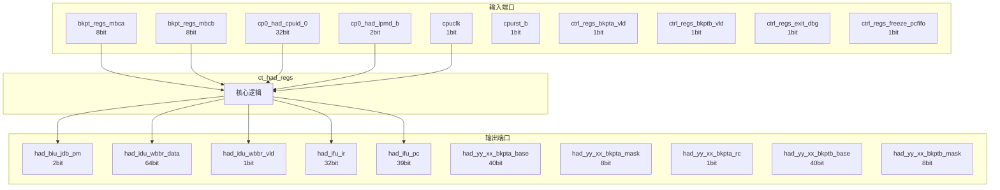

# ct_had_regs 模块设计文档

## 1. 模块概述

### 1.1 基本信息

| 属性 | 值 |
|------|-----|
| 模块名称 | ct_had_regs |
| 文件路径 | had\rtl\ct_had_regs.v |
| 层级 | Level 2 |
| 参数 | ADDRW=`PA_WIDTH, DATAW=64 |

### 1.2 功能描述

ct_had_regs 模块的功能描述。

### 1.3 设计特点

- 包含 25 个 always 块
- 包含 24 个 assign 语句
- 可配置参数: 2 个

## 2. 模块接口说明

### 2.1 输入端口

| 信号名 | 方向 | 位宽 | 描述 |
|--------|------|------|------|
| bkpt_regs_mbca | input | 8 | |
| bkpt_regs_mbcb | input | 8 | |
| cp0_had_cpuid_0 | input | 32 | |
| cp0_had_lpmd_b | input | 2 | |
| cpuclk | input | 1 | |
| cpurst_b | input | 1 | |
| ctrl_regs_bkpta_vld | input | 1 | |
| ctrl_regs_bkptb_vld | input | 1 | |
| ctrl_regs_exit_dbg | input | 1 | |
| ctrl_regs_freeze_pcfifo | input | 1 | |
| ctrl_regs_set_sqa | input | 1 | |
| ctrl_regs_set_sqb | input | 1 | |
| ctrl_regs_update_adro | input | 1 | |
| ctrl_regs_update_dro | input | 1 | |
| ctrl_regs_update_mbo | input | 1 | |
| ctrl_regs_update_pro | input | 1 | |
| ctrl_regs_update_swo | input | 1 | |
| ctrl_regs_update_to | input | 1 | |
| dbgfifo_regs_data | input | 64 | |
| ddc_regs_daddr | input | 64 | |
| ddc_regs_ddata | input | 64 | |
| ddc_regs_ffy | input | 1 | |
| ddc_regs_ir | input | 32 | |
| ddc_regs_update_csr | input | 1 | |
| ddc_regs_update_wbbr | input | 1 | |
| ddc_regs_wbbr | input | 64 | |
| ddc_xx_update_ir | input | 1 | |
| idu_had_iq_empty | input | 1 | |
| idu_had_pipe_stall | input | 1 | |
| idu_had_pipeline_empty | input | 1 | |
| ... | ... | ... | 共72个输入端口 |

### 2.2 输出端口

| 信号名 | 方向 | 位宽 | 描述 |
|--------|------|------|------|
| had_biu_jdb_pm | output | 2 | |
| had_idu_wbbr_data | output | 64 | |
| had_idu_wbbr_vld | output | 1 | |
| had_ifu_ir | output | 32 | |
| had_ifu_pc | output | 39 | |
| had_yy_xx_bkpta_base | output | 40 | |
| had_yy_xx_bkpta_mask | output | 8 | |
| had_yy_xx_bkpta_rc | output | 1 | |
| had_yy_xx_bkptb_base | output | 40 | |
| had_yy_xx_bkptb_mask | output | 8 | |
| had_yy_xx_bkptb_rc | output | 1 | |
| regs_ctrl_adr | output | 1 | |
| regs_ctrl_dr | output | 1 | |
| regs_ctrl_fdb | output | 1 | |
| regs_ctrl_frzc | output | 1 | |
| regs_ctrl_pcfifo_frozen | output | 1 | |
| regs_ctrl_pm | output | 2 | |
| regs_ctrl_sqa | output | 1 | |
| regs_ctrl_sqb | output | 1 | |
| regs_ctrl_sqc | output | 2 | |
| regs_ctrl_tme | output | 1 | |
| regs_event_enter_ie | output | 1 | |
| regs_event_enter_oe | output | 1 | |
| regs_event_exit_ie | output | 1 | |
| regs_event_exit_oe | output | 1 | |
| regs_xx_bca | output | 5 | |
| regs_xx_bcb | output | 5 | |
| regs_xx_ddc_en | output | 1 | |
| regs_xx_nirven | output | 1 | |
| x_regs_serial_data | output | 64 | |

### 2.4 参数列表

| 参数名 | 默认值 | 位宽 | 描述 |
|--------|--------|------|------|
| ADDRW | `PA_WIDTH | 1 | |
| DATAW | 64 | 1 | |

## 3. 模块框图

### 3.1 模块架构图



### 3.2 主要数据连线

无子模块连接。

## 4. 模块实现方案

### 4.1 关键逻辑描述

**Always 块列表:**

```verilog
always @(posedge cpuclk or negedge cpurst_b) begin
  // ...
end
```

```verilog
always @(posedge cpuclk or negedge cpurst_b) begin
  // ...
end
```

```verilog
always @(posedge cpuclk or negedge cpurst_b) begin
  // ...
end
```

```verilog
always @(posedge cpuclk or negedge cpurst_b) begin
  // ...
end
```

```verilog
always @(posedge cpuclk or negedge cpurst_b) begin
  // ...
end
```


**Assign 语句列表:**

| 目标信号 | 源表达式 |
|----------|----------|
| sm_xx_update_dr_en | x_sm_xx_update_dr_en |
| pc_wen | sm_xx_update_dr_en && rtu_yy_xx_dbgon && ir_xx_pc_reg_sel |
| hcr_wen | sm_xx_update_dr_en && ir_xx_hcr_reg_sel |
| hcr_jtgr_int_en | 1'b0 |
| hcr_jtgw_int_en | 1'b0 |
| biu_idle | ifu_had_no_op && lsu_had_no_op |
| cpu_idle | idu_had_pipeline_empty &&
                  lsu_had_no_op &&
                  ifu_had_no_op |
| had_idu_wbbr_vld | ffy && rtu_yy_xx_dbgon |
| regs_ctrl_fdb | fdb |
| regs_ctrl_adr | hcr_reg[21] |
| regs_xx_ddc_en | hcr_reg[20] |
| regs_ctrl_dr | hcr_reg[15] |
| regs_ctrl_tme | hcr_reg[13] |
| regs_ctrl_frzc | hcr_reg[12] |
| regs_xx_nirven | hcr_reg[31] |
| ... | 共24条assign语句 |

## 5. 内部关键信号列表

### 5.1 寄存器信号

| 信号名 | 位宽 | 描述 |
|--------|------|------|
| adro | 1 | |
| baba_reg | 64 | |
| babb_reg | 64 | |
| bama_reg | 8 | |
| bamb_reg | 8 | |
| bus_dead | 1 | |
| dro | 1 | |
| event_ent_ie | 1 | |
| event_ent_oe | 1 | |
| event_exit_ie | 1 | |
| event_exit_oe | 1 | |
| exe_dead | 1 | |
| fdb | 1 | |
| ffy | 1 | |
| frzo | 1 | |
| hcr_adr | 1 | |
| hcr_bca | 5 | |
| hcr_bcb | 5 | |
| hcr_ddcen | 1 | |
| hcr_dr | 1 | |
| ... | ... | 共44个寄存器信号 |

### 5.2 线网信号

| 信号名 | 位宽 | 描述 |
|--------|------|------|
| biu_idle | 1 | |
| cpu_idle | 1 | |
| csr_reg | 16 | |
| event_ie_reg | 32 | |
| event_oe_reg | 32 | |
| hcr_jtgr_int_en | 1 | |
| hcr_jtgw_int_en | 1 | |
| hcr_reg | 32 | |
| hcr_wen | 1 | |
| hsr_reg | 32 | |
| id_reg | 32 | |
| mbir_reg | 32 | |
| pc_reg | 64 | |
| pc_wen | 1 | |
| regs_data_out | 64 | |
| sm_xx_update_dr_en | 1 | |

## 6. 子模块方案

无子模块。

## 7. 修订历史

| 版本 | 日期 | 作者 | 说明 |
|------|------|------|------|
| 1.0 | 2026-03-12 | Auto-generated | 初始版本 |
