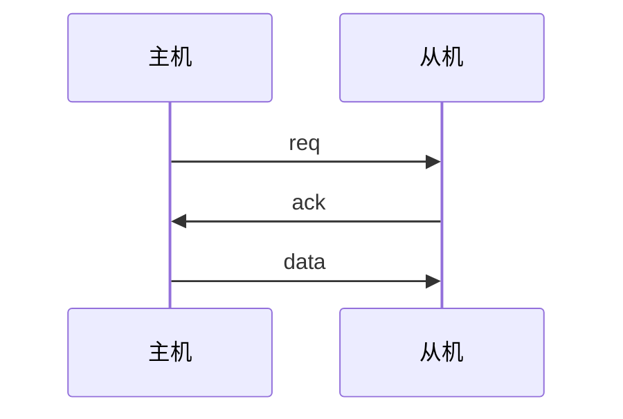
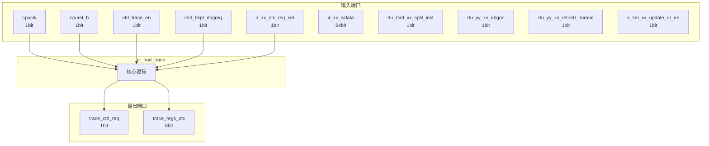

# ct_had_trace 模块设计文档

## 1. 模块概述

### 1.1 基本信息

| 属性 | 值 |
|------|-----|
| 模块名称 | ct_had_trace |
| 文件路径 | had\rtl\ct_had_trace.v |
| 层级 | Level 2 |

### 1.2 功能描述

硬件调试 (Hardware Debug)，(跟踪)，主要信号: 使能信号、读使能、时钟信号、数据信号、指令信号

### 1.3 设计特点

- 包含 1 个 always 块
- 包含 4 个 assign 语句

## 2. 模块接口说明

### 2.1 输入端口

| 信号名 | 方向 | 位宽 | 描述 |
|--------|------|------|------|
| cpuclk | input | 1 | 时钟信号 |
| cpurst_b | input | 1 | 复位信号 |
| ctrl_trace_en | input | 1 | 使能信号 |
| inst_bkpt_dbgreq | input | 1 | 请求信号 |
| ir_xx_otc_reg_sel | input | 1 | 读使能 |
| ir_xx_wdata | input | 64 | 数据信号 |
| rtu_had_xx_split_inst | input | 1 | 指令信号 |
| rtu_yy_xx_dbgon | input | 1 |  |
| rtu_yy_xx_retire0_normal | input | 1 | 读使能 |
| x_sm_xx_update_dr_en | input | 1 | 使能信号 |

### 2.2 输出端口

| 信号名 | 方向 | 位宽 | 描述 |
|--------|------|------|------|
| trace_ctrl_req | output | 1 | 请求信号 |
| trace_regs_otc | output | 8 | 读使能 |

### 2.5 接口时序图



## 3. 模块框图

### 3.1 模块架构图



### 3.2 主要数据连线

无子模块连接。

## 4. 模块实现方案

### 4.1 关键逻辑描述

**Always 块列表:**

```verilog
always @(posedge cpuclk or negedge cpurst_b) begin
  // ...
end
```


**Assign 语句列表:**

| 目标信号 | 源表达式 |
|----------|----------|
| trace_vld | rtu_yy_xx_retire0_normal &&
                  !rtu_had_xx_split_inst &&
                  !rtu_yy_xx_dbgon &&
                   ctrl_trace_en |
| trace_counter_eq_0 | trace_counter[7:0] == 8'b0 |
| trace_counter_dec | trace_vld && !trace_counter_eq_0 && !inst_bkpt_dbgreq |
| trace_ctrl_req | trace_vld && trace_counter_eq_0 |

## 5. 内部关键信号列表

### 5.1 寄存器信号

| 信号名 | 位宽 | 描述 |
|--------|------|------|
| trace_counter | 8 | |

### 5.2 线网信号

| 信号名 | 位宽 | 描述 |
|--------|------|------|
| trace_counter_dec | 1 | |
| trace_counter_eq_0 | 1 | |
| trace_vld | 1 | |

## 6. 子模块方案

无子模块。

## 7. 修订历史

| 版本 | 日期 | 作者 | 说明 |
|------|------|------|------|
| 1.0 | 2026-03-12 | Auto-generated | 初始版本 |
