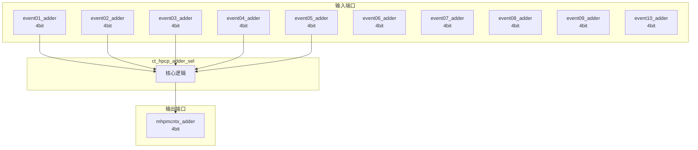

# ct_hpcp_adder_sel 模块设计文档

## 1. 模块概述

### 1.1 基本信息

| 属性 | 值 |
|------|-----|
| 模块名称 | ct_hpcp_adder_sel |
| 文件路径 | pmu\rtl\ct_hpcp_adder_sel.v |
| 层级 | Level 2 |

### 1.2 功能描述

ct_hpcp_adder_sel 模块的功能描述。

### 1.3 设计特点

- 包含 1 个 always 块

## 2. 模块接口说明

### 2.1 输入端口

| 信号名 | 方向 | 位宽 | 描述 |
|--------|------|------|------|
| event01_adder | input | 4 | |
| event02_adder | input | 4 | |
| event03_adder | input | 4 | |
| event04_adder | input | 4 | |
| event05_adder | input | 4 | |
| event06_adder | input | 4 | |
| event07_adder | input | 4 | |
| event08_adder | input | 4 | |
| event09_adder | input | 4 | |
| event10_adder | input | 4 | |
| event11_adder | input | 4 | |
| event12_adder | input | 4 | |
| event13_adder | input | 4 | |
| event14_adder | input | 4 | |
| event15_adder | input | 4 | |
| event16_adder | input | 4 | |
| event17_adder | input | 4 | |
| event18_adder | input | 4 | |
| event19_adder | input | 4 | |
| event20_adder | input | 4 | |
| event21_adder | input | 4 | |
| event22_adder | input | 4 | |
| event23_adder | input | 4 | |
| event24_adder | input | 4 | |
| event25_adder | input | 4 | |
| event26_adder | input | 4 | |
| event27_adder | input | 4 | |
| event28_adder | input | 4 | |
| event29_adder | input | 4 | |
| event30_adder | input | 4 | |
| ... | ... | ... | 共43个输入端口 |

### 2.2 输出端口

| 信号名 | 方向 | 位宽 | 描述 |
|--------|------|------|------|
| mhpmcntx_adder | output | 4 | |

## 3. 模块框图

### 3.1 模块架构图



### 3.2 主要数据连线

无子模块连接。

## 4. 模块实现方案

### 4.1 关键逻辑描述

**Always 块列表:**

```verilog
always @(event03_adder[3:0]
       or event27_adder[3:0]
       or event36_adder[3:0]
       or event38_adder[3:0]
       or event35_adder[3:0]
       or event22_adder[3:0]
       or event28_adder[3:0]
       or event31_adder[3:0]
       or event15_adder[3:0]
       or event19_adder[3:0]
       or event09_adder[3:0]
       or event42_adder[3:0]
       or event37_adder[3:0]
       or event14_adder[3:0]
       or event12_adder[3:0]
       or event04_adder[3:0]
       or event23_adder[3:0]
       or event39_adder[3:0]
       or event01_adder[3:0]
       or event18_adder[3:0]
       or event06_adder[3:0]
       or event16_adder[3:0]
       or event07_adder[3:0]
       or event21_adder[3:0]
       or event08_adder[3:0]
       or event02_adder[3:0]
       or event11_adder[3:0]
       or event13_adder[3:0]
       or event05_adder[3:0]
       or event29_adder[3:0]
       or event41_adder[3:0]
       or event20_adder[3:0]
       or event40_adder[3:0]
       or event10_adder[3:0]
       or event33_adder[3:0]
       or mhpmevtx_value[5:0]
       or event17_adder[3:0]
       or event24_adder[3:0]
       or event34_adder[3:0]
       or event32_adder[3:0]
       or event25_adder[3:0]
       or event26_adder[3:0]
       or event30_adder[3:0]) begin
  // ...
end
```


## 5. 内部关键信号列表

### 5.1 寄存器信号

无寄存器信号。

### 5.2 线网信号

无线网信号。

## 6. 子模块方案

无子模块。

## 7. 修订历史

| 版本 | 日期 | 作者 | 说明 |
|------|------|------|------|
| 1.0 | 2026-03-12 | Auto-generated | 初始版本 |
