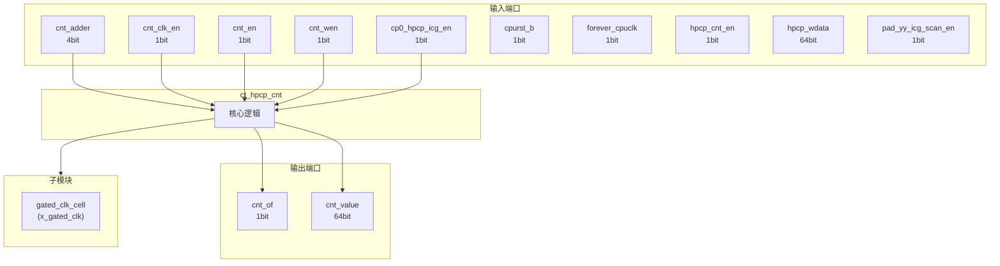
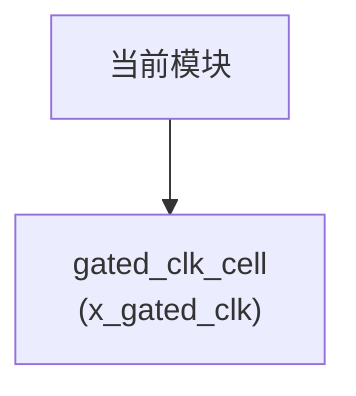

# ct_hpcp_cnt 模块设计文档

## 1. 模块概述

### 1.1 基本信息

| 属性 | 值 |
|------|-----|
| 模块名称 | ct_hpcp_cnt |
| 文件路径 | pmu\rtl\ct_hpcp_cnt.v |
| 层级 | Level 2 |

### 1.2 功能描述

ct_hpcp_cnt 模块的功能描述。

### 1.3 设计特点

- 包含 1 个子模块实例
- 包含 3 个 always 块
- 包含 2 个 assign 语句

## 2. 模块接口说明

### 2.1 输入端口

| 信号名 | 方向 | 位宽 | 描述 |
|--------|------|------|------|
| cnt_adder | input | 4 | |
| cnt_clk_en | input | 1 | |
| cnt_en | input | 1 | |
| cnt_wen | input | 1 | |
| cp0_hpcp_icg_en | input | 1 | |
| cpurst_b | input | 1 | |
| forever_cpuclk | input | 1 | |
| hpcp_cnt_en | input | 1 | |
| hpcp_wdata | input | 64 | |
| pad_yy_icg_scan_en | input | 1 | |

### 2.2 输出端口

| 信号名 | 方向 | 位宽 | 描述 |
|--------|------|------|------|
| cnt_of | output | 1 | |
| cnt_value | output | 64 | |

## 3. 模块框图

### 3.1 模块架构图



### 3.2 主要数据连线

| 源模块 | 目标模块 | 信号名 | 位宽 | 说明 |
|--------|----------|--------|------|------|
| ct_hpcp_cnt | gated_clk_cell | clk_in | - | |
| ct_hpcp_cnt | gated_clk_cell | clk_out | - | |
| ct_hpcp_cnt | gated_clk_cell | external_en | - | |

## 4. 模块实现方案

### 4.1 关键逻辑描述

**Always 块列表:**

```verilog
always @(posedge cnt_clk or negedge cpurst_b) begin
  // ...
end
```

```verilog
always @(posedge cnt_clk or negedge cpurst_b) begin
  // ...
end
```

```verilog
always @(posedge cnt_clk or negedge cpurst_b) begin
  // ...
end
```


**Assign 语句列表:**

| 目标信号 | 源表达式 |
|----------|----------|
| clk_en | cnt_clk_en || cnt_en_ff |
| cnt_of | cnt_overflow |

## 5. 内部关键信号列表

### 5.1 寄存器信号

| 信号名 | 位宽 | 描述 |
|--------|------|------|
| cnt_adder_ff | 4 | |
| cnt_en_ff | 1 | |
| cnt_overflow | 1 | |
| counter | 64 | |

### 5.2 线网信号

| 信号名 | 位宽 | 描述 |
|--------|------|------|
| clk_en | 1 | |
| cnt_clk | 1 | |
| counter_adder | 65 | |

## 6. 子模块方案

### 6.1 模块例化层次结构



### 6.2 子模块列表

| 层级 | 模块名 | 实例名 | 功能描述 |
|------|--------|--------|----------|
| 1 | gated_clk_cell | x_gated_clk | |

## 7. 修订历史

| 版本 | 日期 | 作者 | 说明 |
|------|------|------|------|
| 1.0 | 2026-03-12 | Auto-generated | 初始版本 |
