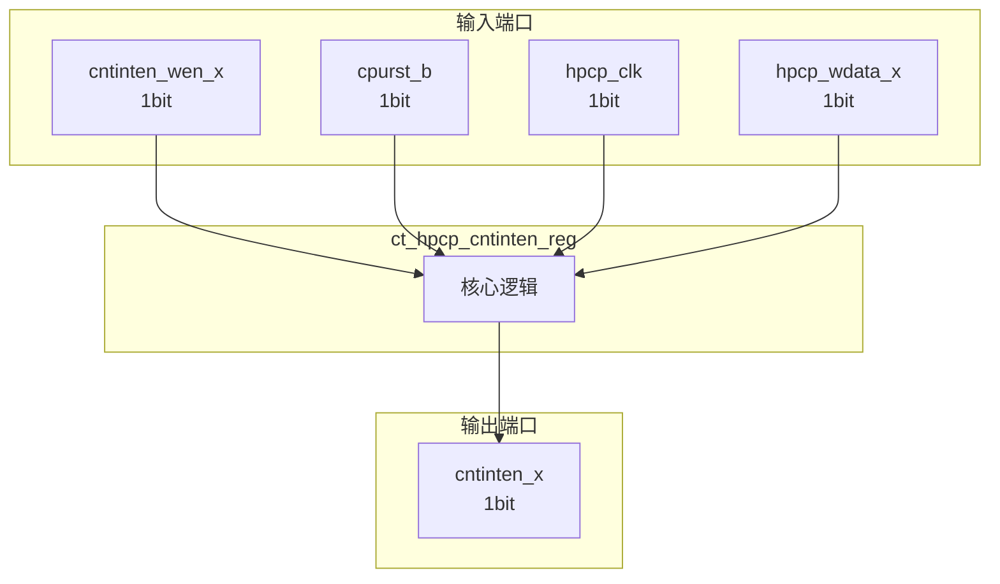

# ct_hpcp_cntinten_reg 模块设计文档

## 1. 模块概述

### 1.1 基本信息

| 属性 | 值 |
|------|-----|
| 模块名称 | ct_hpcp_cntinten_reg |
| 文件路径 | pmu\rtl\ct_hpcp_cntinten_reg.v |
| 层级 | Level 2 |

### 1.2 功能描述

ct_hpcp_cntinten_reg 模块的功能描述。

### 1.3 设计特点

- 包含 1 个 always 块

## 2. 模块接口说明

### 2.1 输入端口

| 信号名 | 方向 | 位宽 | 描述 |
|--------|------|------|------|
| cntinten_wen_x | input | 1 | |
| cpurst_b | input | 1 | |
| hpcp_clk | input | 1 | |
| hpcp_wdata_x | input | 1 | |

### 2.2 输出端口

| 信号名 | 方向 | 位宽 | 描述 |
|--------|------|------|------|
| cntinten_x | output | 1 | |

## 3. 模块框图

### 3.1 模块架构图



### 3.2 主要数据连线

无子模块连接。

## 4. 模块实现方案

### 4.1 关键逻辑描述

**Always 块列表:**

```verilog
always @(posedge hpcp_clk or negedge cpurst_b) begin
  // ...
end
```


## 5. 内部关键信号列表

### 5.1 寄存器信号

无寄存器信号。

### 5.2 线网信号

无线网信号。

## 6. 子模块方案

无子模块。

## 7. 修订历史

| 版本 | 日期 | 作者 | 说明 |
|------|------|------|------|
| 1.0 | 2026-03-12 | Auto-generated | 初始版本 |
