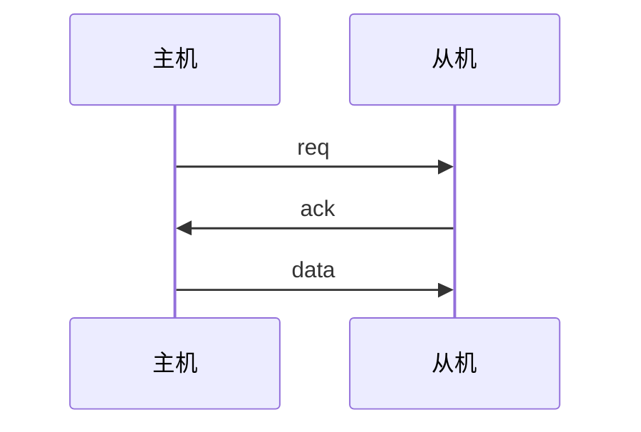
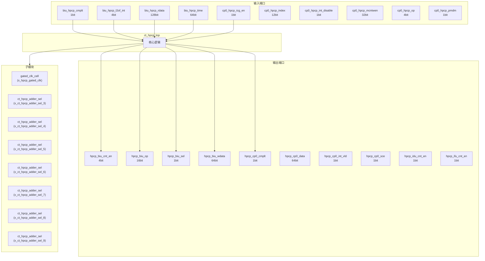

# ct_hpcp_top 模块设计文档

## 1. 模块概述

### 1.1 基本信息

| 属性 | 值 |
|------|-----|
| 模块名称 | ct_hpcp_top |
| 文件路径 | pmu\rtl\ct_hpcp_top.v |
| 层级 | Level 1 |
| 参数 | HPMCNT_NUM=42, HPMEVT_WIDTH=6, MCNTINHBT=12'h320, MCNTWEN=12'h7C9, MCNTINTEN=12'h7CA... |

### 1.2 功能描述

硬件性能计数器 (Hardware Performance Counter)，主要信号: 复位信号、使能信号、选择信号、时钟信号、数据信号

### 1.3 设计特点

- 包含 113 个子模块实例
- 包含 14 个 always 块
- 包含 299 个 assign 语句
- 可配置参数: 140 个

## 2. 模块接口说明

### 2.1 输入端口

| 信号名 | 方向 | 位宽 | 描述 |
|--------|------|------|------|
| biu_hpcp_cmplt | input | 1 | 程序计数器 |
| biu_hpcp_l2of_int | input | 4 | 程序计数器 |
| biu_hpcp_rdata | input | 128 | 数据信号 |
| biu_hpcp_time | input | 64 | 程序计数器 |
| cp0_hpcp_icg_en | input | 1 | 使能信号 |
| cp0_hpcp_index | input | 12 | 索引信号 |
| cp0_hpcp_int_disable | input | 1 | 程序计数器 |
| cp0_hpcp_mcntwen | input | 32 | 使能信号 |
| cp0_hpcp_op | input | 4 | 程序计数器 |
| cp0_hpcp_pmdm | input | 1 | 程序计数器 |
| cp0_hpcp_pmds | input | 1 | 程序计数器 |
| cp0_hpcp_pmdu | input | 1 | 程序计数器 |
| cp0_hpcp_sel | input | 1 | 选择信号 |
| cp0_hpcp_src0 | input | 64 | 程序计数器 |
| cp0_hpcp_wdata | input | 64 | 数据信号 |
| cp0_yy_priv_mode | input | 2 |  |
| cpurst_b | input | 1 | 复位信号 |
| forever_cpuclk | input | 1 | 时钟信号 |
| idu_hpcp_backend_stall | input | 1 | 应答信号 |
| idu_hpcp_fence_sync_vld | input | 1 | 有效信号 |
| idu_hpcp_ir_inst0_type | input | 7 | 程序计数器 |
| idu_hpcp_ir_inst0_vld | input | 1 | 有效信号 |
| idu_hpcp_ir_inst1_type | input | 7 | 程序计数器 |
| idu_hpcp_ir_inst1_vld | input | 1 | 有效信号 |
| idu_hpcp_ir_inst2_type | input | 7 | 程序计数器 |
| idu_hpcp_ir_inst2_vld | input | 1 | 有效信号 |
| idu_hpcp_ir_inst3_type | input | 7 | 程序计数器 |
| idu_hpcp_ir_inst3_vld | input | 1 | 有效信号 |
| idu_hpcp_rf_inst_vld | input | 1 | 有效信号 |
| idu_hpcp_rf_pipe0_inst_vld | input | 1 | 有效信号 |
| ... | ... | ... | 共108个输入端口 |

### 2.2 输出端口

| 信号名 | 方向 | 位宽 | 描述 |
|--------|------|------|------|
| hpcp_biu_cnt_en | output | 4 | 使能信号 |
| hpcp_biu_op | output | 16 | 程序计数器 |
| hpcp_biu_sel | output | 1 | 选择信号 |
| hpcp_biu_wdata | output | 64 | 数据信号 |
| hpcp_cp0_cmplt | output | 1 | 程序计数器 |
| hpcp_cp0_data | output | 64 | 数据信号 |
| hpcp_cp0_int_vld | output | 1 | 有效信号 |
| hpcp_cp0_sce | output | 1 | 程序计数器 |
| hpcp_idu_cnt_en | output | 1 | 使能信号 |
| hpcp_ifu_cnt_en | output | 1 | 使能信号 |
| hpcp_lsu_cnt_en | output | 1 | 使能信号 |
| hpcp_mmu_cnt_en | output | 1 | 使能信号 |
| hpcp_rtu_cnt_en | output | 1 | 使能信号 |

### 2.4 参数列表

| 参数名 | 默认值 | 位宽 | 描述 |
|--------|--------|------|------|
| HPMCNT_NUM | 42 | 1 | |
| HPMEVT_WIDTH | 6 | 1 | |
| MCNTINHBT | 12'h320 | 1 | |
| MCNTWEN | 12'h7C9 | 1 | |
| MCNTINTEN | 12'h7CA | 1 | |
| MCNTOF | 12'h7CB | 1 | |
| MHPMCR | 12'h7F0 | 1 | |
| MHPMSP | 12'h7F1 | 1 | |
| MHPMEP | 12'h7F2 | 1 | |
| MHPMEVT3 | 12'h323 | 1 | |
| MHPMEVT4 | 12'h324 | 1 | |
| MHPMEVT5 | 12'h325 | 1 | |
| MHPMEVT6 | 12'h326 | 1 | |
| MHPMEVT7 | 12'h327 | 1 | |
| MHPMEVT8 | 12'h328 | 1 | |
| MHPMEVT9 | 12'h329 | 1 | |
| MHPMEVT10 | 12'h32A | 1 | |
| MHPMEVT11 | 12'h32B | 1 | |
| MHPMEVT12 | 12'h32C | 1 | |
| MHPMEVT13 | 12'h32D | 1 | |
| MHPMEVT14 | 12'h32E | 1 | |
| MHPMEVT15 | 12'h32F | 1 | |
| MHPMEVT16 | 12'h330 | 1 | |
| MHPMEVT17 | 12'h331 | 1 | |
| MHPMEVT18 | 12'h332 | 1 | |
| MHPMEVT19 | 12'h333 | 1 | |
| MHPMEVT20 | 12'h334 | 1 | |
| MHPMEVT21 | 12'h335 | 1 | |
| MHPMEVT22 | 12'h336 | 1 | |
| MHPMEVT23 | 12'h337 | 1 | |
| MHPMEVT24 | 12'h338 | 1 | |
| MHPMEVT25 | 12'h339 | 1 | |
| MHPMEVT26 | 12'h33A | 1 | |
| MHPMEVT27 | 12'h33B | 1 | |
| MHPMEVT28 | 12'h33C | 1 | |
| MHPMEVT29 | 12'h33D | 1 | |
| MHPMEVT30 | 12'h33E | 1 | |
| MHPMEVT31 | 12'h33F | 1 | |
| MCYCLE | 12'hB00 | 1 | |
| MINSTRET | 12'hB02 | 1 | |
| MHPMCNT3 | 12'hB03 | 1 | |
| MHPMCNT4 | 12'hB04 | 1 | |
| MHPMCNT5 | 12'hB05 | 1 | |
| MHPMCNT6 | 12'hB06 | 1 | |
| MHPMCNT7 | 12'hB07 | 1 | |
| MHPMCNT8 | 12'hB08 | 1 | |
| MHPMCNT9 | 12'hB09 | 1 | |
| MHPMCNT10 | 12'hB0A | 1 | |
| MHPMCNT11 | 12'hB0B | 1 | |
| MHPMCNT12 | 12'hB0C | 1 | |
| MHPMCNT13 | 12'hB0D | 1 | |
| MHPMCNT14 | 12'hB0E | 1 | |
| MHPMCNT15 | 12'hB0F | 1 | |
| MHPMCNT16 | 12'hB10 | 1 | |
| MHPMCNT17 | 12'hB11 | 1 | |
| MHPMCNT18 | 12'hB12 | 1 | |
| MHPMCNT19 | 12'hB13 | 1 | |
| MHPMCNT20 | 12'hB14 | 1 | |
| MHPMCNT21 | 12'hB15 | 1 | |
| MHPMCNT22 | 12'hB16 | 1 | |
| MHPMCNT23 | 12'hB17 | 1 | |
| MHPMCNT24 | 12'hB18 | 1 | |
| MHPMCNT25 | 12'hB19 | 1 | |
| MHPMCNT26 | 12'hB1A | 1 | |
| MHPMCNT27 | 12'hB1B | 1 | |
| MHPMCNT28 | 12'hB1C | 1 | |
| MHPMCNT29 | 12'hB1D | 1 | |
| MHPMCNT30 | 12'hB1E | 1 | |
| MHPMCNT31 | 12'hB1F | 1 | |
| SCNTINTEN | 12'h5C4 | 1 | |
| SCNTOF | 12'h5C5 | 1 | |
| SCNTINHBT | 12'h5C8 | 1 | |
| SHPMCR | 12'h5C9 | 1 | |
| SHPMSP | 12'h5CA | 1 | |
| SHPMEP | 12'h5CB | 1 | |
| SCYCLE | 12'h5E0 | 1 | |
| SINSTRET | 12'h5E2 | 1 | |
| SHPMCNT3 | 12'h5E3 | 1 | |
| SHPMCNT4 | 12'h5E4 | 1 | |
| SHPMCNT5 | 12'h5E5 | 1 | |
| SHPMCNT6 | 12'h5E6 | 1 | |
| SHPMCNT7 | 12'h5E7 | 1 | |
| SHPMCNT8 | 12'h5E8 | 1 | |
| SHPMCNT9 | 12'h5E9 | 1 | |
| SHPMCNT10 | 12'h5EA | 1 | |
| SHPMCNT11 | 12'h5EB | 1 | |
| SHPMCNT12 | 12'h5EC | 1 | |
| SHPMCNT13 | 12'h5ED | 1 | |
| SHPMCNT14 | 12'h5EE | 1 | |
| SHPMCNT15 | 12'h5EF | 1 | |
| SHPMCNT16 | 12'h5F0 | 1 | |
| SHPMCNT17 | 12'h5F1 | 1 | |
| SHPMCNT18 | 12'h5F2 | 1 | |
| SHPMCNT19 | 12'h5F3 | 1 | |
| SHPMCNT20 | 12'h5F4 | 1 | |
| SHPMCNT21 | 12'h5F5 | 1 | |
| SHPMCNT22 | 12'h5F6 | 1 | |
| SHPMCNT23 | 12'h5F7 | 1 | |
| SHPMCNT24 | 12'h5F8 | 1 | |
| SHPMCNT25 | 12'h5F9 | 1 | |
| SHPMCNT26 | 12'h5FA | 1 | |
| SHPMCNT27 | 12'h5FB | 1 | |
| SHPMCNT28 | 12'h5FC | 1 | |
| SHPMCNT29 | 12'h5FD | 1 | |
| SHPMCNT30 | 12'h5FE | 1 | |
| SHPMCNT31 | 12'h5FF | 1 | |
| CYCLE | 12'hC00 | 1 | |
| TIME | 12'hC01 | 1 | |
| INSTRET | 12'hC02 | 1 | |
| HPMCNT3 | 12'hC03 | 1 | |
| HPMCNT4 | 12'hC04 | 1 | |
| HPMCNT5 | 12'hC05 | 1 | |
| HPMCNT6 | 12'hC06 | 1 | |
| HPMCNT7 | 12'hC07 | 1 | |
| HPMCNT8 | 12'hC08 | 1 | |
| HPMCNT9 | 12'hC09 | 1 | |
| HPMCNT10 | 12'hC0A | 1 | |
| HPMCNT11 | 12'hC0B | 1 | |
| HPMCNT12 | 12'hC0C | 1 | |
| HPMCNT13 | 12'hC0D | 1 | |
| HPMCNT14 | 12'hC0E | 1 | |
| HPMCNT15 | 12'hC0F | 1 | |
| HPMCNT16 | 12'hC10 | 1 | |
| HPMCNT17 | 12'hC11 | 1 | |
| HPMCNT18 | 12'hC12 | 1 | |
| HPMCNT19 | 12'hC13 | 1 | |
| HPMCNT20 | 12'hC14 | 1 | |
| HPMCNT21 | 12'hC15 | 1 | |
| HPMCNT22 | 12'hC16 | 1 | |
| HPMCNT23 | 12'hC17 | 1 | |
| HPMCNT24 | 12'hC18 | 1 | |
| HPMCNT25 | 12'hC19 | 1 | |
| HPMCNT26 | 12'hC1A | 1 | |
| HPMCNT27 | 12'hC1B | 1 | |
| HPMCNT28 | 12'hC1C | 1 | |
| HPMCNT29 | 12'hC1D | 1 | |
| HPMCNT30 | 12'hC1E | 1 | |
| HPMCNT31 | 12'hC1F | 1 | |
| EX1 | 2'b01 | 1 | |
| EX2 | 2'b10 | 1 | |

### 2.5 接口时序图



## 3. 模块框图

### 3.1 模块架构图



### 3.2 主要数据连线

| 源模块 | 目标模块 | 信号名 | 位宽 | 说明 |
|--------|----------|--------|------|------|
| ct_hpcp_top | gated_clk_cell | clk_in | - | |
| ct_hpcp_top | gated_clk_cell | clk_out | - | |
| ct_hpcp_top | gated_clk_cell | external_en | - | |
| ct_hpcp_top | ct_hpcp_adder_sel | event01_adder | - | |
| ct_hpcp_top | ct_hpcp_adder_sel | event02_adder | - | |
| ct_hpcp_top | ct_hpcp_adder_sel | event03_adder | - | |
| ct_hpcp_top | ct_hpcp_adder_sel | event01_adder | - | |
| ct_hpcp_top | ct_hpcp_adder_sel | event02_adder | - | |
| ct_hpcp_top | ct_hpcp_adder_sel | event03_adder | - | |
| ct_hpcp_top | ct_hpcp_adder_sel | event01_adder | - | |
| ct_hpcp_top | ct_hpcp_adder_sel | event02_adder | - | |
| ct_hpcp_top | ct_hpcp_adder_sel | event03_adder | - | |
| ct_hpcp_top | ct_hpcp_adder_sel | event01_adder | - | |
| ct_hpcp_top | ct_hpcp_adder_sel | event02_adder | - | |
| ct_hpcp_top | ct_hpcp_adder_sel | event03_adder | - | |
| ct_hpcp_top | ct_hpcp_adder_sel | event01_adder | - | |
| ct_hpcp_top | ct_hpcp_adder_sel | event02_adder | - | |
| ct_hpcp_top | ct_hpcp_adder_sel | event03_adder | - | |
| ct_hpcp_top | ct_hpcp_adder_sel | event01_adder | - | |
| ct_hpcp_top | ct_hpcp_adder_sel | event02_adder | - | |
| ct_hpcp_top | ct_hpcp_adder_sel | event03_adder | - | |
| ct_hpcp_top | ct_hpcp_adder_sel | event01_adder | - | |
| ct_hpcp_top | ct_hpcp_adder_sel | event02_adder | - | |
| ct_hpcp_top | ct_hpcp_adder_sel | event03_adder | - | |
| ct_hpcp_top | ct_hpcp_adder_sel | event01_adder | - | |
| ct_hpcp_top | ct_hpcp_adder_sel | event02_adder | - | |
| ct_hpcp_top | ct_hpcp_adder_sel | event03_adder | - | |
| ct_hpcp_top | ct_hpcp_adder_sel | event01_adder | - | |
| ct_hpcp_top | ct_hpcp_adder_sel | event02_adder | - | |
| ct_hpcp_top | ct_hpcp_adder_sel | event03_adder | - | |

## 4. 模块实现方案

### 4.1 关键逻辑描述

**Always 块列表:**

```verilog
always @(posedge hpcp_clk or negedge cpurst_b) begin
  // ...
end
```

```verilog
always @(cur_state[1:0]
       or hpcp_cp0_cmplt
       or cp0_hpcp_sel) begin
  // ...
end
```

```verilog
always @(posedge hpcp_clk or negedge cpurst_b) begin
  // ...
end
```

```verilog
always @(posedge hpcp_clk or negedge cpurst_b) begin
  // ...
end
```

```verilog
always @(posedge forever_cpuclk or negedge cpurst_b) begin
  // ...
end
```


**Assign 语句列表:**

| 目标信号 | 源表达式 |
|----------|----------|
| hpcp_clk_en | mcntinhbt_clk_en 
                  || mcntinten_clk_en 
                  || mhpmcr_clk_en
                  || mhpmsp_clk_en
                  || mhpmep_clk_en
                  || scntinhbt_clk_en
                  || scntinten_clk_en
                  || shpmcr_clk_en
                  || shpmsp_clk_en
                  || shpmep_clk_en
                  || mcntof_clk_en
                  || scntof_clk_en
                  || biu_hpcp_cmplt
                  || l2of_int_updt_vld
                  || l2of_data_updt_vld  
                  || cp0_hpcp_sel
                  || hpcp_cp0_cmplt
                  || rtu_yy_xx_flush
                  || (|counter_overflow[31:0])
                  || (cnt_mode_dis_pre^cnt_mode_dis) |
| hpcp_retire_inst0_vld | rtu_hpcp_inst0_vld |
| hpcp_retire_inst1_vld | rtu_hpcp_inst1_vld |
| hpcp_retire_inst2_vld | rtu_hpcp_inst2_vld |
| hpcp_retire_inst0_split | rtu_hpcp_inst0_split |
| hpcp_retire_inst1_split | rtu_hpcp_inst1_split |
| hpcp_retire_inst2_split | rtu_hpcp_inst2_split |
| hpcp_retire_inst0_condbr | rtu_hpcp_inst0_condbr |
| hpcp_retire_inst1_condbr | rtu_hpcp_inst1_condbr |
| hpcp_retire_inst2_condbr | rtu_hpcp_inst2_condbr |
| hpcp_retire_inst0_jmp | rtu_hpcp_inst0_jmp |
| hpcp_retire_inst1_jmp | rtu_hpcp_inst1_jmp |
| hpcp_retire_inst2_jmp | rtu_hpcp_inst2_jmp |
| hpcp_retire_bht_mispred | rtu_hpcp_inst0_bht_mispred |
| hpcp_retire_jmp_mispred | rtu_hpcp_inst0_jmp_mispred |
| ... | 共299条assign语句 |

## 5. 内部关键信号列表

### 5.1 寄存器信号

| 信号名 | 位宽 | 描述 |
|--------|------|------|
| biu_hpcp_l2of_int_ff | 4 | |
| cnt0_event_index | 6 | |
| cnt1_event_index | 6 | |
| cnt2_event_index | 6 | |
| cnt3_event_index | 6 | |
| cnt_mask | 32 | |
| cnt_mode_dis | 1 | |
| cur_state | 2 | |
| cy | 1 | |
| data_out | 64 | |
| hpcp_stop_vld_ff | 1 | |
| hpm | 29 | |
| hpmep_high_vld | 1 | |
| hpmep_reg | 63 | |
| hpmsp_high_vld | 1 | |
| hpmsp_reg | 63 | |
| ir | 1 | |
| l2cnt_cmplt_ff | 1 | |
| l2of_data | 32 | |
| l2of_int | 32 | |
| ... | ... | 共86个寄存器信号 |

### 5.2 线网信号

| 信号名 | 位宽 | 描述 |
|--------|------|------|
| bht_mispred | 1 | |
| cnt0_event_index_clr_data | 6 | |
| cnt0_event_index_set_data | 6 | |
| cnt1_event_index_clr_data | 6 | |
| cnt1_event_index_set_data | 6 | |
| cnt2_event_index_clr_data | 6 | |
| cnt2_event_index_set_data | 6 | |
| cnt3_event_index_clr_data | 6 | |
| cnt3_event_index_set_data | 6 | |
| cnt_bit_mask | 32 | |
| cnt_bit_sel | 32 | |
| cnt_index_less_than_limit | 1 | |
| cnt_mask_clr | 1 | |
| cnt_mask_clr_data | 32 | |
| cnt_mask_set | 1 | |
| cnt_mask_set_data | 32 | |
| cnt_mode_dis_pre | 1 | |
| cntinten | 32 | |
| cntinten_value | 64 | |
| cntinten_wen | 32 | |
| ... | ... | 共486个线网信号 |

## 6. 子模块方案

### 6.1 模块例化层次结构

```mermaid
graph TD
    ROOT["当前模块"]
    N0["gated_clk_cell\n(x_hpcp_gated_clk)"]
    ROOT --> N0
    N1["ct_hpcp_adder_sel\n(x_ct_hpcp_adder_sel_3)"]
    ROOT --> N1
    N2["ct_hpcp_adder_sel\n(x_ct_hpcp_adder_sel_4)"]
    ROOT --> N2
    N3["ct_hpcp_adder_sel\n(x_ct_hpcp_adder_sel_5)"]
    ROOT --> N3
    N4["ct_hpcp_adder_sel\n(x_ct_hpcp_adder_sel_6)"]
    ROOT --> N4
    N5["ct_hpcp_adder_sel\n(x_ct_hpcp_adder_sel_7)"]
    ROOT --> N5
    N6["ct_hpcp_adder_sel\n(x_ct_hpcp_adder_sel_8)"]
    ROOT --> N6
    N7["ct_hpcp_adder_sel\n(x_ct_hpcp_adder_sel_9)"]
    ROOT --> N7
    N8["ct_hpcp_adder_sel\n(x_ct_hpcp_adder_sel_10)"]
    ROOT --> N8
    N9["ct_hpcp_adder_sel\n(x_ct_hpcp_adder_sel_11)"]
    ROOT --> N9
    N10["ct_hpcp_adder_sel\n(x_ct_hpcp_adder_sel_12)"]
    ROOT --> N10
    N11["ct_hpcp_adder_sel\n(x_ct_hpcp_adder_sel_13)"]
    ROOT --> N11
    N12["ct_hpcp_adder_sel\n(x_ct_hpcp_adder_sel_14)"]
    ROOT --> N12
    N13["ct_hpcp_adder_sel\n(x_ct_hpcp_adder_sel_15)"]
    ROOT --> N13
    N14["ct_hpcp_adder_sel\n(x_ct_hpcp_adder_sel_16)"]
    ROOT --> N14
```



### 6.2 子模块列表

| 层级 | 模块名 | 实例名 | 功能描述 |
|------|--------|--------|----------|
| 1 | gated_clk_cell | x_hpcp_gated_clk |  |
| 1 | ct_hpcp_adder_sel | x_ct_hpcp_adder_sel_3 | 硬件性能计数器 |
| 1 | ct_hpcp_adder_sel | x_ct_hpcp_adder_sel_4 | 硬件性能计数器 |
| 1 | ct_hpcp_adder_sel | x_ct_hpcp_adder_sel_5 | 硬件性能计数器 |
| 1 | ct_hpcp_adder_sel | x_ct_hpcp_adder_sel_6 | 硬件性能计数器 |
| 1 | ct_hpcp_adder_sel | x_ct_hpcp_adder_sel_7 | 硬件性能计数器 |
| 1 | ct_hpcp_adder_sel | x_ct_hpcp_adder_sel_8 | 硬件性能计数器 |
| 1 | ct_hpcp_adder_sel | x_ct_hpcp_adder_sel_9 | 硬件性能计数器 |
| 1 | ct_hpcp_adder_sel | x_ct_hpcp_adder_sel_10 | 硬件性能计数器 |
| 1 | ct_hpcp_adder_sel | x_ct_hpcp_adder_sel_11 | 硬件性能计数器 |
| 1 | ct_hpcp_adder_sel | x_ct_hpcp_adder_sel_12 | 硬件性能计数器 |
| 1 | ct_hpcp_adder_sel | x_ct_hpcp_adder_sel_13 | 硬件性能计数器 |
| 1 | ct_hpcp_adder_sel | x_ct_hpcp_adder_sel_14 | 硬件性能计数器 |
| 1 | ct_hpcp_adder_sel | x_ct_hpcp_adder_sel_15 | 硬件性能计数器 |
| 1 | ct_hpcp_adder_sel | x_ct_hpcp_adder_sel_16 | 硬件性能计数器 |
| 1 | ct_hpcp_adder_sel | x_ct_hpcp_adder_sel_17 | 硬件性能计数器 |
| 1 | ct_hpcp_adder_sel | x_ct_hpcp_adder_sel_18 | 硬件性能计数器 |
| 1 | ct_hpcp_cntinten_reg | x_ct_hpcp_cntinten_0 | 硬件性能计数器 |
| 1 | ct_hpcp_cntinten_reg | x_ct_hpcp_cntinten_2 | 硬件性能计数器 |
| 1 | ct_hpcp_cntinten_reg | x_ct_hpcp_cntinten_3 | 硬件性能计数器 |
| ... | ... | ... | 共113个实例 |

## 7. 修订历史

| 版本 | 日期 | 作者 | 说明 |
|------|------|------|------|
| 1.0 | 2026-03-12 | Auto-generated | 初始版本 |
