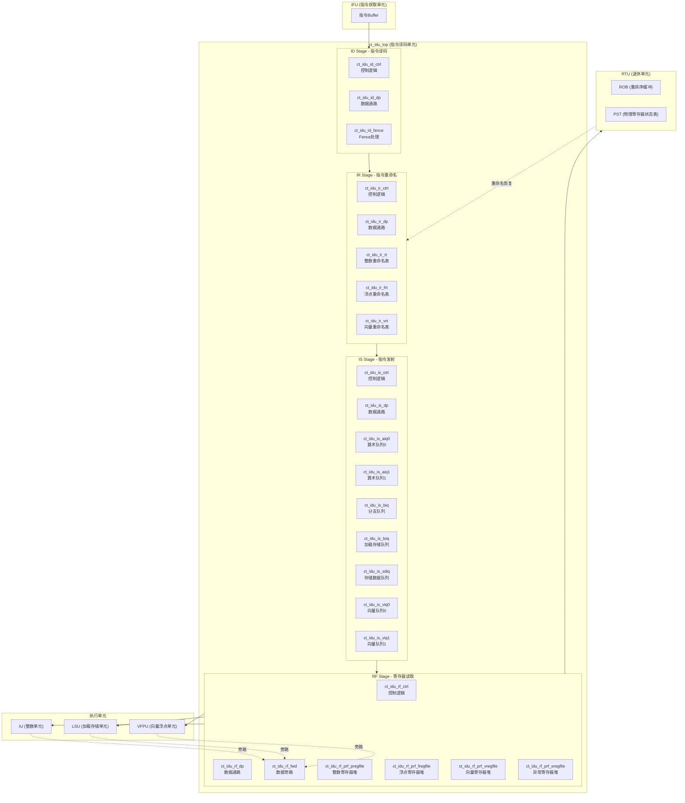
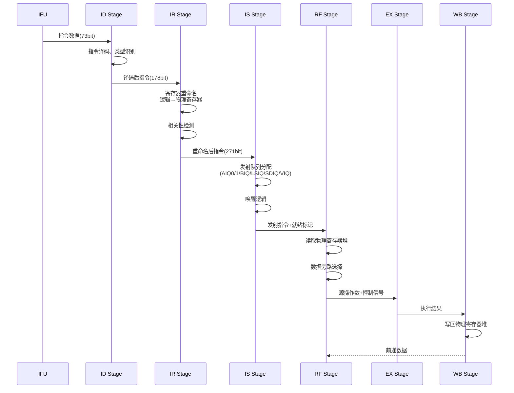
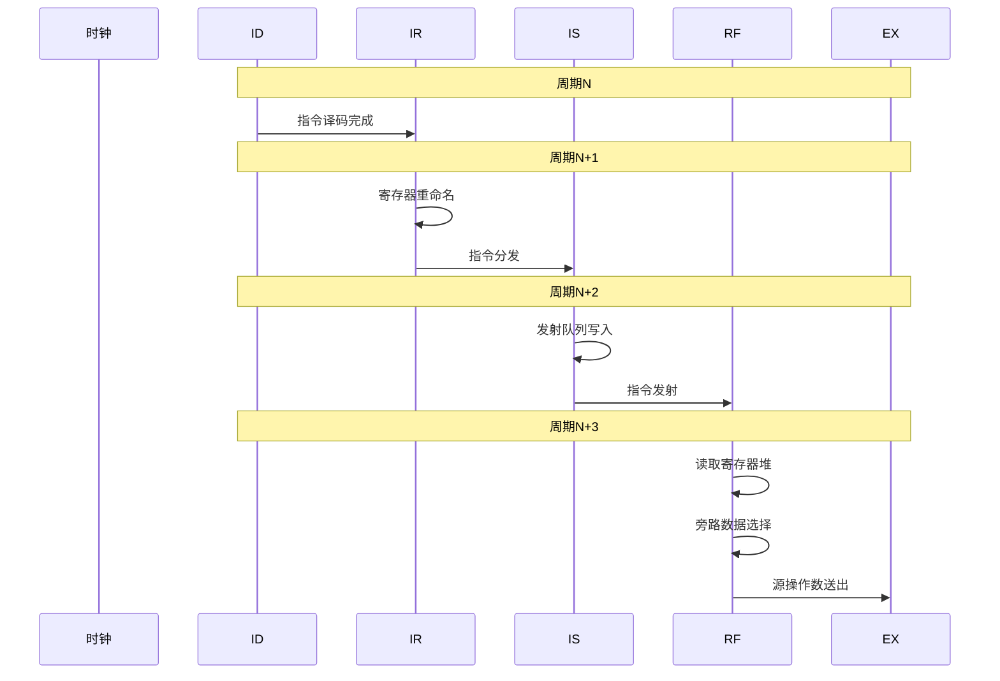

# ct_idu_top 模块详细方案文档

## 1. 模块概述

### 1.1 基本信息

| 属性 | 值 |
|------|-----|
| 模块名称 | ct_idu_top |
| 文件路径 | C910_RTL_FACTORY\gen_rtl\idu\rtl\ct_idu_top.v |
| 层级 | Level 2 (子系统级) |
| 所属子系统 | IDU (Instruction Decode Unit) |

### 1.2 功能描述

ct_idu_top是OpenC910处理器中的**指令译码单元（Instruction Decode Unit）顶层模块**，负责完成以下核心功能：

1. **指令译码（ID Stage）**：从IFU接收指令，进行初步译码，识别指令类型（普通指令、长拆分指令、短拆分指令、Fence指令）
2. **指令重命名（IR Stage）**：进行寄存器重命名，将逻辑寄存器映射到物理寄存器，解决WAR和WAW相关
3. **指令发射（IS Stage）**：将译码后的指令分发到各个发射队列（AIQ0/AIQ1/BIQ/LSIQ/SDIQ/VIQ0/VIQ1）
4. **寄存器读取（RF Stage）**：从物理寄存器堆读取源操作数，处理数据旁路（Bypass）

### 1.3 设计特点

- **多发射架构**：支持每周期最多4条指令的译码和发射
- **乱序执行支持**：通过寄存器重命名和发射队列实现指令级并行
- **7个发射队列**：
  - AIQ0（算术整数队列0）：ALU短指令、除法、特殊指令
  - AIQ1（算术整数队列1）：ALU短指令、乘法
  - BIQ（分支指令队列）：分支跳转指令
  - LSIQ（加载存储指令队列）：Load/Store指令
  - SDIQ（存储数据指令队列）：Store数据准备
  - VIQ0/VIQ1（向量指令队列）：向量运算指令
- **4个物理寄存器堆**：PREG（整数）、FREG（浮点）、VREG（向量）、EREG（异常）
- **8级流水线**：ID → IR → IS → RF → EX → WB

### 1.4 模块层次结构

```
ct_idu_top (指令译码单元顶层)
├── ID Stage (指令译码阶段)
│   ├── ct_idu_id_ctrl (控制逻辑)
│   ├── ct_idu_id_dp (数据通路)
│   └── ct_idu_id_fence (Fence指令处理)
├── IR Stage (指令重命名阶段)
│   ├── ct_idu_ir_ctrl (控制逻辑)
│   ├── ct_idu_ir_dp (数据通路)
│   ├── ct_idu_ir_rt (整数寄存器重命名表)
│   ├── ct_idu_ir_frt (浮点寄存器重命名表)
│   └── ct_idu_ir_vrt (向量寄存器重命名表)
├── IS Stage (指令发射阶段)
│   ├── ct_idu_is_ctrl (控制逻辑)
│   ├── ct_idu_is_dp (数据通路)
│   ├── ct_idu_is_aiq0 (AIQ0发射队列)
│   ├── ct_idu_is_aiq1 (AIQ1发射队列)
│   ├── ct_idu_is_biq (BIQ发射队列)
│   ├── ct_idu_is_lsiq (LSIQ发射队列)
│   ├── ct_idu_is_sdiq (SDIQ发射队列)
│   ├── ct_idu_is_viq0 (VIQ0发射队列)
│   └── ct_idu_is_viq1 (VIQ1发射队列)
└── RF Stage (寄存器读取阶段)
    ├── ct_idu_rf_ctrl (控制逻辑)
    ├── ct_idu_rf_dp (数据通路)
    ├── ct_idu_rf_fwd (数据旁路)
    ├── ct_idu_rf_prf_pregfile (整数物理寄存器堆)
    ├── ct_idu_rf_prf_eregfile (异常寄存器堆)
    ├── ct_idu_rf_prf_fregfile (浮点物理寄存器堆)
    └── ct_idu_rf_prf_vregfile (向量物理寄存器堆)
```

---

## 2. 模块接口说明

### 2.1 接口总览

| 接口类型 | 数量 | 说明 |
|---------|------|------|
| 输入端口 | 414 | 来自CP0、IFU、IU、LSU、RTU、VFPU等模块 |
| 输出端口 | 364 | 输出到CP0、IU、LSU、RTU、VFPU等模块 |

### 2.2 与IFU接口（指令获取）

| 信号名 | 方向 | 位宽 | 描述 |
|--------|------|------|------|
| ifu_idu_ib_inst0_data | input | 73 | 指令Buffer第0条指令数据 |
| ifu_idu_ib_inst0_vld | input | 1 | 指令0有效 |
| ifu_idu_ib_inst1_data | input | 73 | 指令Buffer第1条指令数据 |
| ifu_idu_ib_inst1_vld | input | 1 | 指令1有效 |
| ifu_idu_ib_inst2_data | input | 73 | 指令Buffer第2条指令数据 |
| ifu_idu_ib_inst2_vld | input | 1 | 指令2有效 |
| ifu_idu_ib_pipedown_gateclk | input | 1 | 流水线门控时钟 |
| idu_ifu_id_stall | output | 1 | ID阶段停顿请求 |
| idu_ifu_id_bypass_stall | output | 1 | Bypass停顿请求 |

### 2.3 与RTU接口（寄存器重命名与退休）

| 信号名 | 方向 | 位宽 | 描述 |
|--------|------|------|------|
| rtu_idu_alloc_preg0~3 | input | 7×4 | 分配物理寄存器编号 |
| rtu_idu_alloc_preg0~3_vld | input | 4 | 物理寄存器分配有效 |
| rtu_idu_alloc_ereg0~3 | input | 5×4 | 分配异常寄存器编号 |
| rtu_idu_alloc_freg0~3 | input | 6×4 | 分配浮点寄存器编号 |
| rtu_idu_alloc_vreg0~3 | input | 6×4 | 分配向量寄存器编号 |
| rtu_idu_rt_recover_preg | input | 224 | 物理寄存器恢复表 |
| rtu_idu_flush_fe/is | input | 1 | 流水线冲刷 |
| idu_rtu_rob_create0~3_data | output | 40×4 | ROB创建数据 |
| idu_rtu_pst_dis_inst0~3_preg | output | 7×4 | 退休物理寄存器 |
| idu_rtu_pst_preg_dealloc_mask | output | 96 | 物理寄存器释放掩码 |

### 2.4 与IU接口（整数执行单元）

| 信号名 | 方向 | 位宽 | 描述 |
|--------|------|------|------|
| iu_idu_ex1_pipe0_fwd_preg_vld | input | 1 | Pipe0 EX1前递有效 |
| iu_idu_ex1_pipe0_fwd_preg | input | 7 | Pipe0 EX1前递寄存器号 |
| iu_idu_ex1_pipe0_fwd_preg_data | input | 64 | Pipe0 EX1前递数据 |
| iu_idu_ex2_pipe0_wb_preg_vld | input | 1 | Pipe0写回有效 |
| iu_idu_ex2_pipe0_wb_preg | input | 7 | Pipe0写回寄存器号 |
| iu_idu_ex2_pipe0_wb_preg_data | input | 64 | Pipe0写回数据 |
| idu_iu_rf_pipe0_sel | output | 1 | Pipe0发射选择 |
| idu_iu_rf_pipe0_src0~2 | output | 64×3 | Pipe0源操作数 |
| idu_iu_rf_pipe0_dst_preg | output | 7 | Pipe0目的寄存器 |
| idu_iu_rf_pipe0_func | output | 5 | Pipe0功能码 |

### 2.5 与LSU接口（加载存储单元）

| 信号名 | 方向 | 位宽 | 描述 |
|--------|------|------|------|
| lsu_idu_dc_pipe3_load_inst_vld | input | 1 | Load指令有效 |
| lsu_idu_dc_pipe3_preg_dup0 | input | 7 | Load目的寄存器 |
| lsu_idu_wb_pipe3_wb_preg_vld | input | 1 | Load写回有效 |
| lsu_idu_wb_pipe3_wb_preg_data | input | 64 | Load写回数据 |
| lsu_idu_lsiq_pop_vld | input | 1 | LSIQ弹出有效 |
| lsu_idu_lsiq_pop_entry | input | 12 | LSIQ弹出条目 |
| idu_lsu_rf_pipe3_sel | output | 1 | Pipe3发射选择 |
| idu_lsu_rf_pipe3_src0~1 | output | 64×2 | Pipe3源操作数 |
| idu_lsu_rf_pipe3_offset | output | 12 | Load/Store偏移量 |
| idu_lsu_vmb_create0_en | output | 1 | VMB创建使能 |

### 2.6 与VFPU接口（向量浮点单元）

| 信号名 | 方向 | 位宽 | 描述 |
|--------|------|------|------|
| vfpu_idu_ex1_pipe6_fwd_vreg_vld | input | 1 | Pipe6前递有效 |
| vfpu_idu_ex1_pipe6_fwd_vreg | input | 7 | Pipe6前递向量寄存器 |
| vfpu_idu_ex5_pipe6_wb_vreg_fr_vld | input | 1 | Pipe6写回有效 |
| vfpu_idu_ex5_pipe6_wb_vreg_fr_data | input | 64 | Pipe6写回数据 |
| idu_vfpu_rf_pipe6_sel | output | 1 | Pipe6发射选择 |
| idu_vfpu_rf_pipe6_srcv0_fr | output | 64 | Pipe6源向量0 |
| idu_vfpu_rf_pipe6_dst_vreg | output | 7 | Pipe6目的向量寄存器 |
| idu_vfpu_rf_pipe6_func | output | 20 | Pipe6功能码 |

### 2.7 与CP0接口（协处理器0）

| 信号名 | 方向 | 位宽 | 描述 |
|--------|------|------|------|
| cp0_idu_icg_en | input | 1 | 门控时钟使能 |
| cp0_idu_iq_bypass_disable | input | 1 | Bypass禁用 |
| cp0_idu_rob_fold_disable | input | 1 | ROB折叠禁用 |
| cp0_idu_src2_fwd_disable | input | 1 | SRC2前递禁用 |
| cp0_idu_srcv2_fwd_disable | input | 1 | SRCV2前递禁用 |
| cp0_idu_frm | input | 3 | 浮点舍入模式 |
| cp0_idu_fs | input | 2 | 浮点状态 |
| idu_cp0_rf_sel | output | 1 | CP0指令选择 |
| idu_cp0_rf_opcode | output | 32 | CP0指令操作码 |
| idu_cp0_rf_src0 | output | 64 | CP0源操作数 |

---

## 3. 模块架构图

### 3.1 整体架构



### 3.2 流水线数据流



---

## 4. 子模块详细说明

### 4.1 ID Stage 子模块

#### 4.1.1 ct_idu_id_ctrl
- **功能**：ID阶段控制逻辑
- **主要职责**：
  - 控制指令从IFU到ID阶段的流水线下传
  - 处理指令类型识别（普通/长拆分/短拆分/Fence）
  - 生成ID阶段停顿信号
  - 处理流水线冲刷

#### 4.1.2 ct_idu_id_dp
- **功能**：ID阶段数据通路
- **主要职责**：
  - 指令初步译码
  - 生成分发控制信号
  - 处理短拆分指令的拆分逻辑

#### 4.1.3 ct_idu_id_fence
- **功能**：Fence指令处理
- **主要职责**：
  - 处理Fence/Fence.I指令同步
  - 管理流水线排空逻辑

### 4.2 IR Stage 子模块

#### 4.2.1 ct_idu_ir_ctrl
- **功能**：IR阶段控制逻辑
- **主要职责**：
  - 控制指令从重命名到发射的流水线下传
  - 管理4条指令的并行重命名
  - 处理寄存器分配请求

#### 4.2.2 ct_idu_ir_rt (Integer Rename Table)
- **功能**：整数寄存器重命名表
- **主要职责**：
  - 维护32个逻辑寄存器到96个物理寄存器的映射
  - 处理重命名恢复（Flush时）
  - 生成寄存器相关性标记

#### 4.2.3 ct_idu_ir_frt (Float Rename Table)
- **功能**：浮点寄存器重命名表
- **主要职责**：
  - 维护32个浮点逻辑寄存器到64个物理寄存器的映射

#### 4.2.4 ct_idu_ir_vrt (Vector Rename Table)
- **功能**：向量寄存器重命名表
- **主要职责**：
  - 维护32个向量逻辑寄存器到64个物理寄存器的映射

### 4.3 IS Stage 子模块

#### 4.3.1 ct_idu_is_aiq0 (ALU Issue Queue 0)
- **功能**：算术整数发射队列0
- **容量**：8条目
- **支持指令**：ALU短指令、除法、特殊指令
- **发射端口**：2个（支持2条指令同时发射）

#### 4.3.2 ct_idu_is_aiq1 (ALU Issue Queue 1)
- **功能**：算术整数发射队列1
- **容量**：8条目
- **支持指令**：ALU短指令、乘法（支持MLA链）
- **发射端口**：2个

#### 4.3.3 ct_idu_is_biq (Branch Issue Queue)
- **功能**：分支指令发射队列
- **容量**：12条目
- **支持指令**：分支跳转、条件分支

#### 4.3.4 ct_idu_is_lsiq (Load/Store Issue Queue)
- **功能**：加载存储指令发射队列
- **容量**：12条目
- **支持指令**：Load、Store、原子操作

#### 4.3.5 ct_idu_is_sdiq (Store Data Issue Queue)
- **功能**：存储数据指令队列
- **容量**：12条目
- **支持指令**：Store数据准备

#### 4.3.6 ct_idu_is_viq0/viq1 (Vector Issue Queue)
- **功能**：向量指令发射队列
- **容量**：8条目
- **支持指令**：向量运算、向量加载存储

### 4.4 RF Stage 子模块

#### 4.4.1 ct_idu_rf_prf_pregfile
- **功能**：整数物理寄存器堆
- **规格**：96条目 × 64bit
- **读端口**：16个（支持多发射并行读取）
- **写端口**：8个（支持多路写回）

#### 4.4.2 ct_idu_rf_prf_fregfile
- **功能**：浮点物理寄存器堆
- **规格**：64条目 × 64bit

#### 4.4.3 ct_idu_rf_prf_vregfile
- **功能**：向量物理寄存器堆
- **规格**：64条目 × 128bit（VR0/VR1双端口）

#### 4.4.4 ct_idu_rf_fwd
- **功能**：数据旁路控制
- **职责**：管理EX阶段到RF阶段的数据前递

---

## 5. 关键信号列表

### 5.1 流水线控制信号

| 信号名 | 位宽 | 描述 |
|--------|------|------|
| ctrl_id_pipedown_inst0~3_vld | 4×1 | ID阶段下传指令有效 |
| ctrl_ir_pipedown_inst0~3_vld | 4×1 | IR阶段下传指令有效 |
| ctrl_dp_is_inst0~3_vld | 4×1 | IS阶段指令有效 |
| idu_ifu_id_stall | 1 | ID阶段停顿 |
| ctrl_ir_stall | 1 | IR阶段停顿 |
| ctrl_is_stall | 1 | IS阶段停顿 |

### 5.2 寄存器重命名信号

| 信号名 | 位宽 | 描述 |
|--------|------|------|
| dp_rt_inst0~3_dst_preg | 4×7 | 目的物理寄存器 |
| dp_rt_inst0~3_src0~2_reg | 12×6 | 源逻辑寄存器 |
| rtu_idu_alloc_preg0~3 | 4×7 | 分配物理寄存器 |
| rtu_idu_rt_recover_preg | 224 | 重命名恢复表 |

### 5.3 发射队列信号

| 信号名 | 位宽 | 描述 |
|--------|------|------|
| aiq0_dp_issue_read_data | 227 | AIQ0发射数据 |
| aiq1_dp_issue_read_data | 214 | AIQ1发射数据 |
| biq_dp_issue_read_data | 82 | BIQ发射数据 |
| lsiq_dp_issue_read_data | 163 | LSIQ发射数据 |
| aiq0_xx_issue_en | 1 | AIQ0发射使能 |
| aiq1_xx_issue_en | 1 | AIQ1发射使能 |

### 5.4 数据旁路信号

| 信号名 | 位宽 | 描述 |
|--------|------|------|
| iu_idu_ex1_pipe0_fwd_preg_data | 64 | IU Pipe0 EX1前递数据 |
| iu_idu_ex2_pipe0_wb_preg_data | 64 | IU Pipe0 EX2写回数据 |
| lsu_idu_da_pipe3_fwd_preg_data | 64 | LSU Pipe3 DA前递数据 |
| vfpu_idu_ex3_pipe6_fwd_vreg_fr_data | 64 | VFPU Pipe6 EX3前递数据 |

---

## 6. 模块实现方案

### 6.1 流水线控制逻辑

```verilog
// ID阶段到IR阶段的流水线控制
assign ctrl_id_pipedown_inst0_vld = id_inst0_vld && !ctrl_id_stall;
assign ctrl_id_pipedown_inst1_vld = id_inst1_vld && !ctrl_id_stall && !split_stall;
assign ctrl_id_pipedown_inst2_vld = id_inst2_vld && !ctrl_id_stall && !split_stall;

// IR阶段到IS阶段的流水线控制
assign ctrl_ir_pipedown = ir_inst0_vld && !ctrl_ir_stall;
```

### 6.2 寄存器重命名逻辑

```verilog
// 目的寄存器重命名
assign dp_rt_inst0_dst_preg = rtu_idu_alloc_preg0_vld ? rtu_idu_alloc_preg0 : 7'b0;

// 源寄存器相关性检测
assign src0_rdy = rt_src0_rdy || fwd_src0_vld;
assign src1_rdy = rt_src1_rdy || fwd_src1_vld;
```

### 6.3 发射队列分配逻辑

```verilog
// AIQ0创建使能（ALU短指令、除法、特殊指令）
assign ctrl_aiq0_create0_en = dp_ctrl_ir_inst0_alu_short || 
                               dp_ctrl_ir_inst0_div || 
                               dp_ctrl_ir_inst0_special;

// LSIQ创建使能（Load/Store指令）
assign ctrl_lsiq_create0_en = dp_ctrl_ir_inst0_load || 
                               dp_ctrl_ir_inst0_store;
```

### 6.4 数据旁路选择逻辑

```verilog
// Pipe0 SRC0旁路选择
always @(*) begin
    case (fwd_src0_sel)
        4'b0001: rf_pipe0_src0 = iu_ex1_pipe0_fwd_data;
        4'b0010: rf_pipe0_src0 = iu_ex2_pipe0_wb_data;
        4'b0100: rf_pipe0_src0 = lsu_da_pipe3_fwd_data;
        default: rf_pipe0_src0 = pregfile_rdata;
    endcase
end
```

---

## 7. 时序说明

### 7.1 关键路径

| 路径 | 延迟 | 说明 |
|------|------|------|
| IR→IS 重命名→发射 | 2周期 | 寄存器重命名到发射队列写入 |
| RF→EX 旁路选择 | 1周期 | 数据旁路多路选择 |
| IS→RF 唤醒→读取 | 1周期 | 发射到寄存器读取 |

### 7.2 时序图



---

## 8. 配置参数

| 参数名 | 默认值 | 说明 |
|--------|--------|------|
| AIQ0_DEPTH | 8 | AIQ0队列深度 |
| AIQ1_DEPTH | 8 | AIQ1队列深度 |
| BIQ_DEPTH | 12 | BIQ队列深度 |
| LSIQ_DEPTH | 12 | LSIQ队列深度 |
| SDIQ_DEPTH | 12 | SDIQ队列深度 |
| VIQ0_DEPTH | 8 | VIQ0队列深度 |
| VIQ1_DEPTH | 8 | VIQ1队列深度 |
| PREG_NUM | 96 | 整数物理寄存器数 |
| FREG_NUM | 64 | 浮点物理寄存器数 |
| VREG_NUM | 64 | 向量物理寄存器数 |

---

## 9. 验证要点

1. **指令译码正确性**：验证所有RISC-V指令的正确译码
2. **寄存器重命名**：验证WAW、WAR相关的正确消除
3. **发射队列**：验证各队列的满/空判断和发射逻辑
4. **数据旁路**：验证各执行单元的前递数据正确性
5. **流水线冲刷**：验证异常/分支时的流水线恢复

---

## 10. 参考文档

- OpenC910 架构手册
- RISC-V 指令集规范
- ct_idu_top.v RTL源代码
