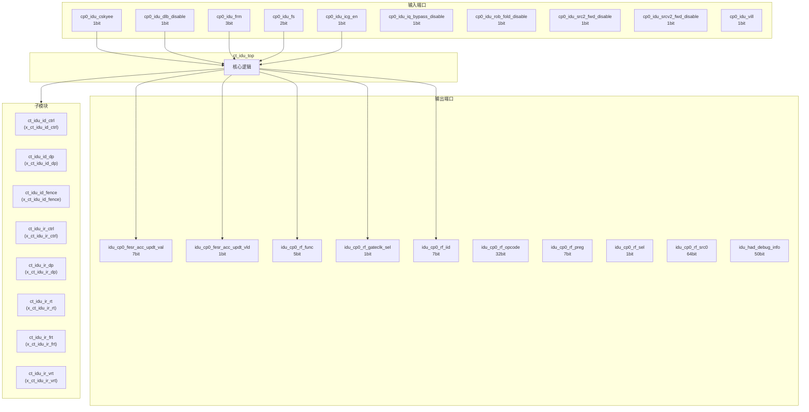

# ct_idu_top 模块设计文档

## 1. 模块概述

### 1.1 基本信息

| 属性 | 值 |
|------|-----|
| 模块名称 | ct_idu_top |
| 文件路径 | idu\rtl\ct_idu_top.v |
| 层级 | Level 2 |

### 1.2 功能描述

ct_idu_top 模块的功能描述。

### 1.3 设计特点

- 包含 25 个子模块实例

## 2. 模块接口说明

### 2.1 输入端口

| 信号名 | 方向 | 位宽 | 描述 |
|--------|------|------|------|
| cp0_idu_cskyee | input | 1 | |
| cp0_idu_dlb_disable | input | 1 | |
| cp0_idu_frm | input | 3 | |
| cp0_idu_fs | input | 2 | |
| cp0_idu_icg_en | input | 1 | |
| cp0_idu_iq_bypass_disable | input | 1 | |
| cp0_idu_rob_fold_disable | input | 1 | |
| cp0_idu_src2_fwd_disable | input | 1 | |
| cp0_idu_srcv2_fwd_disable | input | 1 | |
| cp0_idu_vill | input | 1 | |
| cp0_idu_vs | input | 2 | |
| cp0_idu_vstart | input | 7 | |
| cp0_idu_zero_delay_move_disable | input | 1 | |
| cp0_lsu_fencei_broad_dis | input | 1 | |
| cp0_lsu_fencerw_broad_dis | input | 1 | |
| cp0_lsu_tlb_broad_dis | input | 1 | |
| cp0_yy_clk_en | input | 1 | |
| cp0_yy_hyper | input | 1 | |
| cpurst_b | input | 1 | |
| forever_cpuclk | input | 1 | |
| had_idu_debug_id_inst_en | input | 1 | |
| had_idu_wbbr_data | input | 64 | |
| had_idu_wbbr_vld | input | 1 | |
| hpcp_idu_cnt_en | input | 1 | |
| ifu_idu_ib_inst0_data | input | 73 | |
| ifu_idu_ib_inst0_vld | input | 1 | |
| ifu_idu_ib_inst1_data | input | 73 | |
| ifu_idu_ib_inst1_vld | input | 1 | |
| ifu_idu_ib_inst2_data | input | 73 | |
| ifu_idu_ib_inst2_vld | input | 1 | |
| ... | ... | ... | 共414个输入端口 |

### 2.2 输出端口

| 信号名 | 方向 | 位宽 | 描述 |
|--------|------|------|------|
| idu_cp0_fesr_acc_updt_val | output | 7 | |
| idu_cp0_fesr_acc_updt_vld | output | 1 | |
| idu_cp0_rf_func | output | 5 | |
| idu_cp0_rf_gateclk_sel | output | 1 | |
| idu_cp0_rf_iid | output | 7 | |
| idu_cp0_rf_opcode | output | 32 | |
| idu_cp0_rf_preg | output | 7 | |
| idu_cp0_rf_sel | output | 1 | |
| idu_cp0_rf_src0 | output | 64 | |
| idu_had_debug_info | output | 50 | |
| idu_had_id_inst0_info | output | 40 | |
| idu_had_id_inst0_vld | output | 1 | |
| idu_had_id_inst1_info | output | 40 | |
| idu_had_id_inst1_vld | output | 1 | |
| idu_had_id_inst2_info | output | 40 | |
| idu_had_id_inst2_vld | output | 1 | |
| idu_had_iq_empty | output | 1 | |
| idu_had_pipe_stall | output | 1 | |
| idu_had_pipeline_empty | output | 1 | |
| idu_had_wb_data | output | 64 | |
| idu_had_wb_vld | output | 1 | |
| idu_hpcp_backend_stall | output | 1 | |
| idu_hpcp_fence_sync_vld | output | 1 | |
| idu_hpcp_ir_inst0_type | output | 7 | |
| idu_hpcp_ir_inst0_vld | output | 1 | |
| idu_hpcp_ir_inst1_type | output | 7 | |
| idu_hpcp_ir_inst1_vld | output | 1 | |
| idu_hpcp_ir_inst2_type | output | 7 | |
| idu_hpcp_ir_inst2_vld | output | 1 | |
| idu_hpcp_ir_inst3_type | output | 7 | |
| ... | ... | ... | 共364个输出端口 |

## 3. 模块框图

### 3.1 模块架构图

### 3.2 主要数据连线

| 源模块 | 目标模块 | 信号名 | 位宽 | 说明 |
|--------|----------|--------|------|------|
| ct_idu_top | ct_idu_id_ctrl | cp0_idu_icg_en | - | |
| ct_idu_top | ct_idu_id_ctrl | cp0_yy_clk_en | - | |
| ct_idu_top | ct_idu_id_ctrl | cpurst_b | - | |
| ct_idu_top | ct_idu_id_dp | cp0_idu_cskyee | - | |
| ct_idu_top | ct_idu_id_dp | cp0_idu_frm | - | |
| ct_idu_top | ct_idu_id_dp | cp0_idu_fs | - | |
| ct_idu_top | ct_idu_id_fence | cp0_idu_icg_en | - | |
| ct_idu_top | ct_idu_id_fence | cp0_yy_clk_en | - | |
| ct_idu_top | ct_idu_id_fence | cpurst_b | - | |
| ct_idu_top | ct_idu_ir_ctrl | aiq0_ctrl_entry_cnt_updt_val | - | |
| ct_idu_top | ct_idu_ir_ctrl | aiq0_ctrl_entry_cnt_updt_vld | - | |
| ct_idu_top | ct_idu_ir_ctrl | aiq1_ctrl_entry_cnt_updt_val | - | |
| ct_idu_top | ct_idu_ir_dp | cp0_idu_icg_en | - | |
| ct_idu_top | ct_idu_ir_dp | cp0_yy_clk_en | - | |
| ct_idu_top | ct_idu_ir_dp | cpurst_b | - | |
| ct_idu_top | ct_idu_ir_rt | cp0_idu_icg_en | - | |
| ct_idu_top | ct_idu_ir_rt | cp0_yy_clk_en | - | |
| ct_idu_top | ct_idu_ir_rt | cpurst_b | - | |
| ct_idu_top | ct_idu_ir_frt | cp0_idu_icg_en | - | |
| ct_idu_top | ct_idu_ir_frt | cp0_yy_clk_en | - | |
| ct_idu_top | ct_idu_ir_frt | cpurst_b | - | |
| ct_idu_top | ct_idu_ir_vrt | dp_vrt_inst0_dst_vreg | - | |
| ct_idu_top | ct_idu_ir_vrt | dp_vrt_inst0_dstv_reg | - | |
| ct_idu_top | ct_idu_ir_vrt | dp_vrt_inst0_dstv_vld | - | |
| ct_idu_top | ct_idu_is_ctrl | aiq0_ctrl_1_left_updt | - | |
| ct_idu_top | ct_idu_is_ctrl | aiq0_ctrl_empty | - | |
| ct_idu_top | ct_idu_is_ctrl | aiq0_ctrl_full | - | |
| ct_idu_top | ct_idu_is_dp | aiq0_aiq_create0_entry | - | |
| ct_idu_top | ct_idu_is_dp | aiq0_aiq_create1_entry | - | |
| ct_idu_top | ct_idu_is_dp | aiq1_aiq_create0_entry | - | |

## 4. 模块实现方案

### 4.1 关键逻辑描述

无关键 always 块。

## 5. 内部关键信号列表

### 5.1 寄存器信号

无寄存器信号。

### 5.2 线网信号

| 信号名 | 位宽 | 描述 |
|--------|------|------|
| aiq0_aiq_create0_entry | 8 | |
| aiq0_aiq_create1_entry | 8 | |
| aiq0_ctrl_1_left_updt | 1 | |
| aiq0_ctrl_empty | 1 | |
| aiq0_ctrl_entry_cnt_updt_val | 4 | |
| aiq0_ctrl_entry_cnt_updt_vld | 1 | |
| aiq0_ctrl_full | 1 | |
| aiq0_ctrl_full_updt | 1 | |
| aiq0_ctrl_full_updt_clk_en | 1 | |
| aiq0_dp_issue_entry | 8 | |
| aiq0_dp_issue_read_data | 227 | |
| aiq0_top_aiq0_entry_cnt | 4 | |
| aiq0_xx_gateclk_issue_en | 1 | |
| aiq0_xx_issue_en | 1 | |
| aiq1_aiq_create0_entry | 8 | |
| aiq1_aiq_create1_entry | 8 | |
| aiq1_ctrl_1_left_updt | 1 | |
| aiq1_ctrl_empty | 1 | |
| aiq1_ctrl_entry_cnt_updt_val | 4 | |
| aiq1_ctrl_entry_cnt_updt_vld | 1 | |
| ... | ... | 共972个线网信号 |

## 6. 子模块方案

### 6.1 模块例化层次结构

```mermaid
graph TD
    ROOT["当前模块"]
    N0["ct_idu_id_ctrl\n(x_ct_idu_id_ctrl)"]
    ROOT --> N0
    N1["ct_idu_id_dp\n(x_ct_idu_id_dp)"]
    ROOT --> N1
    N2["ct_idu_id_fence\n(x_ct_idu_id_fence)"]
    ROOT --> N2
    N3["ct_idu_ir_ctrl\n(x_ct_idu_ir_ctrl)"]
    ROOT --> N3
    N4["ct_idu_ir_dp\n(x_ct_idu_ir_dp)"]
    ROOT --> N4
    N5["ct_idu_ir_rt\n(x_ct_idu_ir_rt)"]
    ROOT --> N5
    N6["ct_idu_ir_frt\n(x_ct_idu_ir_frt)"]
    ROOT --> N6
    N7["ct_idu_ir_vrt\n(x_ct_idu_ir_vrt)"]
    ROOT --> N7
    N8["ct_idu_is_ctrl\n(x_ct_idu_is_ctrl)"]
    ROOT --> N8
    N9["ct_idu_is_dp\n(x_ct_idu_is_dp)"]
    ROOT --> N9
    N10["ct_idu_is_aiq0\n(x_ct_idu_is_aiq0)"]
    ROOT --> N10
    N11["ct_idu_is_aiq1\n(x_ct_idu_is_aiq1)"]
    ROOT --> N11
    N12["ct_idu_is_biq\n(x_ct_idu_is_biq)"]
    ROOT --> N12
    N13["ct_idu_is_lsiq\n(x_ct_idu_is_lsiq)"]
    ROOT --> N13
    N14["ct_idu_is_sdiq\n(x_ct_idu_is_sdiq)"]
    ROOT --> N14
```

### 6.2 子模块列表

| 层级 | 模块名 | 实例名 | 功能描述 |
|------|--------|--------|----------|
| 1 | ct_idu_id_ctrl | x_ct_idu_id_ctrl | |
| 1 | ct_idu_id_dp | x_ct_idu_id_dp | |
| 1 | ct_idu_id_fence | x_ct_idu_id_fence | |
| 1 | ct_idu_ir_ctrl | x_ct_idu_ir_ctrl | |
| 1 | ct_idu_ir_dp | x_ct_idu_ir_dp | |
| 1 | ct_idu_ir_rt | x_ct_idu_ir_rt | |
| 1 | ct_idu_ir_frt | x_ct_idu_ir_frt | |
| 1 | ct_idu_ir_vrt | x_ct_idu_ir_vrt | |
| 1 | ct_idu_is_ctrl | x_ct_idu_is_ctrl | |
| 1 | ct_idu_is_dp | x_ct_idu_is_dp | |
| 1 | ct_idu_is_aiq0 | x_ct_idu_is_aiq0 | |
| 1 | ct_idu_is_aiq1 | x_ct_idu_is_aiq1 | |
| 1 | ct_idu_is_biq | x_ct_idu_is_biq | |
| 1 | ct_idu_is_lsiq | x_ct_idu_is_lsiq | |
| 1 | ct_idu_is_sdiq | x_ct_idu_is_sdiq | |
| 1 | ct_idu_is_viq0 | x_ct_idu_is_viq0 | |
| 1 | ct_idu_is_viq1 | x_ct_idu_is_viq1 | |
| 1 | ct_idu_rf_ctrl | x_ct_idu_rf_ctrl | |
| 1 | ct_idu_rf_dp | x_ct_idu_rf_dp | |
| 1 | ct_idu_rf_fwd | x_ct_idu_rf_fwd | |
| ... | ... | ... | 共25个实例 |

## 7. 修订历史

| 版本 | 日期 | 作者 | 说明 |
|------|------|------|------|
| 1.0 | 2026-03-12 | Auto-generated | 初始版本 |
