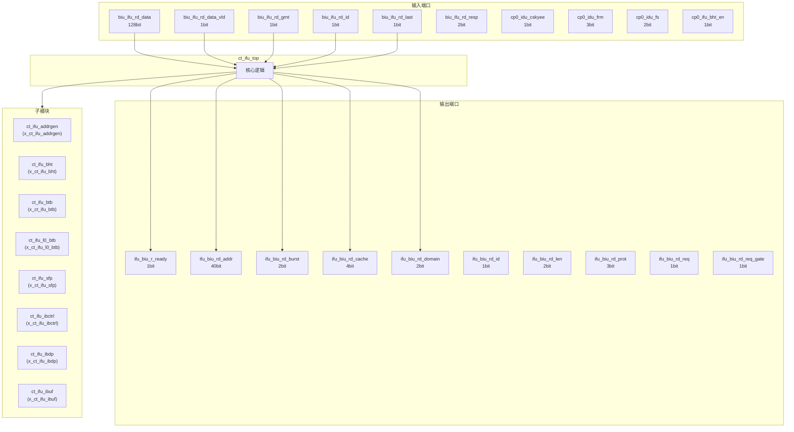

# ct_ifu_top 模块设计文档

## 1. 模块概述

### 1.1 基本信息

| 属性 | 值 |
|------|-----|
| 模块名称 | ct_ifu_top |
| 文件路径 | ifu\rtl\ct_ifu_top.v |
| 层级 | Level 2 |

### 1.2 功能描述

ct_ifu_top 模块的功能描述。

### 1.3 设计特点

- 包含 22 个子模块实例

## 2. 模块接口说明

### 2.1 输入端口

| 信号名 | 方向 | 位宽 | 描述 |
|--------|------|------|------|
| biu_ifu_rd_data | input | 128 | |
| biu_ifu_rd_data_vld | input | 1 | |
| biu_ifu_rd_grnt | input | 1 | |
| biu_ifu_rd_id | input | 1 | |
| biu_ifu_rd_last | input | 1 | |
| biu_ifu_rd_resp | input | 2 | |
| cp0_idu_cskyee | input | 1 | |
| cp0_idu_frm | input | 3 | |
| cp0_idu_fs | input | 2 | |
| cp0_ifu_bht_en | input | 1 | |
| cp0_ifu_bht_inv | input | 1 | |
| cp0_ifu_btb_en | input | 1 | |
| cp0_ifu_btb_inv | input | 1 | |
| cp0_ifu_icache_en | input | 1 | |
| cp0_ifu_icache_inv | input | 1 | |
| cp0_ifu_icache_pref_en | input | 1 | |
| cp0_ifu_icache_read_index | input | 17 | |
| cp0_ifu_icache_read_req | input | 1 | |
| cp0_ifu_icache_read_tag | input | 1 | |
| cp0_ifu_icache_read_way | input | 1 | |
| cp0_ifu_icg_en | input | 1 | |
| cp0_ifu_ind_btb_en | input | 1 | |
| cp0_ifu_ind_btb_inv | input | 1 | |
| cp0_ifu_insde | input | 1 | |
| cp0_ifu_iwpe | input | 1 | |
| cp0_ifu_l0btb_en | input | 1 | |
| cp0_ifu_lbuf_en | input | 1 | |
| cp0_ifu_no_op_req | input | 1 | |
| cp0_ifu_nsfe | input | 1 | |
| cp0_ifu_ras_en | input | 1 | |
| ... | ... | ... | 共133个输入端口 |

### 2.2 输出端口

| 信号名 | 方向 | 位宽 | 描述 |
|--------|------|------|------|
| ifu_biu_r_ready | output | 1 | |
| ifu_biu_rd_addr | output | 40 | |
| ifu_biu_rd_burst | output | 2 | |
| ifu_biu_rd_cache | output | 4 | |
| ifu_biu_rd_domain | output | 2 | |
| ifu_biu_rd_id | output | 1 | |
| ifu_biu_rd_len | output | 2 | |
| ifu_biu_rd_prot | output | 3 | |
| ifu_biu_rd_req | output | 1 | |
| ifu_biu_rd_req_gate | output | 1 | |
| ifu_biu_rd_size | output | 3 | |
| ifu_biu_rd_snoop | output | 4 | |
| ifu_biu_rd_user | output | 2 | |
| ifu_cp0_bht_inv_done | output | 1 | |
| ifu_cp0_btb_inv_done | output | 1 | |
| ifu_cp0_icache_inv_done | output | 1 | |
| ifu_cp0_icache_read_data | output | 128 | |
| ifu_cp0_icache_read_data_vld | output | 1 | |
| ifu_cp0_ind_btb_inv_done | output | 1 | |
| ifu_cp0_rst_inv_req | output | 1 | |
| ifu_had_debug_info | output | 83 | |
| ifu_had_no_inst | output | 1 | |
| ifu_had_no_op | output | 1 | |
| ifu_had_reset_on | output | 1 | |
| ifu_hpcp_btb_inst | output | 1 | |
| ifu_hpcp_btb_mispred | output | 1 | |
| ifu_hpcp_frontend_stall | output | 1 | |
| ifu_hpcp_icache_access | output | 1 | |
| ifu_hpcp_icache_miss | output | 1 | |
| ifu_idu_ib_inst0_data | output | 73 | |
| ... | ... | ... | 共64个输出端口 |

## 3. 模块框图

### 3.1 模块架构图

### 3.2 主要数据连线

| 源模块 | 目标模块 | 信号名 | 位宽 | 说明 |
|--------|----------|--------|------|------|
| ct_ifu_top | ct_ifu_addrgen | addrgen_btb_index | - | |
| ct_ifu_top | ct_ifu_addrgen | addrgen_btb_tag | - | |
| ct_ifu_top | ct_ifu_addrgen | addrgen_btb_target_pc | - | |
| ct_ifu_top | ct_ifu_bht | bht_ifctrl_inv_done | - | |
| ct_ifu_top | ct_ifu_bht | bht_ifctrl_inv_on | - | |
| ct_ifu_top | ct_ifu_bht | bht_ind_btb_rtu_ghr | - | |
| ct_ifu_top | ct_ifu_btb | addrgen_btb_index | - | |
| ct_ifu_top | ct_ifu_btb | addrgen_btb_tag | - | |
| ct_ifu_top | ct_ifu_btb | addrgen_btb_target_pc | - | |
| ct_ifu_top | ct_ifu_l0_btb | addrgen_l0_btb_update_entry | - | |
| ct_ifu_top | ct_ifu_l0_btb | addrgen_l0_btb_update_vld | - | |
| ct_ifu_top | ct_ifu_l0_btb | addrgen_l0_btb_update_vld_bit | - | |
| ct_ifu_top | ct_ifu_sfp | cp0_ifu_icg_en | - | |
| ct_ifu_top | ct_ifu_sfp | cp0_ifu_nsfe | - | |
| ct_ifu_top | ct_ifu_sfp | cp0_ifu_vsetvli_pred_disable | - | |
| ct_ifu_top | ct_ifu_ibctrl | addrgen_ibctrl_cancel | - | |
| ct_ifu_top | ct_ifu_ibctrl | cp0_ifu_icg_en | - | |
| ct_ifu_top | ct_ifu_ibctrl | cp0_yy_clk_en | - | |
| ct_ifu_top | ct_ifu_ibdp | cp0_ifu_icg_en | - | |
| ct_ifu_top | ct_ifu_ibdp | cp0_ifu_ras_en | - | |
| ct_ifu_top | ct_ifu_ibdp | cp0_yy_clk_en | - | |
| ct_ifu_top | ct_ifu_ibuf | cp0_ifu_icg_en | - | |
| ct_ifu_top | ct_ifu_ibuf | cp0_yy_clk_en | - | |
| ct_ifu_top | ct_ifu_ibuf | cpurst_b | - | |
| ct_ifu_top | ct_ifu_icache_if | cp0_ifu_icache_en | - | |
| ct_ifu_top | ct_ifu_icache_if | cp0_ifu_icg_en | - | |
| ct_ifu_top | ct_ifu_icache_if | cp0_yy_clk_en | - | |
| ct_ifu_top | ct_ifu_ifctrl | bht_ifctrl_inv_done | - | |
| ct_ifu_top | ct_ifu_ifctrl | bht_ifctrl_inv_on | - | |
| ct_ifu_top | ct_ifu_ifctrl | btb_ifctrl_inv_done | - | |

## 4. 模块实现方案

### 4.1 关键逻辑描述

无关键 always 块。

## 5. 内部关键信号列表

### 5.1 寄存器信号

无寄存器信号。

### 5.2 线网信号

| 信号名 | 位宽 | 描述 |
|--------|------|------|
| addrgen_btb_index | 10 | |
| addrgen_btb_tag | 10 | |
| addrgen_btb_target_pc | 20 | |
| addrgen_btb_update_vld | 1 | |
| addrgen_ibctrl_cancel | 1 | |
| addrgen_ipdp_chgflw_vl | 8 | |
| addrgen_ipdp_chgflw_vlmul | 2 | |
| addrgen_ipdp_chgflw_vsew | 3 | |
| addrgen_l0_btb_update_entry | 16 | |
| addrgen_l0_btb_update_vld | 1 | |
| addrgen_l0_btb_update_vld_bit | 1 | |
| addrgen_l0_btb_wen | 4 | |
| addrgen_pcgen_pc | 39 | |
| addrgen_pcgen_pcload | 1 | |
| addrgen_xx_pcload | 1 | |
| bht_ifctrl_inv_done | 1 | |
| bht_ifctrl_inv_on | 1 | |
| bht_ind_btb_rtu_ghr | 8 | |
| bht_ind_btb_vghr | 8 | |
| bht_ipdp_pre_array_data_ntake | 32 | |
| ... | ... | 共1097个线网信号 |

## 6. 子模块方案

### 6.1 模块例化层次结构

```mermaid
graph TD
    ROOT["当前模块"]
    N0["ct_ifu_addrgen\n(x_ct_ifu_addrgen)"]
    ROOT --> N0
    N1["ct_ifu_bht\n(x_ct_ifu_bht)"]
    ROOT --> N1
    N2["ct_ifu_btb\n(x_ct_ifu_btb)"]
    ROOT --> N2
    N3["ct_ifu_l0_btb\n(x_ct_ifu_l0_btb)"]
    ROOT --> N3
    N4["ct_ifu_sfp\n(x_ct_ifu_sfp)"]
    ROOT --> N4
    N5["ct_ifu_ibctrl\n(x_ct_ifu_ibctrl)"]
    ROOT --> N5
    N6["ct_ifu_ibdp\n(x_ct_ifu_ibdp)"]
    ROOT --> N6
    N7["ct_ifu_ibuf\n(x_ct_ifu_ibuf)"]
    ROOT --> N7
    N8["ct_ifu_icache_if\n(x_ct_ifu_icache_if)"]
    ROOT --> N8
    N9["ct_ifu_ifctrl\n(x_ct_ifu_ifctrl)"]
    ROOT --> N9
    N10["ct_ifu_ifdp\n(x_ct_ifu_ifdp)"]
    ROOT --> N10
    N11["ct_ifu_ind_btb\n(x_ct_ifu_ind_btb)"]
    ROOT --> N11
    N12["ct_ifu_ipb\n(x_ct_ifu_ipb)"]
    ROOT --> N12
    N13["ct_ifu_ipctrl\n(x_ct_ifu_ipctrl)"]
    ROOT --> N13
    N14["ct_ifu_ipdp\n(x_ct_ifu_ipdp)"]
    ROOT --> N14
```

### 6.2 子模块列表

| 层级 | 模块名 | 实例名 | 功能描述 |
|------|--------|--------|----------|
| 1 | ct_ifu_addrgen | x_ct_ifu_addrgen | |
| 1 | ct_ifu_bht | x_ct_ifu_bht | |
| 1 | ct_ifu_btb | x_ct_ifu_btb | |
| 1 | ct_ifu_l0_btb | x_ct_ifu_l0_btb | |
| 1 | ct_ifu_sfp | x_ct_ifu_sfp | |
| 1 | ct_ifu_ibctrl | x_ct_ifu_ibctrl | |
| 1 | ct_ifu_ibdp | x_ct_ifu_ibdp | |
| 1 | ct_ifu_ibuf | x_ct_ifu_ibuf | |
| 1 | ct_ifu_icache_if | x_ct_ifu_icache_if | |
| 1 | ct_ifu_ifctrl | x_ct_ifu_ifctrl | |
| 1 | ct_ifu_ifdp | x_ct_ifu_ifdp | |
| 1 | ct_ifu_ind_btb | x_ct_ifu_ind_btb | |
| 1 | ct_ifu_ipb | x_ct_ifu_ipb | |
| 1 | ct_ifu_ipctrl | x_ct_ifu_ipctrl | |
| 1 | ct_ifu_ipdp | x_ct_ifu_ipdp | |
| 1 | ct_ifu_l1_refill | x_ct_ifu_l1_refill | |
| 1 | ct_ifu_lbuf | x_ct_ifu_lbuf | |
| 1 | ct_ifu_pcfifo_if | x_ct_ifu_pcfifo_if | |
| 1 | ct_ifu_pcgen | x_ct_ifu_pcgen | |
| 1 | ct_ifu_ras | x_ct_ifu_ras | |
| ... | ... | ... | 共22个实例 |

## 7. 修订历史

| 版本 | 日期 | 作者 | 说明 |
|------|------|------|------|
| 1.0 | 2026-03-12 | Auto-generated | 初始版本 |
