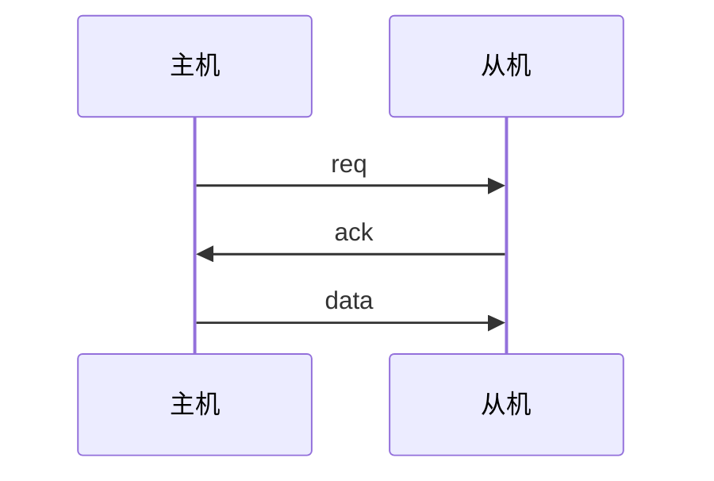
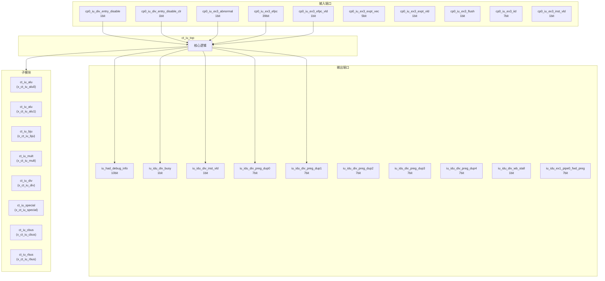
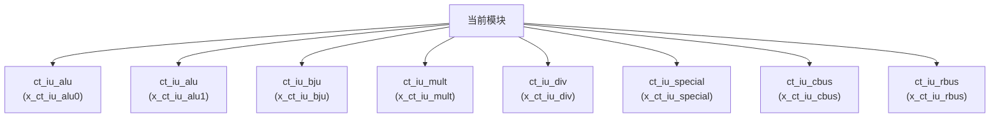

# ct_iu_top 模块设计文档

## 1. 模块概述

### 1.1 基本信息

| 属性 | 值 |
|------|-----|
| 模块名称 | ct_iu_top |
| 文件路径 | iu\rtl\ct_iu_top.v |
| 层级 | Level 2 |
| 参数 | ALU_SEL=21 |

### 1.2 功能描述

整数执行单元 (Integer Execution Unit)，主要信号: 使能信号、程序计数器、读使能、刷新信号、时钟信号

### 1.3 设计特点

- 包含 8 个子模块实例
- 可配置参数: 1 个

## 2. 模块接口说明

### 2.1 输入端口

| 信号名 | 方向 | 位宽 | 描述 |
|--------|------|------|------|
| cp0_iu_div_entry_disable | input | 1 | 使能信号 |
| cp0_iu_div_entry_disable_clr | input | 1 | 使能信号 |
| cp0_iu_ex3_abnormal | input | 1 |  |
| cp0_iu_ex3_efpc | input | 39 | 程序计数器 |
| cp0_iu_ex3_efpc_vld | input | 1 | 有效信号 |
| cp0_iu_ex3_expt_vec | input | 5 |  |
| cp0_iu_ex3_expt_vld | input | 1 | 有效信号 |
| cp0_iu_ex3_flush | input | 1 | 刷新信号 |
| cp0_iu_ex3_iid | input | 7 |  |
| cp0_iu_ex3_inst_vld | input | 1 | 有效信号 |
| cp0_iu_ex3_mtval | input | 32 |  |
| cp0_iu_ex3_rslt_data | input | 64 | 数据信号 |
| cp0_iu_ex3_rslt_preg | input | 7 | 读使能 |
| cp0_iu_ex3_rslt_vld | input | 1 | 有效信号 |
| cp0_iu_icg_en | input | 1 | 使能信号 |
| cp0_iu_vill | input | 1 |  |
| cp0_iu_vl | input | 8 |  |
| cp0_iu_vsetvli_pre_decd_disable | input | 1 | 读使能 |
| cp0_iu_vstart | input | 7 | 开始信号 |
| cp0_yy_clk_en | input | 1 | 时钟信号 |
| cp0_yy_priv_mode | input | 2 |  |
| cpurst_b | input | 1 | 复位信号 |
| forever_cpuclk | input | 1 | 时钟信号 |
| had_idu_wbbr_data | input | 64 | 数据信号 |
| had_idu_wbbr_vld | input | 1 | 有效信号 |
| idu_iu_is_div_gateclk_issue | input | 1 | 时钟信号 |
| idu_iu_is_div_issue | input | 1 |  |
| idu_iu_is_pcfifo_inst_num | input | 3 | 程序计数器 |
| idu_iu_is_pcfifo_inst_vld | input | 1 | 有效信号 |
| idu_iu_rf_bju_gateclk_sel | input | 1 | 时钟信号 |
| ... | ... | ... | 共131个输入端口 |

### 2.2 输出端口

| 信号名 | 方向 | 位宽 | 描述 |
|--------|------|------|------|
| iu_had_debug_info | output | 10 | 输入信号 |
| iu_idu_div_busy | output | 1 |  |
| iu_idu_div_inst_vld | output | 1 | 有效信号 |
| iu_idu_div_preg_dup0 | output | 7 | 读使能 |
| iu_idu_div_preg_dup1 | output | 7 | 读使能 |
| iu_idu_div_preg_dup2 | output | 7 | 读使能 |
| iu_idu_div_preg_dup3 | output | 7 | 读使能 |
| iu_idu_div_preg_dup4 | output | 7 | 读使能 |
| iu_idu_div_wb_stall | output | 1 | 暂停信号 |
| iu_idu_ex1_pipe0_fwd_preg | output | 7 | 读使能 |
| iu_idu_ex1_pipe0_fwd_preg_data | output | 64 | 数据信号 |
| iu_idu_ex1_pipe0_fwd_preg_vld | output | 1 | 有效信号 |
| iu_idu_ex1_pipe1_fwd_preg | output | 7 | 读使能 |
| iu_idu_ex1_pipe1_fwd_preg_data | output | 64 | 数据信号 |
| iu_idu_ex1_pipe1_fwd_preg_vld | output | 1 | 有效信号 |
| iu_idu_ex1_pipe1_mult_stall | output | 1 | 暂停信号 |
| iu_idu_ex2_pipe0_wb_preg | output | 7 | 读使能 |
| iu_idu_ex2_pipe0_wb_preg_data | output | 64 | 数据信号 |
| iu_idu_ex2_pipe0_wb_preg_dup0 | output | 7 | 读使能 |
| iu_idu_ex2_pipe0_wb_preg_dup1 | output | 7 | 读使能 |
| iu_idu_ex2_pipe0_wb_preg_dup2 | output | 7 | 读使能 |
| iu_idu_ex2_pipe0_wb_preg_dup3 | output | 7 | 读使能 |
| iu_idu_ex2_pipe0_wb_preg_dup4 | output | 7 | 读使能 |
| iu_idu_ex2_pipe0_wb_preg_expand | output | 96 | 读使能 |
| iu_idu_ex2_pipe0_wb_preg_vld | output | 1 | 有效信号 |
| iu_idu_ex2_pipe0_wb_preg_vld_dup0 | output | 1 | 有效信号 |
| iu_idu_ex2_pipe0_wb_preg_vld_dup1 | output | 1 | 有效信号 |
| iu_idu_ex2_pipe0_wb_preg_vld_dup2 | output | 1 | 有效信号 |
| iu_idu_ex2_pipe0_wb_preg_vld_dup3 | output | 1 | 有效信号 |
| iu_idu_ex2_pipe0_wb_preg_vld_dup4 | output | 1 | 有效信号 |
| ... | ... | ... | 共118个输出端口 |

### 2.4 参数列表

| 参数名 | 默认值 | 位宽 | 描述 |
|--------|--------|------|------|
| ALU_SEL | 21 | 1 | |

### 2.5 接口时序图

## 3. 模块框图

### 3.1 模块架构图

### 3.2 主要数据连线

| 源模块 | 目标模块 | 信号名 | 位宽 | 说明 |
|--------|----------|--------|------|------|
| ct_iu_top | ct_iu_alu | alu_rbus_ex1_pipex_data | - | |
| ct_iu_top | ct_iu_alu | alu_rbus_ex1_pipex_data_vld | - | |
| ct_iu_top | ct_iu_alu | alu_rbus_ex1_pipex_fwd_data | - | |
| ct_iu_top | ct_iu_alu | alu_rbus_ex1_pipex_data | - | |
| ct_iu_top | ct_iu_alu | alu_rbus_ex1_pipex_data_vld | - | |
| ct_iu_top | ct_iu_alu | alu_rbus_ex1_pipex_fwd_data | - | |
| ct_iu_top | ct_iu_bju | bju_cbus_ex2_pipe2_abnormal | - | |
| ct_iu_top | ct_iu_bju | bju_cbus_ex2_pipe2_bht_mispred | - | |
| ct_iu_top | ct_iu_bju | bju_cbus_ex2_pipe2_iid | - | |
| ct_iu_top | ct_iu_mult | cp0_iu_icg_en | - | |
| ct_iu_top | ct_iu_mult | cp0_yy_clk_en | - | |
| ct_iu_top | ct_iu_mult | cpurst_b | - | |
| ct_iu_top | ct_iu_div | cp0_iu_div_entry_disable | - | |
| ct_iu_top | ct_iu_div | cp0_iu_div_entry_disable_clr | - | |
| ct_iu_top | ct_iu_div | cp0_iu_icg_en | - | |
| ct_iu_top | ct_iu_special | bju_special_pc | - | |
| ct_iu_top | ct_iu_special | cp0_iu_icg_en | - | |
| ct_iu_top | ct_iu_special | cp0_iu_vill | - | |
| ct_iu_top | ct_iu_cbus | bju_cbus_ex2_pipe2_abnormal | - | |
| ct_iu_top | ct_iu_cbus | bju_cbus_ex2_pipe2_bht_mispred | - | |
| ct_iu_top | ct_iu_cbus | bju_cbus_ex2_pipe2_iid | - | |
| ct_iu_top | ct_iu_rbus | alu_rbus_ex1_pipe0_data | - | |
| ct_iu_top | ct_iu_rbus | alu_rbus_ex1_pipe0_data_vld | - | |
| ct_iu_top | ct_iu_rbus | alu_rbus_ex1_pipe0_fwd_data | - | |

## 4. 模块实现方案

### 4.1 关键逻辑描述

无关键 always 块。

## 5. 内部关键信号列表

### 5.1 寄存器信号

无寄存器信号。

### 5.2 线网信号

| 信号名 | 位宽 | 描述 |
|--------|------|------|
| alu_rbus_ex1_pipe0_data | 64 | |
| alu_rbus_ex1_pipe0_data_vld | 1 | |
| alu_rbus_ex1_pipe0_fwd_data | 64 | |
| alu_rbus_ex1_pipe0_fwd_vld | 1 | |
| alu_rbus_ex1_pipe0_preg | 7 | |
| alu_rbus_ex1_pipe1_data | 64 | |
| alu_rbus_ex1_pipe1_data_vld | 1 | |
| alu_rbus_ex1_pipe1_fwd_data | 64 | |
| alu_rbus_ex1_pipe1_fwd_vld | 1 | |
| alu_rbus_ex1_pipe1_preg | 7 | |
| bju_cbus_ex2_pipe2_abnormal | 1 | |
| bju_cbus_ex2_pipe2_bht_mispred | 1 | |
| bju_cbus_ex2_pipe2_iid | 7 | |
| bju_cbus_ex2_pipe2_jmp_mispred | 1 | |
| bju_cbus_ex2_pipe2_sel | 1 | |
| bju_special_pc | 40 | |
| bju_top_mispred_iid | 7 | |
| bju_top_pcfifo_full | 1 | |
| div_rbus_data | 64 | |
| div_rbus_pipe0_data_vld | 1 | |
| ... | ... | 共44个线网信号 |

## 6. 子模块方案

### 6.1 模块例化层次结构

### 6.2 子模块列表

| 层级 | 模块名 | 实例名 | 功能描述 |
|------|--------|--------|----------|
| 1 | ct_iu_alu | x_ct_iu_alu0 | 整数执行单元 |
| 1 | ct_iu_alu | x_ct_iu_alu1 | 整数执行单元 |
| 1 | ct_iu_bju | x_ct_iu_bju | 整数执行单元 |
| 1 | ct_iu_mult | x_ct_iu_mult | 整数执行单元 |
| 1 | ct_iu_div | x_ct_iu_div | 整数执行单元 |
| 1 | ct_iu_special | x_ct_iu_special | 整数执行单元 |
| 1 | ct_iu_cbus | x_ct_iu_cbus | 整数执行单元 |
| 1 | ct_iu_rbus | x_ct_iu_rbus | 整数执行单元 |

## 7. 修订历史

| 版本 | 日期 | 作者 | 说明 |
|------|------|------|------|
| 1.0 | 2026-03-12 | Auto-generated | 初始版本 |
