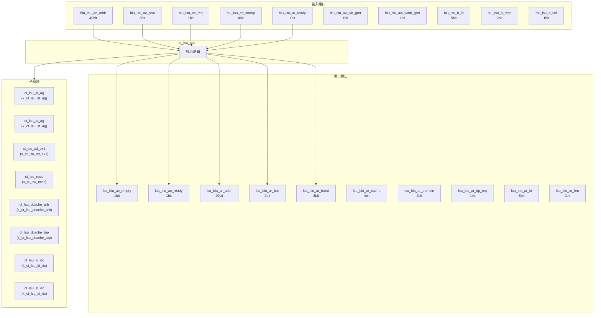

# ct_lsu_top 模块设计文档

## 1. 模块概述

### 1.1 基本信息

| 属性 | 值 |
|------|-----|
| 模块名称 | ct_lsu_top |
| 文件路径 | lsu\rtl\ct_lsu_top.v |
| 层级 | Level 2 |

### 1.2 功能描述

ct_lsu_top 模块的功能描述。

### 1.3 设计特点

- 包含 32 个子模块实例
- 包含 10 个 assign 语句

## 2. 模块接口说明

### 2.1 输入端口

| 信号名 | 方向 | 位宽 | 描述 |
|--------|------|------|------|
| biu_lsu_ac_addr | input | 40 | |
| biu_lsu_ac_prot | input | 3 | |
| biu_lsu_ac_req | input | 1 | |
| biu_lsu_ac_snoop | input | 4 | |
| biu_lsu_ar_ready | input | 1 | |
| biu_lsu_aw_vb_grnt | input | 1 | |
| biu_lsu_aw_wmb_grnt | input | 1 | |
| biu_lsu_b_id | input | 5 | |
| biu_lsu_b_resp | input | 2 | |
| biu_lsu_b_vld | input | 1 | |
| biu_lsu_cd_ready | input | 1 | |
| biu_lsu_cr_ready | input | 1 | |
| biu_lsu_r_data | input | 128 | |
| biu_lsu_r_id | input | 5 | |
| biu_lsu_r_last | input | 1 | |
| biu_lsu_r_resp | input | 4 | |
| biu_lsu_r_vld | input | 1 | |
| biu_lsu_w_vb_grnt | input | 1 | |
| biu_lsu_w_wmb_grnt | input | 1 | |
| cp0_lsu_amr | input | 1 | |
| cp0_lsu_amr2 | input | 1 | |
| cp0_lsu_cb_aclr_dis | input | 1 | |
| cp0_lsu_corr_dis | input | 1 | |
| cp0_lsu_ctc_flush_dis | input | 1 | |
| cp0_lsu_da_fwd_dis | input | 1 | |
| cp0_lsu_dcache_clr | input | 1 | |
| cp0_lsu_dcache_en | input | 1 | |
| cp0_lsu_dcache_inv | input | 1 | |
| cp0_lsu_dcache_pref_dist | input | 2 | |
| cp0_lsu_dcache_pref_en | input | 1 | |
| ... | ... | ... | 共212个输入端口 |

### 2.2 输出端口

| 信号名 | 方向 | 位宽 | 描述 |
|--------|------|------|------|
| lsu_biu_ac_empty | output | 1 | |
| lsu_biu_ac_ready | output | 1 | |
| lsu_biu_ar_addr | output | 40 | |
| lsu_biu_ar_bar | output | 2 | |
| lsu_biu_ar_burst | output | 2 | |
| lsu_biu_ar_cache | output | 4 | |
| lsu_biu_ar_domain | output | 2 | |
| lsu_biu_ar_dp_req | output | 1 | |
| lsu_biu_ar_id | output | 5 | |
| lsu_biu_ar_len | output | 2 | |
| lsu_biu_ar_lock | output | 1 | |
| lsu_biu_ar_prot | output | 3 | |
| lsu_biu_ar_req | output | 1 | |
| lsu_biu_ar_req_gate | output | 1 | |
| lsu_biu_ar_size | output | 3 | |
| lsu_biu_ar_snoop | output | 4 | |
| lsu_biu_ar_user | output | 3 | |
| lsu_biu_aw_req_gate | output | 1 | |
| lsu_biu_aw_st_addr | output | 40 | |
| lsu_biu_aw_st_bar | output | 2 | |
| lsu_biu_aw_st_burst | output | 2 | |
| lsu_biu_aw_st_cache | output | 4 | |
| lsu_biu_aw_st_domain | output | 2 | |
| lsu_biu_aw_st_dp_req | output | 1 | |
| lsu_biu_aw_st_id | output | 5 | |
| lsu_biu_aw_st_len | output | 2 | |
| lsu_biu_aw_st_lock | output | 1 | |
| lsu_biu_aw_st_prot | output | 3 | |
| lsu_biu_aw_st_req | output | 1 | |
| lsu_biu_aw_st_size | output | 3 | |
| ... | ... | ... | 共282个输出端口 |

## 3. 模块框图

### 3.1 模块架构图

### 3.2 主要数据连线

| 源模块 | 目标模块 | 信号名 | 位宽 | 说明 |
|--------|----------|--------|------|------|
| ct_lsu_top | ct_lsu_ld_ag | ag_dcache_arb_ld_data_gateclk_en | - | |
| ct_lsu_top | ct_lsu_ld_ag | ag_dcache_arb_ld_data_high_idx | - | |
| ct_lsu_top | ct_lsu_ld_ag | ag_dcache_arb_ld_data_low_idx | - | |
| ct_lsu_top | ct_lsu_st_ag | ag_dcache_arb_st_dirty_gateclk_en | - | |
| ct_lsu_top | ct_lsu_st_ag | ag_dcache_arb_st_dirty_idx | - | |
| ct_lsu_top | ct_lsu_st_ag | ag_dcache_arb_st_dirty_req | - | |
| ct_lsu_top | ct_lsu_sd_ex1 | cp0_lsu_icg_en | - | |
| ct_lsu_top | ct_lsu_sd_ex1 | cp0_yy_clk_en | - | |
| ct_lsu_top | ct_lsu_sd_ex1 | cpurst_b | - | |
| ct_lsu_top | ct_lsu_mcic | biu_lsu_r_data | - | |
| ct_lsu_top | ct_lsu_mcic | biu_lsu_r_id | - | |
| ct_lsu_top | ct_lsu_mcic | biu_lsu_r_resp | - | |
| ct_lsu_top | ct_lsu_dcache_arb | ag_dcache_arb_ld_data_gateclk_en | - | |
| ct_lsu_top | ct_lsu_dcache_arb | ag_dcache_arb_ld_data_high_idx | - | |
| ct_lsu_top | ct_lsu_dcache_arb | ag_dcache_arb_ld_data_low_idx | - | |
| ct_lsu_top | ct_lsu_dcache_top | cp0_lsu_icg_en | - | |
| ct_lsu_top | ct_lsu_dcache_top | dcache_lsu_ld_data_bank0_dout | - | |
| ct_lsu_top | ct_lsu_dcache_top | dcache_lsu_ld_data_bank1_dout | - | |
| ct_lsu_top | ct_lsu_ld_dc | cb_ld_dc_addr_hit | - | |
| ct_lsu_top | ct_lsu_ld_dc | cp0_lsu_da_fwd_dis | - | |
| ct_lsu_top | ct_lsu_ld_dc | cp0_lsu_dcache_en | - | |
| ct_lsu_top | ct_lsu_st_dc | cp0_lsu_dcache_en | - | |
| ct_lsu_top | ct_lsu_st_dc | cp0_lsu_icg_en | - | |
| ct_lsu_top | ct_lsu_st_dc | cp0_lsu_l2_st_pref_en | - | |
| ct_lsu_top | ct_lsu_lq | cp0_lsu_corr_dis | - | |
| ct_lsu_top | ct_lsu_lq | cp0_lsu_icg_en | - | |
| ct_lsu_top | ct_lsu_lq | cp0_yy_clk_en | - | |
| ct_lsu_top | ct_lsu_sq | cp0_lsu_icg_en | - | |
| ct_lsu_top | ct_lsu_sq | cp0_yy_clk_en | - | |
| ct_lsu_top | ct_lsu_sq | cp0_yy_priv_mode | - | |

## 4. 模块实现方案

### 4.1 关键逻辑描述

无关键 always 块。

**Assign 语句列表:**

| 目标信号 | 源表达式 |
|----------|----------|
| lsu_rtu_wb_pipe3_vsetvl | 1'b0 |
| lsu_rtu_wb_pipe3_vstart_vld | 1'b0 |
| lsu_rtu_wb_pipe4_vstart_vld | 1'b0 |
| lsu_idu_vmb_1_left_updt | 1'b0 |
| lsu_idu_vmb_empty | 1'b1 |
| lsu_idu_vmb_full | 1'b0 |
| lsu_idu_vmb_full_updt | 1'b0 |
| lsu_idu_vmb_full_updt_clk_en | 1'b0 |
| vmb_empty | 1'b1 |
| vmb_ld_wb_data_req | 1'b0 |

## 5. 内部关键信号列表

### 5.1 寄存器信号

无寄存器信号。

### 5.2 线网信号

| 信号名 | 位宽 | 描述 |
|--------|------|------|
| ag_dcache_arb_ld_data_gateclk_en | 8 | |
| ag_dcache_arb_ld_data_high_idx | 11 | |
| ag_dcache_arb_ld_data_low_idx | 11 | |
| ag_dcache_arb_ld_data_req | 8 | |
| ag_dcache_arb_ld_tag_gateclk_en | 1 | |
| ag_dcache_arb_ld_tag_idx | 9 | |
| ag_dcache_arb_ld_tag_req | 1 | |
| ag_dcache_arb_st_dirty_gateclk_en | 1 | |
| ag_dcache_arb_st_dirty_idx | 9 | |
| ag_dcache_arb_st_dirty_req | 1 | |
| ag_dcache_arb_st_tag_gateclk_en | 1 | |
| ag_dcache_arb_st_tag_idx | 9 | |
| ag_dcache_arb_st_tag_req | 1 | |
| amr_l2_mem_set | 1 | |
| amr_wa_cancel | 1 | |
| arb_ctcq_ctc_2nd_trans | 1 | |
| arb_ctcq_ctc_asid_va | 24 | |
| arb_ctcq_ctc_type | 6 | |
| arb_ctcq_ctc_va_pa | 36 | |
| arb_ctcq_entry_oldest_index | 6 | |
| ... | ... | 共1255个线网信号 |

## 6. 子模块方案

### 6.1 模块例化层次结构

```mermaid
graph TD
    ROOT["当前模块"]
    N0["ct_lsu_ld_ag\n(x_ct_lsu_ld_ag)"]
    ROOT --> N0
    N1["ct_lsu_st_ag\n(x_ct_lsu_st_ag)"]
    ROOT --> N1
    N2["ct_lsu_sd_ex1\n(x_ct_lsu_sd_ex1)"]
    ROOT --> N2
    N3["ct_lsu_mcic\n(x_ct_lsu_mcic)"]
    ROOT --> N3
    N4["ct_lsu_dcache_arb\n(x_ct_lsu_dcache_arb)"]
    ROOT --> N4
    N5["ct_lsu_dcache_top\n(x_ct_lsu_dcache_top)"]
    ROOT --> N5
    N6["ct_lsu_ld_dc\n(x_ct_lsu_ld_dc)"]
    ROOT --> N6
    N7["ct_lsu_st_dc\n(x_ct_lsu_st_dc)"]
    ROOT --> N7
    N8["ct_lsu_lq\n(x_ct_lsu_lq)"]
    ROOT --> N8
    N9["ct_lsu_sq\n(x_ct_lsu_sq)"]
    ROOT --> N9
    N10["ct_lsu_ld_da\n(x_ct_lsu_ld_da)"]
    ROOT --> N10
    N11["ct_lsu_st_da\n(x_ct_lsu_st_da)"]
    ROOT --> N11
    N12["ct_lsu_rb\n(x_ct_lsu_rb)"]
    ROOT --> N12
    N13["ct_lsu_wmb\n(x_ct_lsu_wmb)"]
    ROOT --> N13
    N14["ct_lsu_wmb_ce\n(x_ct_lsu_wmb_ce)"]
    ROOT --> N14
```

### 6.2 子模块列表

| 层级 | 模块名 | 实例名 | 功能描述 |
|------|--------|--------|----------|
| 1 | ct_lsu_ld_ag | x_ct_lsu_ld_ag | |
| 1 | ct_lsu_st_ag | x_ct_lsu_st_ag | |
| 1 | ct_lsu_sd_ex1 | x_ct_lsu_sd_ex1 | |
| 1 | ct_lsu_mcic | x_ct_lsu_mcic | |
| 1 | ct_lsu_dcache_arb | x_ct_lsu_dcache_arb | |
| 1 | ct_lsu_dcache_top | x_ct_lsu_dcache_top | |
| 1 | ct_lsu_ld_dc | x_ct_lsu_ld_dc | |
| 1 | ct_lsu_st_dc | x_ct_lsu_st_dc | |
| 1 | ct_lsu_lq | x_ct_lsu_lq | |
| 1 | ct_lsu_sq | x_ct_lsu_sq | |
| 1 | ct_lsu_ld_da | x_ct_lsu_ld_da | |
| 1 | ct_lsu_st_da | x_ct_lsu_st_da | |
| 1 | ct_lsu_rb | x_ct_lsu_rb | |
| 1 | ct_lsu_wmb | x_ct_lsu_wmb | |
| 1 | ct_lsu_wmb_ce | x_ct_lsu_wmb_ce | |
| 1 | ct_lsu_ld_wb | x_ct_lsu_ld_wb | |
| 1 | ct_lsu_st_wb | x_ct_lsu_st_wb | |
| 1 | ct_lsu_lfb | x_ct_lsu_lfb | |
| 1 | ct_lsu_vb | x_ct_lsu_vb | |
| 1 | ct_lsu_vb_sdb_data | x_ct_lsu_vb_sdb_data | |
| ... | ... | ... | 共32个实例 |

## 7. 修订历史

| 版本 | 日期 | 作者 | 说明 |
|------|------|------|------|
| 1.0 | 2026-03-12 | Auto-generated | 初始版本 |
