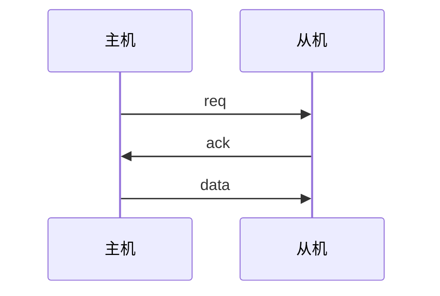
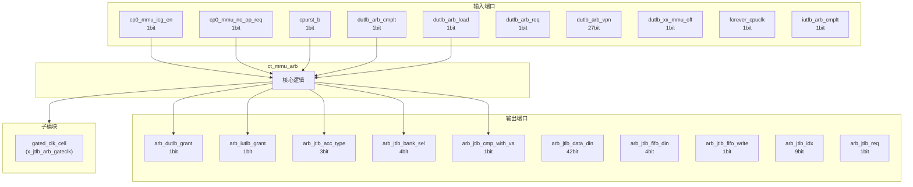
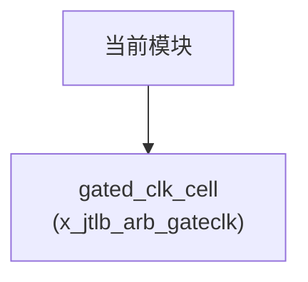

# ct_mmu_arb 模块设计文档

## 1. 模块概述

### 1.1 基本信息

| 属性 | 值 |
|------|-----|
| 模块名称 | ct_mmu_arb |
| 文件路径 | mmu\rtl\ct_mmu_arb.v |
| 层级 | Level 2 |
| 参数 | VPN_WIDTH=39-12, PPN_WIDTH=40-12, FLG_WIDTH=14, PGS_WIDTH=3, ASID_WIDTH=16... |

### 1.2 功能描述

内存管理单元 (Memory Management Unit)，(仲裁器)，主要信号: 授权信号、使能信号、操作码、输入信号、选择信号

### 1.3 设计特点

- 包含 1 个子模块实例
- 包含 3 个 always 块
- 包含 25 个 assign 语句
- 可配置参数: 8 个

## 2. 模块接口说明

### 2.1 输入端口

| 信号名 | 方向 | 位宽 | 描述 |
|--------|------|------|------|
| cp0_mmu_icg_en | input | 1 | 使能信号 |
| cp0_mmu_no_op_req | input | 1 | 请求信号 |
| cpurst_b | input | 1 | 复位信号 |
| dutlb_arb_cmplt | input | 1 |  |
| dutlb_arb_load | input | 1 |  |
| dutlb_arb_req | input | 1 | 请求信号 |
| dutlb_arb_vpn | input | 27 |  |
| dutlb_xx_mmu_off | input | 1 |  |
| forever_cpuclk | input | 1 | 时钟信号 |
| iutlb_arb_cmplt | input | 1 |  |
| iutlb_arb_req | input | 1 | 请求信号 |
| iutlb_arb_vpn | input | 27 |  |
| jtlb_arb_cmp_va | input | 1 |  |
| jtlb_arb_par_clr | input | 1 |  |
| jtlb_arb_pfu_cmplt | input | 1 |  |
| jtlb_arb_pfu_vpn | input | 27 |  |
| jtlb_arb_sel_1g | input | 1 | 选择信号 |
| jtlb_arb_sel_2m | input | 1 | 选择信号 |
| jtlb_arb_sel_4k | input | 1 | 选择信号 |
| jtlb_arb_tc_miss | input | 1 | 未命中信号 |
| jtlb_arb_type | input | 3 |  |
| jtlb_arb_vpn | input | 27 |  |
| lsu_mmu_va2_vld | input | 1 | 有效信号 |
| pad_yy_icg_scan_en | input | 1 | 使能信号 |
| ptw_arb_bank_sel | input | 4 | 选择信号 |
| ptw_arb_data_din | input | 42 | 数据信号 |
| ptw_arb_fifo_din | input | 4 | 输入信号 |
| ptw_arb_pgs | input | 3 |  |
| ptw_arb_req | input | 1 | 请求信号 |
| ptw_arb_tag_din | input | 48 | 标签信号 |
| ... | ... | ... | 共45个输入端口 |

### 2.2 输出端口

| 信号名 | 方向 | 位宽 | 描述 |
|--------|------|------|------|
| arb_dutlb_grant | output | 1 | 授权信号 |
| arb_iutlb_grant | output | 1 | 授权信号 |
| arb_jtlb_acc_type | output | 3 |  |
| arb_jtlb_bank_sel | output | 4 | 选择信号 |
| arb_jtlb_cmp_with_va | output | 1 |  |
| arb_jtlb_data_din | output | 42 | 数据信号 |
| arb_jtlb_fifo_din | output | 4 | 输入信号 |
| arb_jtlb_fifo_write | output | 1 |  |
| arb_jtlb_idx | output | 9 |  |
| arb_jtlb_req | output | 1 | 请求信号 |
| arb_jtlb_tag_din | output | 48 | 标签信号 |
| arb_jtlb_vpn | output | 27 |  |
| arb_jtlb_write | output | 1 |  |
| arb_ptw_grant | output | 1 | 授权信号 |
| arb_ptw_mask | output | 1 | 掩码信号 |
| arb_tlboper_grant | output | 1 | 操作码 |
| arb_top_cur_st | output | 2 | 操作码 |
| arb_top_tlboper_on | output | 1 | 操作码 |
| mmu_yy_xx_no_op | output | 1 | 操作码 |

### 2.4 参数列表

| 参数名 | 默认值 | 位宽 | 描述 |
|--------|--------|------|------|
| VPN_WIDTH | 39-12 | 1 | |
| PPN_WIDTH | 40-12 | 1 | |
| FLG_WIDTH | 14 | 1 | |
| PGS_WIDTH | 3 | 1 | |
| ASID_WIDTH | 16 | 1 | |
| TAG_WIDTH | 1+VPN_WIDTH+ASID_WIDTH+PGS_WIDTH+1 | 1 | |
| DATA_WIDTH | PPN_WIDTH+FLG_WIDTH | 1 | |
| ARB_IDLE | 2'b00 | 1 | |

### 2.5 接口时序图



## 3. 模块框图

### 3.1 模块架构图



### 3.2 主要数据连线

| 源模块 | 目标模块 | 信号名 | 位宽 | 说明 |
|--------|----------|--------|------|------|
| ct_mmu_arb | gated_clk_cell | clk_in | - | |
| ct_mmu_arb | gated_clk_cell | clk_out | - | |
| ct_mmu_arb | gated_clk_cell | external_en | - | |

## 4. 模块实现方案

### 4.1 关键逻辑描述

**Always 块列表:**

```verilog
always @(posedge arb_clk or negedge cpurst_b) begin
  // ...
end
```

```verilog
always @(arb_cur_st
       or dutlb_arb_cmplt
       or arb_iutlb_grant
       or iutlb_arb_cmplt
       or jtlb_arb_pfu_cmplt
       or arb_pfu_grant
       or arb_dutlb_grant) begin
  // ...
end
```

```verilog
always @(posedge arb_clk or negedge cpurst_b) begin
  // ...
end
```


**Assign 语句列表:**

| 目标信号 | 源表达式 |
|----------|----------|
| arb_clk_en | iutlb_arb_req 
                 || dutlb_arb_req
                 || tlboper_arb_req
                 || lsu_mmu_va2_vld
                 || utlb_mask |
| arb_pfu_grant | lsu_mmu_va2_vld 
                     && !dutlb_xx_mmu_off 
                     && !iutlb_arb_req
                     && !dutlb_arb_req
                     && !tlboper_arb_req
                     && !ptw_arb_req
                     && !utlb_mask |
| arb_iutlb_grant | iutlb_arb_req
                     && !dutlb_arb_req
                     && !tlboper_arb_req
                     && !ptw_arb_req
                     && !utlb_mask |
| arb_dutlb_grant | dutlb_arb_req
                     && !tlboper_arb_req
                     && !ptw_arb_req
                     && !utlb_mask |
| arb_tlboper_grant | tlboper_arb_req
                     && !ptw_arb_req
                     && jtlb_arb_sel_4k |
| arb_ptw_grant | ptw_arb_req |
| arb_jtlb_req | arb_iutlb_grant
                    || arb_pfu_grant
                    || arb_dutlb_grant
                    || arb_tlboper_grant
                    || arb_ptw_grant
                    || arb_read_huge
                    || arb_par_clr |
| utlb_mask | (arb_cur_st[1:0] != ARB_IDLE)
                     || tlboper_on |
| utlb_refill_on | (arb_cur_st[1:0] != ARB_IDLE) |
| arb_ptw_mask | tlboper_on |
| mmu_yy_xx_no_op | cp0_mmu_no_op_req
                      && !utlb_refill_on |
| arb_read_huge | (jtlb_arb_sel_2m || jtlb_arb_sel_1g) && jtlb_arb_tc_miss |
| arb_idx_sel_4k | tlboper_xx_pgs_en ? tlboper_xx_pgs[0] :
                        arb_ptw_grant ? ptw_arb_pgs[0] :
                        arb_par_clr ? jtlb_arb_sel_2m : jtlb_arb_sel_4k |
| arb_idx_sel_2m | tlboper_xx_pgs_en ? tlboper_xx_pgs[1] : 
                        arb_ptw_grant ? ptw_arb_pgs[1] :
                        arb_par_clr ? jtlb_arb_sel_1g : jtlb_arb_sel_2m |
| arb_idx_sel_1g | tlboper_xx_pgs_en ? tlboper_xx_pgs[2] : 
                        arb_ptw_grant ? ptw_arb_pgs[2] :
                        arb_par_clr ? !jtlb_arb_sel_1g && !jtlb_arb_sel_2m : jtlb_arb_sel_1g |
| ... | 共25条assign语句 |

## 5. 内部关键信号列表

### 5.1 寄存器信号

| 信号名 | 位宽 | 描述 |
|--------|------|------|
| arb_cur_st | 2 | |
| arb_nxt_st | 2 | |
| tlboper_on | 1 | |

### 5.2 线网信号

| 信号名 | 位宽 | 描述 |
|--------|------|------|
| arb_clk | 1 | |
| arb_clk_en | 1 | |
| arb_idx_sel_1g | 1 | |
| arb_idx_sel_2m | 1 | |
| arb_idx_sel_4k | 1 | |
| arb_load_grant | 1 | |
| arb_par_clr | 1 | |
| arb_pfu_grant | 1 | |
| arb_read_huge | 1 | |
| arb_store_grant | 1 | |
| arb_va_index | 9 | |
| arb_vpn | 27 | |
| tlboper_fifo_wen | 1 | |
| tlboper_idx_not_va_sel | 1 | |
| tlboper_wen | 1 | |
| utlb_mask | 1 | |
| utlb_refill_on | 1 | |

## 6. 子模块方案

### 6.1 模块例化层次结构



### 6.2 子模块列表

| 层级 | 模块名 | 实例名 | 功能描述 |
|------|--------|--------|----------|
| 1 | gated_clk_cell | x_jtlb_arb_gateclk |  |

## 7. 修订历史

| 版本 | 日期 | 作者 | 说明 |
|------|------|------|------|
| 1.0 | 2026-03-12 | Auto-generated | 初始版本 |
