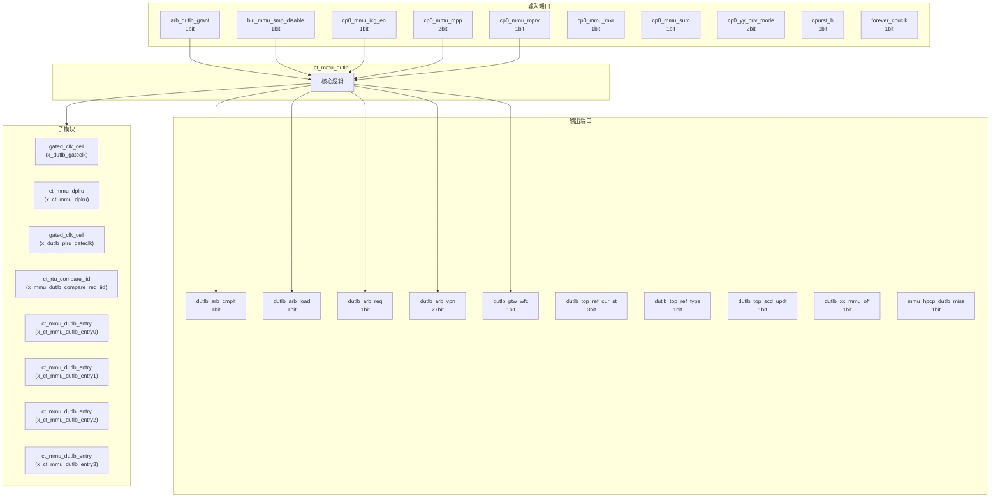

# ct_mmu_dutlb 模块设计文档

## 1. 模块概述

### 1.1 基本信息

| 属性 | 值 |
|------|-----|
| 模块名称 | ct_mmu_dutlb |
| 文件路径 | mmu\rtl\ct_mmu_dutlb.v |
| 层级 | Level 2 |
| 参数 | VPN_WIDTH=39-12, PPN_WIDTH=40-12, FLG_WIDTH=14, PGS_WIDTH=3, LSIQ_ENTRY=12... |

### 1.2 功能描述

ct_mmu_dutlb 模块的功能描述。

### 1.3 设计特点

- 包含 23 个子模块实例
- 包含 9 个 always 块
- 包含 43 个 assign 语句
- 可配置参数: 8 个

## 2. 模块接口说明

### 2.1 输入端口

| 信号名 | 方向 | 位宽 | 描述 |
|--------|------|------|------|
| arb_dutlb_grant | input | 1 | |
| biu_mmu_smp_disable | input | 1 | |
| cp0_mmu_icg_en | input | 1 | |
| cp0_mmu_mpp | input | 2 | |
| cp0_mmu_mprv | input | 1 | |
| cp0_mmu_mxr | input | 1 | |
| cp0_mmu_sum | input | 1 | |
| cp0_yy_priv_mode | input | 2 | |
| cpurst_b | input | 1 | |
| forever_cpuclk | input | 1 | |
| hpcp_mmu_cnt_en | input | 1 | |
| jtlb_dutlb_acc_err | input | 1 | |
| jtlb_dutlb_pgflt | input | 1 | |
| jtlb_dutlb_ref_cmplt | input | 1 | |
| jtlb_dutlb_ref_pavld | input | 1 | |
| jtlb_utlb_ref_flg | input | 14 | |
| jtlb_utlb_ref_pgs | input | 3 | |
| jtlb_utlb_ref_ppn | input | 28 | |
| jtlb_utlb_ref_vpn | input | 27 | |
| lsu_mmu_abort0 | input | 1 | |
| lsu_mmu_abort1 | input | 1 | |
| lsu_mmu_id0 | input | 7 | |
| lsu_mmu_id1 | input | 7 | |
| lsu_mmu_st_inst0 | input | 1 | |
| lsu_mmu_st_inst1 | input | 1 | |
| lsu_mmu_stamo_pa | input | 28 | |
| lsu_mmu_stamo_vld | input | 1 | |
| lsu_mmu_tlb_va | input | 27 | |
| lsu_mmu_va0 | input | 64 | |
| lsu_mmu_va0_vld | input | 1 | |
| ... | ... | ... | 共45个输入端口 |

### 2.2 输出端口

| 信号名 | 方向 | 位宽 | 描述 |
|--------|------|------|------|
| dutlb_arb_cmplt | output | 1 | |
| dutlb_arb_load | output | 1 | |
| dutlb_arb_req | output | 1 | |
| dutlb_arb_vpn | output | 27 | |
| dutlb_ptw_wfc | output | 1 | |
| dutlb_top_ref_cur_st | output | 3 | |
| dutlb_top_ref_type | output | 1 | |
| dutlb_top_scd_updt | output | 1 | |
| dutlb_xx_mmu_off | output | 1 | |
| mmu_hpcp_dutlb_miss | output | 1 | |
| mmu_lsu_access_fault0 | output | 1 | |
| mmu_lsu_access_fault1 | output | 1 | |
| mmu_lsu_buf0 | output | 1 | |
| mmu_lsu_buf1 | output | 1 | |
| mmu_lsu_ca0 | output | 1 | |
| mmu_lsu_ca1 | output | 1 | |
| mmu_lsu_pa0 | output | 28 | |
| mmu_lsu_pa0_vld | output | 1 | |
| mmu_lsu_pa1 | output | 28 | |
| mmu_lsu_pa1_vld | output | 1 | |
| mmu_lsu_page_fault0 | output | 1 | |
| mmu_lsu_page_fault1 | output | 1 | |
| mmu_lsu_sec0 | output | 1 | |
| mmu_lsu_sec1 | output | 1 | |
| mmu_lsu_sh0 | output | 1 | |
| mmu_lsu_sh1 | output | 1 | |
| mmu_lsu_so0 | output | 1 | |
| mmu_lsu_so1 | output | 1 | |
| mmu_lsu_stall0 | output | 1 | |
| mmu_lsu_stall1 | output | 1 | |
| ... | ... | ... | 共36个输出端口 |

### 2.4 参数列表

| 参数名 | 默认值 | 位宽 | 描述 |
|--------|--------|------|------|
| VPN_WIDTH | 39-12 | 1 | |
| PPN_WIDTH | 40-12 | 1 | |
| FLG_WIDTH | 14 | 1 | |
| PGS_WIDTH | 3 | 1 | |
| LSIQ_ENTRY | 12 | 1 | |
| IID_WIDTH | 7 | 1 | |
| LVL_WIDTH | 9 | 1 | |
| IDLE | 3'b000 | 1 | |

## 3. 模块框图

### 3.1 模块架构图



### 3.2 主要数据连线

| 源模块 | 目标模块 | 信号名 | 位宽 | 说明 |
|--------|----------|--------|------|------|
| ct_mmu_dutlb | gated_clk_cell | clk_in | - | |
| ct_mmu_dutlb | gated_clk_cell | clk_out | - | |
| ct_mmu_dutlb | gated_clk_cell | external_en | - | |
| ct_mmu_dutlb | ct_mmu_dplru | cp0_mmu_icg_en | - | |
| ct_mmu_dutlb | ct_mmu_dplru | cpurst_b | - | |
| ct_mmu_dutlb | ct_mmu_dplru | entry0_vld | - | |
| ct_mmu_dutlb | gated_clk_cell | clk_in | - | |
| ct_mmu_dutlb | gated_clk_cell | clk_out | - | |
| ct_mmu_dutlb | gated_clk_cell | external_en | - | |
| ct_mmu_dutlb | ct_rtu_compare_iid | x_iid0 | - | |
| ct_mmu_dutlb | ct_rtu_compare_iid | x_iid0_older | - | |
| ct_mmu_dutlb | ct_rtu_compare_iid | x_iid1 | - | |
| ct_mmu_dutlb | ct_mmu_dutlb_entry | cp0_mmu_icg_en | - | |
| ct_mmu_dutlb | ct_mmu_dutlb_entry | cpurst_b | - | |
| ct_mmu_dutlb | ct_mmu_dutlb_entry | lsu_mmu_tlb_va | - | |
| ct_mmu_dutlb | ct_mmu_dutlb_entry | cp0_mmu_icg_en | - | |
| ct_mmu_dutlb | ct_mmu_dutlb_entry | cpurst_b | - | |
| ct_mmu_dutlb | ct_mmu_dutlb_entry | lsu_mmu_tlb_va | - | |
| ct_mmu_dutlb | ct_mmu_dutlb_entry | cp0_mmu_icg_en | - | |
| ct_mmu_dutlb | ct_mmu_dutlb_entry | cpurst_b | - | |
| ct_mmu_dutlb | ct_mmu_dutlb_entry | lsu_mmu_tlb_va | - | |
| ct_mmu_dutlb | ct_mmu_dutlb_entry | cp0_mmu_icg_en | - | |
| ct_mmu_dutlb | ct_mmu_dutlb_entry | cpurst_b | - | |
| ct_mmu_dutlb | ct_mmu_dutlb_entry | lsu_mmu_tlb_va | - | |
| ct_mmu_dutlb | ct_mmu_dutlb_entry | cp0_mmu_icg_en | - | |
| ct_mmu_dutlb | ct_mmu_dutlb_entry | cpurst_b | - | |
| ct_mmu_dutlb | ct_mmu_dutlb_entry | lsu_mmu_tlb_va | - | |
| ct_mmu_dutlb | ct_mmu_dutlb_entry | cp0_mmu_icg_en | - | |
| ct_mmu_dutlb | ct_mmu_dutlb_entry | cpurst_b | - | |
| ct_mmu_dutlb | ct_mmu_dutlb_entry | lsu_mmu_tlb_va | - | |

## 4. 模块实现方案

### 4.1 关键逻辑描述

**Always 块列表:**

```verilog
always @(posedge dutlb_clk or negedge cpurst_b) begin
  // ...
end
```

```verilog
always @(ref_cur_st
       or dutlb_inst_id_older
       or jtlb_dutlb_acc_err
       or jtlb_dutlb_pgflt
       or arb_dutlb_grant
       or dutlb_miss_vld
       or jtlb_dutlb_ref_cmplt
       or rtu_yy_xx_flush
       or dutlb_inst_id_match) begin
  // ...
end
```

```verilog
always @(posedge dutlb_clk or negedge cpurst_b) begin
  // ...
end
```

```verilog
always @(posedge dutlb_clk or negedge cpurst_b) begin
  // ...
end
```

```verilog
always @(posedge dutlb_clk or negedge cpurst_b) begin
  // ...
end
```


**Assign 语句列表:**

| 目标信号 | 源表达式 |
|----------|----------|
| dutlb_clk_en | dutlb_miss_vld_short0
                   || dutlb_miss_vld_short1
                   || dutlb_acc_flt0
                   || dutlb_acc_flt1
                   || dutlb_refill_on
                   || dutlb_miss |
| cp0_user_mode | cp0_priv_mode[1:0] == 2'b00 |
| cp0_supv_mode | cp0_priv_mode[1:0] == 2'b01 |
| cp0_mach_mode | cp0_priv_mode[1:0] == 2'b11 |
| mmu_lsu_tlb_busy | dutlb_refill_on |
| dutlb_plru_refill_on | dutlb_wfc |
| dutlb_plru_refill_vld | dutlb_refill_vld |
| dplru_clk_en | dutlb_va_chg0 || dutlb_va_chg1 |
| dutlb_miss_vld | dutlb_miss_vld0 || dutlb_miss_vld1 |
| dutlb_arb_req | (ref_cur_st[2:0] == WFG) |
| dutlb_arb_load | refill_read |
| dutlb_refill_on0 | (ref_cur_st[2:0] != IDLE) &&  refill_type |
| dutlb_refill_on1 | (ref_cur_st[2:0] != IDLE) && !refill_type |
| dutlb_wfc | (ref_cur_st[2:0] == WFC) |
| dutlb_refill_vld | dutlb_wfc && jtlb_dutlb_ref_pavld |
| ... | 共43条assign语句 |

## 5. 内部关键信号列表

### 5.1 寄存器信号

| 信号名 | 位宽 | 描述 |
|--------|------|------|
| dutlb_miss | 1 | |
| ref_cur_st | 3 | |
| ref_nxt_st | 3 | |
| refill_id_flop0 | 7 | |
| refill_id_flop1 | 7 | |
| refill_read | 1 | |
| refill_type | 1 | |
| refill_va_flop0 | 27 | |
| refill_va_flop1 | 27 | |

### 5.2 线网信号

| 信号名 | 位宽 | 描述 |
|--------|------|------|
| cp0_mach_mode | 1 | |
| cp0_priv_mode | 2 | |
| cp0_supv_mode | 1 | |
| cp0_user_mode | 1 | |
| dplru_clk | 1 | |
| dplru_clk_en | 1 | |
| dutlb_acc_flt0 | 1 | |
| dutlb_acc_flt1 | 1 | |
| dutlb_clk | 1 | |
| dutlb_clk_en | 1 | |
| dutlb_expt_for_taken | 1 | |
| dutlb_inst_id_match | 1 | |
| dutlb_inst_id_match0 | 1 | |
| dutlb_inst_id_match1 | 1 | |
| dutlb_inst_id_older | 1 | |
| dutlb_inst_id_older0 | 1 | |
| dutlb_inst_id_older1 | 1 | |
| dutlb_miss_cnt | 1 | |
| dutlb_miss_vld | 1 | |
| dutlb_miss_vld0 | 1 | |
| ... | ... | 共164个线网信号 |

## 6. 子模块方案

### 6.1 模块例化层次结构

```mermaid
graph TD
    ROOT["当前模块"]
    N0["gated_clk_cell\n(x_dutlb_gateclk)"]
    ROOT --> N0
    N1["ct_mmu_dplru\n(x_ct_mmu_dplru)"]
    ROOT --> N1
    N2["gated_clk_cell\n(x_dutlb_plru_gateclk)"]
    ROOT --> N2
    N3["ct_rtu_compare_iid\n(x_mmu_dutlb_compare_req_iid)"]
    ROOT --> N3
    N4["ct_mmu_dutlb_entry\n(x_ct_mmu_dutlb_entry0)"]
    ROOT --> N4
    N5["ct_mmu_dutlb_entry\n(x_ct_mmu_dutlb_entry1)"]
    ROOT --> N5
    N6["ct_mmu_dutlb_entry\n(x_ct_mmu_dutlb_entry2)"]
    ROOT --> N6
    N7["ct_mmu_dutlb_entry\n(x_ct_mmu_dutlb_entry3)"]
    ROOT --> N7
    N8["ct_mmu_dutlb_entry\n(x_ct_mmu_dutlb_entry4)"]
    ROOT --> N8
    N9["ct_mmu_dutlb_entry\n(x_ct_mmu_dutlb_entry5)"]
    ROOT --> N9
    N10["ct_mmu_dutlb_entry\n(x_ct_mmu_dutlb_entry6)"]
    ROOT --> N10
    N11["ct_mmu_dutlb_entry\n(x_ct_mmu_dutlb_entry7)"]
    ROOT --> N11
    N12["ct_mmu_dutlb_entry\n(x_ct_mmu_dutlb_entry8)"]
    ROOT --> N12
    N13["ct_mmu_dutlb_entry\n(x_ct_mmu_dutlb_entry9)"]
    ROOT --> N13
    N14["ct_mmu_dutlb_entry\n(x_ct_mmu_dutlb_entry10)"]
    ROOT --> N14
```



### 6.2 子模块列表

| 层级 | 模块名 | 实例名 | 功能描述 |
|------|--------|--------|----------|
| 1 | gated_clk_cell | x_dutlb_gateclk | |
| 1 | ct_mmu_dplru | x_ct_mmu_dplru | |
| 1 | gated_clk_cell | x_dutlb_plru_gateclk | |
| 1 | ct_rtu_compare_iid | x_mmu_dutlb_compare_req_iid | |
| 1 | ct_mmu_dutlb_entry | x_ct_mmu_dutlb_entry0 | |
| 1 | ct_mmu_dutlb_entry | x_ct_mmu_dutlb_entry1 | |
| 1 | ct_mmu_dutlb_entry | x_ct_mmu_dutlb_entry2 | |
| 1 | ct_mmu_dutlb_entry | x_ct_mmu_dutlb_entry3 | |
| 1 | ct_mmu_dutlb_entry | x_ct_mmu_dutlb_entry4 | |
| 1 | ct_mmu_dutlb_entry | x_ct_mmu_dutlb_entry5 | |
| 1 | ct_mmu_dutlb_entry | x_ct_mmu_dutlb_entry6 | |
| 1 | ct_mmu_dutlb_entry | x_ct_mmu_dutlb_entry7 | |
| 1 | ct_mmu_dutlb_entry | x_ct_mmu_dutlb_entry8 | |
| 1 | ct_mmu_dutlb_entry | x_ct_mmu_dutlb_entry9 | |
| 1 | ct_mmu_dutlb_entry | x_ct_mmu_dutlb_entry10 | |
| 1 | ct_mmu_dutlb_entry | x_ct_mmu_dutlb_entry11 | |
| 1 | ct_mmu_dutlb_entry | x_ct_mmu_dutlb_entry12 | |
| 1 | ct_mmu_dutlb_entry | x_ct_mmu_dutlb_entry13 | |
| 1 | ct_mmu_dutlb_entry | x_ct_mmu_dutlb_entry14 | |
| 1 | ct_mmu_dutlb_entry | x_ct_mmu_dutlb_entry15 | |
| ... | ... | ... | 共23个实例 |

## 7. 修订历史

| 版本 | 日期 | 作者 | 说明 |
|------|------|------|------|
| 1.0 | 2026-03-12 | Auto-generated | 初始版本 |
