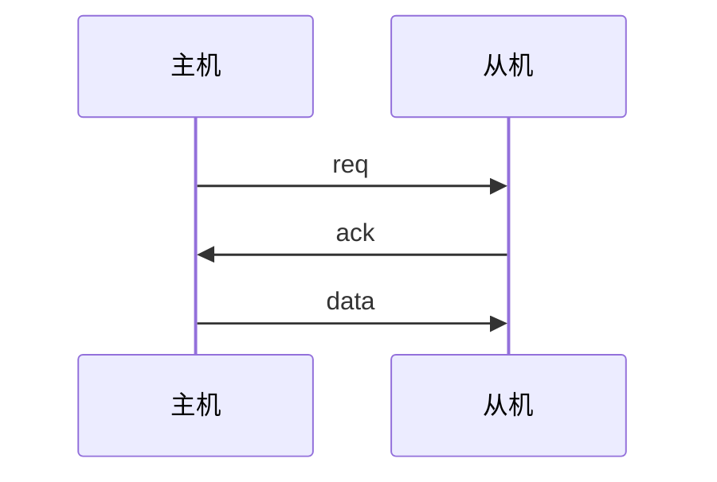
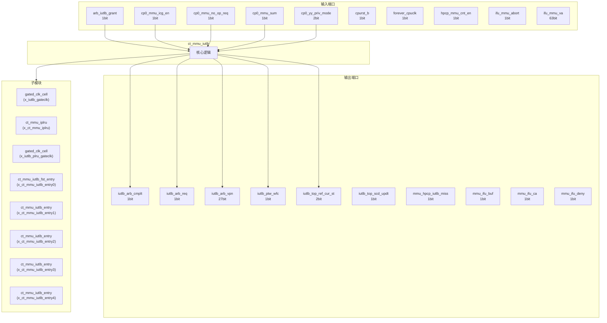

# ct_mmu_iutlb 模块设计文档

## 1. 模块概述

### 1.1 基本信息

| 属性 | 值 |
|------|-----|
| 模块名称 | ct_mmu_iutlb |
| 文件路径 | mmu\rtl\ct_mmu_iutlb.v |
| 层级 | Level 2 |
| 参数 | VPN_WIDTH=39-12, PPN_WIDTH=40-12, FLG_WIDTH=14, PGS_WIDTH=3, VPN_PERLEL=9... |

### 1.2 功能描述

内存管理单元 (Memory Management Unit)，(指令微TLB)，主要信号: 授权信号、使能信号、操作码、读使能、错误信号

### 1.3 设计特点

- 包含 36 个子模块实例
- 包含 8 个 always 块
- 包含 41 个 assign 语句
- 可配置参数: 6 个

## 2. 模块接口说明

### 2.1 输入端口

| 信号名 | 方向 | 位宽 | 描述 |
|--------|------|------|------|
| arb_iutlb_grant | input | 1 | 授权信号 |
| cp0_mmu_icg_en | input | 1 | 使能信号 |
| cp0_mmu_no_op_req | input | 1 | 请求信号 |
| cp0_mmu_sum | input | 1 |  |
| cp0_yy_priv_mode | input | 2 |  |
| cpurst_b | input | 1 | 复位信号 |
| forever_cpuclk | input | 1 | 时钟信号 |
| hpcp_mmu_cnt_en | input | 1 | 使能信号 |
| ifu_mmu_abort | input | 1 |  |
| ifu_mmu_va | input | 63 |  |
| ifu_mmu_va_vld | input | 1 | 有效信号 |
| jtlb_iutlb_acc_err | input | 1 | 错误信号 |
| jtlb_iutlb_pgflt | input | 1 |  |
| jtlb_iutlb_ref_cmplt | input | 1 | 读使能 |
| jtlb_iutlb_ref_pavld | input | 1 | 有效信号 |
| jtlb_utlb_ref_flg | input | 14 | 读使能 |
| jtlb_utlb_ref_pgs | input | 3 | 读使能 |
| jtlb_utlb_ref_ppn | input | 28 | 读使能 |
| jtlb_utlb_ref_vpn | input | 27 | 读使能 |
| lsu_mmu_tlb_va | input | 27 |  |
| pad_yy_icg_scan_en | input | 1 | 使能信号 |
| pmp_mmu_flg2 | input | 4 |  |
| regs_mmu_en | input | 1 | 使能信号 |
| regs_utlb_clr | input | 1 | 读使能 |
| sysmap_mmu_flg2 | input | 5 |  |
| tlboper_utlb_clr | input | 1 | 操作码 |
| tlboper_utlb_inv_va_req | input | 1 | 请求信号 |
| utlb_clk | input | 1 | 时钟信号 |

### 2.2 输出端口

| 信号名 | 方向 | 位宽 | 描述 |
|--------|------|------|------|
| iutlb_arb_cmplt | output | 1 |  |
| iutlb_arb_req | output | 1 | 请求信号 |
| iutlb_arb_vpn | output | 27 |  |
| iutlb_ptw_wfc | output | 1 |  |
| iutlb_top_ref_cur_st | output | 2 | 读使能 |
| iutlb_top_scd_updt | output | 1 | 操作码 |
| mmu_hpcp_iutlb_miss | output | 1 | 程序计数器 |
| mmu_ifu_buf | output | 1 |  |
| mmu_ifu_ca | output | 1 |  |
| mmu_ifu_deny | output | 1 | 使能信号 |
| mmu_ifu_pa | output | 28 |  |
| mmu_ifu_pavld | output | 1 | 有效信号 |
| mmu_ifu_pgflt | output | 1 |  |
| mmu_ifu_sec | output | 1 |  |
| mmu_pmp_pa2 | output | 28 |  |
| mmu_sysmap_pa2 | output | 28 |  |

### 2.4 参数列表

| 参数名 | 默认值 | 位宽 | 描述 |
|--------|--------|------|------|
| VPN_WIDTH | 39-12 | 1 | |
| PPN_WIDTH | 40-12 | 1 | |
| FLG_WIDTH | 14 | 1 | |
| PGS_WIDTH | 3 | 1 | |
| VPN_PERLEL | 9 | 1 | |
| IDLE | 3'b000 | 1 | |

### 2.5 接口时序图



## 3. 模块框图

### 3.1 模块架构图



### 3.2 主要数据连线

| 源模块 | 目标模块 | 信号名 | 位宽 | 说明 |
|--------|----------|--------|------|------|
| ct_mmu_iutlb | gated_clk_cell | clk_in | - | |
| ct_mmu_iutlb | gated_clk_cell | clk_out | - | |
| ct_mmu_iutlb | gated_clk_cell | external_en | - | |
| ct_mmu_iutlb | ct_mmu_iplru | cp0_mmu_icg_en | - | |
| ct_mmu_iutlb | ct_mmu_iplru | cpurst_b | - | |
| ct_mmu_iutlb | ct_mmu_iplru | entry0_vld | - | |
| ct_mmu_iutlb | gated_clk_cell | clk_in | - | |
| ct_mmu_iutlb | gated_clk_cell | clk_out | - | |
| ct_mmu_iutlb | gated_clk_cell | external_en | - | |
| ct_mmu_iutlb | ct_mmu_iutlb_fst_entry | cp0_mmu_icg_en | - | |
| ct_mmu_iutlb | ct_mmu_iutlb_fst_entry | cpurst_b | - | |
| ct_mmu_iutlb | ct_mmu_iutlb_fst_entry | lsu_mmu_tlb_va | - | |
| ct_mmu_iutlb | ct_mmu_iutlb_entry | cp0_mmu_icg_en | - | |
| ct_mmu_iutlb | ct_mmu_iutlb_entry | cpurst_b | - | |
| ct_mmu_iutlb | ct_mmu_iutlb_entry | lsu_mmu_tlb_va | - | |
| ct_mmu_iutlb | ct_mmu_iutlb_entry | cp0_mmu_icg_en | - | |
| ct_mmu_iutlb | ct_mmu_iutlb_entry | cpurst_b | - | |
| ct_mmu_iutlb | ct_mmu_iutlb_entry | lsu_mmu_tlb_va | - | |
| ct_mmu_iutlb | ct_mmu_iutlb_entry | cp0_mmu_icg_en | - | |
| ct_mmu_iutlb | ct_mmu_iutlb_entry | cpurst_b | - | |
| ct_mmu_iutlb | ct_mmu_iutlb_entry | lsu_mmu_tlb_va | - | |
| ct_mmu_iutlb | ct_mmu_iutlb_entry | cp0_mmu_icg_en | - | |
| ct_mmu_iutlb | ct_mmu_iutlb_entry | cpurst_b | - | |
| ct_mmu_iutlb | ct_mmu_iutlb_entry | lsu_mmu_tlb_va | - | |
| ct_mmu_iutlb | ct_mmu_iutlb_entry | cp0_mmu_icg_en | - | |
| ct_mmu_iutlb | ct_mmu_iutlb_entry | cpurst_b | - | |
| ct_mmu_iutlb | ct_mmu_iutlb_entry | lsu_mmu_tlb_va | - | |
| ct_mmu_iutlb | ct_mmu_iutlb_entry | cp0_mmu_icg_en | - | |
| ct_mmu_iutlb | ct_mmu_iutlb_entry | cpurst_b | - | |
| ct_mmu_iutlb | ct_mmu_iutlb_entry | lsu_mmu_tlb_va | - | |

## 4. 模块实现方案

### 4.1 关键逻辑描述

**Always 块列表:**

```verilog
always @(posedge iplru_clk or negedge cpurst_b) begin
  // ...
end
```

```verilog
always @(posedge iutlb_clk or negedge cpurst_b) begin
  // ...
end
```

```verilog
always @(ref_cur_st
       or jtlb_iutlb_ref_cmplt
       or ifu_mmu_abort
       or jtlb_iutlb_pgflt
       or arb_iutlb_grant
       or iutlb_miss_vld) begin
  // ...
end
```

```verilog
always @(posedge iutlb_clk or negedge cpurst_b) begin
  // ...
end
```

```verilog
always @(posedge iutlb_clk or negedge cpurst_b) begin
  // ...
end
```


**Assign 语句列表:**

| 目标信号 | 源表达式 |
|----------|----------|
| iutlb_clk_en | ifu_mmu_va_vld && !iutlb_addr_hit && !iutlb_off_hit
                   || iutlb_refill_on
                   || jtlb_acc_fault
                   || jtlb_acc_fault_flop
                   || iutlb_miss |
| cp0_user_mode | cp0_yy_priv_mode[1:0] == 2'b00 |
| cp0_supv_mode | cp0_yy_priv_mode[1:0] == 2'b01 |
| cp0_mach_mode | cp0_yy_priv_mode[1:0] == 2'b11 |
| iutlb_hit_vld | ifu_mmu_va_vld
                      && iutlb_addr_hit |
| iutlb_bypass_vld | 1'b0 |
| iutlb_off_hit | !regs_mmu_en || cp0_mach_mode |
| iutlb_disable_vld | ifu_mmu_va_vld && iutlb_off_hit |
| mmu_ifu_pavld | iutlb_bypass_vld
                    || (iutlb_hit_vld
                         || iutlb_disable_vld
                         || iutlb_acc_flt
                         || iutlb_ref_pgflt
                         || iutlb_va_illegal
                       ) |
| mmu_ifu_buf | iutlb_flg_aft_bypass[11]
                      || !iutlb_flg_aft_bypass[13] |
| mmu_ifu_sec | iutlb_flg_aft_bypass[9] |
| mmu_ifu_ca | iutlb_flg_aft_bypass[12] |
| iutlb_va_illegal | (ifu_mmu_va[VPN_WIDTH+10] && !(&ifu_mmu_va[62:VPN_WIDTH+11])
                      ||  !ifu_mmu_va[VPN_WIDTH+10] &&  (|ifu_mmu_va[62:VPN_WIDTH+11]))
                          && !iutlb_off_hit && ifu_mmu_va_vld |
| iutlb_page_fault | (!iutlb_flg_aft_bypass[0]
                        || !iutlb_flg_aft_bypass[1] && iutlb_flg_aft_bypass[2]
                        || !iutlb_flg_aft_bypass[3]
                        ||  iutlb_flg_aft_bypass[4] && cp0_supv_mode && !cp0_mmu_sum 
                        || !iutlb_flg_aft_bypass[4] && cp0_user_mode && regs_mmu_en
                        || !iutlb_flg_aft_bypass[5]
                        ||  iutlb_flg_aft_bypass[13]
                        ||  iutlb_ref_pgflt
                        ||  iutlb_va_illegal) 
                        && !jtlb_acc_fault |
| mmu_ifu_pgflt | iutlb_page_fault |
| ... | 共41条assign语句 |

## 5. 内部关键信号列表

### 5.1 寄存器信号

| 信号名 | 位宽 | 描述 |
|--------|------|------|
| iutlb_fst_wen | 4 | |
| iutlb_miss | 1 | |
| iutlb_pa_buf | 28 | |
| iutlb_plru_read_hit | 32 | |
| jtlb_acc_fault_flop | 1 | |
| pmp_flg_vld | 1 | |
| ref_cur_st | 3 | |
| ref_nxt_st | 3 | |

### 5.2 线网信号

| 信号名 | 位宽 | 描述 |
|--------|------|------|
| cp0_mach_mode | 1 | |
| cp0_supv_mode | 1 | |
| cp0_user_mode | 1 | |
| entry0_flg | 14 | |
| entry0_hit | 1 | |
| entry0_pgs | 3 | |
| entry0_ppn | 28 | |
| entry0_swp | 1 | |
| entry0_swp_on | 1 | |
| entry0_upd | 1 | |
| entry0_vld | 1 | |
| entry0_vpn | 27 | |
| entry10_flg | 14 | |
| entry10_hit | 1 | |
| entry10_pgs | 3 | |
| entry10_ppn | 28 | |
| entry10_swp | 1 | |
| entry10_swp_on | 1 | |
| entry10_upd | 1 | |
| entry10_vld | 1 | |
| ... | ... | 共325个线网信号 |

## 6. 子模块方案

### 6.1 模块例化层次结构

```mermaid
graph TD
    ROOT["当前模块"]
    N0["gated_clk_cell\n(x_iutlb_gateclk)"]
    ROOT --> N0
    N1["ct_mmu_iplru\n(x_ct_mmu_iplru)"]
    ROOT --> N1
    N2["gated_clk_cell\n(x_iutlb_plru_gateclk)"]
    ROOT --> N2
    N3["ct_mmu_iutlb_fst_entry\n(x_ct_mmu_iutlb_entry0)"]
    ROOT --> N3
    N4["ct_mmu_iutlb_entry\n(x_ct_mmu_iutlb_entry1)"]
    ROOT --> N4
    N5["ct_mmu_iutlb_entry\n(x_ct_mmu_iutlb_entry2)"]
    ROOT --> N5
    N6["ct_mmu_iutlb_entry\n(x_ct_mmu_iutlb_entry3)"]
    ROOT --> N6
    N7["ct_mmu_iutlb_entry\n(x_ct_mmu_iutlb_entry4)"]
    ROOT --> N7
    N8["ct_mmu_iutlb_entry\n(x_ct_mmu_iutlb_entry5)"]
    ROOT --> N8
    N9["ct_mmu_iutlb_entry\n(x_ct_mmu_iutlb_entry6)"]
    ROOT --> N9
    N10["ct_mmu_iutlb_entry\n(x_ct_mmu_iutlb_entry7)"]
    ROOT --> N10
    N11["ct_mmu_iutlb_fst_entry\n(x_ct_mmu_iutlb_entry8)"]
    ROOT --> N11
    N12["ct_mmu_iutlb_entry\n(x_ct_mmu_iutlb_entry9)"]
    ROOT --> N12
    N13["ct_mmu_iutlb_entry\n(x_ct_mmu_iutlb_entry10)"]
    ROOT --> N13
    N14["ct_mmu_iutlb_entry\n(x_ct_mmu_iutlb_entry11)"]
    ROOT --> N14
```



### 6.2 子模块列表

| 层级 | 模块名 | 实例名 | 功能描述 |
|------|--------|--------|----------|
| 1 | gated_clk_cell | x_iutlb_gateclk |  |
| 1 | ct_mmu_iplru | x_ct_mmu_iplru | 内存管理单元 |
| 1 | gated_clk_cell | x_iutlb_plru_gateclk |  |
| 1 | ct_mmu_iutlb_fst_entry | x_ct_mmu_iutlb_entry0 | 内存管理单元 |
| 1 | ct_mmu_iutlb_entry | x_ct_mmu_iutlb_entry1 | 内存管理单元 |
| 1 | ct_mmu_iutlb_entry | x_ct_mmu_iutlb_entry2 | 内存管理单元 |
| 1 | ct_mmu_iutlb_entry | x_ct_mmu_iutlb_entry3 | 内存管理单元 |
| 1 | ct_mmu_iutlb_entry | x_ct_mmu_iutlb_entry4 | 内存管理单元 |
| 1 | ct_mmu_iutlb_entry | x_ct_mmu_iutlb_entry5 | 内存管理单元 |
| 1 | ct_mmu_iutlb_entry | x_ct_mmu_iutlb_entry6 | 内存管理单元 |
| 1 | ct_mmu_iutlb_entry | x_ct_mmu_iutlb_entry7 | 内存管理单元 |
| 1 | ct_mmu_iutlb_fst_entry | x_ct_mmu_iutlb_entry8 | 内存管理单元 |
| 1 | ct_mmu_iutlb_entry | x_ct_mmu_iutlb_entry9 | 内存管理单元 |
| 1 | ct_mmu_iutlb_entry | x_ct_mmu_iutlb_entry10 | 内存管理单元 |
| 1 | ct_mmu_iutlb_entry | x_ct_mmu_iutlb_entry11 | 内存管理单元 |
| 1 | ct_mmu_iutlb_entry | x_ct_mmu_iutlb_entry12 | 内存管理单元 |
| 1 | ct_mmu_iutlb_entry | x_ct_mmu_iutlb_entry13 | 内存管理单元 |
| 1 | ct_mmu_iutlb_entry | x_ct_mmu_iutlb_entry14 | 内存管理单元 |
| 1 | ct_mmu_iutlb_entry | x_ct_mmu_iutlb_entry15 | 内存管理单元 |
| 1 | ct_mmu_iutlb_fst_entry | x_ct_mmu_iutlb_entry16 | 内存管理单元 |
| ... | ... | ... | 共36个实例 |

## 7. 修订历史

| 版本 | 日期 | 作者 | 说明 |
|------|------|------|------|
| 1.0 | 2026-03-12 | Auto-generated | 初始版本 |
