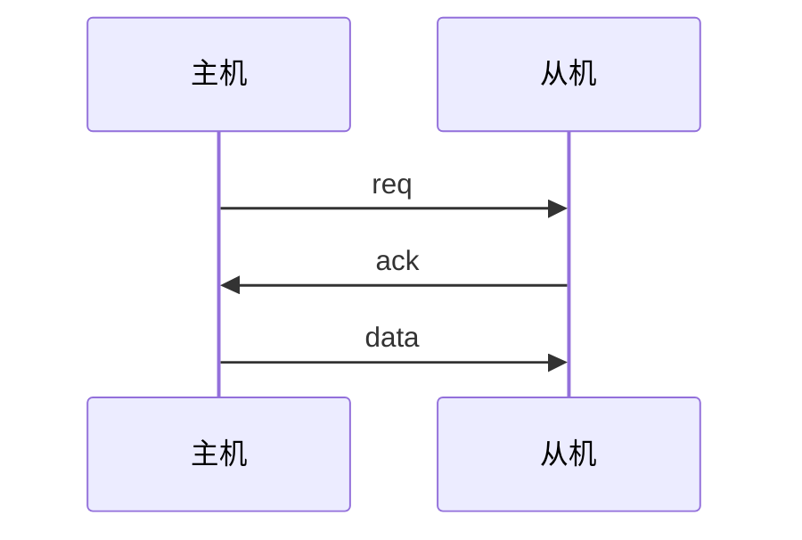
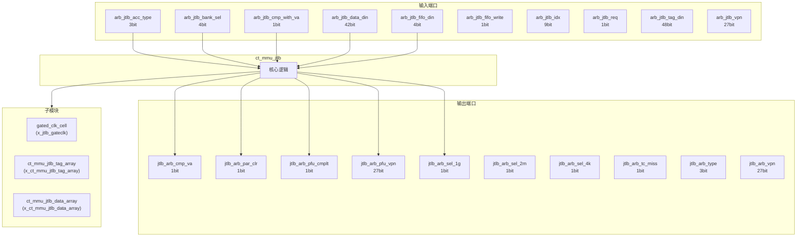
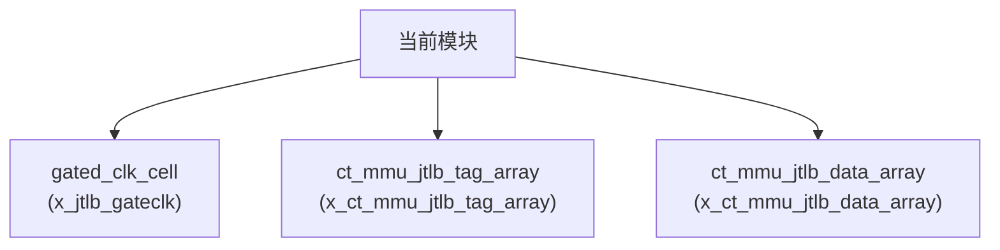

# ct_mmu_jtlb 模块设计文档

## 1. 模块概述

### 1.1 基本信息

| 属性 | 值 |
|------|-----|
| 模块名称 | ct_mmu_jtlb |
| 文件路径 | mmu\rtl\ct_mmu_jtlb.v |
| 层级 | Level 2 |
| 参数 | VPN_WIDTH=39-12, PPN_WIDTH=40-12, FLG_WIDTH=14, PGS_WIDTH=3, ASID_WIDTH=16... |

### 1.2 功能描述

内存管理单元 (Memory Management Unit)，(联合TLB)，主要信号: 使能信号、操作码、输入信号、选择信号、数据信号

### 1.3 设计特点

- 包含 3 个子模块实例
- 包含 19 个 always 块
- 包含 92 个 assign 语句
- 可配置参数: 11 个

## 2. 模块接口说明

### 2.1 输入端口

| 信号名 | 方向 | 位宽 | 描述 |
|--------|------|------|------|
| arb_jtlb_acc_type | input | 3 |  |
| arb_jtlb_bank_sel | input | 4 | 选择信号 |
| arb_jtlb_cmp_with_va | input | 1 |  |
| arb_jtlb_data_din | input | 42 | 数据信号 |
| arb_jtlb_fifo_din | input | 4 | 输入信号 |
| arb_jtlb_fifo_write | input | 1 |  |
| arb_jtlb_idx | input | 9 |  |
| arb_jtlb_req | input | 1 | 请求信号 |
| arb_jtlb_tag_din | input | 48 | 标签信号 |
| arb_jtlb_vpn | input | 27 |  |
| arb_jtlb_write | input | 1 |  |
| arb_top_cur_st | input | 2 | 操作码 |
| cp0_mmu_icg_en | input | 1 | 使能信号 |
| cp0_mmu_maee | input | 1 |  |
| cp0_mmu_mpp | input | 2 |  |
| cp0_mmu_mprv | input | 1 |  |
| cp0_mmu_mxr | input | 1 |  |
| cp0_mmu_ptw_en | input | 1 | 使能信号 |
| cp0_mmu_sum | input | 1 |  |
| cp0_yy_priv_mode | input | 2 |  |
| cpurst_b | input | 1 | 复位信号 |
| dutlb_xx_mmu_off | input | 1 |  |
| forever_cpuclk | input | 1 | 时钟信号 |
| lsu_mmu_va2 | input | 28 |  |
| lsu_mmu_va2_vld | input | 1 | 有效信号 |
| pad_yy_icg_scan_en | input | 1 | 使能信号 |
| pmp_mmu_flg4 | input | 4 |  |
| ptw_arb_vpn | input | 27 |  |
| ptw_jtlb_dmiss | input | 1 | 未命中信号 |
| ptw_jtlb_imiss | input | 1 | 未命中信号 |
| ... | ... | ... | 共47个输入端口 |

### 2.2 输出端口

| 信号名 | 方向 | 位宽 | 描述 |
|--------|------|------|------|
| jtlb_arb_cmp_va | output | 1 |  |
| jtlb_arb_par_clr | output | 1 |  |
| jtlb_arb_pfu_cmplt | output | 1 |  |
| jtlb_arb_pfu_vpn | output | 27 |  |
| jtlb_arb_sel_1g | output | 1 | 选择信号 |
| jtlb_arb_sel_2m | output | 1 | 选择信号 |
| jtlb_arb_sel_4k | output | 1 | 选择信号 |
| jtlb_arb_tc_miss | output | 1 | 未命中信号 |
| jtlb_arb_type | output | 3 |  |
| jtlb_arb_vpn | output | 27 |  |
| jtlb_dutlb_acc_err | output | 1 | 错误信号 |
| jtlb_dutlb_pgflt | output | 1 |  |
| jtlb_dutlb_ref_cmplt | output | 1 | 读使能 |
| jtlb_dutlb_ref_pavld | output | 1 | 有效信号 |
| jtlb_iutlb_acc_err | output | 1 | 错误信号 |
| jtlb_iutlb_pgflt | output | 1 |  |
| jtlb_iutlb_ref_cmplt | output | 1 | 读使能 |
| jtlb_iutlb_ref_pavld | output | 1 | 有效信号 |
| jtlb_ptw_req | output | 1 | 请求信号 |
| jtlb_ptw_type | output | 3 |  |
| jtlb_ptw_vpn | output | 27 |  |
| jtlb_regs_hit | output | 1 | 读使能 |
| jtlb_regs_hit_mult | output | 1 | 读使能 |
| jtlb_regs_tlbp_hit_index | output | 11 | 读使能 |
| jtlb_tlboper_asid_hit | output | 1 | 操作码 |
| jtlb_tlboper_cmplt | output | 1 | 操作码 |
| jtlb_tlboper_fifo | output | 4 | 操作码 |
| jtlb_tlboper_read_idle | output | 1 | 读使能 |
| jtlb_tlboper_sel | output | 4 | 选择信号 |
| jtlb_tlboper_va_hit | output | 1 | 操作码 |
| ... | ... | ... | 共51个输出端口 |

### 2.4 参数列表

| 参数名 | 默认值 | 位宽 | 描述 |
|--------|--------|------|------|
| VPN_WIDTH | 39-12 | 1 | |
| PPN_WIDTH | 40-12 | 1 | |
| FLG_WIDTH | 14 | 1 | |
| PGS_WIDTH | 3 | 1 | |
| ASID_WIDTH | 16 | 1 | |
| PTE_LEVEL | 3 | 1 | |
| VPN_PERLEL | VPN_WIDTH/PTE_LEVEL | 1 | |
| TAG_WIDTH | 1+VPN_WIDTH+ASID_WIDTH+PGS_WIDTH+1 | 1 | |
| DATA_WIDTH | PPN_WIDTH+FLG_WIDTH | 1 | |
| READ_IDLE | 3'b000 | 1 | |
| PFU_IDLE | 2'b00 | 1 | |

### 2.5 接口时序图



## 3. 模块框图

### 3.1 模块架构图



### 3.2 主要数据连线

| 源模块 | 目标模块 | 信号名 | 位宽 | 说明 |
|--------|----------|--------|------|------|
| ct_mmu_jtlb | gated_clk_cell | clk_in | - | |
| ct_mmu_jtlb | gated_clk_cell | clk_out | - | |
| ct_mmu_jtlb | gated_clk_cell | external_en | - | |
| ct_mmu_jtlb | ct_mmu_jtlb_tag_array | cp0_mmu_icg_en | - | |
| ct_mmu_jtlb | ct_mmu_jtlb_tag_array | forever_cpuclk | - | |
| ct_mmu_jtlb | ct_mmu_jtlb_tag_array | jtlb_tag_cen | - | |
| ct_mmu_jtlb | ct_mmu_jtlb_data_array | cp0_mmu_icg_en | - | |
| ct_mmu_jtlb | ct_mmu_jtlb_data_array | forever_cpuclk | - | |
| ct_mmu_jtlb | ct_mmu_jtlb_data_array | jtlb_data_cen0 | - | |

## 4. 模块实现方案

### 4.1 关键逻辑描述

**Always 块列表:**

```verilog
always @(posedge jtlb_clk or negedge cpurst_b) begin
  // ...
end
```

```verilog
always @(posedge jtlb_clk or negedge cpurst_b) begin
  // ...
end
```

```verilog
always @(posedge jtlb_clk or negedge cpurst_b) begin
  // ...
end
```

```verilog
always @(posedge jtlb_clk or negedge cpurst_b) begin
  // ...
end
```

```verilog
always @(posedge jtlb_clk or negedge cpurst_b) begin
  // ...
end
```


**Assign 语句列表:**

| 目标信号 | 源表达式 |
|----------|----------|
| jtlb_clk_en | arb_jtlb_req || ta_vld || tc_vld || !read_cur_idle
                  || !pfu_idle_st || ptw_jtlb_ref_cmplt
                  || lsu_mmu_va2_vld && dutlb_xx_mmu_off |
| jtlb_tag_cen | arb_jtlb_req |
| tag_fifo_wen | arb_jtlb_fifo_write |
| jtlb_data_cen0 | arb_jtlb_req && (|arb_jtlb_bank_sel[1:0]) |
| jtlb_data_cen1 | arb_jtlb_req && (|arb_jtlb_bank_sel[3:2]) |
| ta_way3_hit_kid0 | (ta_way3_vpn[VPN_PERLEL*1-1:0]   == ta_vpn_masked[VPN_PERLEL*1-1:0]) |
| ta_way3_hit_kid1 | (ta_way3_vpn[VPN_PERLEL*2-1:VPN_PERLEL*1]  == ta_vpn_masked[VPN_PERLEL*2-1:VPN_PERLEL*1])
                               && jtlb_cur_pgs[PGS_WIDTH-1:0] == ta_way3_pgs[PGS_WIDTH-1:0] |
| ta_way3_hit_kid2 | (ta_way3_vpn[VPN_WIDTH-1:VPN_PERLEL*2] == ta_vpn_masked[VPN_WIDTH-1:VPN_PERLEL*2])
                               && ta_way3_vld && ta_cmp_va |
| ta_way3_hit_kid3 | (ta_way3_asid[VPN_PERLEL*1-1:0]   == asid_for_va_hit[VPN_PERLEL*1-1:0]) |
| ta_way3_hit_kid4 | (ta_way3_asid[ASID_WIDTH-1:VPN_PERLEL*1]  == asid_for_va_hit[ASID_WIDTH-1:VPN_PERLEL*1]) |
| ta_way3_hit_kid5 | ta_way3_g || tlboper_jtlb_cmp_noasid |
| ta_way2_hit_kid0 | (ta_way2_vpn[VPN_PERLEL*1-1:0]   == ta_vpn_masked[VPN_PERLEL*1-1:0]) |
| ta_way2_hit_kid1 | (ta_way2_vpn[VPN_PERLEL*2-1:VPN_PERLEL*1]  == ta_vpn_masked[VPN_PERLEL*2-1:VPN_PERLEL*1])
                               && jtlb_cur_pgs[PGS_WIDTH-1:0] == ta_way2_pgs[PGS_WIDTH-1:0] |
| ta_way2_hit_kid2 | (ta_way2_vpn[VPN_WIDTH-1:VPN_PERLEL*2] == ta_vpn_masked[VPN_WIDTH-1:VPN_PERLEL*2])
                               && ta_way2_vld && ta_cmp_va |
| ta_way2_hit_kid3 | (ta_way2_asid[VPN_PERLEL*1-1:0]   == asid_for_va_hit[VPN_PERLEL*1-1:0]) |
| ... | 共92条assign语句 |

## 5. 内部关键信号列表

### 5.1 寄存器信号

| 信号名 | 位宽 | 描述 |
|--------|------|------|
| pfu_cur_st | 2 | |
| pfu_nxt_st | 2 | |
| pfu_off_chk | 1 | |
| pfu_pa_buf | 28 | |
| pfu_sec_buf | 1 | |
| pfu_share_buf | 1 | |
| read_cur_st | 3 | |
| read_nxt_st | 3 | |
| ta_acc_type | 3 | |
| ta_cmp_va | 1 | |
| ta_jtlb_fifo_upd | 12 | |
| ta_vld | 1 | |
| ta_vpn | 27 | |
| ta_way_sel | 4 | |
| ta_wen | 1 | |
| tc_acc_type | 3 | |
| tc_cmp_va | 1 | |
| tc_jtlb_fifo | 12 | |
| tc_vld | 1 | |
| tc_vpn | 27 | |
| ... | ... | 共70个寄存器信号 |

### 5.2 线网信号

| 信号名 | 位宽 | 描述 |
|--------|------|------|
| asid_for_va_hit | 16 | |
| cp0_mach_mode | 1 | |
| cp0_priv_mode | 2 | |
| cp0_supv_mode | 1 | |
| cp0_user_mode | 1 | |
| jtlb_clk | 1 | |
| jtlb_clk_en | 1 | |
| jtlb_cur_pgs | 3 | |
| jtlb_data_cen0 | 1 | |
| jtlb_data_cen1 | 1 | |
| jtlb_data_din | 84 | |
| jtlb_data_dout0 | 84 | |
| jtlb_data_dout1 | 84 | |
| jtlb_data_idx | 8 | |
| jtlb_data_wen | 4 | |
| jtlb_pfu_acc_fault | 1 | |
| jtlb_pfu_cmplt | 1 | |
| jtlb_pfu_deny | 1 | |
| jtlb_pfu_flag_fault | 1 | |
| jtlb_pfu_pa | 28 | |
| ... | ... | 共129个线网信号 |

## 6. 子模块方案

### 6.1 模块例化层次结构



### 6.2 子模块列表

| 层级 | 模块名 | 实例名 | 功能描述 |
|------|--------|--------|----------|
| 1 | gated_clk_cell | x_jtlb_gateclk |  |
| 1 | ct_mmu_jtlb_tag_array | x_ct_mmu_jtlb_tag_array | 内存管理单元 |
| 1 | ct_mmu_jtlb_data_array | x_ct_mmu_jtlb_data_array | 内存管理单元 |

## 7. 修订历史

| 版本 | 日期 | 作者 | 说明 |
|------|------|------|------|
| 1.0 | 2026-03-12 | Auto-generated | 初始版本 |
