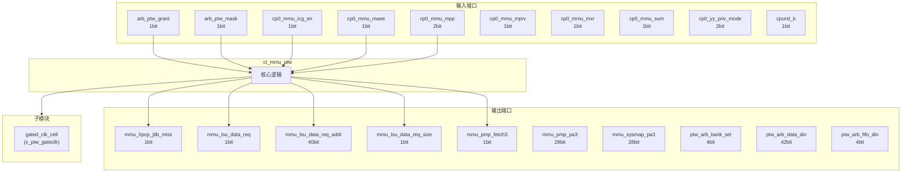
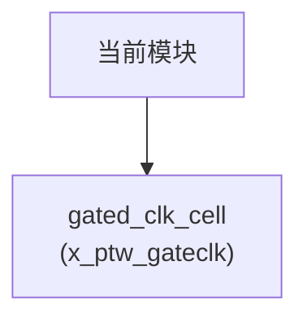

# ct_mmu_ptw 模块设计文档

## 1. 模块概述

### 1.1 基本信息

| 属性 | 值 |
|------|-----|
| 模块名称 | ct_mmu_ptw |
| 文件路径 | mmu\rtl\ct_mmu_ptw.v |
| 层级 | Level 2 |
| 参数 | VADDR_WIDTH=39, PADDR_WIDTH=40, VPN_WIDTH=VADDR_WIDTH-12, PPN_WIDTH=PADDR_WIDTH-12, FLG_WIDTH=14... |

### 1.2 功能描述

ct_mmu_ptw 模块的功能描述。

### 1.3 设计特点

- 包含 1 个子模块实例
- 包含 10 个 always 块
- 包含 50 个 assign 语句
- 可配置参数: 12 个

## 2. 模块接口说明

### 2.1 输入端口

| 信号名 | 方向 | 位宽 | 描述 |
|--------|------|------|------|
| arb_ptw_grant | input | 1 | |
| arb_ptw_mask | input | 1 | |
| cp0_mmu_icg_en | input | 1 | |
| cp0_mmu_maee | input | 1 | |
| cp0_mmu_mpp | input | 2 | |
| cp0_mmu_mprv | input | 1 | |
| cp0_mmu_mxr | input | 1 | |
| cp0_mmu_sum | input | 1 | |
| cp0_yy_priv_mode | input | 2 | |
| cpurst_b | input | 1 | |
| dutlb_ptw_wfc | input | 1 | |
| forever_cpuclk | input | 1 | |
| hpcp_mmu_cnt_en | input | 1 | |
| iutlb_ptw_wfc | input | 1 | |
| jtlb_ptw_req | input | 1 | |
| jtlb_ptw_type | input | 3 | |
| jtlb_ptw_vpn | input | 27 | |
| jtlb_xx_fifo | input | 12 | |
| lsu_mmu_bus_error | input | 1 | |
| lsu_mmu_data | input | 64 | |
| lsu_mmu_data_vld | input | 1 | |
| pad_yy_icg_scan_en | input | 1 | |
| pmp_mmu_flg3 | input | 4 | |
| regs_ptw_cur_asid | input | 16 | |
| regs_ptw_satp_ppn | input | 28 | |
| sysmap_mmu_flg3 | input | 5 | |
| sysmap_mmu_hit3 | input | 8 | |
| tlboper_ptw_abort | input | 1 | |

### 2.2 输出端口

| 信号名 | 方向 | 位宽 | 描述 |
|--------|------|------|------|
| mmu_hpcp_jtlb_miss | output | 1 | |
| mmu_lsu_data_req | output | 1 | |
| mmu_lsu_data_req_addr | output | 40 | |
| mmu_lsu_data_req_size | output | 1 | |
| mmu_pmp_fetch3 | output | 1 | |
| mmu_pmp_pa3 | output | 28 | |
| mmu_sysmap_pa3 | output | 28 | |
| ptw_arb_bank_sel | output | 4 | |
| ptw_arb_data_din | output | 42 | |
| ptw_arb_fifo_din | output | 4 | |
| ptw_arb_pgs | output | 3 | |
| ptw_arb_req | output | 1 | |
| ptw_arb_tag_din | output | 48 | |
| ptw_arb_vpn | output | 27 | |
| ptw_jtlb_dmiss | output | 1 | |
| ptw_jtlb_imiss | output | 1 | |
| ptw_jtlb_pmiss | output | 1 | |
| ptw_jtlb_ref_acc_err | output | 1 | |
| ptw_jtlb_ref_cmplt | output | 1 | |
| ptw_jtlb_ref_data_vld | output | 1 | |
| ptw_jtlb_ref_flg | output | 14 | |
| ptw_jtlb_ref_pgflt | output | 1 | |
| ptw_jtlb_ref_pgs | output | 3 | |
| ptw_jtlb_ref_ppn | output | 28 | |
| ptw_top_cur_st | output | 4 | |
| ptw_top_imiss | output | 1 | |

### 2.4 参数列表

| 参数名 | 默认值 | 位宽 | 描述 |
|--------|--------|------|------|
| VADDR_WIDTH | 39 | 1 | |
| PADDR_WIDTH | 40 | 1 | |
| VPN_WIDTH | VADDR_WIDTH-12 | 1 | |
| PPN_WIDTH | PADDR_WIDTH-12 | 1 | |
| FLG_WIDTH | 14 | 1 | |
| ASID_WIDTH | 16 | 1 | |
| PGS_WIDTH | 3 | 1 | |
| PTE_LEVEL | 3 | 1 | |
| VPN_PERLEL | VPN_WIDTH/PTE_LEVEL | 1 | |
| TAG_WIDTH | 1+VPN_WIDTH+ASID_WIDTH+PGS_WIDTH+1 | 1 | |
| DATA_WIDTH | PPN_WIDTH+FLG_WIDTH | 1 | |
| PTW_IDLE | 5'b00000 | 1 | |

## 3. 模块框图

### 3.1 模块架构图



### 3.2 主要数据连线

| 源模块 | 目标模块 | 信号名 | 位宽 | 说明 |
|--------|----------|--------|------|------|
| ct_mmu_ptw | gated_clk_cell | clk_in | - | |
| ct_mmu_ptw | gated_clk_cell | clk_out | - | |
| ct_mmu_ptw | gated_clk_cell | external_en | - | |

## 4. 模块实现方案

### 4.1 关键逻辑描述

**Always 块列表:**

```verilog
always @(posedge ptw_clk or negedge cpurst_b) begin
  // ...
end
```

```verilog
always @(ptw_nxt_st[4:0]
       or ptw_cur_st
       or lsu_mmu_bus_error
       or lsu_mmu_data_vld) begin
  // ...
end
```

```verilog
always @(cp0_mmu_maee
       or ptw_hit_2m
       or jtlb_ptw_req
       or arb_ptw_grant
       or ptw_pmp_deny
       or ptw_cur_st
       or lsu_mmu_bus_error
       or lsu_mmu_data_vld
       or ptw_hit_1g
       or ptw_page_flt
       or ptw_chk_cross) begin
  // ...
end
```

```verilog
always @(posedge ptw_clk or negedge cpurst_b) begin
  // ...
end
```

```verilog
always @(posedge ptw_clk or negedge cpurst_b) begin
  // ...
end
```


**Assign 语句列表:**

| 目标信号 | 源表达式 |
|----------|----------|
| cp0_user_mode | ptw_fetch_type ? cp0_yy_priv_mode[1:0] == 2'b00 
                                      : cp0_priv_mode[1:0] == 2'b00 |
| cp0_supv_mode | ptw_fetch_type ? cp0_yy_priv_mode[1:0] == 2'b01 
                                      : cp0_priv_mode[1:0] == 2'b01 |
| cp0_mach_mode | ptw_fetch_type ? cp0_yy_priv_mode[1:0] == 2'b11
                                      : cp0_priv_mode[1:0] == 2'b11 |
| ptw_clk_en | jtlb_ptw_req || ptw_refill_on || jtlb_miss |
| ptw_data_fst | (ptw_cur_st[4:0] == PTW_FST_DATA) |
| ptw_data_scd | (ptw_cur_st[4:0] == PTW_SCD_DATA) |
| ptw_data_thd | (ptw_cur_st[4:0] == PTW_THD_DATA) |
| ptw_data_abt | (ptw_cur_st[4:0] == PTW_ABT_DATA) |
| ptw_chk_fst | (ptw_cur_st[4:0] == PTW_FST_CHK) |
| ptw_chk_scd | (ptw_cur_st[4:0] == PTW_SCD_CHK) |
| ptw_chk_thd | (ptw_cur_st[4:0] == PTW_THD_CHK) |
| ptw_crs1_1g | (ptw_cur_st[4:0] == PTW_1G_CRS1) |
| ptw_crs2_1g | (ptw_cur_st[4:0] == PTW_1G_CRS2) |
| ptw_crs1_2m | (ptw_cur_st[4:0] == PTW_2M_CRS1) |
| ptw_crs2_2m | (ptw_cur_st[4:0] == PTW_2M_CRS2) |
| ... | 共50条assign语句 |

## 5. 内部关键信号列表

### 5.1 寄存器信号

| 信号名 | 位宽 | 描述 |
|--------|------|------|
| jtlb_miss | 1 | |
| lsu_data_flop | 64 | |
| ptw_cur_st | 5 | |
| ptw_fifo | 12 | |
| ptw_hit_num | 8 | |
| ptw_nxt_abt_st | 5 | |
| ptw_nxt_st | 5 | |
| ptw_req_addr | 40 | |
| ptw_type | 3 | |
| ptw_vpn | 27 | |
| ref_pgs | 3 | |

### 5.2 线网信号

| 信号名 | 位宽 | 描述 |
|--------|------|------|
| cp0_mach_mode | 1 | |
| cp0_priv_mode | 2 | |
| cp0_supv_mode | 1 | |
| cp0_user_mode | 1 | |
| jtlb_miss_cnt | 1 | |
| ptw_addr_fst | 1 | |
| ptw_addr_scd | 1 | |
| ptw_addr_thd | 1 | |
| ptw_chk_cross | 1 | |
| ptw_chk_fst | 1 | |
| ptw_chk_scd | 1 | |
| ptw_chk_thd | 1 | |
| ptw_clk | 1 | |
| ptw_clk_en | 1 | |
| ptw_crs1_1g | 1 | |
| ptw_crs1_2m | 1 | |
| ptw_crs2_1g | 1 | |
| ptw_crs2_2m | 1 | |
| ptw_crs2_chk | 1 | |
| ptw_data_abt | 1 | |
| ... | ... | 共50个线网信号 |

## 6. 子模块方案

### 6.1 模块例化层次结构



### 6.2 子模块列表

| 层级 | 模块名 | 实例名 | 功能描述 |
|------|--------|--------|----------|
| 1 | gated_clk_cell | x_ptw_gateclk | |

## 7. 修订历史

| 版本 | 日期 | 作者 | 说明 |
|------|------|------|------|
| 1.0 | 2026-03-12 | Auto-generated | 初始版本 |
