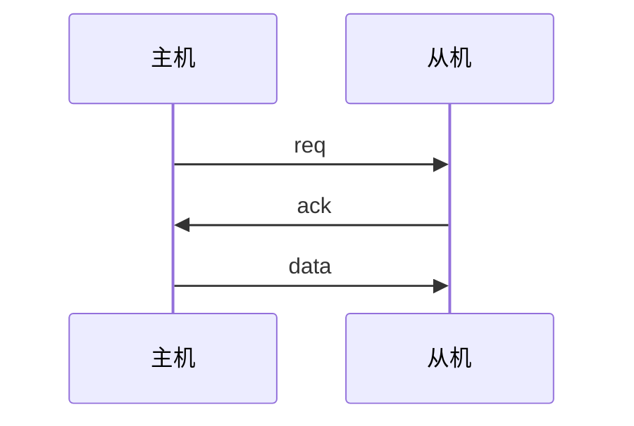
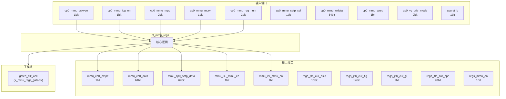
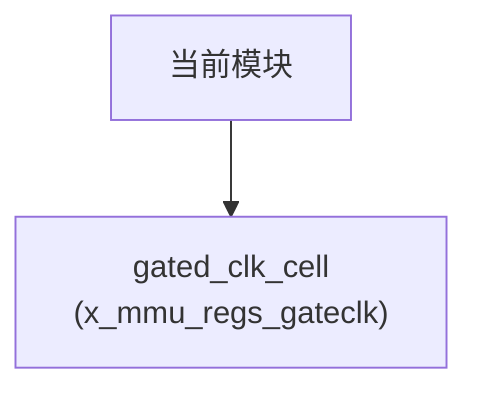

# ct_mmu_regs 模块设计文档

## 1. 模块概述

### 1.1 基本信息

| 属性 | 值 |
|------|-----|
| 模块名称 | ct_mmu_regs |
| 文件路径 | mmu\rtl\ct_mmu_regs.v |
| 层级 | Level 2 |
| 参数 | VPN_WIDTH=39-12, PPN_WIDTH=40-12, FLG_WIDTH=14, PGS_WIDTH=3, ASID_WIDTH=16... |

### 1.2 功能描述

内存管理单元 (Memory Management Unit)，(寄存器)，主要信号: 使能信号、读使能、选择信号、时钟信号、数据信号

### 1.3 设计特点

- 包含 1 个子模块实例
- 包含 15 个 always 块
- 包含 25 个 assign 语句
- 可配置参数: 9 个

## 2. 模块接口说明

### 2.1 输入端口

| 信号名 | 方向 | 位宽 | 描述 |
|--------|------|------|------|
| cp0_mmu_cskyee | input | 1 |  |
| cp0_mmu_icg_en | input | 1 | 使能信号 |
| cp0_mmu_mpp | input | 2 |  |
| cp0_mmu_mprv | input | 1 |  |
| cp0_mmu_reg_num | input | 2 | 读使能 |
| cp0_mmu_satp_sel | input | 1 | 选择信号 |
| cp0_mmu_wdata | input | 64 | 数据信号 |
| cp0_mmu_wreg | input | 1 | 读使能 |
| cp0_yy_priv_mode | input | 2 |  |
| cpurst_b | input | 1 | 复位信号 |
| forever_cpuclk | input | 1 | 时钟信号 |
| jtlb_regs_hit | input | 1 | 读使能 |
| jtlb_regs_hit_mult | input | 1 | 读使能 |
| jtlb_regs_tlbp_hit_index | input | 11 | 读使能 |
| jtlb_tlbr_asid | input | 16 |  |
| jtlb_tlbr_flg | input | 14 |  |
| jtlb_tlbr_g | input | 1 |  |
| jtlb_tlbr_pgs | input | 3 |  |
| jtlb_tlbr_ppn | input | 28 |  |
| jtlb_tlbr_vpn | input | 27 |  |
| pad_yy_icg_scan_en | input | 1 | 使能信号 |
| rtu_mmu_bad_vpn | input | 27 |  |
| rtu_mmu_expt_vld | input | 1 | 有效信号 |
| tlboper_regs_cmplt | input | 1 | 读使能 |
| tlboper_regs_tlbp_cmplt | input | 1 | 读使能 |
| tlboper_regs_tlbr_cmplt | input | 1 | 读使能 |

### 2.2 输出端口

| 信号名 | 方向 | 位宽 | 描述 |
|--------|------|------|------|
| mmu_cp0_cmplt | output | 1 |  |
| mmu_cp0_data | output | 64 | 数据信号 |
| mmu_cp0_satp_data | output | 64 | 数据信号 |
| mmu_lsu_mmu_en | output | 1 | 使能信号 |
| mmu_xx_mmu_en | output | 1 | 使能信号 |
| regs_jtlb_cur_asid | output | 16 | 读使能 |
| regs_jtlb_cur_flg | output | 14 | 读使能 |
| regs_jtlb_cur_g | output | 1 | 读使能 |
| regs_jtlb_cur_ppn | output | 28 | 读使能 |
| regs_mmu_en | output | 1 | 使能信号 |
| regs_ptw_cur_asid | output | 16 | 读使能 |
| regs_ptw_satp_ppn | output | 28 | 读使能 |
| regs_tlboper_cur_asid | output | 16 | 读使能 |
| regs_tlboper_cur_pgs | output | 3 | 读使能 |
| regs_tlboper_cur_vpn | output | 27 | 读使能 |
| regs_tlboper_inv_asid | output | 16 | 读使能 |
| regs_tlboper_invall | output | 1 | 读使能 |
| regs_tlboper_invasid | output | 1 | 读使能 |
| regs_tlboper_mir | output | 12 | 读使能 |
| regs_tlboper_tlbp | output | 1 | 读使能 |
| regs_tlboper_tlbr | output | 1 | 读使能 |
| regs_tlboper_tlbwi | output | 1 | 读使能 |
| regs_tlboper_tlbwr | output | 1 | 读使能 |
| regs_utlb_clr | output | 1 | 读使能 |

### 2.4 参数列表

| 参数名 | 默认值 | 位宽 | 描述 |
|--------|--------|------|------|
| VPN_WIDTH | 39-12 | 1 | |
| PPN_WIDTH | 40-12 | 1 | |
| FLG_WIDTH | 14 | 1 | |
| PGS_WIDTH | 3 | 1 | |
| ASID_WIDTH | 16 | 1 | |
| MIR_NUM | 2'd0 | 1 | |
| MEL_NUM | 2'd1 | 1 | |
| MEH_NUM | 2'd2 | 1 | |
| MCIR_NUM | 2'd3 | 1 | |

### 2.5 接口时序图



## 3. 模块框图

### 3.1 模块架构图



### 3.2 主要数据连线

| 源模块 | 目标模块 | 信号名 | 位宽 | 说明 |
|--------|----------|--------|------|------|
| ct_mmu_regs | gated_clk_cell | clk_in | - | |
| ct_mmu_regs | gated_clk_cell | clk_out | - | |
| ct_mmu_regs | gated_clk_cell | external_en | - | |

## 4. 模块实现方案

### 4.1 关键逻辑描述

**Always 块列表:**

```verilog
always @(posedge mmu_regs_clk or negedge cpurst_b) begin
  // ...
end
```

```verilog
always @(posedge mmu_regs_clk or negedge cpurst_b) begin
  // ...
end
```

```verilog
always @(posedge mmu_regs_clk or negedge cpurst_b) begin
  // ...
end
```

```verilog
always @(posedge mmu_regs_clk or negedge cpurst_b) begin
  // ...
end
```

```verilog
always @(posedge mmu_regs_clk or negedge cpurst_b) begin
  // ...
end
```


**Assign 语句列表:**

| 目标信号 | 源表达式 |
|----------|----------|
| regs_utlb_clr | satp_write_en |
| mmu_regs_clk_en | cp0_mmu_wreg
                      || satp_write_en
                      || rtu_mmu_expt_vld
                      || tlboper_regs_cmplt
                      || mcir_no_op |
| mir_write_en | (cp0_mmu_reg_num[1:0] == MIR_NUM) && cp0_mmu_wreg |
| mel_write_en | (cp0_mmu_reg_num[1:0] == MEL_NUM) && cp0_mmu_wreg |
| meh_write_en | (cp0_mmu_reg_num[1:0] == MEH_NUM) && cp0_mmu_wreg |
| mcir_write_en | (cp0_mmu_reg_num[1:0] == MCIR_NUM) && cp0_mmu_wreg |
| satp_write_en | cp0_mmu_satp_sel |
| wdata_invall | cp0_mmu_wdata[26] && cp0_mmu_cskyee |
| wdata_invasid | !cp0_mmu_wdata[26] &&  cp0_mmu_wdata[27] && cp0_mmu_cskyee |
| wdata_tlbp | !cp0_mmu_wdata[26] && !cp0_mmu_wdata[27] && cp0_mmu_cskyee
                     && cp0_mmu_wdata[31] |
| wdata_tlbwi | !cp0_mmu_wdata[26] && !cp0_mmu_wdata[27] && cp0_mmu_cskyee
                     &&!cp0_mmu_wdata[31] &&  cp0_mmu_wdata[29] |
| wdata_tlbwr | !cp0_mmu_wdata[26] && !cp0_mmu_wdata[27] && cp0_mmu_cskyee
                     &&!cp0_mmu_wdata[31] && !cp0_mmu_wdata[29]
                     && cp0_mmu_wdata[28] |
| wdata_tlbr | !cp0_mmu_wdata[26] && !cp0_mmu_wdata[27] && cp0_mmu_cskyee
                     &&!cp0_mmu_wdata[31] && !cp0_mmu_wdata[29] 
                     &&!cp0_mmu_wdata[28] &&  cp0_mmu_wdata[30] |
| mcir_data_no_op | (cp0_mmu_wdata[31:26] == 6'b0) |
| mmu_cp0_cmplt | tlboper_regs_cmplt || mcir_no_op |
| ... | 共25条assign语句 |

## 5. 内部关键信号列表

### 5.1 寄存器信号

| 信号名 | 位宽 | 描述 |
|--------|------|------|
| mcir_asid | 16 | |
| mcir_invall | 1 | |
| mcir_invasid | 1 | |
| mcir_no_op | 1 | |
| mcir_tlbp | 1 | |
| mcir_tlbr | 1 | |
| mcir_tlbwi | 1 | |
| mcir_tlbwr | 1 | |
| meh_asid | 16 | |
| meh_pgs | 3 | |
| meh_vpn | 27 | |
| mel_access | 1 | |
| mel_b | 1 | |
| mel_c | 1 | |
| mel_dirty | 1 | |
| mel_exe | 1 | |
| mel_global | 1 | |
| mel_ppn | 28 | |
| mel_read | 1 | |
| mel_rsw | 2 | |
| ... | ... | 共32个寄存器信号 |

### 5.2 线网信号

| 信号名 | 位宽 | 描述 |
|--------|------|------|
| cp0_priv_mode | 2 | |
| mcir_data | 64 | |
| mcir_data_no_op | 1 | |
| mcir_write_en | 1 | |
| meh_data | 64 | |
| meh_write_en | 1 | |
| mel_data | 64 | |
| mel_write_en | 1 | |
| mir_data | 64 | |
| mir_write_en | 1 | |
| mmu_regs_clk | 1 | |
| mmu_regs_clk_en | 1 | |
| satp_data | 64 | |
| satp_write_en | 1 | |
| wdata_invall | 1 | |
| wdata_invasid | 1 | |
| wdata_tlbp | 1 | |
| wdata_tlbr | 1 | |
| wdata_tlbwi | 1 | |
| wdata_tlbwr | 1 | |

## 6. 子模块方案

### 6.1 模块例化层次结构



### 6.2 子模块列表

| 层级 | 模块名 | 实例名 | 功能描述 |
|------|--------|--------|----------|
| 1 | gated_clk_cell | x_mmu_regs_gateclk |  |

## 7. 修订历史

| 版本 | 日期 | 作者 | 说明 |
|------|------|------|------|
| 1.0 | 2026-03-12 | Auto-generated | 初始版本 |
