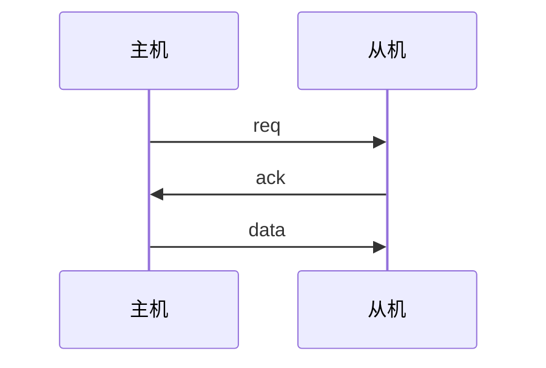
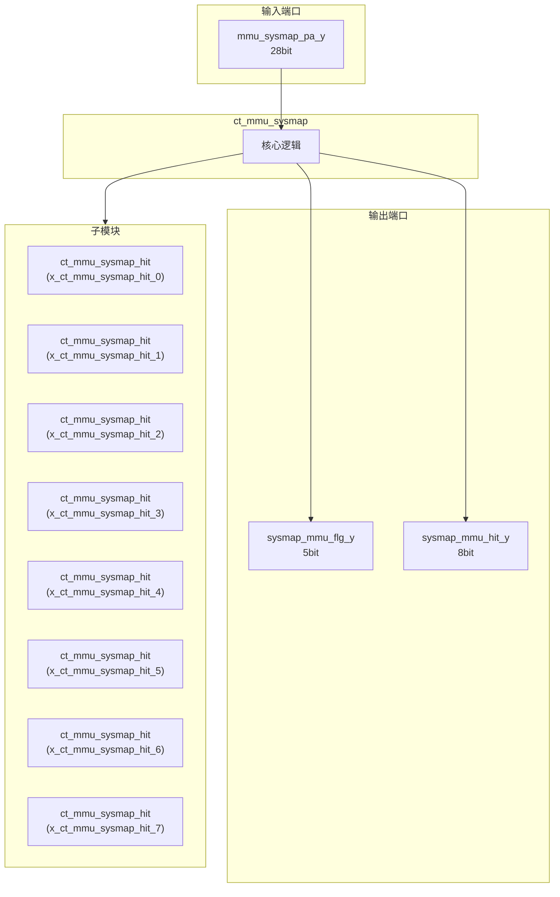
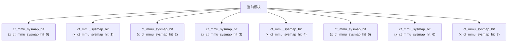

# ct_mmu_sysmap 模块设计文档

## 1. 模块概述

### 1.1 基本信息

| 属性 | 值 |
|------|-----|
| 模块名称 | ct_mmu_sysmap |
| 文件路径 | mmu\rtl\ct_mmu_sysmap.v |
| 层级 | Level 2 |
| 参数 | ADDR_WIDTH=`PA_WIDTH-12, FLG_WIDTH=5 |

### 1.2 功能描述

内存管理单元 (Memory Management Unit)，(系统映射)，主要信号: 命中信号

### 1.3 设计特点

- 包含 8 个子模块实例
- 包含 1 个 always 块
- 包含 8 个 assign 语句
- 可配置参数: 2 个

## 2. 模块接口说明

### 2.1 输入端口

| 信号名 | 方向 | 位宽 | 描述 |
|--------|------|------|------|
| mmu_sysmap_pa_y | input | 28 |  |

### 2.2 输出端口

| 信号名 | 方向 | 位宽 | 描述 |
|--------|------|------|------|
| sysmap_mmu_flg_y | output | 5 |  |
| sysmap_mmu_hit_y | output | 8 | 命中信号 |

### 2.4 参数列表

| 参数名 | 默认值 | 位宽 | 描述 |
|--------|--------|------|------|
| ADDR_WIDTH | `PA_WIDTH-12 | 1 | |
| FLG_WIDTH | 5 | 1 | |

### 2.5 接口时序图



## 3. 模块框图

### 3.1 模块架构图



### 3.2 主要数据连线

| 源模块 | 目标模块 | 信号名 | 位宽 | 说明 |
|--------|----------|--------|------|------|
| ct_mmu_sysmap | ct_mmu_sysmap_hit | addr_ge_bottom_x | - | |
| ct_mmu_sysmap | ct_mmu_sysmap_hit | addr_ge_upaddr_x | - | |
| ct_mmu_sysmap | ct_mmu_sysmap_hit | sysmap_comp_hit_x | - | |
| ct_mmu_sysmap | ct_mmu_sysmap_hit | addr_ge_bottom_x | - | |
| ct_mmu_sysmap | ct_mmu_sysmap_hit | addr_ge_upaddr_x | - | |
| ct_mmu_sysmap | ct_mmu_sysmap_hit | sysmap_comp_hit_x | - | |
| ct_mmu_sysmap | ct_mmu_sysmap_hit | addr_ge_bottom_x | - | |
| ct_mmu_sysmap | ct_mmu_sysmap_hit | addr_ge_upaddr_x | - | |
| ct_mmu_sysmap | ct_mmu_sysmap_hit | sysmap_comp_hit_x | - | |
| ct_mmu_sysmap | ct_mmu_sysmap_hit | addr_ge_bottom_x | - | |
| ct_mmu_sysmap | ct_mmu_sysmap_hit | addr_ge_upaddr_x | - | |
| ct_mmu_sysmap | ct_mmu_sysmap_hit | sysmap_comp_hit_x | - | |
| ct_mmu_sysmap | ct_mmu_sysmap_hit | addr_ge_bottom_x | - | |
| ct_mmu_sysmap | ct_mmu_sysmap_hit | addr_ge_upaddr_x | - | |
| ct_mmu_sysmap | ct_mmu_sysmap_hit | sysmap_comp_hit_x | - | |
| ct_mmu_sysmap | ct_mmu_sysmap_hit | addr_ge_bottom_x | - | |
| ct_mmu_sysmap | ct_mmu_sysmap_hit | addr_ge_upaddr_x | - | |
| ct_mmu_sysmap | ct_mmu_sysmap_hit | sysmap_comp_hit_x | - | |
| ct_mmu_sysmap | ct_mmu_sysmap_hit | addr_ge_bottom_x | - | |
| ct_mmu_sysmap | ct_mmu_sysmap_hit | addr_ge_upaddr_x | - | |
| ct_mmu_sysmap | ct_mmu_sysmap_hit | sysmap_comp_hit_x | - | |
| ct_mmu_sysmap | ct_mmu_sysmap_hit | addr_ge_bottom_x | - | |
| ct_mmu_sysmap | ct_mmu_sysmap_hit | addr_ge_upaddr_x | - | |
| ct_mmu_sysmap | ct_mmu_sysmap_hit | sysmap_comp_hit_x | - | |

## 4. 模块实现方案

### 4.1 关键逻辑描述

**Always 块列表:**

```verilog
always @(sysmap_hit[7:0]) begin
  // ...
end
```


**Assign 语句列表:**

| 目标信号 | 源表达式 |
|----------|----------|
| sysmap_comp_hit0 | mmu_sysmap_pa_y[ADDR_WIDTH-1:0]
                        < `SYSMAP_BASE_ADDR0 |
| sysmap_comp_hit1 | mmu_sysmap_pa_y[ADDR_WIDTH-1:0]
                        < `SYSMAP_BASE_ADDR1 |
| sysmap_comp_hit2 | mmu_sysmap_pa_y[ADDR_WIDTH-1:0]
                        < `SYSMAP_BASE_ADDR2 |
| sysmap_comp_hit3 | mmu_sysmap_pa_y[ADDR_WIDTH-1:0]
                        < `SYSMAP_BASE_ADDR3 |
| sysmap_comp_hit4 | mmu_sysmap_pa_y[ADDR_WIDTH-1:0]
                        < `SYSMAP_BASE_ADDR4 |
| sysmap_comp_hit5 | mmu_sysmap_pa_y[ADDR_WIDTH-1:0]
                        < `SYSMAP_BASE_ADDR5 |
| sysmap_comp_hit6 | mmu_sysmap_pa_y[ADDR_WIDTH-1:0]
                        < `SYSMAP_BASE_ADDR6 |
| sysmap_comp_hit7 | mmu_sysmap_pa_y[ADDR_WIDTH-1:0]
                        < `SYSMAP_BASE_ADDR7 |

## 5. 内部关键信号列表

### 5.1 寄存器信号

无寄存器信号。

### 5.2 线网信号

| 信号名 | 位宽 | 描述 |
|--------|------|------|
| addr_ge_bottom0 | 1 | |
| addr_ge_bottom1 | 1 | |
| addr_ge_bottom2 | 1 | |
| addr_ge_bottom3 | 1 | |
| addr_ge_bottom4 | 1 | |
| addr_ge_bottom5 | 1 | |
| addr_ge_bottom6 | 1 | |
| addr_ge_bottom7 | 1 | |
| addr_ge_upaddr0 | 1 | |
| addr_ge_upaddr1 | 1 | |
| addr_ge_upaddr2 | 1 | |
| addr_ge_upaddr3 | 1 | |
| addr_ge_upaddr4 | 1 | |
| addr_ge_upaddr5 | 1 | |
| addr_ge_upaddr6 | 1 | |
| addr_ge_upaddr7 | 1 | |
| sysmap_comp_hit0 | 1 | |
| sysmap_comp_hit1 | 1 | |
| sysmap_comp_hit2 | 1 | |
| sysmap_comp_hit3 | 1 | |
| ... | ... | 共33个线网信号 |

## 6. 子模块方案

### 6.1 模块例化层次结构



### 6.2 子模块列表

| 层级 | 模块名 | 实例名 | 功能描述 |
|------|--------|--------|----------|
| 1 | ct_mmu_sysmap_hit | x_ct_mmu_sysmap_hit_0 | 内存管理单元 |
| 1 | ct_mmu_sysmap_hit | x_ct_mmu_sysmap_hit_1 | 内存管理单元 |
| 1 | ct_mmu_sysmap_hit | x_ct_mmu_sysmap_hit_2 | 内存管理单元 |
| 1 | ct_mmu_sysmap_hit | x_ct_mmu_sysmap_hit_3 | 内存管理单元 |
| 1 | ct_mmu_sysmap_hit | x_ct_mmu_sysmap_hit_4 | 内存管理单元 |
| 1 | ct_mmu_sysmap_hit | x_ct_mmu_sysmap_hit_5 | 内存管理单元 |
| 1 | ct_mmu_sysmap_hit | x_ct_mmu_sysmap_hit_6 | 内存管理单元 |
| 1 | ct_mmu_sysmap_hit | x_ct_mmu_sysmap_hit_7 | 内存管理单元 |

## 7. 修订历史

| 版本 | 日期 | 作者 | 说明 |
|------|------|------|------|
| 1.0 | 2026-03-12 | Auto-generated | 初始版本 |
