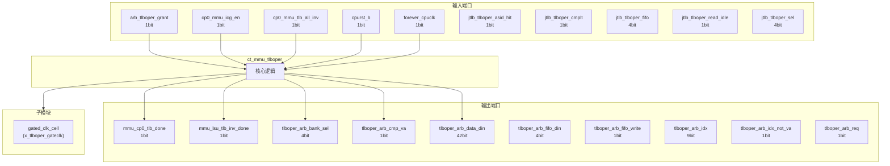
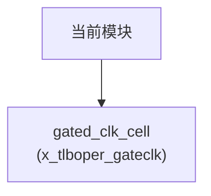

# ct_mmu_tlboper 模块设计文档

## 1. 模块概述

### 1.1 基本信息

| 属性 | 值 |
|------|-----|
| 模块名称 | ct_mmu_tlboper |
| 文件路径 | mmu\rtl\ct_mmu_tlboper.v |
| 层级 | Level 2 |
| 参数 | VPN_WIDTH=39-12, PPN_WIDTH=40-12, ASID_WIDTH=16, FLG_WIDTH=14, PGS_WIDTH=3... |

### 1.2 功能描述

ct_mmu_tlboper 模块的功能描述。

### 1.3 设计特点

- 包含 1 个子模块实例
- 包含 17 个 always 块
- 包含 65 个 assign 语句
- 可配置参数: 14 个

## 2. 模块接口说明

### 2.1 输入端口

| 信号名 | 方向 | 位宽 | 描述 |
|--------|------|------|------|
| arb_tlboper_grant | input | 1 | |
| cp0_mmu_icg_en | input | 1 | |
| cp0_mmu_tlb_all_inv | input | 1 | |
| cpurst_b | input | 1 | |
| forever_cpuclk | input | 1 | |
| jtlb_tlboper_asid_hit | input | 1 | |
| jtlb_tlboper_cmplt | input | 1 | |
| jtlb_tlboper_fifo | input | 4 | |
| jtlb_tlboper_read_idle | input | 1 | |
| jtlb_tlboper_sel | input | 4 | |
| jtlb_tlboper_va_hit | input | 1 | |
| jtlb_xx_tc_read | input | 1 | |
| lsu_mmu_tlb_all_inv | input | 1 | |
| lsu_mmu_tlb_asid | input | 16 | |
| lsu_mmu_tlb_asid_all_inv | input | 1 | |
| lsu_mmu_tlb_va | input | 27 | |
| lsu_mmu_tlb_va_all_inv | input | 1 | |
| lsu_mmu_tlb_va_asid_inv | input | 1 | |
| pad_yy_icg_scan_en | input | 1 | |
| regs_jtlb_cur_flg | input | 14 | |
| regs_jtlb_cur_g | input | 1 | |
| regs_jtlb_cur_ppn | input | 28 | |
| regs_tlboper_cur_asid | input | 16 | |
| regs_tlboper_cur_pgs | input | 3 | |
| regs_tlboper_cur_vpn | input | 27 | |
| regs_tlboper_inv_asid | input | 16 | |
| regs_tlboper_invall | input | 1 | |
| regs_tlboper_invasid | input | 1 | |
| regs_tlboper_mir | input | 12 | |
| regs_tlboper_tlbp | input | 1 | |
| ... | ... | ... | 共33个输入端口 |

### 2.2 输出端口

| 信号名 | 方向 | 位宽 | 描述 |
|--------|------|------|------|
| mmu_cp0_tlb_done | output | 1 | |
| mmu_lsu_tlb_inv_done | output | 1 | |
| tlboper_arb_bank_sel | output | 4 | |
| tlboper_arb_cmp_va | output | 1 | |
| tlboper_arb_data_din | output | 42 | |
| tlboper_arb_fifo_din | output | 4 | |
| tlboper_arb_fifo_write | output | 1 | |
| tlboper_arb_idx | output | 9 | |
| tlboper_arb_idx_not_va | output | 1 | |
| tlboper_arb_req | output | 1 | |
| tlboper_arb_tag_din | output | 48 | |
| tlboper_arb_vpn | output | 27 | |
| tlboper_arb_write | output | 1 | |
| tlboper_jtlb_asid | output | 16 | |
| tlboper_jtlb_asid_sel | output | 1 | |
| tlboper_jtlb_cmp_noasid | output | 1 | |
| tlboper_jtlb_inv_asid | output | 16 | |
| tlboper_jtlb_tlbwr_on | output | 1 | |
| tlboper_ptw_abort | output | 1 | |
| tlboper_regs_cmplt | output | 1 | |
| tlboper_regs_tlbp_cmplt | output | 1 | |
| tlboper_regs_tlbr_cmplt | output | 1 | |
| tlboper_top_lsu_cmplt | output | 1 | |
| tlboper_top_lsu_oper | output | 1 | |
| tlboper_top_tlbiall_cur_st | output | 1 | |
| tlboper_top_tlbiasid_cur_st | output | 3 | |
| tlboper_top_tlbiva_cur_st | output | 4 | |
| tlboper_top_tlbp_cur_st | output | 2 | |
| tlboper_top_tlbr_cur_st | output | 2 | |
| tlboper_top_tlbwi_cur_st | output | 2 | |
| ... | ... | ... | 共36个输出端口 |

### 2.4 参数列表

| 参数名 | 默认值 | 位宽 | 描述 |
|--------|--------|------|------|
| VPN_WIDTH | 39-12 | 1 | |
| PPN_WIDTH | 40-12 | 1 | |
| ASID_WIDTH | 16 | 1 | |
| FLG_WIDTH | 14 | 1 | |
| PGS_WIDTH | 3 | 1 | |
| TAG_WIDTH | 1+VPN_WIDTH+ASID_WIDTH+PGS_WIDTH+1 | 1 | |
| DATA_WIDTH | PPN_WIDTH+FLG_WIDTH | 1 | |
| PIDLE | 2'b00 | 1 | |
| RIDLE | 2'b00 | 1 | |
| WIIDLE | 2'b00 | 1 | |
| WRIDLE | 2'b00 | 1 | |
| IASID_IDLE | 3'b000 | 1 | |
| IALL_IDLE | 1'b0 | 1 | |
| IVA_IDLE | 4'b0000 | 1 | |

## 3. 模块框图

### 3.1 模块架构图



### 3.2 主要数据连线

| 源模块 | 目标模块 | 信号名 | 位宽 | 说明 |
|--------|----------|--------|------|------|
| ct_mmu_tlboper | gated_clk_cell | clk_in | - | |
| ct_mmu_tlboper | gated_clk_cell | clk_out | - | |
| ct_mmu_tlboper | gated_clk_cell | external_en | - | |

## 4. 模块实现方案

### 4.1 关键逻辑描述

**Always 块列表:**

```verilog
always @(posedge tlboper_clk or negedge cpurst_b) begin
  // ...
end
```

```verilog
always @(tlb_lsu_oper_flop
       or tlbp_cur_st[1:0]
       or arb_tlboper_grant
       or regs_tlboper_tlbp
       or jtlb_tlboper_cmplt) begin
  // ...
end
```

```verilog
always @(posedge tlboper_clk or negedge cpurst_b) begin
  // ...
end
```

```verilog
always @(arb_tlboper_grant
       or tlbr_cur_st[1:0]
       or jtlb_tlboper_cmplt
       or regs_tlboper_tlbr
       or tlb_lsu_oper) begin
  // ...
end
```

```verilog
always @(posedge tlboper_clk or negedge cpurst_b) begin
  // ...
end
```


**Assign 语句列表:**

| 目标信号 | 源表达式 |
|----------|----------|
| tlboper_clk_en | regs_tlboper_tlbp
                     || regs_tlboper_tlbr
                     || regs_tlboper_tlbwi
                     || regs_tlboper_tlbwr
                     || tlb_inv_asid
                     || tlb_inv_all
                     || tlb_inv_va
                     || lsu_oper_cmplt
                     || !tlb_sm_idle |
| tlb_tlbp_req | (tlbp_cur_st[1:0] == PWFG) |
| tlb_tlbp_cmplt | (tlbp_cur_st[1:0] == PWFC)
                           && jtlb_tlboper_cmplt |
| tlb_tlbr_req | (tlbr_cur_st[1:0] == RWFG) |
| tlb_tlbr_cmplt | (tlbr_cur_st[1:0] == RWFC)
                           && jtlb_tlboper_cmplt |
| tlb_tlbwi_req | (tlbwi_cur_st[1:0] == WIWFG) |
| tlb_tlbwi_cmplt | (tlbwi_cur_st[1:0] == WIWFC)
                            && jtlb_tlboper_cmplt |
| tlb_tlbwr_rd_req | (tlbwr_cur_st[1:0] == WRWFG) |
| tlb_tlbwr_wt_req | (tlbwr_cur_st[1:0] == WRTAG)
                             && jtlb_tlboper_cmplt |
| tlb_tlbwr_req | tlb_tlbwr_rd_req || tlb_tlbwr_wt_req |
| tlb_tlbwr_cmplt | (tlbwr_cur_st[1:0] == WRWFC)
                             && jtlb_tlboper_cmplt |
| tlb_inv_asid | lsu_mmu_tlb_asid_all_inv && !lsu_oper_cmplt && tlb_sm_idle || regs_tlboper_invasid && !tlb_lsu_oper |
| tlb_invasid_rd_req | (tlbiasid_cur_st[2:0] == IASID_RD) |
| tlb_invasid_wt_req | (tlbiasid_cur_st[2:0] == IASID_WT) |
| tlb_invasid_req | tlb_invasid_rd_req || tlb_invasid_wt_req |
| ... | 共65条assign语句 |

## 5. 内部关键信号列表

### 5.1 寄存器信号

| 信号名 | 位宽 | 描述 |
|--------|------|------|
| lsu_oper_cmplt | 1 | |
| tlb_inv_cnt | 11 | |
| tlb_lsu_oper_flop | 1 | |
| tlbiall_cur_st | 1 | |
| tlbiall_nxt_st | 1 | |
| tlbiasid_cur_st | 3 | |
| tlbiasid_nxt_st | 3 | |
| tlbiva_cur_st | 4 | |
| tlbiva_nxt_st | 4 | |
| tlbp_cur_st | 2 | |
| tlbp_nxt_st | 2 | |
| tlbr_cur_st | 2 | |
| tlbr_nxt_st | 2 | |
| tlbwi_cur_st | 2 | |
| tlbwi_nxt_st | 2 | |
| tlbwr_cur_st | 2 | |
| tlbwr_nxt_st | 2 | |

### 5.2 线网信号

| 信号名 | 位宽 | 描述 |
|--------|------|------|
| bank_sel_all | 1 | |
| bank_sel_idx | 1 | |
| bank_sel_wr | 1 | |
| idx_sel | 4 | |
| invall_cnt | 11 | |
| invasid_cnt | 11 | |
| jtlb_cnt | 11 | |
| lsu_va_sel | 1 | |
| tlb_cnt_inv_on | 1 | |
| tlb_inv_all | 1 | |
| tlb_inv_asid | 1 | |
| tlb_inv_cnt_dec | 1 | |
| tlb_inv_cnt_init | 1 | |
| tlb_inv_done | 1 | |
| tlb_inv_va | 1 | |
| tlb_invall_cmplt | 1 | |
| tlb_invall_cnt_dec | 1 | |
| tlb_invall_cnt_init | 1 | |
| tlb_invall_req | 1 | |
| tlb_invasid_cmplt | 1 | |
| ... | ... | 共54个线网信号 |

## 6. 子模块方案

### 6.1 模块例化层次结构



### 6.2 子模块列表

| 层级 | 模块名 | 实例名 | 功能描述 |
|------|--------|--------|----------|
| 1 | gated_clk_cell | x_tlboper_gateclk | |

## 7. 修订历史

| 版本 | 日期 | 作者 | 说明 |
|------|------|------|------|
| 1.0 | 2026-03-12 | Auto-generated | 初始版本 |
