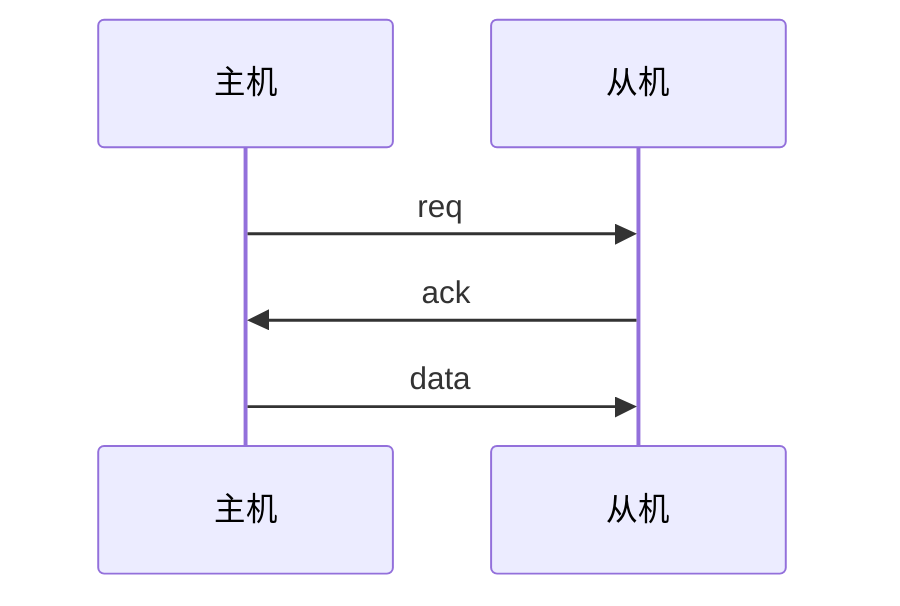
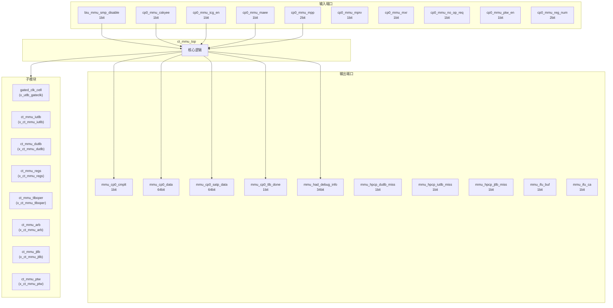

# ct_mmu_top 模块设计文档

## 1. 模块概述

### 1.1 基本信息

| 属性 | 值 |
|------|-----|
| 模块名称 | ct_mmu_top |
| 文件路径 | mmu\rtl\ct_mmu_top.v |
| 层级 | Level 1 |

### 1.2 功能描述

内存管理单元 (Memory Management Unit)，主要信号: 使能信号、读使能、输入信号、选择信号、时钟信号

### 1.3 设计特点

- 包含 13 个子模块实例
- 包含 1 个 assign 语句

## 2. 模块接口说明

### 2.1 输入端口

| 信号名 | 方向 | 位宽 | 描述 |
|--------|------|------|------|
| biu_mmu_smp_disable | input | 1 |  |
| cp0_mmu_cskyee | input | 1 |  |
| cp0_mmu_icg_en | input | 1 | 使能信号 |
| cp0_mmu_maee | input | 1 |  |
| cp0_mmu_mpp | input | 2 |  |
| cp0_mmu_mprv | input | 1 |  |
| cp0_mmu_mxr | input | 1 |  |
| cp0_mmu_no_op_req | input | 1 | 请求信号 |
| cp0_mmu_ptw_en | input | 1 | 使能信号 |
| cp0_mmu_reg_num | input | 2 | 读使能 |
| cp0_mmu_satp_sel | input | 1 | 选择信号 |
| cp0_mmu_sum | input | 1 |  |
| cp0_mmu_tlb_all_inv | input | 1 | 输入信号 |
| cp0_mmu_wdata | input | 64 | 数据信号 |
| cp0_mmu_wreg | input | 1 | 读使能 |
| cp0_yy_priv_mode | input | 2 |  |
| cpurst_b | input | 1 | 复位信号 |
| forever_cpuclk | input | 1 | 时钟信号 |
| hpcp_mmu_cnt_en | input | 1 | 使能信号 |
| ifu_mmu_abort | input | 1 |  |
| ifu_mmu_va | input | 63 |  |
| ifu_mmu_va_vld | input | 1 | 有效信号 |
| lsu_mmu_abort0 | input | 1 |  |
| lsu_mmu_abort1 | input | 1 |  |
| lsu_mmu_bus_error | input | 1 | 错误信号 |
| lsu_mmu_data | input | 64 | 数据信号 |
| lsu_mmu_data_vld | input | 1 | 有效信号 |
| lsu_mmu_id0 | input | 7 |  |
| lsu_mmu_id1 | input | 7 |  |
| lsu_mmu_st_inst0 | input | 1 | 指令信号 |
| ... | ... | ... | 共56个输入端口 |

### 2.2 输出端口

| 信号名 | 方向 | 位宽 | 描述 |
|--------|------|------|------|
| mmu_cp0_cmplt | output | 1 |  |
| mmu_cp0_data | output | 64 | 数据信号 |
| mmu_cp0_satp_data | output | 64 | 数据信号 |
| mmu_cp0_tlb_done | output | 1 | 完成信号 |
| mmu_had_debug_info | output | 34 | 输入信号 |
| mmu_hpcp_dutlb_miss | output | 1 | 程序计数器 |
| mmu_hpcp_iutlb_miss | output | 1 | 程序计数器 |
| mmu_hpcp_jtlb_miss | output | 1 | 程序计数器 |
| mmu_ifu_buf | output | 1 |  |
| mmu_ifu_ca | output | 1 |  |
| mmu_ifu_deny | output | 1 | 使能信号 |
| mmu_ifu_pa | output | 28 |  |
| mmu_ifu_pavld | output | 1 | 有效信号 |
| mmu_ifu_pgflt | output | 1 |  |
| mmu_ifu_sec | output | 1 |  |
| mmu_lsu_access_fault0 | output | 1 |  |
| mmu_lsu_access_fault1 | output | 1 |  |
| mmu_lsu_buf0 | output | 1 |  |
| mmu_lsu_buf1 | output | 1 |  |
| mmu_lsu_ca0 | output | 1 |  |
| mmu_lsu_ca1 | output | 1 |  |
| mmu_lsu_data_req | output | 1 | 请求信号 |
| mmu_lsu_data_req_addr | output | 40 | 请求信号 |
| mmu_lsu_data_req_size | output | 1 | 请求信号 |
| mmu_lsu_mmu_en | output | 1 | 使能信号 |
| mmu_lsu_pa0 | output | 28 |  |
| mmu_lsu_pa0_vld | output | 1 | 有效信号 |
| mmu_lsu_pa1 | output | 28 |  |
| mmu_lsu_pa1_vld | output | 1 | 有效信号 |
| mmu_lsu_pa2 | output | 28 |  |
| ... | ... | ... | 共55个输出端口 |

### 2.5 接口时序图

## 3. 模块框图

### 3.1 模块架构图

### 3.2 主要数据连线

| 源模块 | 目标模块 | 信号名 | 位宽 | 说明 |
|--------|----------|--------|------|------|
| ct_mmu_top | gated_clk_cell | clk_in | - | |
| ct_mmu_top | gated_clk_cell | clk_out | - | |
| ct_mmu_top | gated_clk_cell | external_en | - | |
| ct_mmu_top | ct_mmu_iutlb | arb_iutlb_grant | - | |
| ct_mmu_top | ct_mmu_iutlb | cp0_mmu_icg_en | - | |
| ct_mmu_top | ct_mmu_iutlb | cp0_mmu_no_op_req | - | |
| ct_mmu_top | ct_mmu_dutlb | arb_dutlb_grant | - | |
| ct_mmu_top | ct_mmu_dutlb | biu_mmu_smp_disable | - | |
| ct_mmu_top | ct_mmu_dutlb | cp0_mmu_icg_en | - | |
| ct_mmu_top | ct_mmu_regs | cp0_mmu_cskyee | - | |
| ct_mmu_top | ct_mmu_regs | cp0_mmu_icg_en | - | |
| ct_mmu_top | ct_mmu_regs | cp0_mmu_mpp | - | |
| ct_mmu_top | ct_mmu_tlboper | arb_tlboper_grant | - | |
| ct_mmu_top | ct_mmu_tlboper | cp0_mmu_icg_en | - | |
| ct_mmu_top | ct_mmu_tlboper | cp0_mmu_tlb_all_inv | - | |
| ct_mmu_top | ct_mmu_arb | arb_dutlb_grant | - | |
| ct_mmu_top | ct_mmu_arb | arb_iutlb_grant | - | |
| ct_mmu_top | ct_mmu_arb | arb_jtlb_acc_type | - | |
| ct_mmu_top | ct_mmu_jtlb | arb_jtlb_acc_type | - | |
| ct_mmu_top | ct_mmu_jtlb | arb_jtlb_bank_sel | - | |
| ct_mmu_top | ct_mmu_jtlb | arb_jtlb_cmp_with_va | - | |
| ct_mmu_top | ct_mmu_ptw | arb_ptw_grant | - | |
| ct_mmu_top | ct_mmu_ptw | arb_ptw_mask | - | |
| ct_mmu_top | ct_mmu_ptw | cp0_mmu_icg_en | - | |
| ct_mmu_top | ct_mmu_sysmap | mmu_sysmap_pa_y | - | |
| ct_mmu_top | ct_mmu_sysmap | sysmap_mmu_flg_y | - | |
| ct_mmu_top | ct_mmu_sysmap | sysmap_mmu_hit_y | - | |
| ct_mmu_top | ct_mmu_sysmap | mmu_sysmap_pa_y | - | |
| ct_mmu_top | ct_mmu_sysmap | sysmap_mmu_flg_y | - | |
| ct_mmu_top | ct_mmu_sysmap | sysmap_mmu_hit_y | - | |

## 4. 模块实现方案

### 4.1 关键逻辑描述

无关键 always 块。

**Assign 语句列表:**

| 目标信号 | 源表达式 |
|----------|----------|
| utlb_clk_en | regs_utlb_clr
                  || tlboper_utlb_clr
                  || tlboper_utlb_inv_va_req
                  || !regs_mmu_en
                  || jtlb_top_utlb_pavld
                  || dutlb_top_scd_updt
                  || iutlb_top_scd_updt |

## 5. 内部关键信号列表

### 5.1 寄存器信号

无寄存器信号。

### 5.2 线网信号

| 信号名 | 位宽 | 描述 |
|--------|------|------|
| arb_dutlb_grant | 1 | |
| arb_iutlb_grant | 1 | |
| arb_jtlb_acc_type | 3 | |
| arb_jtlb_bank_sel | 4 | |
| arb_jtlb_cmp_with_va | 1 | |
| arb_jtlb_data_din | 42 | |
| arb_jtlb_fifo_din | 4 | |
| arb_jtlb_fifo_write | 1 | |
| arb_jtlb_idx | 9 | |
| arb_jtlb_req | 1 | |
| arb_jtlb_tag_din | 48 | |
| arb_jtlb_vpn | 27 | |
| arb_jtlb_write | 1 | |
| arb_ptw_grant | 1 | |
| arb_ptw_mask | 1 | |
| arb_tlboper_grant | 1 | |
| arb_top_cur_st | 2 | |
| arb_top_tlboper_on | 1 | |
| dutlb_arb_cmplt | 1 | |
| dutlb_arb_load | 1 | |
| ... | ... | 共166个线网信号 |

## 6. 子模块方案

### 6.1 模块例化层次结构

```mermaid
graph TD
    ROOT["当前模块"]
    N0["gated_clk_cell\n(x_utlb_gateclk)"]
    ROOT --> N0
    N1["ct_mmu_iutlb\n(x_ct_mmu_iutlb)"]
    ROOT --> N1
    N2["ct_mmu_dutlb\n(x_ct_mmu_dutlb)"]
    ROOT --> N2
    N3["ct_mmu_regs\n(x_ct_mmu_regs)"]
    ROOT --> N3
    N4["ct_mmu_tlboper\n(x_ct_mmu_tlboper)"]
    ROOT --> N4
    N5["ct_mmu_arb\n(x_ct_mmu_arb)"]
    ROOT --> N5
    N6["ct_mmu_jtlb\n(x_ct_mmu_jtlb)"]
    ROOT --> N6
    N7["ct_mmu_ptw\n(x_ct_mmu_ptw)"]
    ROOT --> N7
    N8["ct_mmu_sysmap\n(x_ct_mmu_sysmap_0)"]
    ROOT --> N8
    N9["ct_mmu_sysmap\n(x_ct_mmu_sysmap_1)"]
    ROOT --> N9
    N10["ct_mmu_sysmap\n(x_ct_mmu_sysmap_2)"]
    ROOT --> N10
    N11["ct_mmu_sysmap\n(x_ct_mmu_sysmap_3)"]
    ROOT --> N11
    N12["ct_mmu_sysmap\n(x_ct_mmu_sysmap_4)"]
    ROOT --> N12
```

### 6.2 子模块列表

| 层级 | 模块名 | 实例名 | 功能描述 |
|------|--------|--------|----------|
| 1 | gated_clk_cell | x_utlb_gateclk |  |
| 1 | ct_mmu_iutlb | x_ct_mmu_iutlb | 内存管理单元 |
| 1 | ct_mmu_dutlb | x_ct_mmu_dutlb | 内存管理单元 |
| 1 | ct_mmu_regs | x_ct_mmu_regs | 内存管理单元 |
| 1 | ct_mmu_tlboper | x_ct_mmu_tlboper | 内存管理单元 |
| 1 | ct_mmu_arb | x_ct_mmu_arb | 内存管理单元 |
| 1 | ct_mmu_jtlb | x_ct_mmu_jtlb | 内存管理单元 |
| 1 | ct_mmu_ptw | x_ct_mmu_ptw | 内存管理单元 |
| 1 | ct_mmu_sysmap | x_ct_mmu_sysmap_0 | 内存管理单元 |
| 1 | ct_mmu_sysmap | x_ct_mmu_sysmap_1 | 内存管理单元 |
| 1 | ct_mmu_sysmap | x_ct_mmu_sysmap_2 | 内存管理单元 |
| 1 | ct_mmu_sysmap | x_ct_mmu_sysmap_3 | 内存管理单元 |
| 1 | ct_mmu_sysmap | x_ct_mmu_sysmap_4 | 内存管理单元 |

## 7. 修订历史

| 版本 | 日期 | 作者 | 说明 |
|------|------|------|------|
| 1.0 | 2026-03-12 | Auto-generated | 初始版本 |
