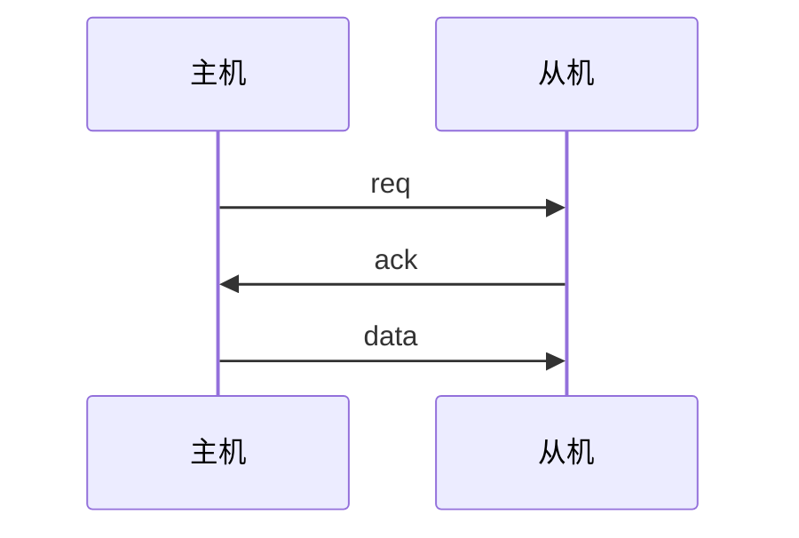
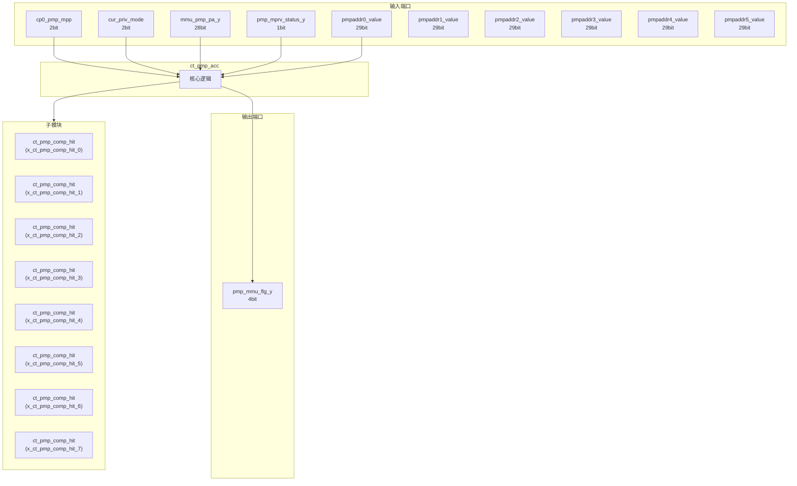
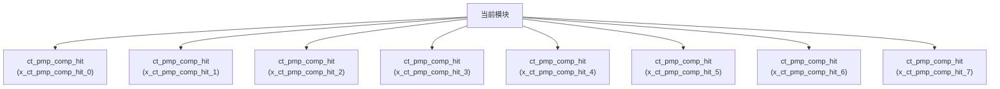

# ct_pmp_acc 模块设计文档

## 1. 模块概述

### 1.1 基本信息

| 属性 | 值 |
|------|-----|
| 模块名称 | ct_pmp_acc |
| 文件路径 | pmp\rtl\ct_pmp_acc.v |
| 层级 | Level 2 |

### 1.2 功能描述

物理内存保护 (Physical Memory Protection)，(访问控制)，主要信号: 配置信号、状态信号、地址信号

### 1.3 设计特点

- 包含 8 个子模块实例
- 包含 1 个 always 块
- 包含 1 个 assign 语句

## 2. 模块接口说明

### 2.1 输入端口

| 信号名 | 方向 | 位宽 | 描述 |
|--------|------|------|------|
| cp0_pmp_mpp | input | 2 |  |
| cur_priv_mode | input | 2 |  |
| mmu_pmp_pa_y | input | 28 |  |
| pmp_mprv_status_y | input | 1 | 状态信号 |
| pmpaddr0_value | input | 29 | 地址信号 |
| pmpaddr1_value | input | 29 | 地址信号 |
| pmpaddr2_value | input | 29 | 地址信号 |
| pmpaddr3_value | input | 29 | 地址信号 |
| pmpaddr4_value | input | 29 | 地址信号 |
| pmpaddr5_value | input | 29 | 地址信号 |
| pmpaddr6_value | input | 29 | 地址信号 |
| pmpaddr7_value | input | 29 | 地址信号 |
| pmpcfg0_value | input | 64 | 配置信号 |
| pmpcfg2_value | input | 64 | 配置信号 |

### 2.2 输出端口

| 信号名 | 方向 | 位宽 | 描述 |
|--------|------|------|------|
| pmp_mmu_flg_y | output | 4 |  |

### 2.5 接口时序图



## 3. 模块框图

### 3.1 模块架构图



### 3.2 主要数据连线

| 源模块 | 目标模块 | 信号名 | 位宽 | 说明 |
|--------|----------|--------|------|------|
| ct_pmp_acc | ct_pmp_comp_hit | addr_match_mode_x | - | |
| ct_pmp_acc | ct_pmp_comp_hit | mmu_addr_ge_bottom_x | - | |
| ct_pmp_acc | ct_pmp_comp_hit | mmu_addr_ge_upaddr_x | - | |
| ct_pmp_acc | ct_pmp_comp_hit | addr_match_mode_x | - | |
| ct_pmp_acc | ct_pmp_comp_hit | mmu_addr_ge_bottom_x | - | |
| ct_pmp_acc | ct_pmp_comp_hit | mmu_addr_ge_upaddr_x | - | |
| ct_pmp_acc | ct_pmp_comp_hit | addr_match_mode_x | - | |
| ct_pmp_acc | ct_pmp_comp_hit | mmu_addr_ge_bottom_x | - | |
| ct_pmp_acc | ct_pmp_comp_hit | mmu_addr_ge_upaddr_x | - | |
| ct_pmp_acc | ct_pmp_comp_hit | addr_match_mode_x | - | |
| ct_pmp_acc | ct_pmp_comp_hit | mmu_addr_ge_bottom_x | - | |
| ct_pmp_acc | ct_pmp_comp_hit | mmu_addr_ge_upaddr_x | - | |
| ct_pmp_acc | ct_pmp_comp_hit | addr_match_mode_x | - | |
| ct_pmp_acc | ct_pmp_comp_hit | mmu_addr_ge_bottom_x | - | |
| ct_pmp_acc | ct_pmp_comp_hit | mmu_addr_ge_upaddr_x | - | |
| ct_pmp_acc | ct_pmp_comp_hit | addr_match_mode_x | - | |
| ct_pmp_acc | ct_pmp_comp_hit | mmu_addr_ge_bottom_x | - | |
| ct_pmp_acc | ct_pmp_comp_hit | mmu_addr_ge_upaddr_x | - | |
| ct_pmp_acc | ct_pmp_comp_hit | addr_match_mode_x | - | |
| ct_pmp_acc | ct_pmp_comp_hit | mmu_addr_ge_bottom_x | - | |
| ct_pmp_acc | ct_pmp_comp_hit | mmu_addr_ge_upaddr_x | - | |
| ct_pmp_acc | ct_pmp_comp_hit | addr_match_mode_x | - | |
| ct_pmp_acc | ct_pmp_comp_hit | mmu_addr_ge_bottom_x | - | |
| ct_pmp_acc | ct_pmp_comp_hit | mmu_addr_ge_upaddr_x | - | |

## 4. 模块实现方案

### 4.1 关键逻辑描述

**Always 块列表:**

```verilog
always @(pmpcfg0_value[34:31]
       or pmpcfg0_value[63]
       or pmpcfg0_value[26:23]
       or pmpcfg2_value[34:31]
       or pmpcfg2_value[18:15]
       or pmpcfg0_value[10:07]
       or pmpcfg0_value[42:39]
       or pmp_default_flg[3:0]
       or pmpcfg0_value[2:0]
       or pmpcfg2_value[58:55]
       or pmpcfg0_value[58:55]
       or pmp_hit[15:0]
       or pmpcfg0_value[18:15]
       or pmpcfg0_value[50:47]
       or pmpcfg2_value[10:07]
       or pmpcfg2_value[42:39]
       or pmpcfg2_value[50:47]
       or pmpcfg2_value[26:23]
       or pmpcfg2_value[63]
       or pmpcfg2_value[2:0]) begin
  // ...
end
```


**Assign 语句列表:**

| 目标信号 | 源表达式 |
|----------|----------|
| cp0_mach_mode | cp0_priv_mode[1:0] == 2'b11 |

## 5. 内部关键信号列表

### 5.1 寄存器信号

无寄存器信号。

### 5.2 线网信号

| 信号名 | 位宽 | 描述 |
|--------|------|------|
| addr_match_mode0 | 2 | |
| addr_match_mode1 | 2 | |
| addr_match_mode2 | 2 | |
| addr_match_mode3 | 2 | |
| addr_match_mode4 | 2 | |
| addr_match_mode5 | 2 | |
| addr_match_mode6 | 2 | |
| addr_match_mode7 | 2 | |
| cp0_mach_mode | 1 | |
| cp0_priv_mode | 2 | |
| mmu_addr_ge_bottom0 | 1 | |
| mmu_addr_ge_bottom1 | 1 | |
| mmu_addr_ge_bottom2 | 1 | |
| mmu_addr_ge_bottom3 | 1 | |
| mmu_addr_ge_bottom4 | 1 | |
| mmu_addr_ge_bottom5 | 1 | |
| mmu_addr_ge_bottom6 | 1 | |
| mmu_addr_ge_bottom7 | 1 | |
| mmu_addr_ge_upaddr0 | 1 | |
| mmu_addr_ge_upaddr1 | 1 | |
| ... | ... | 共36个线网信号 |

## 6. 子模块方案

### 6.1 模块例化层次结构



### 6.2 子模块列表

| 层级 | 模块名 | 实例名 | 功能描述 |
|------|--------|--------|----------|
| 1 | ct_pmp_comp_hit | x_ct_pmp_comp_hit_0 | 物理内存保护 |
| 1 | ct_pmp_comp_hit | x_ct_pmp_comp_hit_1 | 物理内存保护 |
| 1 | ct_pmp_comp_hit | x_ct_pmp_comp_hit_2 | 物理内存保护 |
| 1 | ct_pmp_comp_hit | x_ct_pmp_comp_hit_3 | 物理内存保护 |
| 1 | ct_pmp_comp_hit | x_ct_pmp_comp_hit_4 | 物理内存保护 |
| 1 | ct_pmp_comp_hit | x_ct_pmp_comp_hit_5 | 物理内存保护 |
| 1 | ct_pmp_comp_hit | x_ct_pmp_comp_hit_6 | 物理内存保护 |
| 1 | ct_pmp_comp_hit | x_ct_pmp_comp_hit_7 | 物理内存保护 |

## 7. 修订历史

| 版本 | 日期 | 作者 | 说明 |
|------|------|------|------|
| 1.0 | 2026-03-12 | Auto-generated | 初始版本 |
