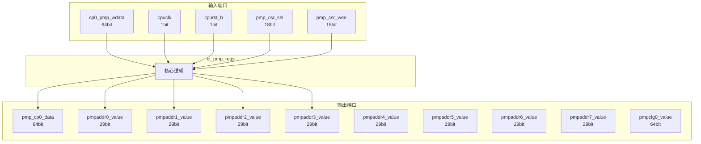

# ct_pmp_regs 模块设计文档

## 1. 模块概述

### 1.1 基本信息

| 属性 | 值 |
|------|-----|
| 模块名称 | ct_pmp_regs |
| 文件路径 | pmp\rtl\ct_pmp_regs.v |
| 层级 | Level 2 |
| 参数 | ADDR_WIDTH=28+1 |

### 1.2 功能描述

ct_pmp_regs 模块的功能描述。

### 1.3 设计特点

- 包含 16 个 always 块
- 包含 16 个 assign 语句
- 可配置参数: 1 个

## 2. 模块接口说明

### 2.1 输入端口

| 信号名 | 方向 | 位宽 | 描述 |
|--------|------|------|------|
| cp0_pmp_wdata | input | 64 | |
| cpuclk | input | 1 | |
| cpurst_b | input | 1 | |
| pmp_csr_sel | input | 18 | |
| pmp_csr_wen | input | 18 | |

### 2.2 输出端口

| 信号名 | 方向 | 位宽 | 描述 |
|--------|------|------|------|
| pmp_cp0_data | output | 64 | |
| pmpaddr0_value | output | 29 | |
| pmpaddr1_value | output | 29 | |
| pmpaddr2_value | output | 29 | |
| pmpaddr3_value | output | 29 | |
| pmpaddr4_value | output | 29 | |
| pmpaddr5_value | output | 29 | |
| pmpaddr6_value | output | 29 | |
| pmpaddr7_value | output | 29 | |
| pmpcfg0_value | output | 64 | |
| pmpcfg2_value | output | 64 | |

### 2.4 参数列表

| 参数名 | 默认值 | 位宽 | 描述 |
|--------|--------|------|------|
| ADDR_WIDTH | 28+1 | 1 | |

## 3. 模块框图

### 3.1 模块架构图



### 3.2 主要数据连线

无子模块连接。

## 4. 模块实现方案

### 4.1 关键逻辑描述

**Always 块列表:**

```verilog
always @(posedge cpuclk or negedge cpurst_b) begin
  // ...
end
```

```verilog
always @(posedge cpuclk or negedge cpurst_b) begin
  // ...
end
```

```verilog
always @(posedge cpuclk or negedge cpurst_b) begin
  // ...
end
```

```verilog
always @(posedge cpuclk or negedge cpurst_b) begin
  // ...
end
```

```verilog
always @(posedge cpuclk or negedge cpurst_b) begin
  // ...
end
```


**Assign 语句列表:**

| 目标信号 | 源表达式 |
|----------|----------|
| pmp_updt_pmp0cfg | pmp_csr_wen[0] && !pmp0cfg_lock |
| pmp_updt_pmp1cfg | pmp_csr_wen[0] && !pmp1cfg_lock |
| pmp_updt_pmp2cfg | pmp_csr_wen[0] && !pmp2cfg_lock |
| pmp_updt_pmp3cfg | pmp_csr_wen[0] && !pmp3cfg_lock |
| pmp_updt_pmp4cfg | pmp_csr_wen[0] && !pmp4cfg_lock |
| pmp_updt_pmp5cfg | pmp_csr_wen[0] && !pmp5cfg_lock |
| pmp_updt_pmp6cfg | pmp_csr_wen[0] && !pmp6cfg_lock |
| pmp_updt_pmp7cfg | pmp_csr_wen[0] && !pmp7cfg_lock |
| pmp_updt_pmpaddr0 | pmp_csr_wen[2] && !pmpcfg0_value[7] && !(pmpcfg0_value[15] && (pmpcfg0_value[12:11] == 2'b01)) |
| pmp_updt_pmpaddr1 | pmp_csr_wen[3] && !pmpcfg0_value[15] && !(pmpcfg0_value[23] && (pmpcfg0_value[20:19] == 2'b01)) |
| pmp_updt_pmpaddr2 | pmp_csr_wen[4] && !pmpcfg0_value[23] && !(pmpcfg0_value[31] && (pmpcfg0_value[28:27] == 2'b01)) |
| pmp_updt_pmpaddr3 | pmp_csr_wen[5] && !pmpcfg0_value[31] && !(pmpcfg0_value[39] && (pmpcfg0_value[36:35] == 2'b01)) |
| pmp_updt_pmpaddr4 | pmp_csr_wen[6] && !pmpcfg0_value[39] && !(pmpcfg0_value[47] && (pmpcfg0_value[44:43] == 2'b01)) |
| pmp_updt_pmpaddr5 | pmp_csr_wen[7] && !pmpcfg0_value[47] && !(pmpcfg0_value[55] && (pmpcfg0_value[52:51] == 2'b01)) |
| pmp_updt_pmpaddr6 | pmp_csr_wen[8] && !pmpcfg0_value[55] && !(pmpcfg0_value[63] && (pmpcfg0_value[60:59] == 2'b01)) |
| ... | 共16条assign语句 |

## 5. 内部关键信号列表

### 5.1 寄存器信号

| 信号名 | 位宽 | 描述 |
|--------|------|------|
| pmp0cfg_addr_mode | 2 | |
| pmp0cfg_executeable | 1 | |
| pmp0cfg_lock | 1 | |
| pmp0cfg_readable | 1 | |
| pmp0cfg_writable | 1 | |
| pmp1cfg_addr_mode | 2 | |
| pmp1cfg_executeable | 1 | |
| pmp1cfg_lock | 1 | |
| pmp1cfg_readable | 1 | |
| pmp1cfg_writable | 1 | |
| pmp2cfg_addr_mode | 2 | |
| pmp2cfg_executeable | 1 | |
| pmp2cfg_lock | 1 | |
| pmp2cfg_readable | 1 | |
| pmp2cfg_writable | 1 | |
| pmp3cfg_addr_mode | 2 | |
| pmp3cfg_executeable | 1 | |
| pmp3cfg_lock | 1 | |
| pmp3cfg_readable | 1 | |
| pmp3cfg_writable | 1 | |
| ... | ... | 共40个寄存器信号 |

### 5.2 线网信号

| 信号名 | 位宽 | 描述 |
|--------|------|------|
| pmp_updt_pmp0cfg | 1 | |
| pmp_updt_pmp1cfg | 1 | |
| pmp_updt_pmp2cfg | 1 | |
| pmp_updt_pmp3cfg | 1 | |
| pmp_updt_pmp4cfg | 1 | |
| pmp_updt_pmp5cfg | 1 | |
| pmp_updt_pmp6cfg | 1 | |
| pmp_updt_pmp7cfg | 1 | |
| pmp_updt_pmpaddr0 | 1 | |
| pmp_updt_pmpaddr1 | 1 | |
| pmp_updt_pmpaddr2 | 1 | |
| pmp_updt_pmpaddr3 | 1 | |
| pmp_updt_pmpaddr4 | 1 | |
| pmp_updt_pmpaddr5 | 1 | |
| pmp_updt_pmpaddr6 | 1 | |
| pmp_updt_pmpaddr7 | 1 | |
| pmpaddr10_value | 29 | |
| pmpaddr11_value | 29 | |
| pmpaddr12_value | 29 | |
| pmpaddr13_value | 29 | |
| ... | ... | 共24个线网信号 |

## 6. 子模块方案

无子模块。

## 7. 修订历史

| 版本 | 日期 | 作者 | 说明 |
|------|------|------|------|
| 1.0 | 2026-03-12 | Auto-generated | 初始版本 |
