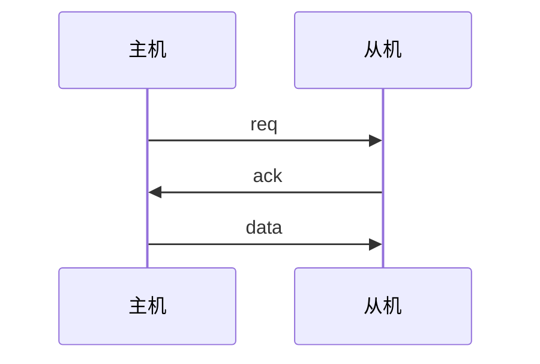
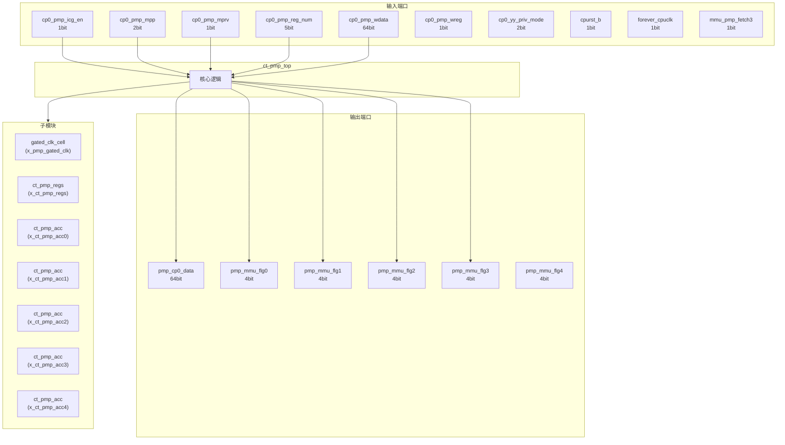
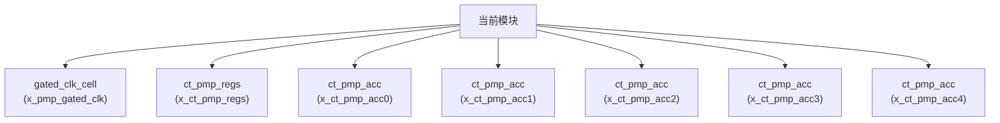

# ct_pmp_top 模块设计文档

## 1. 模块概述

### 1.1 基本信息

| 属性 | 值 |
|------|-----|
| 模块名称 | ct_pmp_top |
| 文件路径 | pmp\rtl\ct_pmp_top.v |
| 层级 | Level 1 |
| 参数 | PMPCFG0=12'h3A0, PMPCFG2=12'h3A2, PMPADDR0=12'h3B0, PMPADDR1=12'h3B1, PMPADDR2=12'h3B2... |

### 1.2 功能描述

物理内存保护 (Physical Memory Protection)，主要信号: 使能信号、读使能、时钟信号、数据信号、复位信号

### 1.3 设计特点

- 包含 7 个子模块实例
- 包含 6 个 assign 语句
- 可配置参数: 18 个

## 2. 模块接口说明

### 2.1 输入端口

| 信号名 | 方向 | 位宽 | 描述 |
|--------|------|------|------|
| cp0_pmp_icg_en | input | 1 | 使能信号 |
| cp0_pmp_mpp | input | 2 |  |
| cp0_pmp_mprv | input | 1 |  |
| cp0_pmp_reg_num | input | 5 | 读使能 |
| cp0_pmp_wdata | input | 64 | 数据信号 |
| cp0_pmp_wreg | input | 1 | 读使能 |
| cp0_yy_priv_mode | input | 2 |  |
| cpurst_b | input | 1 | 复位信号 |
| forever_cpuclk | input | 1 | 时钟信号 |
| mmu_pmp_fetch3 | input | 1 |  |
| mmu_pmp_pa0 | input | 28 |  |
| mmu_pmp_pa1 | input | 28 |  |
| mmu_pmp_pa2 | input | 28 |  |
| mmu_pmp_pa3 | input | 28 |  |
| mmu_pmp_pa4 | input | 28 |  |
| pad_yy_icg_scan_en | input | 1 | 使能信号 |

### 2.2 输出端口

| 信号名 | 方向 | 位宽 | 描述 |
|--------|------|------|------|
| pmp_cp0_data | output | 64 | 数据信号 |
| pmp_mmu_flg0 | output | 4 |  |
| pmp_mmu_flg1 | output | 4 |  |
| pmp_mmu_flg2 | output | 4 |  |
| pmp_mmu_flg3 | output | 4 |  |
| pmp_mmu_flg4 | output | 4 |  |

### 2.4 参数列表

| 参数名 | 默认值 | 位宽 | 描述 |
|--------|--------|------|------|
| PMPCFG0 | 12'h3A0 | 1 | |
| PMPCFG2 | 12'h3A2 | 1 | |
| PMPADDR0 | 12'h3B0 | 1 | |
| PMPADDR1 | 12'h3B1 | 1 | |
| PMPADDR2 | 12'h3B2 | 1 | |
| PMPADDR3 | 12'h3B3 | 1 | |
| PMPADDR4 | 12'h3B4 | 1 | |
| PMPADDR5 | 12'h3B5 | 1 | |
| PMPADDR6 | 12'h3B6 | 1 | |
| PMPADDR7 | 12'h3B7 | 1 | |
| PMPADDR8 | 12'h3B8 | 1 | |
| PMPADDR9 | 12'h3B9 | 1 | |
| PMPADDR10 | 12'h3BA | 1 | |
| PMPADDR11 | 12'h3BB | 1 | |
| PMPADDR12 | 12'h3BC | 1 | |
| PMPADDR13 | 12'h3BD | 1 | |
| PMPADDR14 | 12'h3BE | 1 | |
| PMPADDR15 | 12'h3BF | 1 | |

### 2.5 接口时序图

## 3. 模块框图

### 3.1 模块架构图

### 3.2 主要数据连线

| 源模块 | 目标模块 | 信号名 | 位宽 | 说明 |
|--------|----------|--------|------|------|
| ct_pmp_top | gated_clk_cell | clk_in | - | |
| ct_pmp_top | gated_clk_cell | clk_out | - | |
| ct_pmp_top | gated_clk_cell | external_en | - | |
| ct_pmp_top | ct_pmp_regs | cp0_pmp_wdata | - | |
| ct_pmp_top | ct_pmp_regs | cpuclk | - | |
| ct_pmp_top | ct_pmp_regs | cpurst_b | - | |
| ct_pmp_top | ct_pmp_acc | cp0_pmp_mpp | - | |
| ct_pmp_top | ct_pmp_acc | cur_priv_mode | - | |
| ct_pmp_top | ct_pmp_acc | mmu_pmp_pa_y | - | |
| ct_pmp_top | ct_pmp_acc | cp0_pmp_mpp | - | |
| ct_pmp_top | ct_pmp_acc | cur_priv_mode | - | |
| ct_pmp_top | ct_pmp_acc | mmu_pmp_pa_y | - | |
| ct_pmp_top | ct_pmp_acc | cp0_pmp_mpp | - | |
| ct_pmp_top | ct_pmp_acc | cur_priv_mode | - | |
| ct_pmp_top | ct_pmp_acc | mmu_pmp_pa_y | - | |
| ct_pmp_top | ct_pmp_acc | cp0_pmp_mpp | - | |
| ct_pmp_top | ct_pmp_acc | cur_priv_mode | - | |
| ct_pmp_top | ct_pmp_acc | mmu_pmp_pa_y | - | |
| ct_pmp_top | ct_pmp_acc | cp0_pmp_mpp | - | |
| ct_pmp_top | ct_pmp_acc | cur_priv_mode | - | |
| ct_pmp_top | ct_pmp_acc | mmu_pmp_pa_y | - | |

## 4. 模块实现方案

### 4.1 关键逻辑描述

无关键 always 块。

**Assign 语句列表:**

| 目标信号 | 源表达式 |
|----------|----------|
| wr_pmp_regs | |pmp_csr_wen[17:0] |
| pmp_mprv_status0 | cp0_pmp_mprv |
| pmp_mprv_status1 | cp0_pmp_mprv |
| pmp_mprv_status2 | 1'b0 |
| pmp_mprv_status3 | cp0_pmp_mprv && !mmu_pmp_fetch3 |
| pmp_mprv_status4 | cp0_pmp_mprv |

## 5. 内部关键信号列表

### 5.1 寄存器信号

无寄存器信号。

### 5.2 线网信号

| 信号名 | 位宽 | 描述 |
|--------|------|------|
| cp0_pmp_addr | 12 | |
| cpuclk | 1 | |
| cur_priv_mode | 2 | |
| pmp_csr_sel | 18 | |
| pmp_csr_wen | 18 | |
| pmp_mprv_status0 | 1 | |
| pmp_mprv_status1 | 1 | |
| pmp_mprv_status2 | 1 | |
| pmp_mprv_status3 | 1 | |
| pmp_mprv_status4 | 1 | |
| pmpaddr0_value | 29 | |
| pmpaddr1_value | 29 | |
| pmpaddr2_value | 29 | |
| pmpaddr3_value | 29 | |
| pmpaddr4_value | 29 | |
| pmpaddr5_value | 29 | |
| pmpaddr6_value | 29 | |
| pmpaddr7_value | 29 | |
| pmpcfg0_value | 64 | |
| pmpcfg2_value | 64 | |
| ... | ... | 共21个线网信号 |

## 6. 子模块方案

### 6.1 模块例化层次结构

### 6.2 子模块列表

| 层级 | 模块名 | 实例名 | 功能描述 |
|------|--------|--------|----------|
| 1 | gated_clk_cell | x_pmp_gated_clk |  |
| 1 | ct_pmp_regs | x_ct_pmp_regs | 物理内存保护 |
| 1 | ct_pmp_acc | x_ct_pmp_acc0 | 物理内存保护 |
| 1 | ct_pmp_acc | x_ct_pmp_acc1 | 物理内存保护 |
| 1 | ct_pmp_acc | x_ct_pmp_acc2 | 物理内存保护 |
| 1 | ct_pmp_acc | x_ct_pmp_acc3 | 物理内存保护 |
| 1 | ct_pmp_acc | x_ct_pmp_acc4 | 物理内存保护 |

## 7. 修订历史

| 版本 | 日期 | 作者 | 说明 |
|------|------|------|------|
| 1.0 | 2026-03-12 | Auto-generated | 初始版本 |
