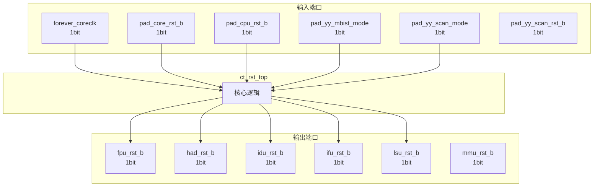

# ct_rst_top 模块设计文档

## 1. 模块概述

### 1.1 基本信息

| 属性 | 值 |
|------|-----|
| 模块名称 | ct_rst_top |
| 文件路径 | rst\rtl\ct_rst_top.v |
| 层级 | Level 1 |

### 1.2 功能描述

ct_rst_top 模块的功能描述。

### 1.3 设计特点

- 包含 7 个 always 块
- 包含 8 个 assign 语句

## 2. 模块接口说明

### 2.1 输入端口

| 信号名 | 方向 | 位宽 | 描述 |
|--------|------|------|------|
| forever_coreclk | input | 1 | |
| pad_core_rst_b | input | 1 | |
| pad_cpu_rst_b | input | 1 | |
| pad_yy_mbist_mode | input | 1 | |
| pad_yy_scan_mode | input | 1 | |
| pad_yy_scan_rst_b | input | 1 | |

### 2.2 输出端口

| 信号名 | 方向 | 位宽 | 描述 |
|--------|------|------|------|
| fpu_rst_b | output | 1 | |
| had_rst_b | output | 1 | |
| idu_rst_b | output | 1 | |
| ifu_rst_b | output | 1 | |
| lsu_rst_b | output | 1 | |
| mmu_rst_b | output | 1 | |

## 3. 模块框图

### 3.1 模块架构图



### 3.2 主要数据连线

无子模块连接。

## 4. 模块实现方案

### 4.1 关键逻辑描述

**Always 块列表:**

```verilog
always @(posedge forever_coreclk or negedge async_corerst_b) begin
  // ...
end
```

```verilog
always @(posedge forever_coreclk or negedge corerst_b) begin
  // ...
end
```

```verilog
always @(posedge forever_coreclk or negedge corerst_b) begin
  // ...
end
```

```verilog
always @(posedge forever_coreclk or negedge corerst_b) begin
  // ...
end
```

```verilog
always @(posedge forever_coreclk or negedge corerst_b) begin
  // ...
end
```


**Assign 语句列表:**

| 目标信号 | 源表达式 |
|----------|----------|
| async_corerst_b | pad_core_rst_b & pad_cpu_rst_b & !pad_yy_mbist_mode |
| corerst_b | pad_yy_scan_mode ? pad_yy_scan_rst_b : core_rst_ff_3rd |
| ifu_rst_b | pad_yy_scan_mode ? pad_yy_scan_rst_b : ifurst_b |
| idu_rst_b | pad_yy_scan_mode ? pad_yy_scan_rst_b : idurst_b |
| lsu_rst_b | pad_yy_scan_mode ? pad_yy_scan_rst_b : lsurst_b |
| fpu_rst_b | pad_yy_scan_mode ? pad_yy_scan_rst_b : fpurst_b |
| mmu_rst_b | pad_yy_scan_mode ? pad_yy_scan_rst_b : mmurst_b |
| had_rst_b | pad_yy_scan_mode ? pad_yy_scan_rst_b : hadrst_b |

## 5. 内部关键信号列表

### 5.1 寄存器信号

| 信号名 | 位宽 | 描述 |
|--------|------|------|
| core_rst_ff_1st | 1 | |
| core_rst_ff_2nd | 1 | |
| core_rst_ff_3rd | 1 | |
| fpurst_b | 1 | |
| hadrst_b | 1 | |
| idurst_b | 1 | |
| ifurst_b | 1 | |
| lsurst_b | 1 | |
| mmurst_b | 1 | |

### 5.2 线网信号

| 信号名 | 位宽 | 描述 |
|--------|------|------|
| async_corerst_b | 1 | |
| corerst_b | 1 | |

## 6. 子模块方案

无子模块。

## 7. 修订历史

| 版本 | 日期 | 作者 | 说明 |
|------|------|------|------|
| 1.0 | 2026-03-12 | Auto-generated | 初始版本 |
