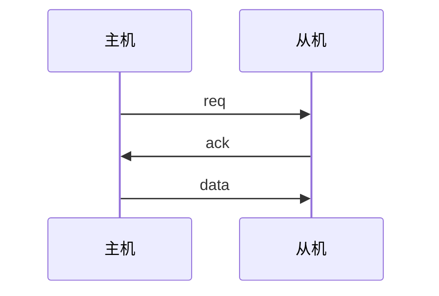
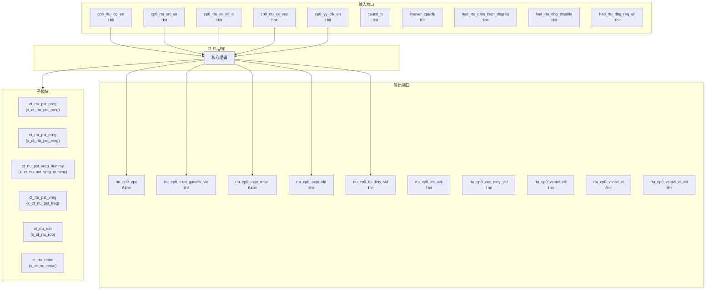
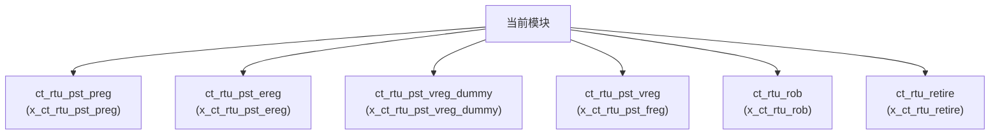

# ct_rtu_top 模块设计文档

## 1. 模块概述

### 1.1 基本信息

| 属性 | 值 |
|------|-----|
| 模块名称 | ct_rtu_top |
| 文件路径 | rtu\rtl\ct_rtu_top.v |
| 层级 | Level 2 |

### 1.2 功能描述

退休单元 (Retirement Unit)，主要信号: 使能信号、操作码、输入信号、时钟信号、请求信号

### 1.3 设计特点

- 包含 6 个子模块实例

## 2. 模块接口说明

### 2.1 输入端口

| 信号名 | 方向 | 位宽 | 描述 |
|--------|------|------|------|
| cp0_rtu_icg_en | input | 1 | 使能信号 |
| cp0_rtu_srt_en | input | 1 | 使能信号 |
| cp0_rtu_xx_int_b | input | 1 | 输入信号 |
| cp0_rtu_xx_vec | input | 5 |  |
| cp0_yy_clk_en | input | 1 | 时钟信号 |
| cpurst_b | input | 1 | 复位信号 |
| forever_cpuclk | input | 1 | 时钟信号 |
| had_rtu_data_bkpt_dbgreq | input | 1 | 请求信号 |
| had_rtu_dbg_disable | input | 1 |  |
| had_rtu_dbg_req_en | input | 1 | 请求信号 |
| had_rtu_debug_retire_info_en | input | 1 | 使能信号 |
| had_rtu_event_dbgreq | input | 1 | 请求信号 |
| had_rtu_fdb | input | 1 |  |
| had_rtu_hw_dbgreq | input | 1 | 请求信号 |
| had_rtu_hw_dbgreq_gateclk | input | 1 | 时钟信号 |
| had_rtu_inst_bkpt_dbgreq | input | 1 | 请求信号 |
| had_rtu_non_irv_bkpt_dbgreq | input | 1 | 请求信号 |
| had_rtu_pop1_disa | input | 1 | 操作码 |
| had_rtu_trace_dbgreq | input | 1 | 请求信号 |
| had_rtu_trace_en | input | 1 | 使能信号 |
| had_rtu_xx_jdbreq | input | 1 | 请求信号 |
| had_rtu_xx_tme | input | 1 |  |
| had_yy_xx_exit_dbg | input | 1 |  |
| hpcp_rtu_cnt_en | input | 1 | 使能信号 |
| idu_rtu_fence_idle | input | 1 | 使能信号 |
| idu_rtu_ir_ereg0_alloc_vld | input | 1 | 有效信号 |
| idu_rtu_ir_ereg1_alloc_vld | input | 1 | 有效信号 |
| idu_rtu_ir_ereg2_alloc_vld | input | 1 | 有效信号 |
| idu_rtu_ir_ereg3_alloc_vld | input | 1 | 有效信号 |
| idu_rtu_ir_ereg_alloc_gateclk_vld | input | 1 | 时钟信号 |
| ... | ... | ... | 共216个输入端口 |

### 2.2 输出端口

| 信号名 | 方向 | 位宽 | 描述 |
|--------|------|------|------|
| rtu_cp0_epc | output | 64 | 程序计数器 |
| rtu_cp0_expt_gateclk_vld | output | 1 | 时钟信号 |
| rtu_cp0_expt_mtval | output | 64 |  |
| rtu_cp0_expt_vld | output | 1 | 有效信号 |
| rtu_cp0_fp_dirty_vld | output | 1 | 有效信号 |
| rtu_cp0_int_ack | output | 1 | 应答信号 |
| rtu_cp0_vec_dirty_vld | output | 1 | 有效信号 |
| rtu_cp0_vsetvl_vill | output | 1 |  |
| rtu_cp0_vsetvl_vl | output | 8 |  |
| rtu_cp0_vsetvl_vl_vld | output | 1 | 有效信号 |
| rtu_cp0_vsetvl_vlmul | output | 2 |  |
| rtu_cp0_vsetvl_vsew | output | 3 |  |
| rtu_cp0_vsetvl_vtype_vld | output | 1 | 有效信号 |
| rtu_cp0_vstart | output | 7 | 开始信号 |
| rtu_cp0_vstart_vld | output | 1 | 有效信号 |
| rtu_cpu_no_retire | output | 1 | 读使能 |
| rtu_had_bkpt_data_st | output | 1 | 数据信号 |
| rtu_had_data_bkpta_vld | output | 1 | 有效信号 |
| rtu_had_data_bkptb_vld | output | 1 | 有效信号 |
| rtu_had_dbg_ack_info | output | 1 | 应答信号 |
| rtu_had_dbgreq_ack | output | 1 | 请求信号 |
| rtu_had_debug_info | output | 43 | 输入信号 |
| rtu_had_inst0_bkpt_inst | output | 1 | 指令信号 |
| rtu_had_inst0_non_irv_bkpt | output | 4 | 指令信号 |
| rtu_had_inst1_non_irv_bkpt | output | 4 | 指令信号 |
| rtu_had_inst2_non_irv_bkpt | output | 4 | 指令信号 |
| rtu_had_inst_bkpt_inst_vld | output | 1 | 有效信号 |
| rtu_had_inst_bkpta_vld | output | 1 | 有效信号 |
| rtu_had_inst_bkptb_vld | output | 1 | 有效信号 |
| rtu_had_inst_exe_dead | output | 1 | 指令信号 |
| ... | ... | ... | 共237个输出端口 |

### 2.5 接口时序图

## 3. 模块框图

### 3.1 模块架构图

### 3.2 主要数据连线

| 源模块 | 目标模块 | 信号名 | 位宽 | 说明 |
|--------|----------|--------|------|------|
| ct_rtu_top | ct_rtu_pst_preg | cp0_rtu_icg_en | - | |
| ct_rtu_top | ct_rtu_pst_preg | cp0_yy_clk_en | - | |
| ct_rtu_top | ct_rtu_pst_preg | cpurst_b | - | |
| ct_rtu_top | ct_rtu_pst_ereg | cp0_rtu_icg_en | - | |
| ct_rtu_top | ct_rtu_pst_ereg | cp0_yy_clk_en | - | |
| ct_rtu_top | ct_rtu_pst_ereg | cpurst_b | - | |
| ct_rtu_top | ct_rtu_pst_vreg_dummy | idu_rtu_ir_xreg0_alloc_vld | - | |
| ct_rtu_top | ct_rtu_pst_vreg_dummy | idu_rtu_ir_xreg1_alloc_vld | - | |
| ct_rtu_top | ct_rtu_pst_vreg_dummy | idu_rtu_ir_xreg2_alloc_vld | - | |
| ct_rtu_top | ct_rtu_pst_vreg | cp0_rtu_icg_en | - | |
| ct_rtu_top | ct_rtu_pst_vreg | cp0_yy_clk_en | - | |
| ct_rtu_top | ct_rtu_pst_vreg | cpurst_b | - | |
| ct_rtu_top | ct_rtu_rob | cp0_rtu_icg_en | - | |
| ct_rtu_top | ct_rtu_rob | cp0_rtu_xx_int_b | - | |
| ct_rtu_top | ct_rtu_rob | cp0_rtu_xx_vec | - | |
| ct_rtu_top | ct_rtu_retire | cp0_rtu_icg_en | - | |
| ct_rtu_top | ct_rtu_retire | cp0_rtu_srt_en | - | |
| ct_rtu_top | ct_rtu_retire | cp0_yy_clk_en | - | |

## 4. 模块实现方案

### 4.1 关键逻辑描述

无关键 always 块。

## 5. 内部关键信号列表

### 5.1 寄存器信号

| 信号名 | 位宽 | 描述 |
|--------|------|------|
| x_ct_rtu_pst_preg | 1 | |
| x_ct_rtu_pst_ereg | 1 | |
| x_ct_rtu_pst_freg | 1 | |

### 5.2 线网信号

| 信号名 | 位宽 | 描述 |
|--------|------|------|
| pst_retire_retired_reg_wb | 1 | |
| pst_retired_ereg_wb | 1 | |
| pst_retired_freg_wb | 1 | |
| pst_retired_vreg_wb | 1 | |
| pst_top_retired_reg_wb | 3 | |
| retire_pst_async_flush | 1 | |
| retire_pst_wb_retire_inst0_ereg_vld | 1 | |
| retire_pst_wb_retire_inst0_preg_vld | 1 | |
| retire_pst_wb_retire_inst0_vreg_vld | 1 | |
| retire_pst_wb_retire_inst1_ereg_vld | 1 | |
| retire_pst_wb_retire_inst1_preg_vld | 1 | |
| retire_pst_wb_retire_inst1_vreg_vld | 1 | |
| retire_pst_wb_retire_inst2_ereg_vld | 1 | |
| retire_pst_wb_retire_inst2_preg_vld | 1 | |
| retire_pst_wb_retire_inst2_vreg_vld | 1 | |
| retire_rob_async_expt_commit_mask | 1 | |
| retire_rob_ctc_flush_req | 1 | |
| retire_rob_dbg_inst0_ack_int | 1 | |
| retire_rob_dbg_inst0_dbg_mode_on | 1 | |
| retire_rob_dbg_inst0_expt_vld | 1 | |
| ... | ... | 共166个线网信号 |

## 6. 子模块方案

### 6.1 模块例化层次结构

### 6.2 子模块列表

| 层级 | 模块名 | 实例名 | 功能描述 |
|------|--------|--------|----------|
| 1 | ct_rtu_pst_preg | x_ct_rtu_pst_preg | 退休单元 |
| 1 | ct_rtu_pst_ereg | x_ct_rtu_pst_ereg | 退休单元 |
| 1 | ct_rtu_pst_vreg_dummy | x_ct_rtu_pst_vreg_dummy | 退休单元 |
| 1 | ct_rtu_pst_vreg | x_ct_rtu_pst_freg | 退休单元 |
| 1 | ct_rtu_rob | x_ct_rtu_rob | 退休单元 |
| 1 | ct_rtu_retire | x_ct_rtu_retire | 退休单元 |

## 7. 修订历史

| 版本 | 日期 | 作者 | 说明 |
|------|------|------|------|
| 1.0 | 2026-03-12 | Auto-generated | 初始版本 |
