# ct_top 模块框图

## 1. 模块层次结构

| 层级 | 模块名 | 实例名 | 说明 |
|------|--------|--------|------|
| 0 | ct_top | ct_top | 顶层模块 |
| 1 | ct_core | x_ct_core | 子模块 |
| 2 | ct_ifu_top | x_ct_ifu_top | 孙模块 |
| 2 | ct_idu_top | x_ct_idu_top | 孙模块 |
| 2 | ct_iu_top | x_ct_iu_top | 孙模块 |
| 2 | ct_vfpu_top | x_ct_vfpu_top | 孙模块 |
| 2 | ct_lsu_top | x_ct_lsu_top | 孙模块 |
| 2 | ... | ... | 还有 2 个孙模块 |
| 1 | ct_mmu_top | x_ct_mmu_top | 子模块 |
| 1 | ct_pmp_top | x_ct_pmp_top | 子模块 |
| 1 | ct_biu_top | x_ct_biu_top | 子模块 |
| 1 | ct_had_private_top | x_ct_had_private_top | 子模块 |
| 1 | ct_hpcp_top | x_ct_hpcp_top | 子模块 |
| 1 | ct_rst_top | x_ct_rst_top | 子模块 |
| 1 | ct_clk_top | x_ct_clk_top | 子模块 |

## 2. 模块框图 (Mermaid)

```mermaid
graph TB
    subgraph ct_top["ct_top"]
        subgraph x_ct_core["ct_core"]
            x_ct_ifu_top["ct_ifu_top"]
            x_ct_idu_top["ct_idu_top"]
            x_ct_iu_top["ct_iu_top"]
            x_ct_vfpu_top["ct_vfpu_top"]
            x_ct_lsu_top["ct_lsu_top"]
            x_ct_cp0_top["ct_cp0_top"]
            x_ct_rtu_top["ct_rtu_top"]
        end
        x_ct_mmu_top["ct_mmu_top"]
        x_ct_pmp_top["ct_pmp_top"]
        x_ct_biu_top["ct_biu_top"]
        x_ct_had_private_top["ct_had_private_top"]
        x_ct_hpcp_top["ct_hpcp_top"]
        x_ct_rst_top["ct_rst_top"]
        x_ct_clk_top["ct_clk_top"]
    end
    x_ct_core -->|data| x_ct_mmu_top
    x_ct_mmu_top -->|data| x_ct_pmp_top
    x_ct_pmp_top -->|data| x_ct_biu_top
    x_ct_biu_top -->|data| x_ct_had_private_top
    x_ct_had_private_top -->|data| x_ct_hpcp_top
    x_ct_hpcp_top -->|data| x_ct_rst_top
    x_ct_rst_top -->|data| x_ct_clk_top
    input_pad_biu_acvalid["pad_biu_acvalid"]
    input_pad_biu_acvalid --> ct_top
    input_pad_biu_arready["pad_biu_arready"]
    input_pad_biu_arready --> ct_top
    input_pad_biu_awready["pad_biu_awready"]
    input_pad_biu_awready --> ct_top
    input_pad_biu_bvalid["pad_biu_bvalid"]
    input_pad_biu_bvalid --> ct_top
    input_pad_biu_cdready["pad_biu_cdready"]
    input_pad_biu_cdready --> ct_top
    output_biu_pad_acready["biu_pad_acready"]
    ct_top --> output_biu_pad_acready
    output_biu_pad_arlock["biu_pad_arlock"]
    ct_top --> output_biu_pad_arlock
    output_biu_pad_arvalid["biu_pad_arvalid"]
    ct_top --> output_biu_pad_arvalid
    output_biu_pad_awlock["biu_pad_awlock"]
    ct_top --> output_biu_pad_awlock
    output_biu_pad_awunique["biu_pad_awunique"]
    ct_top --> output_biu_pad_awunique
```



## 3. 主要数据连线

| 源模块 | 信号名 | 位宽 | 目标模块 |
|--------|--------|------|----------|
| ct_top | biu_cp0_apb_base | - | x_ct_core |
| ct_top | biu_mmu_smp_disable | - | x_ct_mmu_top |
| ct_top | cp0_pmp_icg_en | - | x_ct_pmp_top |
| ct_top | biu_cp0_apb_base | - | x_ct_biu_top |
| ct_top | biu_had_coreid | - | x_ct_had_private_top |
| ct_top | biu_hpcp_cmplt | - | x_ct_hpcp_top |
| ct_top | forever_coreclk | - | x_ct_rst_top |
| ct_top | biu_xx_dbg_wakeup | - | x_ct_clk_top |

## 4. ASCII 框图 (Word兼容)

```
┌──────────────────────────────────────────────────────────┐
│                          ct_top                          │
│  ┌──────────┐  ┌──────────┐  ┌──────────┐  ┌──────────┐  ┌──────────┐  │
│  │ ct_core  │  │ ct_mmu_t │  │ ct_pmp_t │  │ ct_biu_t │  │ ct_had_p │  │
│  └──────────┘  └──────────┘  └──────────┘  └──────────┘  └──────────┘  │
│            ──►          ──►          ──►          ──►            │
│  pad_biu_acvalid, pad_biu_arready, pad_biu_awready       │
│  ▲                                                       │
│        biu_pad_acready, biu_pad_arlock, biu_pad_arvalid  │
│                                                       ▼  │
└──────────────────────────────────────────────────────────┘
```