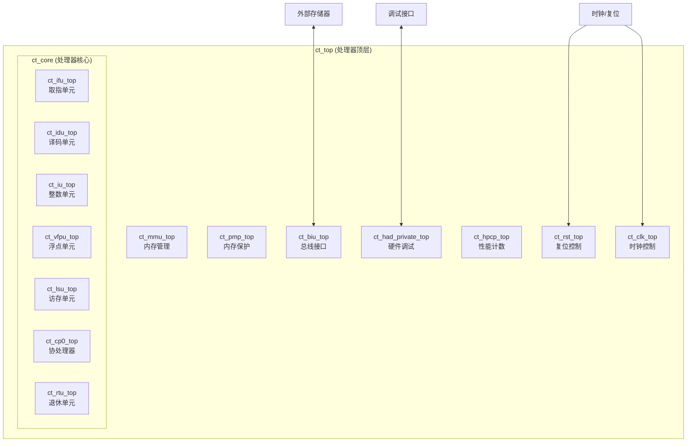
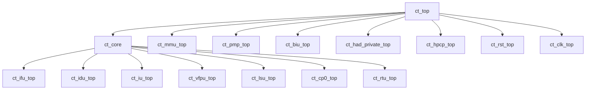

# ct\_top 模块设计文档

## 1. 模块概述

### 1.1 基本信息

| 属性   | 值                                             |
| ---- | --------------------------------------------- |
| 模块名称 | ct\_top                                       |
| 文件路径 | C910\_RTL\_FACTORY/gen\_rtl/cpu/rtl/ct\_top.v |
| 功能描述 | OpenC910 处理器顶层模块                              |
| 设计特点 | RISC-V 64位处理器，支持乱序执行，多发射流水线                   |

### 1.2 功能描述

ct\_top 是 OpenC910 处理器的顶层模块，集成了以下主要功能单元：

* **处理器核心 (ct\_core)**：包含取指单元、译码单元、执行单元、访存单元等

* **内存管理单元 (ct\_mmu\_top)**：实现虚拟地址到物理地址的转换

* **物理内存保护 (ct\_pmp\_top)**：实现物理内存区域的访问控制

* **总线接口单元 (ct\_biu\_top)**：实现与外部总线的接口

* **硬件调试 (ct\_had\_private\_top)**：支持硬件断点和调试功能

* **性能计数器 (ct\_hpcp\_top)**：支持性能监控和计数

* **复位控制 (ct\_rst\_top)**：处理器复位管理

* **时钟控制 (ct\_clk\_top)**：处理器时钟管理

### 1.3 设计特点

* 支持 RISC-V RV64GC 指令集

* 乱序执行，双发射流水线

* 支持 AXI4 总线接口

* 支持硬件调试和性能监控

* 支持多核配置

## 2. 模块接口说明

### 2.1 输入端口

| 信号名                    | 方向    | 位宽  | 描述            |
| ---------------------- | ----- | --- | ------------- |
| pll\_core\_clk         | input | 1   | PLL 时钟输入      |
| pad\_cpu\_rst\_b       | input | 1   | CPU 复位信号（低有效） |
| pad\_core\_rst\_b      | input | 1   | 核心复位信号（低有效）   |
| pad\_biu\_arready      | input | 1   | AXI 读地址就绪     |
| pad\_biu\_awready      | input | 1   | AXI 写地址就绪     |
| pad\_biu\_wready       | input | 1   | AXI 写数据就绪     |
| pad\_biu\_rvalid       | input | 1   | AXI 读数据有效     |
| pad\_biu\_bvalid       | input | 1   | AXI 写响应有效     |
| pad\_biu\_rdata        | input | 128 | AXI 读数据       |
| pad\_biu\_rid          | input | 5   | AXI 读 ID      |
| pad\_biu\_rlast        | input | 1   | AXI 读数据最后一拍   |
| pad\_biu\_rresp        | input | 4   | AXI 读响应       |
| pad\_core\_hartid      | input | 3   | 硬件线程 ID       |
| pad\_xx\_time          | input | 64  | 时间计数器值        |
| pad\_yy\_scan\_mode    | input | 1   | 扫描模式          |
| pad\_yy\_scan\_rst\_b  | input | 1   | 扫描复位          |
| pad\_yy\_icg\_scan\_en | input | 1   | ICG 扫描使能      |
| pad\_yy\_mbist\_mode   | input | 1   | MBIST 模式      |

### 2.2 输出端口

| 信号名                   | 方向     | 位宽  | 描述          |
| --------------------- | ------ | --- | ----------- |
| biu\_pad\_arvalid     | output | 1   | AXI 读地址有效   |
| biu\_pad\_araddr      | output | 40  | AXI 读地址     |
| biu\_pad\_arid        | output | 5   | AXI 读 ID    |
| biu\_pad\_arlen       | output | 2   | AXI 读长度     |
| biu\_pad\_arsize      | output | 3   | AXI 读大小     |
| biu\_pad\_arburst     | output | 2   | AXI 读突发类型   |
| biu\_pad\_arlock      | output | 1   | AXI 读锁定     |
| biu\_pad\_arcache     | output | 4   | AXI 读缓存属性   |
| biu\_pad\_arprot      | output | 3   | AXI 读保护属性   |
| biu\_pad\_awvalid     | output | 1   | AXI 写地址有效   |
| biu\_pad\_awaddr      | output | 40  | AXI 写地址     |
| biu\_pad\_awid        | output | 5   | AXI 写 ID    |
| biu\_pad\_awlen       | output | 2   | AXI 写长度     |
| biu\_pad\_awsize      | output | 3   | AXI 写大小     |
| biu\_pad\_awburst     | output | 2   | AXI 写突发类型   |
| biu\_pad\_wvalid      | output | 1   | AXI 写数据有效   |
| biu\_pad\_wdata       | output | 128 | AXI 写数据     |
| biu\_pad\_wstrb       | output | 16  | AXI 写选通     |
| biu\_pad\_wlast       | output | 1   | AXI 写数据最后一拍 |
| biu\_pad\_bready      | output | 1   | AXI 写响应就绪   |
| biu\_pad\_rready      | output | 1   | AXI 读数据就绪   |
| cp0\_pad\_mstatus     | output | 64  | M 状态寄存器     |
| rtu\_pad\_retire0     | output | 1   | 指令退休标志 0    |
| rtu\_pad\_retire0\_pc | output | 40  | 退休指令 PC 0   |
| rtu\_pad\_retire1     | output | 1   | 指令退休标志 1    |
| rtu\_pad\_retire1\_pc | output | 40  | 退休指令 PC 1   |
| rtu\_pad\_retire2     | output | 1   | 指令退休标志 2    |
| rtu\_pad\_retire2\_pc | output | 40  | 退休指令 PC 2   |

## 3. 模块框图

### 3.1 模块架构图

### 3.2 主要数据连线

| 源模块          | 信号名               | 位宽 | 目标模块         | 说明     |
| ------------ | ----------------- | -- | ------------ | ------ |
| ct\_top      | forever\_coreclk  | 1  | ALL          | 全局时钟   |
| ct\_top      | pad\_cpu\_rst\_b  | 1  | ALL          | 全局复位   |
| ct\_core     | ifu\_biu\_rd\_req | 1  | ct\_biu\_top | 取指请求   |
| ct\_core     | lsu\_biu\_\*      | -  | ct\_biu\_top | 访存请求   |
| ct\_biu\_top | biu\_lsu\_\*      | -  | ct\_core     | 访存响应   |
| ct\_core     | iu\_mmu\_\*       | -  | ct\_mmu\_top | 地址翻译请求 |
| ct\_mmu\_top | mmu\_iu\_\*       | -  | ct\_core     | 地址翻译响应 |
| ct\_mmu\_top | mmu\_pmp\_\*      | -  | ct\_pmp\_top | 内存权限检查 |

## 4. 模块实现方案

### 4.1 流水线设计

OpenC910 采用双发射乱序执行流水线，主要流水线阶段包括：

| 流水线   | 执行单元         | 级数   | 支持指令       |
| ----- | ------------ | ---- | ---------- |
| Pipe0 | ALU0/BRU/MUL | 5-7  | 整数运算、分支、乘法 |
| Pipe1 | ALU1/DIV     | 5-40 | 整数运算、除法    |
| Pipe2 | LSU          | 3-20 | 加载/存储指令    |
| Pipe3 | VFPU         | 5-15 | 浮点运算       |

### 4.2 关键逻辑描述

#### 4.2.1 时钟和复位管理

* 支持多种时钟源选择

* 支持时钟门控以降低功耗

* 支持异步复位和同步释放

#### 4.2.2 总线接口

* 支持 AXI4 总线协议

* 支持 128 位数据宽度

* 支持突发传输

#### 4.2.3 调试支持

* 支持 JTAG 调试接口

* 支持硬件断点

* 支持单步执行

### 4.3 数据前递机制

| 前递路径    | 源阶段  | 目标阶段 | 说明       |
| ------- | ---- | ---- | -------- |
| EX->ID  | 执行阶段 | 译码阶段 | ALU 结果前递 |
| MEM->ID | 访存阶段 | 译码阶段 | 加载数据前递   |
| WB->ID  | 写回阶段 | 译码阶段 | 写回数据前递   |

## 5. 子模块方案

### 5.1 模块例化层次结构

### 5.2 子模块列表

| 层级 | 模块名                   | 实例名                      | 文件路径                    | 功能描述     |
| -- | --------------------- | ------------------------ | ----------------------- | -------- |
| 1  | ct\_core              | x\_ct\_core              | ct\_core.v              | 处理器核心    |
| 1  | ct\_mmu\_top          | x\_ct\_mmu\_top          | ct\_mmu\_top.v          | 内存管理单元   |
| 1  | ct\_pmp\_top          | x\_ct\_pmp\_top          | ct\_pmp\_top.v          | 物理内存保护   |
| 1  | ct\_biu\_top          | x\_ct\_biu\_top          | ct\_biu\_top.v          | 总线接口单元   |
| 1  | ct\_had\_private\_top | x\_ct\_had\_private\_top | ct\_had\_private\_top.v | 硬件调试     |
| 1  | ct\_hpcp\_top         | x\_ct\_hpcp\_top         | ct\_hpcp\_top.v         | 性能计数器    |
| 1  | ct\_rst\_top          | x\_ct\_rst\_top          | ct\_rst\_top.v          | 复位控制     |
| 1  | ct\_clk\_top          | x\_ct\_clk\_top          | ct\_clk\_top.v          | 时钟控制     |
| 2  | ct\_ifu\_top          | x\_ct\_ifu\_top          | ct\_ifu\_top.v          | 取指单元     |
| 2  | ct\_idu\_top          | x\_ct\_idu\_top          | ct\_idu\_top.v          | 译码单元     |
| 2  | ct\_iu\_top           | x\_ct\_iu\_top           | ct\_iu\_top.v           | 整数执行单元   |
| 2  | ct\_vfpu\_top         | x\_ct\_vfpu\_top         | ct\_vfpu\_top.v         | 向量浮点单元   |
| 2  | ct\_lsu\_top          | x\_ct\_lsu\_top          | ct\_lsu\_top.v          | 访存单元     |
| 2  | ct\_cp0\_top          | x\_ct\_cp0\_top          | ct\_cp0\_top.v          | 协处理器 CP0 |
| 2  | ct\_rtu\_top          | x\_ct\_rtu\_top          | ct\_rtu\_top.v          | 退休单元     |

### 5.3 子模块文档链接

* [ct\_core 详细文档](./ct_core_top.md)

* [ct\_mmu\_top 详细文档](./ct_mmu_top_top.md)

* [ct\_biu\_top 详细文档](./ct_biu_top_top.md)

## 6. 内部关键信号列表

### 6.1 寄存器信号

| 信号名                       | 位宽 | 描述      |
| ------------------------- | -- | ------- |
| forever\_coreclk          | 1  | 全局时钟    |
| cp0\_yy\_priv\_mode       | 2  | 当前特权模式  |
| idu\_had\_pipeline\_empty | 1  | 流水线空闲标志 |
| rtu\_pad\_retire0         | 1  | 指令退休标志  |

### 6.2 线网信号

| 信号名              | 位宽  | 描述      |
| ---------------- | --- | ------- |
| biu\_pad\_araddr | 40  | AXI 读地址 |
| biu\_pad\_awaddr | 40  | AXI 写地址 |
| biu\_pad\_wdata  | 128 | AXI 写数据 |
| pad\_biu\_rdata  | 128 | AXI 读数据 |

## 7. 可测试性设计

### 7.1 测试信号

| 信号名                    | 方向    | 位宽 | 描述       |
| ---------------------- | ----- | -- | -------- |
| pad\_yy\_scan\_mode    | input | 1  | 扫描模式使能   |
| pad\_yy\_scan\_rst\_b  | input | 1  | 扫描复位     |
| pad\_yy\_icg\_scan\_en | input | 1  | ICG 扫描使能 |
| pad\_yy\_mbist\_mode   | input | 1  | MBIST 模式 |

### 7.2 调试接口

* 支持 JTAG 调试接口

* 支持硬件断点（指令断点和数据断点）

* 支持外部调试请求

## 8. 修订历史

| 版本  | 日期         | 作者     | 说明     |
| --- | ---------- | ------ | ------ |
| 1.0 | 2024-01-01 | T-Head | 初始版本   |
| 1.1 | 2024-06-01 | T-Head | 添加性能优化 |

